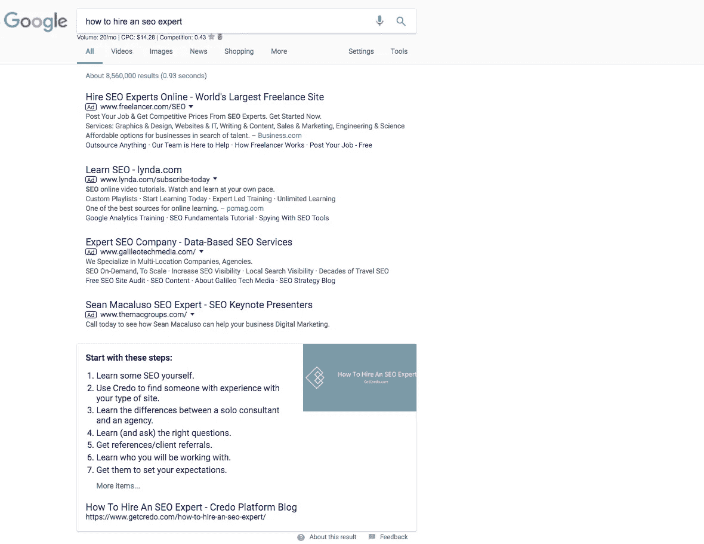

# 为什么“搜索引擎优化关键词”并不重要，应该怎么做

> 原文：<https://medium.com/swlh/why-seo-keywords-dont-matter-and-what-to-do-instead-9f3bb1cbf56a>

当我与企业主或营销经理谈论 SEO 和内容营销时，我经常听到这样的说法:

> 我们有行业知识，但我们需要有人将 SEO 关键字插入到文章中。

当我听到这个我畏缩了，但这是可以理解的。搜索引擎优化看起来像一些神奇的巫术，有人在互联网上做，突然给你带来大量的流量，你的业务收入爆炸，你提前退休。

*不幸的是*，这不是 SEO 的工作方式。

抱歉。

这归结为对 SEO 工作方式的一个基本误解。

这是一个典型的先有鸡还是先有蛋的问题——知识和主题/关键词哪个先来？

# 谷歌如何对抗低质量的“搜索引擎优化内容”

早在 21 世纪初，搜索引擎是愚蠢的。他们没有办法知道关键词的真正含义，只知道它们存在。结果，在 SEO 世界中出现了“关键词密度”的概念，许多从事 SEO 的人用它来确定他们的页面是否围绕特定的关键词进行了适当的优化。

还有一些其他的技巧，人们用来在页面上获得更多的关键词:

*   现在被忽略的 meta keywords 标签，用户看不到，只有搜索引擎爬虫能看到；
*   让文本和背景颜色一样，这样搜索引擎才看得见，而用户看不见；
*   浮动文本离开屏幕，再次只对代码中的搜索引擎可见，而对用户不可见。

正如你所知道的，这些策略被用来试图欺骗搜索引擎，但是对最终用户来说毫无价值。事实上，不合格的内容往往比更好的内容排名靠前，因为“优化”页面的人有更好或更多的锦囊妙计。

搜索引擎发现了这些伎俩，很长一段时间，搜索引擎和 SEO 从业者就像在玩打地鼠游戏。

SEO 社区会找到一个新的有效的技巧(“哦，让白色文本从屏幕上浮动下来，这很有帮助！”)，搜索引擎会发现它，要么惩罚它，要么贬低它，然后 SEO 行业会继续下一步。

鼹鼠，被干掉，再次出现，重复。

然而，在过去的六到七年里，搜索引擎**已经不再打击鼹鼠，而是改变了游戏**。当搜索引擎在下棋的时候，SEO 行业的很多人一直在下跳棋。

> 当搜索引擎在下棋的时候，很多 SEO 行业的人一直在下跳棋。

尤其是谷歌在内容排名和奖励方面经历了一些重大转变。与内容以及如何更好地映射到您的网站排名相关的最大问题有以下两个:

1.  [熊猫](https://moz.com/learn/seo/google-panda)，2011 年初开始；
2.  [蜂鸟](https://searchengineland.com/google-hummingbird-172816)，2013 年开始。

Panda 瞄准了降低搜索结果质量的低质量内容，尤其是“如何做”和更多信息内容。在 2010 年底/2011 年初，如果你搜索任何东西试图找到相关的信息和方向，你可能会找到一些 Squidoo、Wikihow 和其他排名的组合。Panda 及其所有进一步的迭代，直到它在 2014 年左右进入核心算法，开始解决这个问题(图片来自[sixtrix](https://www.sistrix.com/ask-sistrix/google-penalties/how-long-does-a-google-penalty-last/)):

在此基础上，谷歌于 2013 年发布了[蜂鸟](https://searchengineland.com/google-hummingbird-172816)，开启了 SEO 行业谈论“实体”和“主题”而非关键词的先河。一个实体可以是从品牌到人的任何东西，当你在谷歌搜索结果的右边找到一个知识面板时，它是最常见的:

在上面的例子中， [Vevo](https://www.vevo.com/) 是 Google 的一个实体。

根据维基百科的说法，在这些算法改变后的几年里，搜索引擎已经开始更加重视像 [tf*idf](https://en.wikipedia.org/wiki/Tf%E2%80%93idf) 这样的东西，它们“反映了一个单词对集合或语料库中的一个文档有多重要”。需要说明的是，tf*idf 一直在使用，但在我看来，它的价值远没有今天这么高。

这是一种奇特的说法，即搜索引擎不再只是查看特定的关键字，如“SEO consultant”以及它们的使用频率，并与页面上的其他元素进行匹配(尽管这些内容仍然非常重要)。

搜索引擎现在知道，正在使用的其他术语往往与更相关的页面和更好的搜索体验相关，所以他们不仅看“SEO”等，还喜欢在提到“内容”、“链接”、“顾问”和“Rand Fishkin”等内容时，对提到 SEO 的页面进行更好的排名。这只是一个例子，但是你明白我的意思了。

# 谷歌正在奖励优秀的内容

谷歌长期以来一直想奖励优秀的内容，我想说他们终于朝着这个方向迈出了大步。搜索引擎优化行业发现页面上的某些元素与更好的排名相关，如列表、图像和块引用，现在正被搜索引擎以其他方式使用，试图给搜索者提供更好的结果。

我们一会儿就会谈到这一点，但让我们快速回顾一下，看看一个例子，谷歌用许多语义相关的术语来奖励深度内容，而不是“适当”优化的内容。

六年前，给客户的常见 SEO 建议是将他们的主要关键字放在标题标签的前面，放在 URL 中，放在页面上的 H1 中，放在元描述中，并在整篇文章中出现几次。

*听起来很像“SEO 关键词”和“关键词密度”，不是吗？*

现在就去看看搜索结果:

如果你看看这两个，你肯定还会看到那个老建议的元素，这意味着它在一定程度上仍然有效。但这就足够了吗？

如果你看看耐克的例子，前三个结果是 nike.com 的！他们的品牌胜过一切，如果你不是 Nike.com，祝你好运为这个广泛的品牌关键词获得流量。

下一个是一副滑雪板。最上面是产品广告，但下面是内容网站。我不想在这里羞辱你，但是第一个结果是我的副业项目(是的，确实排名第一)，那篇文章是 2000 字的原创内容和照片。

搜索一个 SEO 行业相关的术语，你会看到在标题的开头附近没有目标关键字[谷歌蜂鸟]的文章排名！

随着许多信息查询中答案框的出现，搜索引擎正在奖励结构良好的文章，这些文章给出了人们正在搜索的答案。

# 忘记“搜索引擎优化关键词”

当有人来找我，希望找到一个顾问来帮助他们将关键词插入到他们正在写的内容中时，我温和地帮助他们理解，通过一些“SEO 技巧”来获得更好的内容和页面排名的日子已经一去不复返了，现在你必须在系统内工作，才能真正看到 SEO 投资的好处。

我对那些希望雇人帮助他们进行 SEO 的人的建议是，不要把 SEO 当作你事后做的事情，而是当作一个需要在你的组织中传播的**系统**。

你不能只是写内容，然后让别人在里面插入一些关键词。

*你实际上需要围绕主题的专业知识，才能雄辩而自然地写出相关内容，因为这是搜索引擎想要的。*

如今，为了让一个半竞争关键词排名靠前，你需要几样东西:

1.  链接到页面。这是最强的排名因素；
2.  半权威领域；
3.  用语义相关的术语书写的自然语言；
4.  深入报道内容。

布莱恩·迪恩 2016 年的[研究](https://backlinko.com/search-engine-ranking)显示，根据 SEMrush 的数据，他们研究的关键词(超过 100 万个搜索结果)的平均排名为 1890 个单词。

500 字的博客文章实际上是排名和驱动流量的日子已经一去不复返了。这已经不起作用了，所以不要再每月付给某人 200 美元让他每月给你写四篇博文。

“那么我的内容应该是多长时间，约翰？”你可能会问。我的回答可能不会让你吃惊，但我会反过来问你:

> *嗯，完全覆盖题目需要多少？*

这就是你的内容需要的长度——足够长，以深入涵盖该主题，并成为互联网上关于该主题的最佳内容。

# 那么研究和专业知识哪个更重要呢？

你从哪里开始，与主题的专业知识或与关键字研究？

我的回答是，如今要想在搜索结果(SERPs)中胜出，你需要成为你所写主题的权威和专家。这并不意味着你不必为了写出最好的内容而做研究，但这确实意味着你不能只是将你网站上要写的内容外包给任何老的“内容作者”。你需要一个在你投资的领域有专业知识的人。

一旦你有了专业知识，或者你是一个专家，可以想出如何让你的内容写出来，而不用花费你所有的宝贵时间，那么你需要做关键词研究，以确定人们在你的业务周围搜索的高流量术语。

# 关键词研究在内容营销中的作用

我们刚刚讨论了你或你的公司(或你的机构)中的某个人如何需要成为一个主题专家，才能在这些天的搜索结果中真正排名。

关键字研究将会更有成效，因为你可以确定你需要写的关键字和主题，以获得你网站的流量，然后转化为用户。

从一开始就进行关键字研究，这样你就可以规划出你的内容，系统地创建页面、帖子和资源，以满足搜索者和你的潜在客户的需求。

在这篇文章中，我不会教你如何做[关键词研究](https://www.getcredo.com/easy-keyword-research-seo/)，而是会把你引向我们的资源(链接在左边),告诉你在为你的网站/公司做关键词研究时，应该考虑以下工具:

*   Adwords 关键词工具(仍然相关！)
*   Moz 的关键词浏览器
*   谷歌搜索控制台(如今是关键字创意的宝库)
*   Ahrefs 和/或 SEMrush(取决于您订阅的内容)
*   HitTail 或 Longtail Pro

# 收尾工作

SEO 并不容易，但也非常好学。这是一个系统，你可以在其中学习和执行，并看到可重复和可靠的增长和结果，只要你采取必要的行动，并应用你学到的战术和战略。

从成为专家开始，在适当的关键词研究和主题发现和开发上打下基础，然后去执行并主宰你的利基市场。

玩得开心！

*原载于 2017 年 11 月 7 日*[*【www.getcredo.com】*](https://www.getcredo.com/content-keyword-topics/)*。*

## 这个故事发表在 [The Startup](https://medium.com/swlh) 上，Medium 的出版物拥有超过 256，410 人的关注。

# 订阅[在这里获取头条](http://growthsupply.com/the-startup-newsletter/)。

