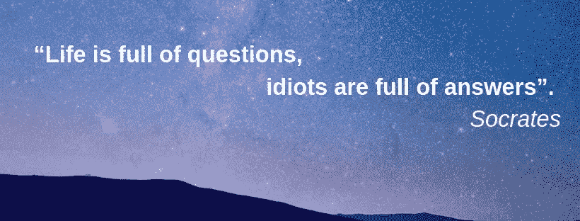

# 为什么一家初创公司应该关心可辅导性？

> 原文：<https://medium.com/swlh/why-should-a-startup-care-to-be-coachable-8608629c8f27>

[初创公司创始人和导师之间的对话，如果你曾指导过一家初创公司，你可能也遇到过这种情况，☺️]

创业公司创始人(寻求建议):我想更好地了解我的客户和他们的问题。我的创业公司将帮助病人按照时间表服药。你能给我一些建议吗？

*导师(给点建议):* 我很乐意！首先，我们来了解一下问题。嗯……所以，你在努力帮助病人按时服药。在我看来，你的目标客户非常广泛，我建议你缩小范围，不要为所有患者解决一个普遍问题，而是要具体——例如，你可以从考虑服药的频率开始，无论患者是在医院还是在家里，或者患者服药的目的是什么[它只是为了愈合的目的，或者它是为了医疗预防的目的，或者它可能是为了术后治疗]。所以，我的意思是，有许多“为什么”和许多因素可能会影响“按时服药”的必要性，․，我的建议是思考它们，并与人们交谈。

*创业创始人(同校):* 哦，可是为什么呢？我相信每个人都有不知道什么时候吃药的问题。

*导师(分享他的看法):* 嗯……可能吧，但并不是每个吃药的病人都需要在具体的时间提醒吃药。几个月前，一位医生给我开了维生素 C，但说明非常简单:我只需每天服用 1 粒，没有任何严格的时间表，而且，如果我不吃一天，也不会有什么不好的事情发生。我不需要别人提醒我拿了它。

*创业创始人(不准备听任何意见):* 嗯，确实如此但是最需要。

*导师(尝试挑战创始人做更好的研究):* 嗯，了解一下不同患者和不同案例的服药体验如何，比如糖尿病、术后治疗、老人、小孩等等。然后了解对于哪种类型的患者，在什么情况下，在准确的时间服药是“关键任务”。另外，你也可以试着找出那些病人忘记吃药的原因。

*创业创始人(显示不开放反馈):* 啊哈！也许在另一个宇宙，但不是现在。理论上这是一个伟大的想法，但我很幸运，因为吃药对任何人来说都是困难的，每个病人都需要一个提醒。我真的很有动力进入下一步。

上面描述的对话是“是的，但是……”的经典案例**。**是的，导师，我明白你的意思，但是我已经做了一个事先的决定，什么都不会改变。这是一个典型的情况，创业公司寻求帮助，然后忽视它，因为他们不能听取和分析任何建议。

我每周都看到很多初创公司，他们似乎对每个问题都有答案，甚至没有质疑他们答案的逻辑，这就是为什么我决定分享我对初创公司可辅导性的看法，以及为什么初创公司应该关心这些问题。

# **可训练意味着什么**

如果你是一个初创公司的创始人，你没有资金，没有不断增长的客户数量，没有几十名员工，你对任何建议的态度都像上面对话中的人一样，**请三思。也许你应该留有余地，因为有些事情你还不知道，有些事情会让你变得更好——也许你应该更容易接受训练。可训练是生活中最重要的技能和态度之一，无论你是初创企业的创始人、网球运动员、医生，甚至是总统候选人。**

如果你是一个希望改进产品指标、改进营销指标、从风投那里筹集资金、发展业务等的创始人。，你应该做一个自我评估，看看你是否可以被辅导。

易受训练与适应力和对变化持开放态度有关。这只是意味着初创公司的创始人对激进的变革持开放态度，这些变革可能会导致优先考虑新产品功能、测试新的客户获取渠道、改变产品路线图以及许多其他事情。所有的改变通常应该在旅程的中途完成。这是阻碍创始人“听取反馈”的最大心理障碍。

**那么，可训练意味着什么呢？对于一个初创公司的创始人来说，可辅导意味着:**

*   **他们乐于倾听反馈**，而不是试图快速做出反应来保护自己的立场，深入理解反馈，然后试图从中提取任何有用的信息来做出决策。听取反馈对创业公司来说是一件很难的事情，但这意味着创业公司创始人已经准备好**接受建设性的批评以学习**，而不是攻击任何反馈，只是停下来问自己一个简单的问题:“*这个反馈有什么好处，有什么值得我学习的吗？*
*   他们愿意尝试新事物。如果他们看到业绩越来越差，他们就不会坚持同样的想法和同样的方法。他们通常有一种超级狂热的尝试新事物的方法。“我需要工作，我需要提高”是他们脑海中最重要的话语，他们准备停下来问自己“*为了更多地了解 X，Y，Z，我还需要进行哪些实验？*

为了比较起见，让我们来看看另一种态度。**不可训练的创业创始人会表现出不同的行为，包括但不限于:**

*   他们总是认为自己是对的，不具备自我反省的能力。
*   他们不愿意尝试、学习新事物，也不愿意接受改变。
*   他们“充满”消极和悲观。
*   在建设性的批评中，他们通常会翻白眼(这是给我上周遇到的青少年读者/初创公司的😊).
*   他们不尊重他人和/或他人的观点。

还有这么多…

可培训并不意味着你不了解你的市场、客户、技术、产品等。这意味着你有决心去寻找一些人来帮助你更好地了解你的创业公司的一些隐藏的方面(比如客户行为、技术性能、营销技巧等等)。这意味着你愿意讨论一些可能有助于你改善创业相关的事情。

# **为什么是可训练的**

可训练是关于意识和从一种情况中获取金块并利用它们的能力。被教导是明智的。这意味着你在关注其他人以及他们所获得的经验、智慧、技能和知识，你愿意足够仔细地倾听，看看在你自己的旅程中有什么可以帮助你。

可辅导性对于实现你的许多或大多数创业目标非常重要。**受益于可辅导性的初创公司创始人通常:**

*   更了解他们的客户，他们的客户也更开心。
*   寻找更好的客户获取渠道。
*   拥有令人印象深刻的产品指标。
*   吸引最优秀的人才加入他们的创业公司。
*   了解挑战，并更好地做好准备。

当你看到创业公司创始人的可训练的特征时，很容易看出他们是那些在发展业务、筹集资金、拥有新伙伴等方面取得成功的人。当他们努力成长、学习和成功时，可训练的创业创始人与世界互动的方式不断帮助他们。有趣的是，你可以看到，可辅导的初创公司会发展成长思维，重视自我提升，而不是“好运”，这也有助于他们完成工作。易受训练者的态度是随和、开放和乐于接受，让他们生活中想做的任何事情看起来都是可行的。他们成为周围人的灵感，因为他们得到了结果。

如果你正在读这篇文章，而你还没有成功(很有可能)，那么也许，仅仅是也许，看看你从导师、你的团队成员等那里获得反馈的方式，会有所收获。除非你是可训练的，愿意挑战自己的现状，否则再多的训练或指导都不会有所作为。有一句话适用于指导:“当医生比病人更关心疾病时，病人永远不会好转。”我喜欢辅导和指导专业人士。但我发现，如果被辅导者不像导师那样关心改善他们的状况，他们永远也不会取得很大的进步。

*感谢阅读。如果你喜欢这篇文章，请点击* ***👏按钮几次(👏👏👏👏👏)*** *帮助别人发现它:)* ***这对他们和我来说意义重大:)*** *。*

## 这篇文章发表在 [The Startup](https://medium.com/swlh) 上，这是 Medium 最大的创业刊物，拥有+401，714 名读者。

## 在这里订阅接收[我们的头条新闻](http://growthsupply.com/the-startup-newsletter/)。

