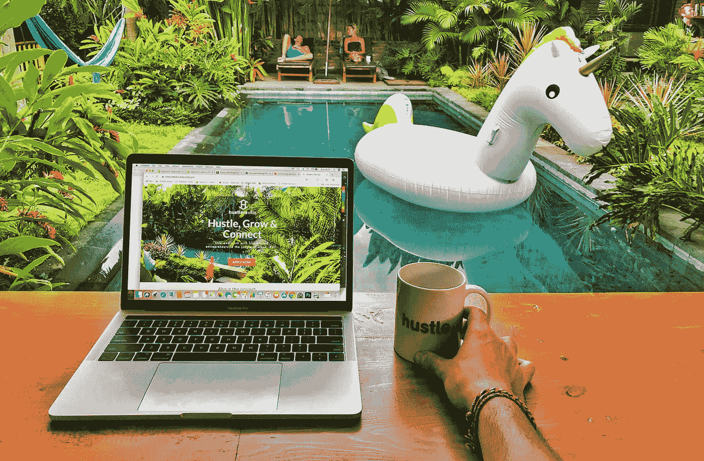
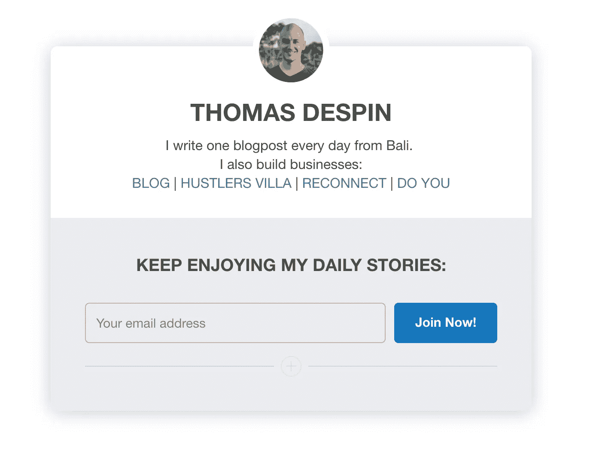

# 我为什么要建立个人品牌？

> 原文：<https://medium.com/swlh/why-should-i-build-a-personal-brand-6db75147803>

Shot from [Hustlers Villa](http://www.hustlersvilla.com)

如果你读了这篇文章，你很可能不知道什么是个人品牌。

维基百科将其定义为*“在他人脑海中建立关于个人、群体或组织的既定形象或印象的持续过程”(阅读更多* [*此处*](https://en.wikipedia.org/wiki/Personal_branding) *)*

在我的印象中，个人品牌过去主要指名人、政治人物或生活教练。

现在，似乎品牌这个词在每个在网上做任何事情的人的嘴里，个人品牌随之而来。

你会看到人们给自己贴上他们想贴的任何标签，他们的整个新闻开始看起来像一个平庸的商业广告，销售诈骗产品(即他们自己)。

这就是为什么，即使我在过去的几年里对个人品牌做了一些肤浅的研究，我仍然记得这种负面的观点，基于那些试图把自己变成任何类型的教练或顾问的人。

# 我不想困在做一件事上

我只是做我喜欢做的事，不管人们是否跟着我。

我发起的每个项目，我写的每篇文章，都是因为我喜欢去做。如果没人注意，我还是会继续做下去。

现在你应该把我叫出来说:*“那你为什么把内容发布到网上而不留给自己呢？”*

我也叫出了自己，并自发地找到了两个答案:

1.  发布我的内容让我负责并致力于制作它
2.  我的每一篇文章可能最终会帮助或启发世界上某个地方的至少一个人。那为什么要留给自己呢？

在博客上发表这篇每日文章让我感觉很棒，知道有人可以从中获得一些东西让我感觉更好。

但是我最喜欢的是，我可以自由地谈论我想谈论的任何事情。

今天我们谈论个人品牌，明天我们将谈论可持续发展的处女岛。我喜欢它。

这也是为什么我觉得建立个人品牌听起来不太好的另一个原因:因为我不想因为一件事而“出名”,并且不得不坚持下去。

我的一个朋友几年前开始写旅行博客，写关于背包旅行的文章。他建立了一个 6 位数的博客，拥有成千上万的追随者。

现在，他觉得自己被卡住了，因为他的观众是背包客，但他成了一个连续的企业家，他不再认同他的观众。

# 反正我也没什么可卖的

这是我对建立个人品牌的第二大反对意见:我没有东西可卖。

我在那里看到的大多数人都建立了一个个人品牌，被认为是“一个在任何领域都是专家的人，并且销售任何相关产品的人。”

但是我要卖什么呢？

我没有一个印有我头像的销售漏斗，也没有一句标语说我在这个超级棒，所以人们绝对应该购买我的*997 美元的*培训。

我没有一本*会改变你生活的免费电子书*，我用它向你追加销售一些私人教练、6 位数咨询或人们从电子书中追加销售的任何东西。

最让我兴奋的一件事是当我收到一封来自我从未听说过的人的电子邮件，说他/她有一天读了我写的一些东西，这段内容对他/她的生活产生了积极的影响。

就是这样。

我真的很想知道，由于将一些个人想法付诸文字的过程，有人从中获得了价值。

每一封电子邮件都让我开心不已。

而且是免费的。

# 建立个人品牌来影响更多人？

和大家一样，我也经常质疑自己人生的意义。

不像所有人，我经常得出这样的结论:生活完全没有意义。我没意见。

这要么意味着我们现在都应该自杀，要么意味着我们有机会为自己的生活创造我们想要的意义。

我还没有自杀，所以我想我选择了第二种选择。

我决定，如果生活对我来说有任何意义，那就是积极影响我们生活的世界，同时为自己创造一个可以享受的生活，并在以后传给我的孩子。

我知道，这听起来简单，模糊，俗气。

但对我来说，这仍然是一个很好的指导方针，因为它显示了一些我可以遵循的长远方向。

我有一个关于“生命的意义”的更详细的版本，我将在另一篇文章中讨论。

回到主题:我是否应该建立一个个人品牌来影响更多的人？

换句话说:我能否在建立个人品牌的同时，继续专注于创作我喜欢创作的内容，以便让这些内容惠及比现在更多的人？

我通常不检查我的统计数据，但只是看了一下，发现在过去的 30 天里，大约有 10，000 人阅读了我在 Medium 上的博客帖子。这个博客上的数字也差不多(我在两个博客上分享相同的内容)。

每个月大约有 20，000 人阅读我的文章，并可能从中获得一些东西(可能会更少，但我们不在乎，我们只是用数字来衡量)

如果是 10 万呢？多 5 倍。
如果是 100 万呢？多 50 倍。

影响更多的人是有吸引力的，但这也让我觉得我应该创造更高质量的内容。

因为可能会有更多的人阅读它，我会觉得更有责任提供更好的内容，更成熟的思想，更可行的建议。

这就引出了我想问自己的下一个问题:

# 我应该创建一个个人品牌来加强我自己的游戏吗？

我每天都发帖子已经有一段时间了。

我知道这种感觉，我知道如何一打开笔记本电脑就想出(或多或少)有意义的东西，我知道如何保持承诺和一致性。

但是因为我的主要目标是*“每天发布一些东西”*，而且因为我并不在乎谁在阅读或者他们会从中获得什么(只要它是体面的和在线的)，所以我并没有在内容本身上加强我的游戏。

没关系，我尊重自己定下的规则。

但是现在难道不是更进一步的时候吗？

我不需要创建一个个人品牌来为自己设定一个目标，以提高我发布的内容的质量，但如果同时做这两者是一个值得承诺的伟大组合呢？

如果我可以继续与人分享我想分享的东西，而不拘泥于某个特定的主题，同时对我正在谈论的东西更深入一点，会怎么样？

在我开始每天早上深度工作一周后，我会有这些想法，这可能不是巧合。

我有更多*集中*的时间写这个博客，这意味着我在最后一刻(睡觉前 30 分钟)停止写那些博客文章。

更集中的时间意味着我可以更深入地挖掘我问自己的问题，以及我找到的答案。

当我写这篇文章的时候，我还意识到一件事。

# 我已经有了一个个人品牌，它已经帮了我很多

**6 年前，当我在法国为学生们组织聚会**时，人们都知道并关注我，以了解接下来的活动。

他们会与需要组织活动的人分享我的联系方式，脸书的酒吧、夜店和学生协会也会联系我，做我当时做的事情:组织活动。

4 年前，当我骑着自行车环游世界的时候，人们跟着我去看我在哪个国家，我在做什么，我在路上遇见了谁。

他们会把我介绍给他们在不同国家认识的人，多亏了他们，我认识了很多不可思议的人，在很多不同的地方睡过觉。

2 年前，当我建立起一个 6 位数的电子商务公司时，人们跟着我听我们正在经历什么，我们有什么有用的见解要分享。

他们会和我联系，分享他们自己的见解，最终，我们和来自三大洲的 17 个人在巴厘岛组织了一个 Ecom 别墅。

**现在我是在巴厘岛**建造 [**皮条客别墅**](http://www.hustlersvilla.com/) **的家伙，从去年 2 月开始，人们开始联系我，以便得到一个房间，加入社区，或者只是来见面和联系。**

今天，他们经常介绍我，说我是网上企业家去巴厘岛的必去之地。

**现在我也是在苏拉威西岛的一个私人岛屿**上建造 [**Reconnect、**](http://www.reconnect.id/) **生态度假村的人，人们联系我是为了获得投资机会或以某种方式参与这个项目。**

即使我没有分享太多。

以上 5 点之所以发生，是因为我有一个个人品牌。因为人们与我分享的故事有联系，在某些时候。

最后，不管我接受与否，我其实已经有了个人品牌。一个我没有有意识地或有策略地精心制作的，但仍然有一些东西。

# 那我现在该怎么办？

在接下来的一个月里，我将专注于提供更高质量的内容(我的意思是更深入)，并在个人层面上分享更多内容，以赋予我所写的内容更多特色。

最近有人提出给我 4 次个人品牌辅导，因为我认为这是一个有趣的巧合，所以我接受了。

我从来没有深入过这个话题，和一个 100%专注于它的人一起工作可能会是一次有趣的经历。我一定会和你分享我学到的东西，以及它如何对你有用。

另一方面，如果你开始在脸书的视频广告中看到我开着一辆兰博基尼，卖着一套仅售 2997 美元的“人生转型教练套餐”，请到巴厘岛来给我一巴掌吧。

爱你，明天再聊，

托马斯

## 这篇文章发表在 [The Startup](https://medium.com/swlh) 上，这是 Medium 最大的创业刊物，拥有+393，714 名读者。

## 在此订阅接收[我们的头条新闻](http://growthsupply.com/the-startup-newsletter/)。

