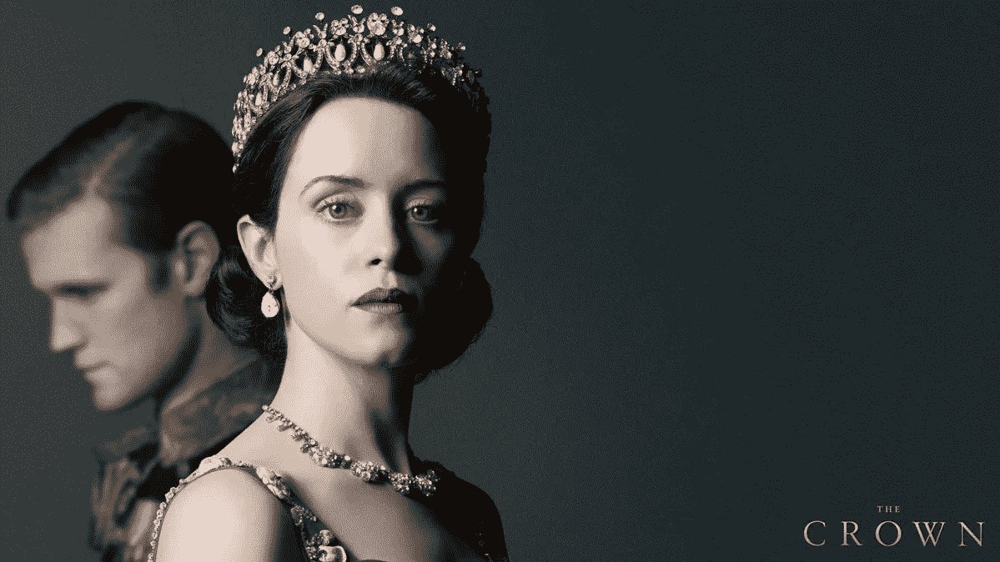

# 为什么领导力要取代我们的个性？

> 原文：<https://medium.com/swlh/why-should-leadership-replace-our-personality-e4ef96c53dd8>

Elizabeth II struggled to find her authentic self in her early reigning years [Photo of Claire Foy in Netflix’s [The Crown](https://www.netflix.com/title/80025678)]

领导者应该是什么样子的？

他们如何行动？他们怎么穿衣服？他们在看什么节目？他们看电视吗？他们的日常锻炼是怎样的？有没有胡子？

我冥想够努力吗？？？

有机会在一个组织中担任领导是一种特权，但这种特权可能伴随着令人不舒服的压力…