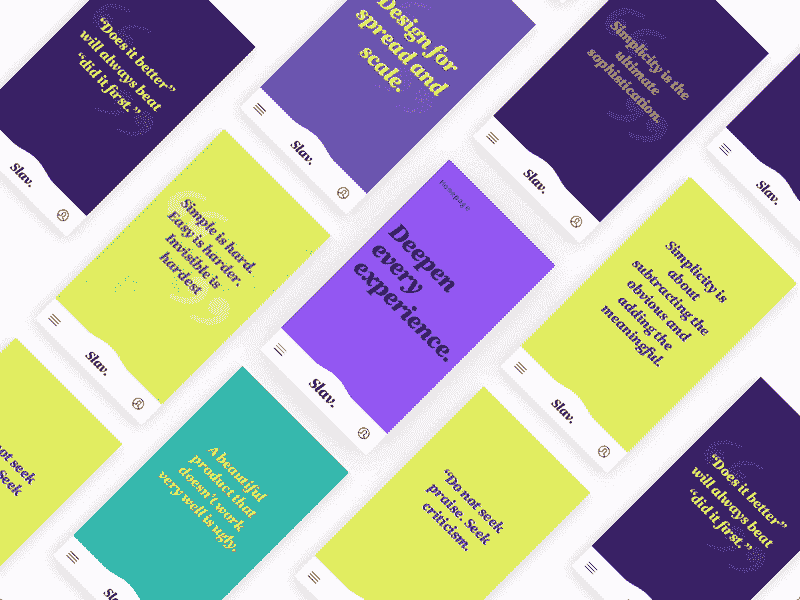
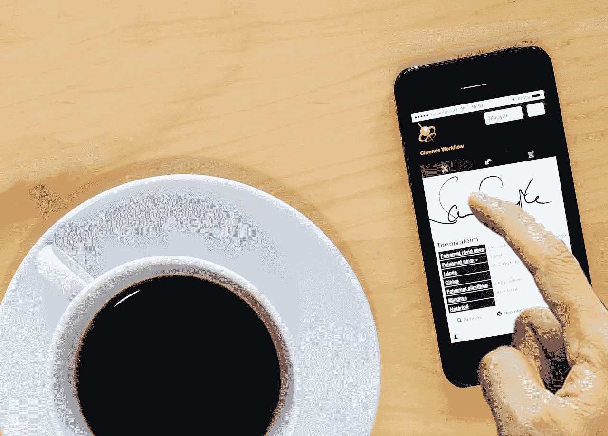
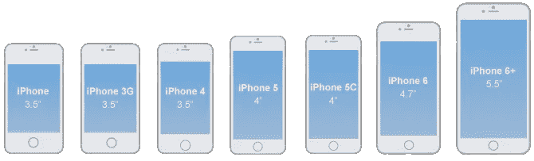
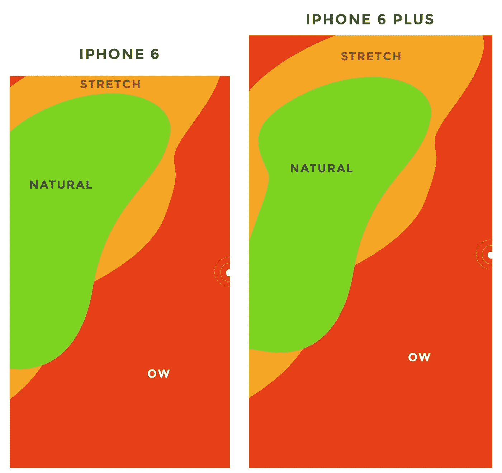
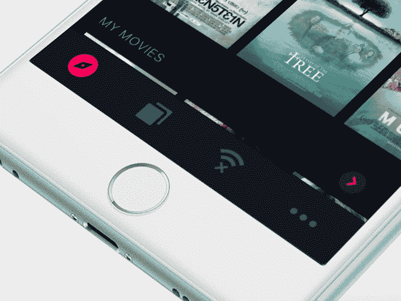
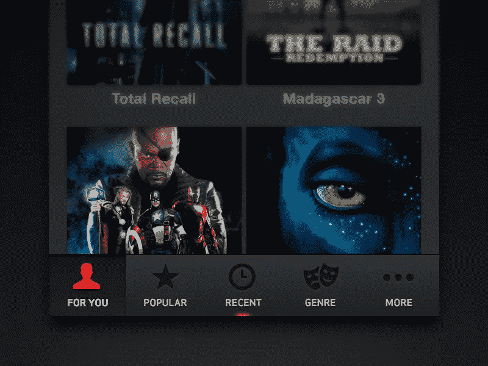

# 为什么手机菜单要放在下面？

> 原文：<https://medium.com/swlh/why-should-mobile-menu-be-placed-below-701bbf7cd83e>

Contextual Mobile Navigation by [Slav](https://dribbble.com/shots/3897490-Contextual-Mobile-Navigation)

研究表明，使用手机会影响你的大脑。进一步的研究称，日常手机菜单用户拥有更大更发达的体感皮层；控制我们拇指的区域。大多数用户用一只手使用他们的手机，他们或者用右手或者左手的拇指与屏幕进行交互，就像计算机鼠标一样，但是有局限性。

# 拇指变成了鼠标

借助鼠标在桌面上导航很容易。这是因为鼠标不会限制我们的手腕运动。但是当用户切换到移动界面时，他们的拇指活动范围有限。根据手机的大小，他们无法触及界面的某些区域。

当菜单被放置在难以触及的区域时，用户要么不得不重新排列他们的手机，以便拇指移动得更近，要么不得不用另一只手进行交互。这是额外的工作，减缓了用户的任务。

# 大屏幕与小屏幕

Image courtesy [findingui](http://blog.fluidui.com/designing-for-mobile-101-pixels-points-and-resolutions/)

随着越来越多的用户选择大屏幕手机，顶部区域变得比小屏幕手机更难触及。这样做的最大问题是，大屏幕在与拇指相对的顶角处的可到达性更低。

# 拇指可达性法则

当然，设计师不能改变用户拿手机的方式，但是他们可以改变导航菜单的位置。将导航菜单放在顶部是桌面的惯例，但这不适用于移动屏幕，因为顶部是拇指最难够到的地方。为了使导航更快，有必要将菜单放在屏幕底部拇指可及的地方。这就是你的菜单应该放在哪里的优先等级。高优先级选项应该在 thumb 直接可及的最低位置，低优先级选项应该在最高位置。

# 拇指最佳位置

Animated Bottom Bar by [Upmitt](https://dribbble.com/shots/2519096-Animated-Bottom-Bar-Icons)

现在，用户握住他们各自手机的手将根据他们的偏好而变化。那你应该把菜单放在哪边？研究发现了一个“最佳点”,它允许用户不用伸出拇指或弯曲来够到这个点。现在你可以想象甜蜜点在哪里了！它就在底部的正中间。那是从左侧或右侧最容易够到的地方。

随着越来越多的人选择大屏幕，这成为一个重要的功能，因为较小的屏幕没有可达性问题。这种机械效率将导致更快地完成任务。

# 拇指功能决定菜单形式

Bottom menu designed by [Filip Slováček](https://dribbble.com/filipslovacek)

无论将菜单放在顶部是多么传统，记住这种放置忽略了用户的拇指功能。拇指是主要的交互手指，它应该决定位置。难以使用的菜单会降低导航速度和客户满意度。UX 设计师的目标是追求最流畅的设计。通过一个简单的改变来消除可达性降低的障碍，并增强您今后提供的体验！

*您可以关注我们的* [*脸书*](https://www.facebook.com/monsoonfish)*/*[*LinkedIn*](https://www.linkedin.com/company/13404751/)*/*[*Twitter*](https://twitter.com/monsoonfishy)

*原载于 monsoonfish.com***。**

**

## *这个故事发表在 [The Startup](https://medium.com/swlh) 上，这是 Medium 最大的企业家出版物，拥有 277，994+人。*

## *在这里订阅接收[我们的头条新闻](http://growthsupply.com/the-startup-newsletter/)。*

**