# 为什么 Snapchat 迅速成为唱片艺人的最佳社交媒体平台

> 原文：<https://medium.com/swlh/why-snapchat-is-quickly-becoming-the-best-social-media-platform-for-recording-artists-31515a6f3b18>

艺术家和有影响力的人在社交媒体上与粉丝联系的方式正在迅速改变。多年来，有一些伟大的产品创新改变了社交媒体以及影响者与观众互动的方式。Snapchat 是这一切的幕后推手，其改变游戏的产品功能包括“故事”、“镜头”和“滤镜”，以及 instagram 快速复制功能。考虑到所有这些，我相信 snap 最好的创新还在后面。snapchat 的未来可能会更好地改变影响者与观众互动的方式。以下原因是为什么我相信 Snapchat 的定位是成为唱片艺人营销自己的最佳平台社交媒体平台。

# 1.与其他平台相比，卓越的品牌

在 snapchat 上，艺术家通过拥有品牌化的可共享互动内容，能够在整个平台上拥有非常强的品牌知名度。比如自定义贴纸，滤镜，镜头，故事。例如，当德雷克最近的专辑《蝎子》(Scorpion)放弃 snapchat 时，Snapchat 的核心用户体验中隐藏着与德雷克有关的小块内容。

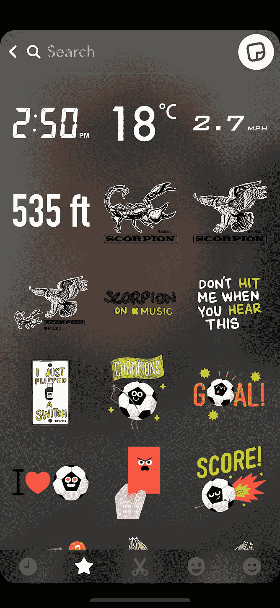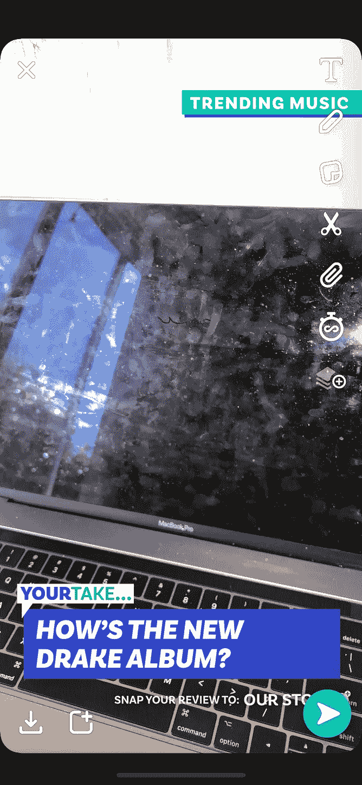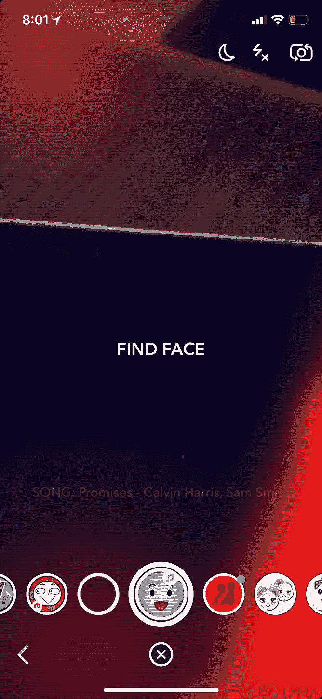

Custom Drake snap stickers and ‘Your take’ community story and Calvin harris Song lens

通过具有定制的镜头或贴纸，这允许艺术家以低摩擦的方式与用户生成的内容结合。这为这位艺术家的音乐建立了一个病毒式传播的循环。这和歌曲在 Vine 上爆红的原理是一样的。由于 Snapchat 的内容审查团队，snapchat 的“你的观点”故事为社区提供了一个有组织地表达意见的渠道。评审团队总是以公正的方式展现一个主题的两个方面。这防止了困扰其他社交媒体平台的回音室问题。Snap 的用户能够更好地表达他们的观点，并以一种推文或 instagram 评论所不允许的方式为对话做出贡献。如果你认为这些营销策略只是为像德雷克这样有资源做任何事情的大牌艺术家准备的，那么即使是较小的或独立的艺术家也可以通过 [Lens studio](https://lensstudio.snapchat.com/) 创建自己的定制镜头，或者在 snapchat 中创建自己的滤镜。

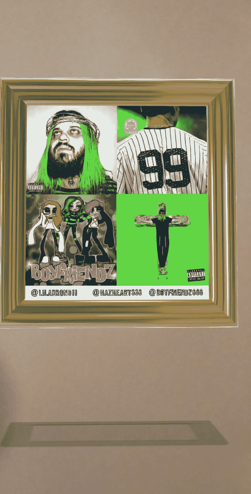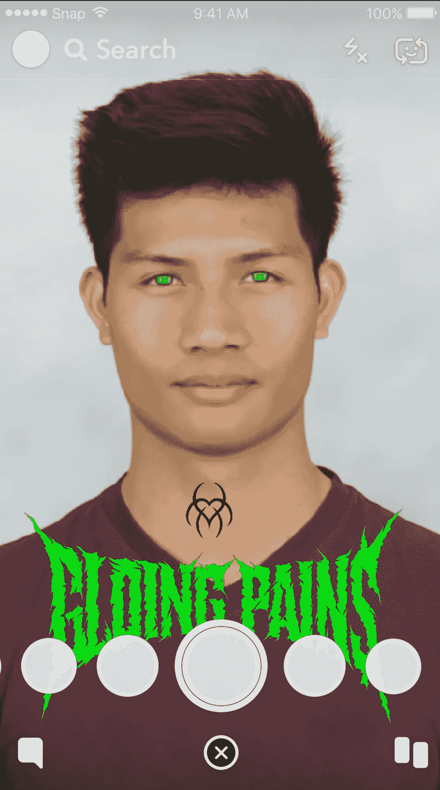

Proof of concepts I made with artist Lil Aarron’s album art and music

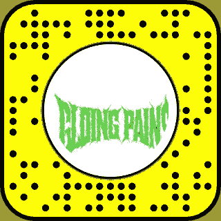

Scan the snap code and try it out!

艺术家能够将他们的音乐片段附加到镜头上，使用户生成的内容易于共享和发现，并有可能像野火一样传播。例如，如果一个艺术家创造了一个引人注目或“迷因”类型的镜头，这可以吸引观众，甚至不用他们先听到音乐。这正是艺术家“黑耳朵”用他的新抓拍镜头所做的。让我们以此为例。

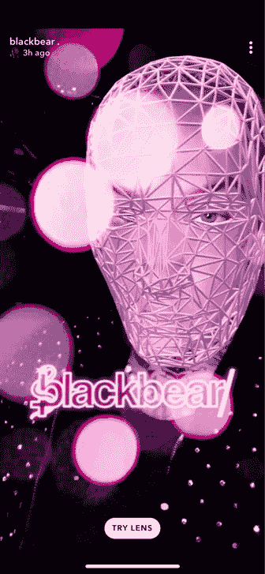

Blackbear snap lens

> **描绘以下场景**
> 
> 影响者——在这个例子中，Blackbear 发布了一个带有镜头的故事，其中包括一首新歌的片段。号召说“试试镜头”
> 
> **一名用户解锁镜头，并开始试用。**
> 
> **用户听到了这首歌，并且想要听到更多。**
> 
> 他们会立即去 spotify 或 apple music，查看这位艺术家最近的作品，在这个例子中是 blackbear。
> 
> **用户播放歌曲，喜欢并将其添加到他们的曲库。**
> 
> **在此之后，用户将快照发送给他们的朋友或发布帖子，用镜头讲述故事。**
> 
> **从影响者的角度来看，这是用户的理想之旅。**

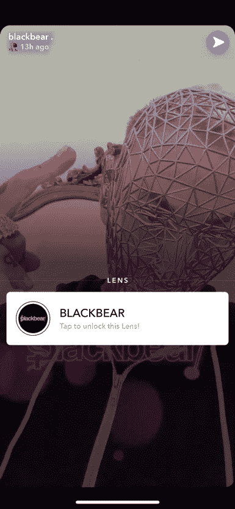

现在是 2018 年，人们厌倦了老式的侵入式广告形式，这种形式远离了产品的 UX。通过品牌快照滤镜和镜头，有影响力的人和公司能够在不影响核心体验的情况下做广告。而是通过向用户提供有趣愉快的体验来增加它。AR 媒体中的广告的未来将不再仅仅是被动的(视频、弹出窗口等)，而是变得越来越引人入胜、个性化、游戏化和有趣。

# **2。使用 Seatgeek 和电子商务集成在 Snapchat 中购票**

[Snaps 最近与 Seatgeek 的合作](https://seatgeek.com/press/seatgeek-and-snap-partner-to-bring-ticket-buying-directly-into-snapchat-app)允许用户直接在应用程序中购买活动门票。这允许比任何其他当前购票平台更直接的到消费者的管道。Snapchat 的用户群和普通音乐消费者的人口统计数据非常吻合。想想今天最受欢迎的艺术家的普通节日参加者或音乐会参加者。为音乐相关产品和体验(音乐节、购物、收藏品等)付费的人很可能是年轻人，而且很可能活跃在社交媒体上，尤其是 snapchat。当你今天去听音乐会时，你会很容易地看到超过一半的人在录制表演并自拍，然后发布或发送到 snapchat 上。

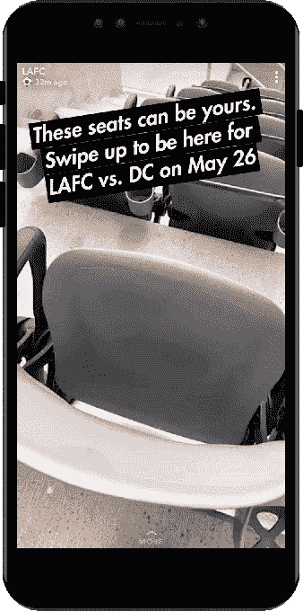

Ticket purchase flow in snapchat

让我们看看用户在 instagram 上购买门票和物品的典型流程和当前问题。

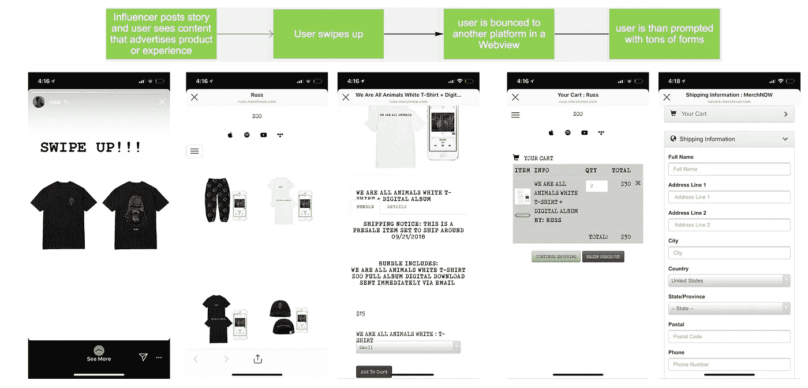

Example of typical flow and UX

# 其他选项

如你所见，webviews 有一个非常笨拙的体验。页面加载缓慢，网站的响应速度不如带有元素的文本。例如，当用户上下滚动查看项目时，很容易退出体验，导致他们在表单中重新输入信息。这造成了很多摩擦，并可能导致用户放弃，降低销售转化率。许多不同的影响者在不同的网站上销售不同的产品，导致用户重复输入他们的信息或注册账户。在 snapchat 上，webviews 有一个自动填充功能，用户可以通过点击发送他们的帐户信息等

# 3.Snapstore

在 snapchat 上，当用户购买商品时，他们的运输和支付信息可以存储起来供以后使用。极大地减少了处理表单时的摩擦和烦恼。

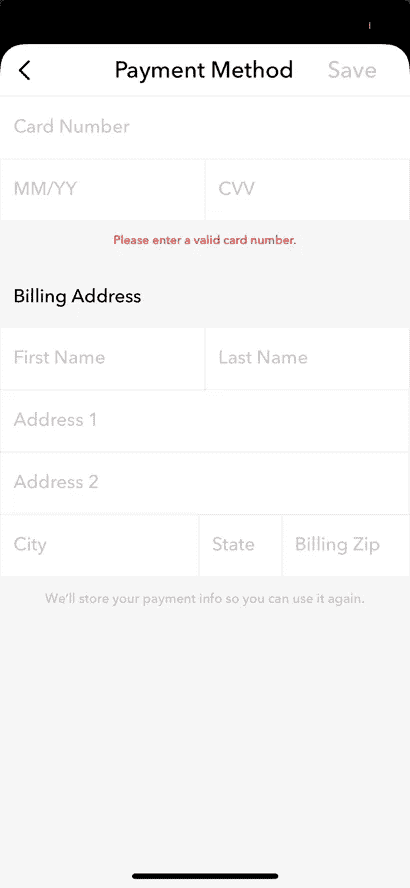

snapstore 在其当前的迭代中还有很长的路要走。但是这对有影响力的人和品牌来说潜力巨大。将用户留在 snapchat 中，而不是有一个向上滑动的链接，将用户跳转到其他平台，可以实现更具体、更完美的电子商务体验。Snapchat 的产品和品牌从创建之初就与用户有着内在的信任度和透明度。从 snaps 数据最小化实践到内容审查，用户信任 snapchat。有影响力的人可以利用这一点来增加潜在的转化率。如果一个产品正在 snapchat 上销售，用户知道它是合法的。由于用户经常使用 snapchat 进行交流，因此它每天打开 25 次。这意味着，仅仅因为一个用户看了你的产品或故事一次，并反弹，他们很可能会再次看到它，并可能转换。有点像你每天上班路过那家商店，最终决定进去看看。

# **4。快照代码**

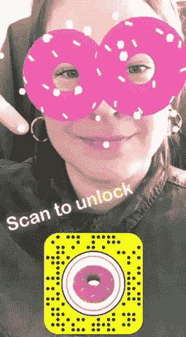

Snapcodes 允许用户解锁独家内容。这为场馆和艺术家提供了一个独特的机会来提升现场音乐会的体验。通过在门票上添加 snapcodes 或将它们打印出来并贴在场馆内的实物上。场馆、艺术家和节日可以提供独家内容，如滤镜和镜头，或者在他们的网站上通过 snapcodes 链接到 merch。无论如何，去音乐会的人都会抢购，通过添加独家内容，这可以鼓励用户将他们包括在他们的快照中。

example of a way snapcodes can be incorporated in the festival experience by adding them to wristbands.

# **结论**

音乐是文化。Snapchat 是文化。对于 GenZ 人群来说，Snapchat 已经改变了我们交流、捕捉、消费内容以及很快购买产品的方式。当我们在音乐会上时，我们抓拍。当一些疯狂的事情发生时，我们会爆发。当我们吃好吃的东西时，我们会打响指。触发因素不胜枚举。然而，snapchat 的潜力在很大程度上仍未开发。这是 GenZ 的注意力和眼球所在，有影响力的人和品牌可以充分利用这一点来超级瞄准 Genz 的人口统计。有一点是肯定的，音乐和 AR 内容的交集就在这里，snapchat 处于这一领域的最前沿。这是一个你不想错过的机会。

有问题吗？评论？你可以在 https://www.nicklamela.design/或 nlamela@tradecrafted.com 找到我

## 这篇文章发表在[《创业](https://medium.com/swlh)》上，这是 Medium 最大的创业刊物，有+ 371，663 人关注。

## 订阅接收[我们的头条新闻](http://growthsupply.com/the-startup-newsletter/)。

