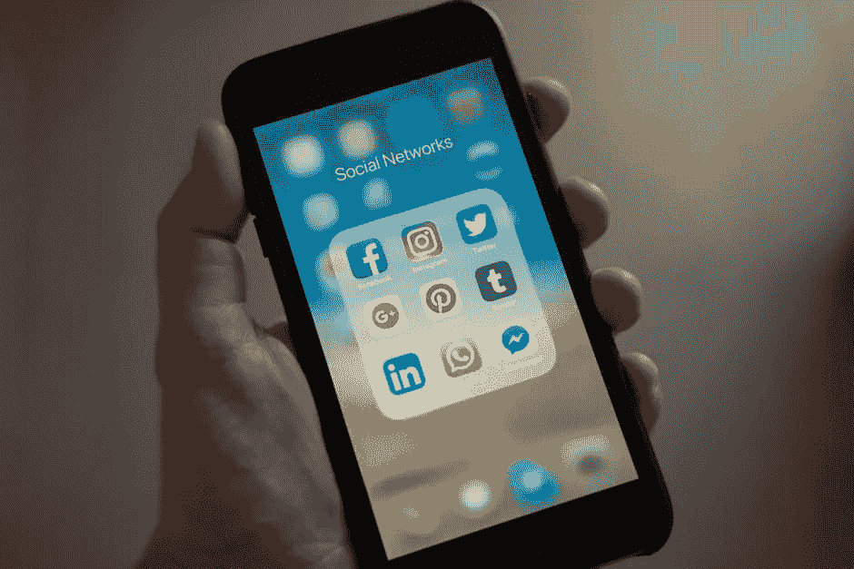
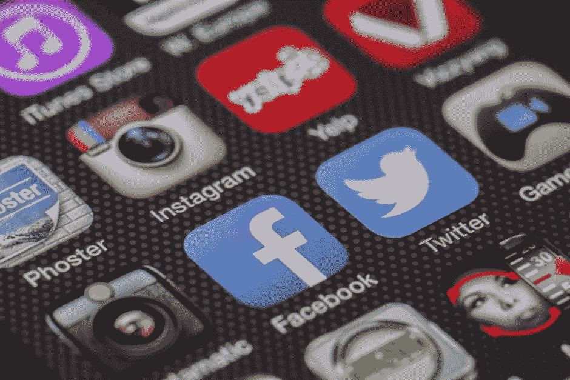

# 为什么社交媒体对记者来说是福是祸

> 原文：<https://medium.com/swlh/why-social-media-has-become-a-blessing-and-a-curse-for-journalists-8497a3bccaea>

自 15 世纪古腾堡发明印刷机以来，新闻业已经走过了漫长的道路。自从 1991 年互联网变得对公众开放以来，人们处理日常事务的方式已经完全改变了。正如我在这个博客上多次提到的，我们一直在线，在我们的个人和职业生活中从来没有像现在这样依赖万维网。

就像观众可以通过智能手机或互联网即时获得突发新闻一样，记者也可以。根据 Jennifer Alejandro 在 2010 年[进行的一项研究，六分之五接受调查的编辑表示，速度和即时性是社交媒体在接收新闻方面最有用的方面，我相信八年过去了，这种情况仍然存在。](http://reutersinstitute.politics.ox.ac.uk/sites/default/files/research/files/Journalism%2520in%2520the%2520Age%2520of%2520Social%2520Media.pdf)

作为一名记者，我明白这些社交平台在寻找、研究和分享故事方面有多么重要。每天我都会浏览 Twitter，希望能找到一个可以变成故事的信息宝库。十有八九我会中大奖。有 10%的日子里，我在 Twitter feed 上找不到任何有用的东西，我就用这个平台(以及其他社交媒体和搜索引擎)来搜索潜在的相关信息。

但是，随着能够快速找到信息，就需要更快地发布信息。亚历杭德罗说，获得“独家新闻”和“突发新闻”的想法现在是基于社交媒体上的“趋势”或搜索引擎上排名较高的内容。亚历杭德罗说:

> “记者被迫加快传统的新闻流程，因为人们现在需要实时信息。记者或媒体一收到信息，人们就想知道。
> 
> “因此，搁置一个故事直到它完成，是冒着被竞争对手抢先报道的风险，或者更糟糕的是，被公众称为反应迟钝。现在，一旦信息可用，就必须一次给观众一些信息。任何媒体都等不起。”

这也许解释了为什么我之前的帖子中提到的所谓的牛津广场枪击事件的信息应该被报道？在专业人士对情况进行评估之前就被分享了，为什么错误信息会被这么多人这么快地传播。正如我在这篇文章中得出的结论，我认为让人们了解潜在的问题和危险是重要的，但是如果信息分享得太快，可能会弊大于利。

也许这是一个太大的要求，但我认为在今天的数字时代，记者应该重视准确、真实的报道，而不是首先披露一个故事，不管它的内容如何。

## 这篇文章发表在[《创业](https://medium.com/swlh)》上，这是 Medium 最大的创业刊物，有 285，454+人关注。

## 订阅接收[我们的头条新闻](http://growthsupply.com/the-startup-newsletter/)。

