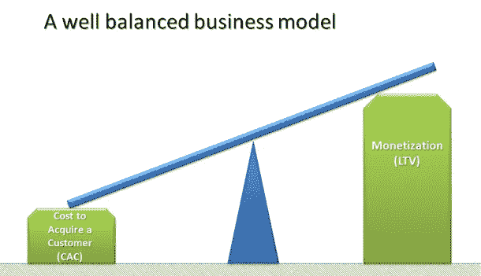
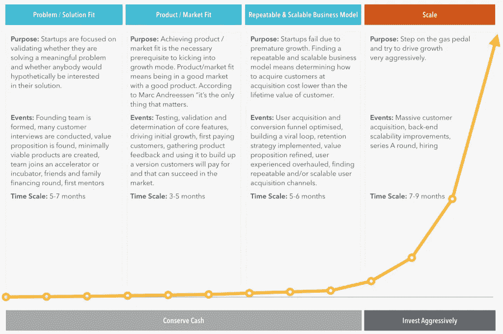

# 创业失败的原因以及如何避免过早扩张的陷阱

> 原文：<https://medium.com/swlh/why-startups-fail-and-how-to-avoid-the-pitfalls-of-premature-scaling-2fca33952fdb>

2012 年[初创公司基因组](https://s3.amazonaws.com/startupcompass-public/StartupGenomeReport1_Why_Startups_Succeed_v2.pdf)分析调查了 650 家互联网初创公司，发现“过早扩大规模是初创公司表现不佳并因超越自己而在早期输掉战斗的最常见原因”。类似地，一份关于 3200 家[高增长初创公司](http://www.appsterhq.com/blog/3-crucial-features-high-growth-startups)的[补充报告](http://innovationfootprints.com/wp-content/uploads/2015/07/startup-genome-report-extra-on-premature-scaling.pdf)显示，“74%的高增长互联网初创公司因过早扩张而失败”。因此，过早的扩展是创业杀手。但是，到底什么是过早结垢呢？你如何防止它导致你公司的死亡？在这篇文章中，我将提供这两个问题的详细答案，并概述成功发展你的业务的各种关键策略。

## 可重复和可扩展的业务模型

企业家史蒂夫·布兰克(Steve Blank)将初创公司定义为“一个为寻找可重复和可扩展的商业模式而成立的组织”。

扩展这个定义，[我最近指出](http://www.appsterhq.com/blog/start-ups-business-plans-lean-canvases-pivots):

*“创建可重复和可扩展的商业模式是初创企业生命周期中的一个阶段，在这个阶段，一家新企业找到了以低于预期收入的价格持续获得新客户的方法，从而产生了(潜在的)利润。”*

在初创公司的世界里，一旦有能力快速获得客户，并且成本低于客户创造的收入，想要成为公司的人就会成为“真正的企业”。

形成可重复和可扩展的商业模式对创业公司的活力至关重要，因为它为创业公司实现其核心目标开辟了可能性，即[以指数方式增长和扩展](http://www.appsterhq.com/blog/realities-21st-century-start-ups)。

因此，实现这样的商业模式是创业公司的最终目标。

当您的公司获得以下 3 个关键发展时，就达到了这一定义点:

1.  你的 [**客户获取成本(CAC)**](https://blog.kissmetrics.com/customer-acquisition-cost/)——即说服潜在客户购买产品或服务的总成本——比客户(LTV) 的 [**终身价值(指标)低——即客户在其一生中预期产生的收入；**](https://blog.kissmetrics.com/how-to-calculate-lifetime-value/)
2.  你按照 [**规模经济**](http://www.investopedia.com/terms/e/economiesofscale.asp) 经营——也就是说，你的顾客越多，你的产品成本就越便宜——这样你的 CAC/LTV 比率*随着增长而下降*；和
3.  你的商业模式不断自我复制，即你不断成功获取客户，而不耗尽你的获客渠道。

连续创业者转风投 [David Skok](http://www.forentrepreneurs.com/startup-killer/) 建议，SaaS 的初创公司应该追求并建立一个最低 3 比 1 的 LTV/CAC 比率，也就是说，你的普通客户带来的收入应该比当初收购他/她的成本至少高 3 倍:

(图片[来源](http://dskok.wpengine.netdna-cdn.com/wp-content/uploads/2009/12/image3.png)

这个 3:1 的比例似乎是大多数创业公司的普遍共识。

# **创业发展的 6 个阶段**

上述[创业公司基因组](https://s3.amazonaws.com/startupcompass-public/StartupGenomeReport1_Why_Startups_Succeed_v2.pdf)项目发现，创业公司一般会经历 6 个基于里程碑的发展阶段。

具体来说，初创公司通常会经历**发现**、**验证**、**效率**、**规模**、**维持**和**保护**等阶段。

前 3 个阶段——即发现、验证和效率——概括了初创公司验证其主要业务理念和产品的核心假设的时期。

在 [Appster](http://www.appsterhq.com/blog) 这里，我们已经写了大量关于开发、测试和理解你的核心业务假设、想法和产品的角色和重要性的文章——请看这里: [1](http://www.appsterhq.com/blog/mvp-app) 、 [2](http://www.appsterhq.com/blog/early-stage-entrepreneurs-launch-profitable-startup) 、 [3](http://www.appsterhq.com/blog/test-product-idea-real-world-feedback) 、 [4](http://www.appsterhq.com/blog/markets-fancy-ideas-create-successful-start-ups) 、 [5](http://www.appsterhq.com/blog/ways-to-boost-startup-revenue) 。

让我们更详细地看一下前 3 个阶段:

*   **发现阶段**:关注=确保初创公司打算解决的主要客户难题 a)足以推动新公司的发展，b) [可以货币化](http://www.appsterhq.com/blog/early-stage-entrepreneurs-launch-profitable-startup)达到业务最终可以盈利和扩大规模的程度。换句话说，找到适合的[问题/解决方案是最重要的关注点。](http://www.appsterhq.com/blog/early-stage-entrepreneurs-launch-profitable-startup)
*   **验证阶段**:聚焦=实现[产品/市场契合](../../../../../../../../../../../../../Applications/Microsoft%20Office%202011/Microsoft%20Word.app/Contents/product%20market%20fit%20example)。产品/市场契合意味着创造一种受欢迎的产品，满足足够大的市场需求，让你的初创企业在未来成长为一家全面的企业。正如我之前讨论的那样，作为一名创始人，你必须“绝对确信你打算提供的解决方案确实存在市场——否则，你的初创公司永远也赚不到它需要的钱来(扩大规模或)为世界做(任何)好事”。
*   效率阶段:专注=优化商业模式，使初创公司最终能够盈利。这最终涉及到开发可重复和可扩展的业务模型。

一般来说，一旦一家初创公司成功地走过了这三个阶段，就该开始大举投资，以扩大经营规模了:

我作为一名企业家，现在又是一家成功的数字应用初创公司的联合创始人，我的经历让我相信，成功的公司有别于其他大多数最终失败的想要创业的公司，因为前者承诺在初创公司生命周期的前三个阶段保持超节俭的支出。

因为 Appster 博客已经包含了很多有用的内容( [1](http://www.appsterhq.com/blog/3-crucial-features-high-growth-startups) 、 [2](http://www.appsterhq.com/blog/vertical-horizontal-business-growth) 、 [3](http://www.appsterhq.com/blog/4-crucial-steps-expanding-startup-internationally) 、 [4](http://www.appsterhq.com/blog/startup-growth-viral-loops) 、 [5](http://www.appsterhq.com/blog/ways-to-boost-startup-revenue) 、 [6](http://www.appsterhq.com/blog/business-development-for-startups) 、 [7](http://www.appsterhq.com/blog/realities-21st-century-start-ups) )，详细介绍了扩展一家初创公司的方法，也就是《初创公司基因组报告》中提到的第四个阶段，我将把这个阶段的讨论留到另一个时间。

我也将推迟讨论第 5 和第 6 阶段，即维持和保护，因为我想更仔细地看看与过早扩展相关的危险，这通常发生在创业生命周期的早期。

# **什么是过早洁牙？**

简单来说，[过早扩张](https://www.entrepreneur.com/article/245603)指的是努力让你的业务以超出你承受能力的速度增长。

或者，正如我最近解释的:

“过早扩张是指在你成功敲定一个可重复、可扩展的商业模式的复杂细节之前，试图大规模扩张和壮大你的新公司。

*未能确定 CAC 和 LTV 的具体情况会导致过早结垢，从而导致启动失败。*

试图在没有足够资源的情况下扩大你的公司规模，实际上肯定会产生一个[负](http://www.appsterhq.com/blog/costly-mistakes-avoid-first-time-entrepreneur) [现金流](http://www.appsterhq.com/blog/4-financial-metrics-startups-measure)的情况，在这种情况下，你的初创公司将会耗尽资金。

因过早规模化而失败的创业公司有以下一个或多个共同特征:

*   **在充分测试和验证他们的问题/解决方案是否合适之前，他们构建并尝试扩展产品**。对 3200 家高增长创业公司的创业基因组分析发现 [80%的成功创业公司在生命周期的前 3 个阶段专注于发现问题空间](http://innovationfootprints.com/wp-content/uploads/2015/07/startup-genome-report-extra-on-premature-scaling.pdf)(即发现适合市场的问题/解决方案)，而不是专注于客户获取策略。
*   **在成功建立稳固的产品/市场联盟之前，他们在获取客户方面花费过多**。失败的创业公司倾向于通过在公共关系和营销策略上花费大量资金来弥补产品/市场不匹配。这是一个可以被称为[企业家愿景谬误](https://brandtalkwithgarrett.com/2016/06/27/the-entrepreneurs-fallacy/)的例子，在这个例子中，一个企业家制造了一个“保证成功”的“革命性”产品，并试图*说服*她的客户购买它，而不是故意制造她广泛的*研究和测试*证明客户真正想要的东西。
*   **他们在过早的时候雇佣了太多的人**(包括昂贵的“顾问”，他们可能不会给企业带来任何实质性的价值)**筹集了太多的资金**导致财务纪律的丧失(即，对效率的专注)**和/或试图以牺牲** **发展公司的其他方面**为代价来获得高收益。

下面的 Appster 信息图概述了创业过程中 4 个主要阶段的主要焦点、业务行动和战略，以及每个阶段的大致时间表:

# **建立问题/解决方案契合度**

(图片[来源](http://www.anjalileadership.com/wp-content/uploads/2017/05/Group-coaching.jpg))

正如风险投资家和亿万富翁维诺德·科斯拉曾经说过的，“如果没有问题，就没有解决方案，公司也没有存在的理由……没有人会付钱给你去解决一个不存在的问题”。

成功建立问题/解决方案匹配需要发现并彻底了解客户的棘手问题，这些问题如此重要，以至于足够多的人不仅认识到它的存在，而且愿意为其解决方案支付高价。

在 1-5 的痛苦等级中，可货币化的痛苦是 4 或 5，也就是说，它需要立即得到解决*。*

发现适合的问题/解决方案是建立成功创业不可或缺的一部分。

为什么？

因为每一项创业活动最终都是基于创造人们愿意*购买*的东西的能力，但是这种购买永远不会实现，除非你的创造有效地解决了你的客户的一个或多个紧迫的问题。

一家初创公司如何验证它认为可以货币化的客户痛苦？

我在之前已经写过这个话题[。以下是需要记住的最重要的几点。](http://www.appsterhq.com/blog/early-stage-entrepreneurs-launch-profitable-startup)

为了测试您的疼痛假设，您需要:

*   找到一个客户样本；
*   亲自或在线调查他们；
*   评估结果；和
*   多做测试。

获取尽可能多的有效洞察力需要从你的焦点小组那里获得残酷的诚实。

与其急切地向你的参与者推销具体的想法，并试图向他们推销你的特定疼痛假说，你应该问一些开放式的问题，目的是让回答者自由、公开地说话。

同样重要的是，确保你不会明确地告诉你的参与者你正在构思一个商业创意，从而避免误导你的听众。

相反，你应该提出这样的问题:

1.  x 最难的方面是什么[即某个给定的问题]？
2.  再讲讲 x，上一次 x 发生了什么？
3.  为什么那次经历如此成问题或不愉快？
4.  您目前使用什么解决方案(如果有)来解决这个问题？你对他们有什么不满意的地方？它们需要如何改变？

一定要利用所有线下和线上资源来寻找潜在客户，并收集这种亲密的焦点小组反馈。

试试你现有的电子邮件列表、在线论坛/留言板、社交网络和微型网站、Reddit、Linkedin、Quora 和 Meetup.com。

[去星巴克向路人提供免费咖啡](http://www.appsterhq.com/blog/test-product-idea-real-world-feedback)以换取意见。

你也可以考虑以[冷电子邮件](/swlh/how-im-transforming-my-life-by-cold-emailing-complete-strangers-4c5eb8ba3e78)的形式，利用个性化的、周到的、智能定向的对外营销。

最后，您可以应用[“100 美元测试](http://www.appsterhq.com/blog/early-stage-entrepreneurs-launch-profitable-startup)”:

*“列出你正在考虑在最终产品中实现的所有功能，并问你的客户，‘如果你只有 100 美元来投资这款产品的一个或多个功能，你会如何投资？你会投资哪些功能？自然地，顾客会选择他们最关心的产品，从而为你提供数据来区分你产品的必要和多余的功能。”*

# **确定产品/市场适合度**

(图片[来源](http://hotspotsseattle.com/wp-content/uploads/2015/06/publicmarket11.jpg))

安德森·霍洛维茨风险投资公司的合伙人马克·安德森坚持认为，创业公司的成功最终取决于找到健康市场和受欢迎产品之间的契合点:

*“在一个伟大的市场——一个拥有大量真实潜在客户的市场——市场从初创公司那里获取产品。*

当你认真对待它的时候，除了市场，你几乎可以忽略其他任何东西。

*因此，一个成功的初创企业是已经达到产品/市场契合度的企业。*

*你会看到数量惊人的初创公司，它们几乎在运营的所有方面都完全搞定了，但由于找不到产品/市场，它们实际上正径直走向悬崖。”*

马克在这里的基本主张是，如果创始人没有尽职尽责，确保真正的产品/市场适合随着时间的推移而发展和繁荣，他们注定会失败。

增长黑客肖恩·埃利斯认为，一旦一家初创公司开发出工作原型并对其进行 beta 测试，该公司就可以通过要求其 beta 用户回答以下简单而重要的调查问题来衡量其产品/市场适合度:

如果您不能再使用产品 *x* ，您会有什么感受？

*   非常失望
*   有点失望
*   不失望(它真的没那么有用)
*   不适用—我不再使用产品 *x*

埃利斯的著名调查已经在数百家初创公司进行了测试，该调查基于他的信念:

*“考虑产品市场适合度的最佳方式是，产品应该是‘必须拥有的’。如今，人们有太多的选择，以至于不能满足于一件好事。那么，是什么让一件东西成为必需品呢？本质上，它需要既有价值又难以替代。各种调查问题旨在作为‘必备’信息技术的主要指标。”*

本质上，如果超过 40%的测试人员表示，如果他们不能继续使用你的产品，他们会“非常失望”,那么可以说，你的初创公司已经实现了稳固的产品/市场匹配。

如果你想了解更多关于埃利斯测试背后的想法和有用性，那么可以考虑观看下面由埃利斯本人发表的[演讲](https://youtu.be/X88sztwM-fg)。

此时，在成功走过创业的前 3 或 4 个关键阶段后，是时候进入发展规模经济、创造更多收入和扩大经营的阶段了。

由于我们已经提供了大量关于不同创业方法的详细和全面的内容，我鼓励你访问 [Appster 博客](http://appsterhq.com/blog)继续阅读这个主题。

*最初发布于*[*Appsterhq*](http://www.appsterhq.com/blog/avoid-pitfalls-premature-scaling)*。*

## 这个故事发表在 [The Startup](https://medium.com/swlh) 上，这是 Medium 最大的企业家出版物，拥有 293，189+人。

## 在这里订阅接收[我们的头条新闻](http://growthsupply.com/the-startup-newsletter/)。

