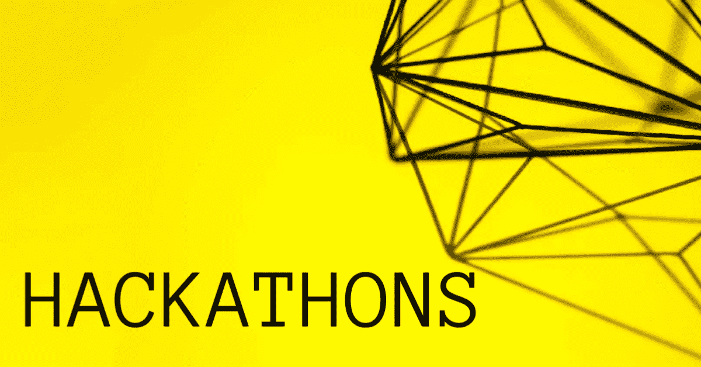
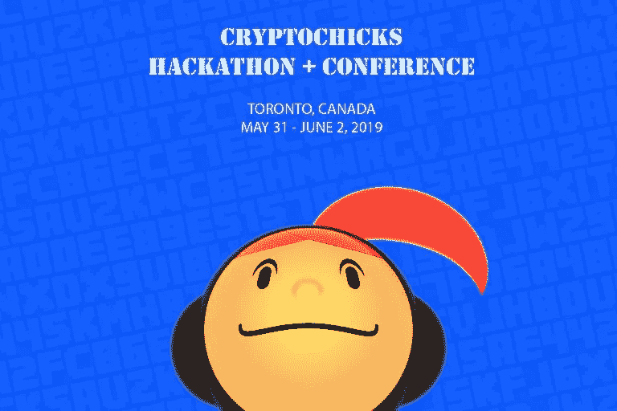
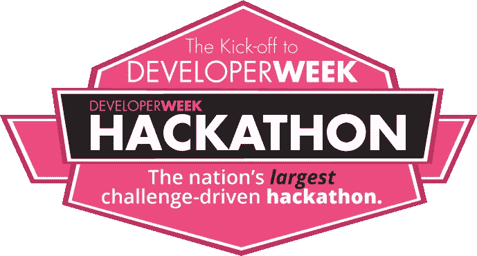
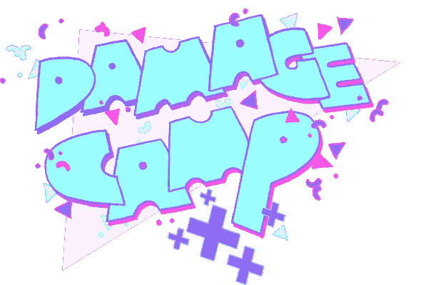

# 为什么创业公司应该把黑客马拉松加入他们的营销武器库

> 原文：<https://medium.com/swlh/why-startups-should-add-hackathons-to-their-marketing-arsenal-16a86553e77c>

## 黑客马拉松为你的初创公司提供了一个很好的方式来产生真正的轰动，获得行业支持者和招募优秀人才。

SpinSpirational.com

一旦你开始考虑创业的想法，你就应该开始建立关系网——开始参与你所在行业的社区。尽快建立你的社区会让你所有的营销工作变得更加容易。对于区块链和/或 crypto developments 来说，这可能意味着建立你的个人资料，并加入 Reddit、Bitcointalk、Telegram 和 Linkedin 等平台，但社区不仅仅是数字的，它们也是人类的。聚会、会议、活动、行业座谈会和我最喜欢的黑客马拉松应该加入你的营销武库。

黑客马拉松是一种冲刺式的活动，通常在周末举行，最初起源于程序员，但已经扩展到包括公益事业、游戏、机器人、人工智能、汽车……机会是无限的。它们是一种很好的方式，可以将人们聚集在一起，在社区的帮助下开展项目。

黑客马拉松非常有利于加强品牌在社区中的存在，不仅对于参与者，而且对于黑客马拉松的制作者来说，都是很好的社交机会。他们对于在社区中建立友谊是非常重要的，在如此短的时间内培养的信心和创造力的价值是无价的。黑客马拉松可以让个人、团体和组织接触到新的可能性、新的思维方式，并且可以很好地向社区介绍你和你的公司。

要开始创建您的黑客马拉松活动，请查看一些顶级的黑客马拉松组织和活动正在做什么。如果你没有足够的资源来创建自己的黑客马拉松，那就去参加一个已经存在的——作为赞助者、导师、参与者或演讲者来参与。

CryptoChicks.ca

加拿大非营利组织 CryptoChicks 是一个将黑客马拉松技术视为科学的团体。CryptoChicks 是区块链的一个女性教育中心，由埃琳娜·西内尔尼科娃(Elena Sinelnikova)和联合创始人娜塔莉·阿姆利娜(Natalie Ameline)于 2017 年 7 月创立。Elena 对 CryptoChicks 的愿景是赋予和激励对了解加密货币和区块链感兴趣的女性。Elena 是一个软件开发团队的领导者，她认为女性在技术领域的代表性严重不足。娜塔莉亚的专长主要在于战略财务规划，她和埃琳娜一样，认为女性是科技世界中一种极具天赋但尚未开发的资源。

**CryptoChicks 2019 年多伦多黑客马拉松和大会已经成为全城谈论的话题**

目前，2019 年 CryptoChicks 的日历包括在瑞士、巴基斯坦举行的黑客马拉松活动，他们定于 2019 年 5 月底举行的[多伦多黑客马拉松](https://cryptochickshackathon.com/)已经因特邀演讲者以太坊发明家 Vitalik Buterin 而引起了很多关注。

DeveloperWeek

**developer week**

[developer week](http://www.developerweek.com/)是全球最大的开发者博览会和会议系列，参与者超过 8000 人。在 DeveloperWeek 期间，重点是新的开发技术，如 HTML 5、Python、Javascript、机器人开发、数据科学和机器学习。

developer week 过去的活动主办者和支持者有 Google、Oracle、脸书、IBM、Cloudera、红帽、Optimizely、SendGrid、黑莓、微软、Neo Technology、Eventbrite、Klout、Built.io、Ripple、GNIP、Tagged、HackReactor 等。

数百名开发人员参加了 DeveloperWeek 黑客马拉松，这拉开了 DeveloperWeek 的序幕。参与者将构建 web 和移动应用程序来解决现实世界中的群众投票挑战。

**hack Zurich**

[hack Zurich，](https://digitalfestival.ch/en/HACK/)可能是欧洲最大的黑客马拉松，是一年一度的不间断编程比赛，在瑞士苏黎世举行，持续 40 个小时。该黑客马拉松在参与者中很受欢迎，因为该活动免费参加，提供免费食物和饮料，并且是更大的苏黎世数字节的一部分。你可以加入一个团队，或者如果你是单飞，你可以在活动中加入一个团队。对于所有类型的编码人员来说都是一件大事。

**TechCrunch Disrupt**

[TechCrunch Disrupt](https://techcrunch.com/events/)是发生在纽约市、旧金山和柏林的一系列国际活动。TechCrunch Disrupt 事件主要围绕早期创业公司展开，这些公司争夺奖金、媒体关注和风险资本。TechCrunch Disrupt 的 24 小时黑客马拉松为程序员提供了一个难以置信的机会，让他们得到行业专业人士的指导，与投资者联系，并与其他程序员一起玩得开心。

Dames Making Games — Damage Camp

**美女制作游戏——伤害营**

虽然从技术上来说不是黑客马拉松，但它是一个非常有趣的传统会议，一个非营利性的视频游戏艺术组织 Dames Making Games[，为女性、非男性、女性和对游戏感兴趣的同性恋者举办了广泛的项目和活动，为游戏爱好者推出了他们的系列会议，名为 Damage Camp。](https://dmg.to/)

Damage Camp 展示了来自多伦多和蒙特利尔的 12 位主流和独立游戏艺术家、开发人员和研究人员的单声道演讲，突出了艺术和文化社区与加拿大蓬勃发展的技术和游戏产业之间的联系。为了这次活动，他们创建了一个由 16 个新的和未发布的游戏组成的拱廊，在会议期间开放，会议在[多伦多媒体艺术中心(TMAC)](https://www.tomediaarts.org/) 举行，这是一个新的媒体艺术中心和节日中心，位于多伦多艺术设计区的中心&致力于以社区为基础、无障碍的方法来促进文化和技术的发展。成员包括加拿大电影制作人发行中心，查尔斯街视频，DMG 和伽玛空间。tomediaarts.org

**在黑客马拉松中孵化的项目**

最近在纽约举行的 CryptoChicks 黑客马拉松活动见证了由 [Casie N. Kesterson](https://www.linkedin.com/in/casiekesterson/) 组织的一个项目的开发，该项目将艺术史学家、博物馆、拍卖行、画廊、出版商和档案馆的研究与区块链技术相结合，将提供一个更快、 成本较低的方法来进行彻底的研究，验证艺术品的所有权和交易，项目的初始阶段侧重于利用版权清晰的文件，这将有助于那些与纳粹掠夺的艺术品打交道的人。他们在 2018 年的多伦多黑客马拉松活动中看到了 Rachel O'Neill、Natalie Chin 和 Sally Yip 提出的一个有趣的项目； Reg-A-Star 是一个民事登记工具，旨在向准入有限或不存在的地区提供生物统计出生登记服务。通过对每个人的出生进行登记，并能够证明孩子的真实年龄，你可以防止侵犯人权，如童婚和未成年人应征入伍。

黑客马拉松为你的创业提供了一个很好的方式来产生真正的轰动，获得行业支持者和招募优秀人才。有价值的、有机的品牌曝光是你的创业成为社区话题的关键，谁知道呢，你可能会帮助推出一个有巨大社会影响的有趣项目。

奥黛丽·奈斯比特

[螺旋营销&公关](http://www.spinspirational.com)

[奥黛丽·奈斯比特在领英上](https://www.linkedin.com/in/audrey-nesbitt-0388a52a/)

[@ audreynesbit 11 在推特上](https://twitter.com/AudreyNesbitt11)

## 这篇文章发表在 [The Startup](https://medium.com/swlh) 上，这是 Medium 最大的创业刊物，拥有+393，714 名读者。

## 在这里订阅接收[我们的头条新闻](http://growthsupply.com/the-startup-newsletter/)。

