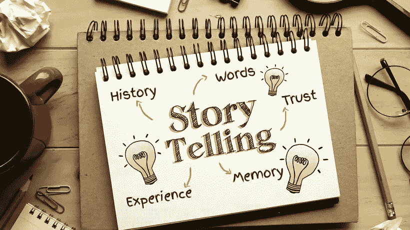

# 为什么讲故事引领营销的新时代

> 原文：<https://medium.com/swlh/why-storytelling-is-leading-marketings-new-era-105a717bab5c>

市场营销已经发生了巨大的变化，尤其是在过去的十年里。随着数字和移动技术的兴起，营销在商业优先事项中强势复苏。作为一个商科专业的学生，市场营销是一个似乎已经过时甚至不受重视的学科领域。快进十年后，尤其是 iPhone 推出后，数字营销是其中之一…