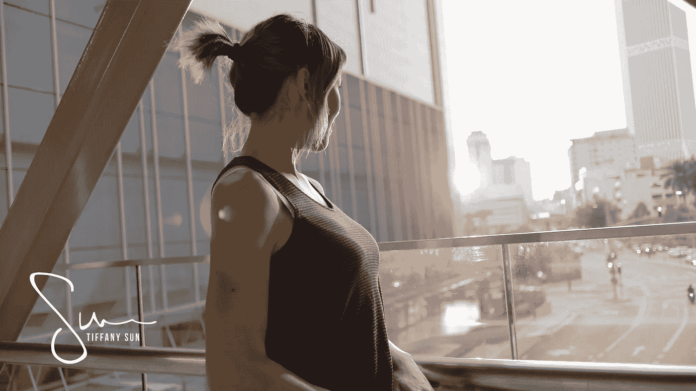

# 为什么休假是你能为自己做出的最好决定

> 原文：<https://medium.com/swlh/why-taking-time-off-is-the-best-decision-you-can-make-for-yourself-9b6a6950dfd7>

听到这个词，**工作与生活的平衡**，总是让我畏缩，因为老实说，这不是我的强项。

我总是想着工作，不管我的人生方向是否正确，这经常让我觉得我做得不够，这让我想继续工作。如果我必须更准确地描述这种感觉，它就像一种瘙痒…