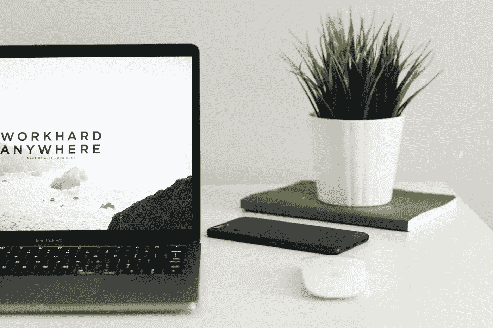
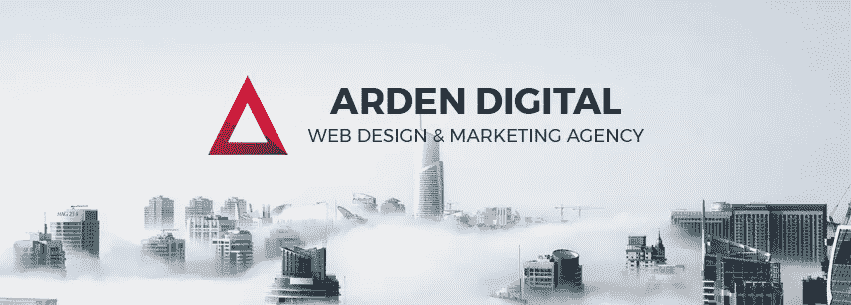

# 为什么 1%不再是“1%”

> 原文：<https://medium.com/swlh/why-the-1-will-no-longer-be-the-1-aa250c7eea1c>

让我们首先探索一下显而易见的事实:没有什么是永恒的，对吗？我们知道这是不可避免的，我们在不断变化，每秒钟都在增长。然而，我们花了这么多时间在一些相同的耻辱上，并把它作为我们的平台。因此，有了“1%”。知道没有什么是永恒的，我们怎么还能假设仍然有，或者将永远有那 1%。是不是富人越来越富，穷人越来越穷？我说绝对不行。随着时间的推移，这一点变得越来越明显。

近年来这里发生了迅速的变化，年轻一代几乎在一夜之间成为百万富翁**。这不是偶然或运气。在以后的岁月里，我们看到一个 16 岁的孩子一夜之间成为百万富翁的唯一途径是，他的父亲是一家大公司的所有者，并且他的净资产超过 1 亿英镑。随着技术时代的不断发展，现在每个拥有笔记本电脑或智能手机的人都拥有成为百万富翁的工具。我们正处于这样一个时代，当母亲浏览杂货店时，即使是婴儿也会伴随着智能手机和奶嘴。婴儿潮一代传播了他们对孩子如此自由地使用强大工具的厌恶，但这种厌恶只是源于无知的根源。然而，这同样是一个强大的工具，它共同教导年轻人科技的适宜世界。随着年轻一代如此容易获得，这只是“1%”不再保持其头衔的一种方式。**

接下来的日子表明，要想变得富有，你还必须上大学和/或已经来自白领家庭(至少这大大增加了你的机会)。虽然，教育和一个装满钱的口袋仍然可以帮助你飞黄腾达，但这绝对不是像以前那样的必需品了。成为富人需要什么？一个平台(互联网)和一个小众。这是我们大多数人已经拥有的。有了这么多合适的工具，我们大多数人成为“1%”只是时间问题。

虽然许多人已经成功地找到了接近 1%的方法，但仍有许多人在努力奋斗。人们面临的最大问题是互联网有多大。是的，互联网是平台，但下一步是什么？然后你就有了利基。从小学起，我们就被教导要选择职业。警察、医生、消防员、护士，不胜枚举。因此，我们都有一个职业重点，但这与利基市场略有不同，利基市场实际上会产生致命的影响。

那么99%的下一步是什么，去编程。

想看更多吗？下一章 1/2/18“取消编程”

Written by Alyssa Kelly | January 1, 2018

## 这个故事发表在 [The Startup](https://medium.com/swlh) 上，这是 Medium 最大的企业家出版物，拥有 285，454+人。

## 订阅接收[我们的头条](http://growthsupply.com/the-startup-newsletter/)。

