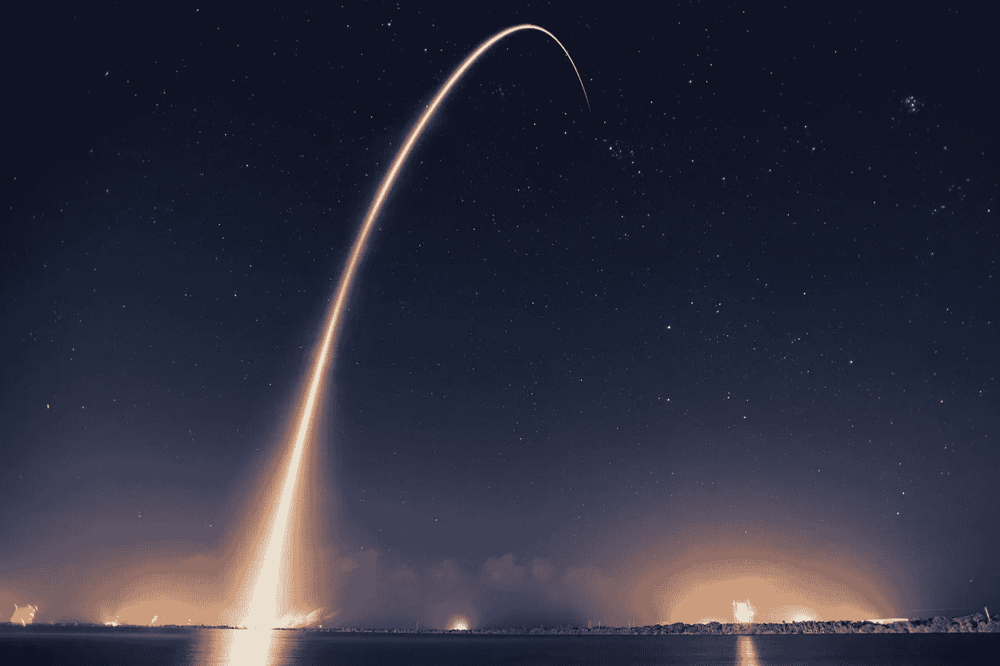

# 为什么埃隆·马斯克要离开我们美丽的星球

> 原文：<https://medium.com/swlh/why-the-hell-does-elon-musk-want-to-leave-our-beautiful-planet-f5a78c58bdef>

Cape Canaveral Air Force Station, United States [Photo by [SpaceX](https://unsplash.com/photos/TV2gg2kZD1o?utm_source=unsplash&utm_medium=referral&utm_content=creditCopyText) on [Unsplash](https://unsplash.com/?utm_source=unsplash&utm_medium=referral&utm_content=creditCopyText)]

> “当你仰望地球上的夜空时，你不会不好奇在群星之中是什么样子。我总是仰望月亮，把它视为宇宙中最浪漫的地方。”—汤姆·汉克斯

地球是我们都知道并热爱的地方。这是我们的家；我们仅有的一个。

在日常生活中，我们有时认为我们的星球是理所当然的。

地球为我们人类提供了坚实的土地，我们可以呼吸的空气，以及所有现存生命中不可或缺的关键元素“水”。

几乎这个星球的每一个特征都是我们自身存在的直接原因。

我们到底有多幸运？

**嗯，要是我们星球的就好了:**

*   地壳或表面比它实际上要厚一点(4-30 英里)，那么我们人类就不可能存在。大陆不可能以这种方式形成，因此**阻止了地球上多样化生命的传播**。我们星球的内部温度将不受控制，非常适合生命居住。
*   尺寸再小，就没有可呼吸的大气或云，空气和**当然也没有人类**。
*   气体含量没有达到我们现在所拥有的最合适的数量，那么我们的大气就无法维持生命的繁荣。
*   它的**轴**(一个从顶部到底部穿过中心的假想极点)的一定程度的倾斜不存在或保持正确，那么我们当前的温和且相对温和的季节变化将更加严酷，并且**无法维持生命和平衡**。
*   太空中的位置会稍微靠近全能的太阳，然后太阳辐射会烘烤它的表面；再远一点，那么我们热爱的地球将只不过是一个永远黑暗和冰的漂浮球。

现在来回答关于运气的问题。

瑞典乌普萨拉大学的天体物理学家埃里克·扎克里森进行的研究表明，我们的地球是宇宙中 700 颗行星中唯一的一颗。

对于数学书呆子来说；700 万亿分之一是 7 后面跟着 20 个零，即 700000000000000000！

是的，我们就是这么幸运！

# 那么，为什么马斯克先生如此痴迷于离开地球去火星，一个充满废物和虚无的不毛之地呢？

科学和宗教都认为地球注定要灭亡。

> “上帝要彻底毁灭地球上的一切”——圣经(以赛亚书 24 章)

科学家认为，就像强大的恐龙一样，我们也可能在某一天被一颗巨大的小行星毁灭。

这只是人类在地球上灭绝的众多方式之一。

是的，这些都是我们应该努力成为行星间物种的很好的理由。

> “人类需要成为多星球物种”——埃隆·马斯克

但是，这仍然不足以解释埃隆·马斯克和他在 SpaceX 的士兵们每天投入的大量辛勤工作和奉献。

我是说你为什么要这么做？这并不意味着末日即将来临。

为什么要花费数十亿美元在太空冒险上，而你可以花费所有的资源来培育我们的家园？*(实际上很难这样说埃隆·马斯克，因为他在特斯拉和 Solarcity 还有其他对地球友好的项目，但为了便于讨论，我们现在就顺其自然吧)*

所以我不禁想知道，**到底是什么让埃隆·马斯克和 SpaceX 打勾？**

## 答案其实一点也不复杂。

我们需要离开地球的原因和我们的祖先离开舒适的家园，去遥远未知的地方旅行的原因是一样的。

或者是同样的原因，为什么欧洲伟大的探险家在 15 世纪到 17 世纪痴迷于离开他们自己的土地去寻找新的土地。

> 我们上一代探险家**拥抱对未知和不确定的恐惧**的原因，是因为我们作为一个物种与生俱来的成长和进化的天性。

## 我们人类是天生的探险家。

正是因为这种对探索的痴迷，才让我们变成了这个星球上有史以来最崇高的物种。

有人可能会说，我们的祖先只是用完了食物，或者探险家只是在寻找新的贸易路线，以满足 17 世纪蓬勃发展的资本主义。

这些理由很有道理，但不完全完整。

# 让我们回到过去，看看一位年轻探险家的航行，它塑造了我们的现代历史和思维方式。

> “1831 年，皇家海军派遣英国皇家海军舰艇贝格尔号去绘制南美洲海岸、福克兰群岛和加拉帕戈斯群岛的地图。海军需要这些知识来加强英国对南美的帝国控制。船长是一名业余科学家，他决定在探险队中增加一名地质学家来研究途中可能遇到的地质构造。在几名专业地质学家拒绝了他的邀请后，船长把这份工作给了 22 岁的剑桥毕业生查尔斯·达尔文。达尔文曾学习成为一名圣公会牧师，但他对地质学和自然科学的兴趣远远超过对圣经的兴趣。他抓住了机会，剩下的就是历史了。船长在航行中绘制军事地图，而达尔文则收集经验数据，形成最终成为进化论的见解。”《智人》，尤瓦尔·诺亚·哈拉里著

正如你所看到的，如果探索仅仅是由征服土地和养活人类的需要推动的，那么也许，我们不会很快了解我们自己的生物故事。

驱使达尔文离开家进入荒野的不是金钱或权力，至少不是主要原因，而是探索未知的渴望。

其他一些著名的人，就像达尔文一样，从他们的舒适区被吸引了出来，包括:伽利略·伽利雷，克里斯托弗·哥伦布，瓦斯科·达伽马，马可·波罗，尼尔·阿姆斯特朗等。

这些人来自不同的专业背景、国家和时代，但被一个共同的主题团结在一起:

> 对探索未知的永无止境的渴望。

我个人认为，几百年后，埃隆·马斯克的名字将会和上面提到的那些人一起被提起。

> “我们不会停止探索，我们所有探索的终点将是到达我们开始的地方，并第一次了解这个地方。”—t·s·艾略特

# 那么这些信息对你现在的生活有什么帮助呢？还是明天？或者将来的任何时候？

让我们花点时间忘记拯救地球，或者到达火星，或者努力成为人类伟大的探险家。

想想你此时此地的生活。

无论你现在的生活状态如何，无论你是快乐、成功、满足、痛苦、挣扎还是停滞不前；人生的下一步肯定需要你走出舒适区，进入未知的领域。

简而言之，没有其他方法可以成长或进化。

探索是你的基因。

探索给了我们人类真正刺激的感觉。

根据[本杰明·p·哈迪](https://medium.com/u/5153880ce2ee?source=post_page-----f5a78c58bdef--------------------------------)写的一篇[文章](/@benjaminhardy/to-have-freedom-in-your-life-you-must-stop-avoiding-this-one-thing-78cf4d77ec1c):

> 只有当你把稳定和可预测性抛在身后，你的生活才会有自由。
> 
> 除非你步入未知，否则你不可能自由。
> 
> 如果你不愿意踏入未知，那么你就是你所知的人质。你是当前环境的奴隶。
> 
> 你是情感的奴隶。
> 
> 你是你故事的奴隶。
> 
> 你是你认为自己是什么的固定思维模式的奴隶。

这个信息是非常真实的，可能有点令人紧张。

也就是说，为了成长、快乐并在生活中拥有真正的自由，一个人必须停止生活在自己的故事和舒适区中。

历史上充满了普通人的成功故事，他们跨出了自己的界限，并因其勇敢而获得了非凡的回报。

> “我认为普通人有可能选择变得不平凡”——埃隆·马斯克

# 别担心，你不必去火星

Photo by [Jonatan Pie](https://unsplash.com/photos/h8nxGssjQXs?utm_source=unsplash&utm_medium=referral&utm_content=creditCopyText) on [Unsplash](https://unsplash.com/?utm_source=unsplash&utm_medium=referral&utm_content=creditCopyText)

> “我是个讲故事的人；这才是探索真正的意义所在。去别人没去过的地方，回来讲一个没听过的故事。”—詹姆斯·卡梅伦

如果你曾经觉得被固定的工作或生活困住，只是不快乐，那么不要接受生活的本来面目。

去探索吧！

不一定要探索一个新的星球。

它可以很简单，比如尝试一项新的爱好，或者学习一门你一直想学的语言，或者像我这样，重新发现一种久违的写作激情。

对你来说，可以是跳舞、绘画、唱歌，甚至骑马，谁知道呢！

或者你想自己创业，那就想办法去做。

去探索吧！

如果你不快乐，就不要满足于你所拥有的。

向伟大的探险家学习，努力站在巨人的肩膀上。

如果埃隆·马斯克能够找到一种快乐的方式来探索火星，那么毫无疑问，我们至少可以尝试探索新的可能性，兴奋不已，并在途中找到新的激情。

所需要的，就是步入未知，拥抱不确定性。

如果你没能打开通往幸福的钥匙，那么，至少你会有一些精彩的故事可以讲述。

## 这篇文章发表在 [The Startup](https://medium.com/swlh) 上，这是 Medium 最大的创业刊物，有+ 377，345 人关注。

## 订阅接收[我们的头条](http://growthsupply.com/the-startup-newsletter/)。

