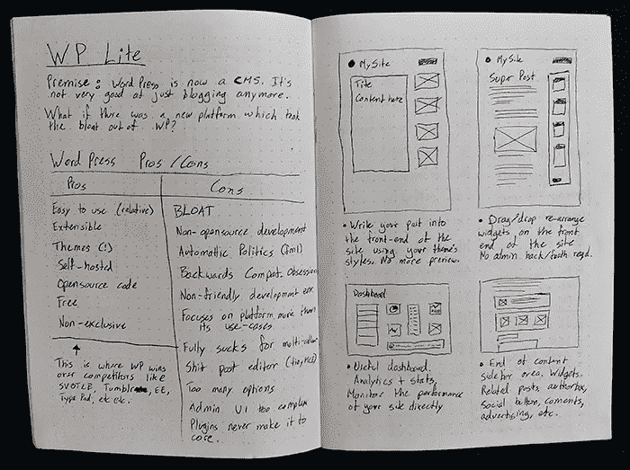
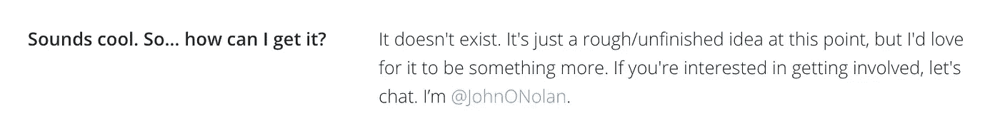
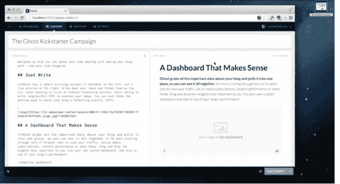

# 为什么显而易见的想法是最好的

> 原文：<https://medium.com/swlh/why-the-obvious-ideas-are-the-best-ones-21715dceb393>

## Ghost.org 鼓舞人心的故事:与约翰·奥诺兰的对话

his post was originally [published on Frontcourt](http://frontcourt.co/).

“有时候那些明显的想法，那些看起来不太好的想法，实际上是你最好的想法，”约翰向我解释道。“我一直试图更经常地拥抱这些，因为那是我工作最好的地方。”

John O'Nolan 是 Ghost 创始团队的成员之一，Ghost 是一个为独立出版商、记者和博客作者提供发言权的出版平台。他的故事与你典型的创业历程截然不同。

当大多数创始人踏上漫长而曲折的创业之路时，他们有着数百万(或数十亿)美元估值、风险投资资金和久负盛名的加速器项目的宏伟抱负。

约翰和幽灵证明了还有另一种方式可以获得成功。在不追逐估值或只关注退出的情况下，建立一家成功的、可持续发展的科技公司是可能的。作为证明，Ghost 现在拥有超过 3，200 名付费客户，每月经常性收入超过 60，000 美元——仅在推出 3 年后。

Ghost 是为了持久而不是为了销售而制造的。它是一个完全非营利的组织，是一个开源项目。因此，没有一个团队可以从中赚很多钱。这意味着，与许多其他创业公司不同，Ghost 没有为估值、股东利益或收购进行优化。

然而，这些指令只是真实故事的一个影子。Ghost 最初的成功需要数年的时间。最近，我有幸与约翰谈论了《幽灵》从想法到现实的旅程。

*更喜欢听这样的采访？点击下方播放:*

# 成功源于服务

约翰知道写博客。他创建 Ghost 的旅程始于对构建和设计博客的热情，这无意中成为了他的专长:

“我为大公司建立了很多很多的博客，最后我成了很多人建立公司博客的关键人物。这些人来自微软、维珍航空、诺基亚以及各种不同的组织。”

通过这次经历，John 对博客平台 Wordpress 产生了好奇，他开始在开源的基础上帮助他们进行设计和前端开发。在大约两年的时间里，他参与的越来越多，以至于他们让他担任设计组的副主任。

当时，该产品正在经历一些关键的变化——从其作为博客平台的根基转变为一个成熟的内容管理系统，可以做各种不同的事情，如电子商务、网络等等。

结果，一个想法开始在约翰的脑海中出现:

当我开始看到它脱离了博客平台，失去了最初的关注点时，我想知道，“如果 WordPress 今天从头再来，会是什么样子呢？”"纯粹专注于博客和出版，而不是任何其他用例."

约翰喜欢这个想法，但在做出承诺之前，他与自己反复斟酌:

“我拒绝它的时间最长，因为谁还想要另一个博客平台？世界上并不缺少它们。我认为这个想法太明显了，不够有创意或创新性。我试图用我的时间去想其他更有雄心的事情，并为之献身。”

# “如果你中了彩票，你会做什么？”

几个月后，脑海中仍然萦绕着“幽灵”的想法，约翰意识到他并不真的想要——或者需要——建立一个大企业，筹集大量风险资本，或者成为百万富翁。

“我只想做我真正喜欢的事情，对我来说，它能变得多大并不重要，只要我能赚到合理的薪水，过上我喜欢的生活。我想，那么，想到一个非常明显的想法，如果它是我喜欢的事情，就去追求它，这有什么错呢？’”

这种认识是由一个简单的问题引起的——我想我们都曾在人生的某个阶段问过自己:

**如果你中了彩票，你会做什么？**

“你赢了，我不知道，1 亿美元，所以你有更多的钱，你永远不知道该怎么处理。接下来你会怎么做？”“一开始，这个游戏很简单，”约翰解释道你买了一辆兰博基尼，一艘游艇，7 栋房子，你向你可怕的公司老板伸出手指，然后你走出去，买你想要的一切，物质主义疯狂了。在那之后，事情会变得有点困难，但是你可以想象花很多钱去环游世界，学习新的东西，给慈善机构捐款，诸如此类的事情。"

“实际上，在 2 到 3 年的时间里，你可以用世界上任何数量的钱购买和做任何事情。到那时，你至少还能活 50、60 年。”

“假设你跳过了购买、参观和做所有事情的 2 年，你实际上想在剩下的时间里花时间做什么？

“这个问题困扰了我很长一段时间，最终，我在世界各地旅行，我想是在 2011 年，2012 年，我发现自己坐在菲律宾的一个小岛上，和几个当时是好朋友的人一起玩，看着风筝冲浪者在岛上玩风筝，在我的笔记本电脑上做一些工作。我想当时我甚至在黑 WordPress，只是在做一些修改。我意识到我终于找到了这个问题的答案，那就是，我会做完全一样的事情。”

“我已经拥有的生活方式，我基本上认为是理所当然的，不需要大量的金钱，也不需要成为亿万富翁或百万富翁或诸如此类的人。对于在英国从事科技工作的人来说，这需要一份非常适中、平均、甚至低于平均水平的薪水。我非常开心。我想这是我能记得的唯一一个可识别的转折点。”

# 把想法写在纸上

抛开“这永远不会是一个 1 亿美元的想法”的污名，意识到这个想法可以是一个小生意，并维持他想要的生活方式，约翰决定把它从脑海中抹去，并把这个想法写在纸上。

“有一天，我拿出一个笔记本，草草写下一些我认为它可能会变成的样子，看起来会是什么样子，这几乎是一种试图把它从我的脑海中抹去并写在纸上的方式，这样我就可以继续前进。当我看到这些都被写下来时，它似乎变得更加有趣，如果有什么不同的话，它巩固了我的想法，而不是让我想继续前进。”

*原图来自* [*约翰的记事本*](http://john.onolan.org/part-i-lets-begin-at-the-beginning/) *。*

正如任何一个面临承诺一个想法的时刻的人都会证明的那样，做出这个决定是一个重大的决定。但对约翰来说幸运的是，他在正确的时刻得到了他所需要的推动力。

“我和几个人谈过，不是很多，我想几乎每个人都无一例外地说了类似这样的话，‘每个人都在谈论做这样的事情，但没有人真正做到过。’"

# 将想法变成现实

反馈促使 John 将他的想法从在笔记本上涂鸦转移到设计一些屏幕，并在简单的产品页面布局中展示这个想法。

“我只是把它扔了出来，我把它放在一起，就像一个大模型，一个非常非常大的 Photoshop 画布。我想，我把它分成了 11 张图片，它们一张一张地出现，然后把它们放到了我的博客上。我想，如果没有别的，我已经把这个想法摆在那里了。我敢肯定，我的数百名 Twitter 粉丝会阅读它，也许其中一些人会喜欢它。对我来说，这可能是结束，但事实并非如此。"

这篇博文以一个故事开始，分享了 John 在博客开发方面的经历，以及他个人对 Wordpress 等大型博客平台发展方向的失望。[帖子解释](https://john.onolan.org/project-ghost/):

> *“然而，我使用 WordPress 的时间越长，我在创建博客时遇到的问题就越多。你看，WordPress 变了。最初是一个不起眼的博客平台，旨在为大众提供数字出版，现在已经发展成为一个成熟的网站 CMS。”*

约翰呈现登录页面的方式流畅优美。从约翰个人经历和挫折的最初故事，这篇文章过渡到解释 Ghost 将如何工作，并成为“只是一个博客平台”。最后，它解释了如何将业务设置为开源，并欢迎来自开发人员和各级开发人员的贡献。

在这篇博客文章的最后，有一条给对这个想法感兴趣的人的信息:

这篇博文火了。它登上了黑客新闻的榜首，被数百人转发，到第一周结束时，它已经被访问了 25 万次。约翰的收件箱已经满了。

“人们的兴趣是爆炸性的，出乎意料的，远远超出了我想象的反应，‘又一个博客平台，’”约翰回忆道。

但是为什么人们对这个想法如此感兴趣呢？

约翰认为，有两个非常不同的原因，人们伸出手，与他人分享这个想法。首先是产品本身。人们喜欢这个想法，也喜欢它不同于目前可用的方式。

第二个原因是企业运作的方式。Ghost 是一个目的驱动的非盈利组织，也是一个开源项目。他们所做的一切都是为了用户的利益。约翰解释道:

“即使在最初的博客帖子中，它的全部意义也是创造由非营利组织支持的开源技术，这将改善在线作家和记者的生活和能力。它的全部意义在于为每个人创造技术，不仅仅是为了致富而出售的技术，而是为了建造真正好的东西并使其可持续发展的技术。”

# 信仰的飞跃

在流量和对他的想法的兴趣激增之后，约翰转入了验证模式。他写了一篇后续博文，开始收集电子邮件地址，并记录了所有给他发邮件讨论幽灵概念的人:

“那时我知道，在我的职业生涯中，我所从事的任何其他工作都没有获得如此巨大的反响，如果我不至少尝试一下，弄清楚下一步可能会是什么，我会疯掉的。从那时起，我停止了所有的自由职业工作，开始用我的积蓄来研究这个想法，想办法把它变成现实，而不仅仅是一个模型。”

# 启动项目

“对于一个非盈利的开源项目来说，只有一个明确的方法可以做到这一点:Kickstarter。其他的都没有意义，”约翰在他的博客上解释道。

在观察了一些成功的活动后，他意识到，当你至少表现出一些能够实现你承诺的能力时，Kickstarter 项目似乎会更好。

“在这一点上，我所知道的是，在 Kickstarter 上表现良好的产品都有高保真的原型，并且被非常强烈地展示出来，”[他回忆道](http://john.onolan.org/part-v-preparation-for-trial-by-fire/)。

在这个阶段，他的所有努力都集中在将概念转化为有形的东西，准备展示，并通过 Kickstarter 筹集一些资金。约翰请他的朋友汉娜·沃尔夫帮忙制作一个原型。

约翰和汉娜是 7 年前认识的朋友，那时他们是年轻天真的网页设计师，在一个论坛上发布关于 HTML/CSS 和 PHP 的基础知识。

2012 年底，汉娜和约翰碰巧在就一些完全不相关的事情交换电子邮件，当时汉娜询问了“幽灵”的进展。[约翰回答道](https://john.onolan.org/part-iii-from-fiction-to-function/):

> “RE Ghost——我正在设计更多的模型，很多很多。最大的失败是找不到人为插件做第一次后端代码提交。大约有 6 个人已经答应了，但是实际上没有人做任何事情…所以…如果你有时间的话…”

24 小时后，汉娜编写了 Ghost 的第一段代码，实际上成了 Ghost 的意外联合创始人。然后，她继续在 MOO.com 的繁忙日程中帮助建立新平台，包括每天 4 小时的通勤和 8 小时的工作。

约翰解释说:“我们花了几个月的时间来制作它，并把它整合到一起，足以制作一个博客帖子的视频后续，解释我们想要做什么，我们迄今为止已经做了什么。”

它工作的程度是如此之小，以至于 Kickstarter 的视频中实际上有一些视频胡闹，让它看起来比实际工作得多一点。

“例如，在 Kickstarter 视频中，你可以看到这个仪表板加载并执行操作，实际上它只是 CSS 动画淡入的静态图像。有一个点，我点击并拖动一张图片从我的桌面到编辑器中，它就神奇地出现在那里，当然，实际发生的是我拖动一张图片到我的浏览器中，它不支持任何东西，图片就再次缩放回桌面，就像当你拖动一个图标到一个不支持的应用程序中。我把那段剪掉了，所以看起来像是刚刚出现在编辑器里的图像。它真的，真的是以最简单、最基本的方式工作，“我们已经设法编写了一个节点应用程序，它将启动和关闭”这种方式，但除此之外没有别的了

该活动于 2013 年 4 月 29 日启动，邀请所有对该项目感兴趣的人做出贡献，帮助 Ghost 成为现实。这是一个巨大的成功，筹集的资金超过了最初目标的 10 倍——这大大出乎约翰的意料。

“我们最初的目标是大约 3 万美元，在 11 个小时内达到了这个目标，然后在 29 天的筹款活动中，我们最终筹集了大约 30 万美元。”

# 建筑幽灵

在 Kickstarter 成功融资后，现在是时候让 Ghost 变成现实了。这是一项艰巨的任务，也是约翰职业生涯中面临的最大挑战之一:

“最初的恐慌是，‘亲爱的上帝，我们现在有很多钱，我们该如何处理这些？’“一旦我们想通了这一点，我们坐下来，向所有表示出兴趣的人发送了一份简讯，并说:“看，我们正在寻找大约 10 名开发人员来帮助我们构建该产品的第一个 Kickstarter 版本。”"

通过将自己限制在一个由 10 名开源开发者组成的小团队中，为 Ghost 做贡献感觉很排外，许多人很高兴能在 Ghost 的初期发挥作用。John 认为这是引入项目首批开发人员的关键:

“如果我们只是说，‘请大家来帮帮我们’，我想我们可能就没那么幸运了。因为我们说，“我们只是要和一小群人一起工作来构建第一个版本，”最后，我们得到了大约 10 个真正有热情的开发人员，他们从早期就真正想成为这个项目的一部分。这是一个巨大的好处，因为我们有更多的人手来帮助我们将这个非常破碎的原型变成现实。”

Kickstarter 活动于 2013 年 5 月 28 日正式结束，在夏天剩下的时间里，约翰、汉娜和他们的团队一直在埋头工作，马不停蹄地准备推出第一个公开版的 Ghost。

到 7 月 12 日，Kickstarter 的支持者已经准备好了早期预览，9 月 20 日，Ghost 准备向公众推出。

# 一夜成功的漫长道路

大约一年前在约翰的记事本上开始的草图不再只是一个幻影——而是一个现实。通过 Kickstarter 活动和 John 关于该项目的博客帖子，Ghost 积累了一个大约 5 万人的邮件列表，他们都以某种方式表达了对该产品的浓厚兴趣。

当 Ghost 上线时，它(再次)登上了黑客新闻的头版，并在推特上被转发和分享了数千次。这导致了大量注册的涌入。

约翰向我解释道:“我认为，在(网站推出的)头 24 小时内，我们就有 10 万用户在 Ghost.org 上注册，这让我感到难以置信。”。“不可思议的是，该网站一直保持运行，这让多年后的我更加难以置信，因为我知道我们的底层基础设施是多么的不稳定。这一切都奏效了，我们只是试图保持这种势头。”

虽然这看起来像是立竿见影的成功，但最初的兴趣和用户都源于 John 随着项目的进展慢慢建立了一个围绕 Ghost 的社区。

现在，Ghost 推出仅三年多，它仍在继续壮大，每月都在增长，拥有 3000 多名付费客户，每月收入超过 60，000 美元。

# 经验教训

回想这一切是如何开始的，以及迄今为止的幽灵之旅，约翰分享了他一路上学到的两个关键教训:

**1。简单的想法可能是最好的**
“我认为我学到的最重要的事情是，有时看起来不像好想法的明显想法是你最好的想法，因此，我一直试图更经常地接受这些想法，因为这些想法通常看起来是我做得最好的地方。”

**2。招致意外**
“我认为，有趣的是，在我们的案例中，我们所有最重大的成功在很大程度上都是偶然的，而我们做出的所有正确决定在很大程度上都是偶然的。他们不一定是有意识的。”

“现在我明白了其中许多事后看来是多么的重要，我会继续重复并再做一次。这些都是在正确的时间和正确的地点对我们有利的大量事情。”

这篇文章是由 [PostReach](https://www.postreach.co/?utm_source=content&utm_medium=frontcourt) 带给你的:

轻松发现你*(和你的竞争对手)*发布的每个帖子的关键流量统计、来源和有影响力的分享者。[**免费上手**](https://www.postreach.co/?utm_source=content&utm_campaign=state-2016&utm_medium=medium) **。**

*原载于 2016 年 11 月 29 日 frontcourt.co**T21*[。](http://frontcourt.co/john-onloan-ghost-interview/)