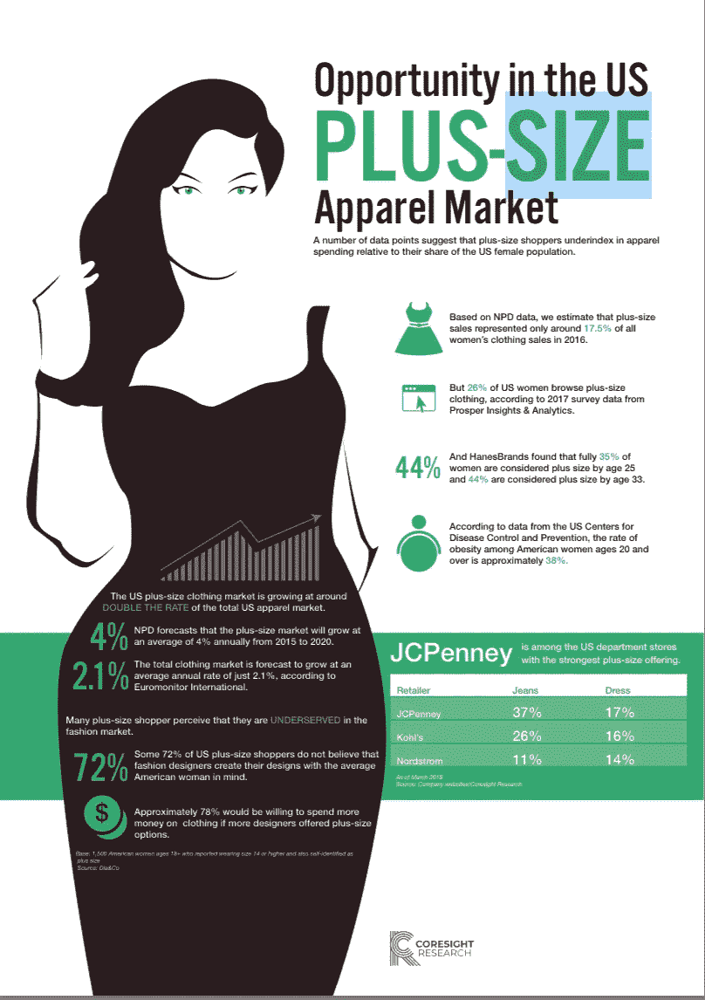

# 为什么加大码女装市场是零售业的救星

> 原文：<https://medium.com/swlh/why-the-plus-size-womens-market-is-saving-apparel-29ebe6c8e0ad>

“零售启示录”有自己的维基百科词条。我仍然相信这不是天启，这是一个转变。一个例子是女性加大码市场，数据、时尚和个性化正在积极改变消费者的生活。

女性大码服装市场的增长速度一直快于美国整体服装市场，分析师预测，未来几年，该细分市场的增长速度将继续快于整体服装市场。

2016 年，美国购物者在女性大码服装上花费了 214 亿美元。消费者调查数据显示，超过四分之一的美国女性浏览大码服装。

新的零售商如**和 [**ELOQUII**](https://www.eloquii.com) 已经出现，为更年轻和更注重时尚的购物者服务。JCPenney 投资了大码服装，据报道，沃尔玛 将推出一个新的低价大码服装品牌。(美国柯尔百货公司和诺德斯特龙也是这一领域的领导者。)**

**根据美国疾病控制和预防中心的数据，20 岁及以上美国女性的肥胖率约为 38%。**

**由黛博拉·温斯威格 和她的团队 [**Coresight Research**](https://www.linkedin.com/company/10009947/)**

**在这个清单上，我还要加上“服装即服务”模式，这个模式是由克里斯汀·亨西克**和她的团队 [**格温妮·比**](http://gwynniebee.com) 创建的——一个针对大码女性的混合订阅/租赁模式。****

****#零售#电子商务#时尚#服装#科尔#诺德斯特龙****

********

## ****这个故事发表在 [The Startup](https://medium.com/swlh) 上，这是 Medium 最大的创业刊物，拥有 315，028+人关注。****

## ****在这里订阅接收[我们的头条新闻](http://growthsupply.com/the-startup-newsletter/)。****

********