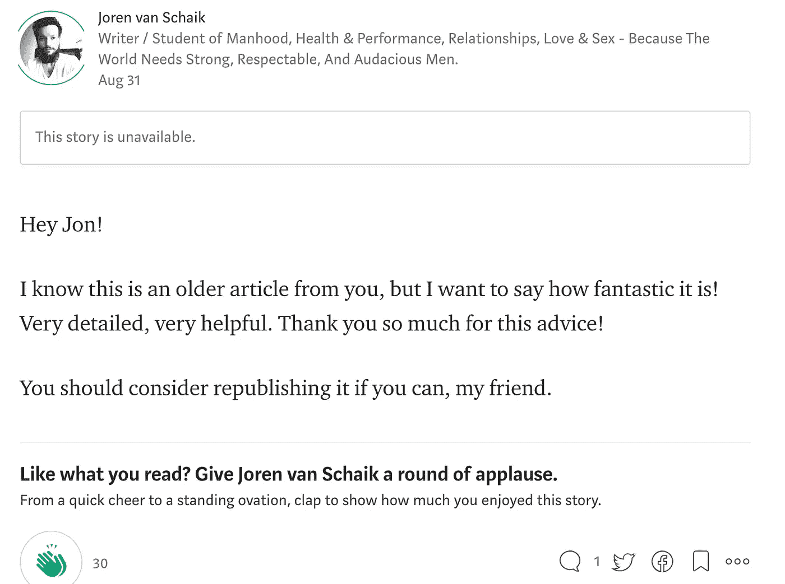
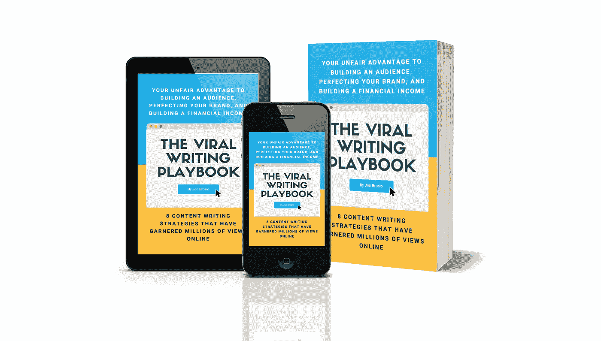

# 为什么你的博客的成功可能取决于这个简单的实践

> 原文：<https://medium.com/swlh/why-the-success-of-your-blog-might-hinge-on-this-one-simple-practice-acdef815a504>

## 如果你没有这样做，你可能已经落后太多了…

Photo by [Charles Deluvio 🇵🇭🇨🇦](https://unsplash.com/photos/Mv9hjnEUHR4?utm_source=unsplash&utm_medium=referral&utm_content=creditCopyText)

如果你写博客已经有一段时间了，你可能会经历这样的时刻，你觉得自己已经没有主意了。

> 我们玩的这个游戏充满了潮起潮落。

当你刚刚起步的时候，你是在以光速发射文章。你进入了宇宙*写作圈*(如果那不是一个词的话……我正在创造它……)你的动力无法停止。

时间流逝，然而…

在你意识到之前，你已经花了几个月的时间扫描你的*思想盒子*的范围，寻找任何能引起共鸣的碎片。

但是没有任何结果…

蟋蟀…

但是，如果你没有考虑过大多数**顶级博主**在创意枯竭时采用的一种做法——一种无论如何都只是简单有利的做法，那会怎么样呢？

> 与其前进，不如后退呢？

Time traveling [blog](https://vignette.wikia.nocookie.net/bttf/images/3/3c/DeLorean_Arrival.gif/revision/latest?cb=20100901215907)…

# 重新发布你的旧帖子

与其纠结于想出全新的想法，不如看看你已经有的想法。

你的档案里有没有对新读者有帮助的文章？

这是一个很好的机会来更新和重新发布你的文章，让他们出现在新的观众面前(或者提醒长期读者他们仍然存在)。

我将带你了解重新发布旧帖子的方法和原因。

但在我们走得太远之前，你可能会问自己这个问题:

> “如果我重新发布一篇旧帖子，读者会抱怨吗？”

不。事实上，他们会感谢你的。新读者可能没有挖掘你的档案，发现你的一些最好的帖子。而老读者可能已经忘记了。

hope you’re okay with this, Joren!

即使是那些一遍又一遍地返回最喜欢的帖子的读者也会很高兴你更新了它(**我甚至有一个朋友，**[**Joren van Schaik**](https://medium.com/u/58d0551e31b5?source=post_page-----acdef815a504--------------------------------)**，推荐我重新发布我几周前的一篇旧帖子**):

你认为我对这个建议做了什么？

你最好相信我重新发布了这篇文章，并且得到了比第一次更好的反响！

 [## 如何在博客上赚到你的第一美元(甚至更多)

### 为聪明的博客作者提供一步一步的演练…

medium.com](/swlh/how-to-earn-your-first-dollar-and-more-blogging-5094bafd7cdd) 

因此，让我们进入重新发布的优势…

# 如何决定更新和重新发布哪些帖子

Photo by [Victoriano Izquierdo](https://unsplash.com/photos/JG35CpZLfVs?utm_source=unsplash&utm_medium=referral&utm_content=creditCopyText)

如果你写博客已经有一段时间了，你的档案中可能会有几十篇甚至几百篇文章。

你如何判断哪些是值得更新和重新发布的？

这个问题没有正确的答案。

但是一个好的起点是当你第一次发布时带来最积极回应的**帖子，**尤其是如果它们相对较旧的话。

他们可能需要更新(这样第一次阅读的读者会得到最好的印象)。而且它们很可能是关于热门话题的，所以重新发布它们会对你现有的读者有所帮助。

考虑到某些监管因素，更新可能包括确保内容是最新的(例如，如果你写的是营销——GDPR 的引入是否改变了文章的内容？).

任何称职的顶级博主都知道*你不应该修复没坏的东西*。寄希望于一个在过去没有得到太多接受的帖子，通过这次重新发布，将自己变成一个超级病毒式的帖子是没有用的…

重新发布刚上线时表现出实力的内容。

# 重新发布帖子时，应该修改多少？

Photo by [Raquel Martínez](https://unsplash.com/photos/SQM0sS0htzw?utm_source=unsplash&utm_medium=referral&utm_content=creditCopyText)

同样，这里没有固定的规则。

像李小龙那样做，

> *《似水……》*

能够接受曾经的一切，让它适合今天。

当您准备重新发布帖子时，您应该:

*   **仔细阅读。第一轮你有没有漏掉任何错别字？是否存在事实错误？你需要修改任何笨拙或令人困惑的句子吗？**
*   **更新帖子以适应今天发生的事情**(如上所述——特别是如果你写的是软件、社交媒体或任何其他快速变化的领域)。例如，如果你发布了关于建立一个中型网页，你可能需要新的截图，并确保你的一步一步的指示仍然准确。
*   考虑添加更多细节。你的原帖有没有什么地方有点稀疏？充实他们。这是你第一次尝试好东西并把它变得伟大的机会。
*   **检查所有链接。**即使一个链接*正在工作，你也可能需要将它指向一个更新的资源。*
*   链接到你最近的一些帖子。如果你两年前写了这篇文章，几乎可以肯定你已经写了一些相关的东西。在适当的位置添加一个链接。
*   花时间让它更有吸引力。重新发布的好处之一是你节省了大量的写作时间，这意味着你可以花更多的精力去寻找图片、布局文章等等。

# 案例研究:病毒式写作剧本

我首先创建了[病毒式写作剧本:*你在 2017 年建立受众、完善品牌和建立财务收入的不公平优势*](https://www.tribeloyal.com/thank-you/viral-writing-playbook) 。

[The Viral Writing Playbook](https://www.tribeloyal.com/viral-writing-playbook/)

虽然一开始不叫这个名字。我对电子书的第一次尝试是*“三个月内从零到一百万”*，在我的第二次尝试中，我选了一本粗制滥造的*“拿走你的东西。”*

这两个标题都令人困惑和含糊不清。他们没有提供对实际内容的价值的一瞥。

即使产品在销售，我知道我可以**重新发布**产品，增加价值和内容——我做了，整整两次。

**这么多的附加值来自于我在过去几年写的文章中发表的内容！**

即使你没有类似的系列文章可以使用，你也可以考虑如何将旧的文章转换成新的格式。例如:

*   你可以录下自己阅读博客文章的过程，并将其作为播客片段。
*   **你可以从一篇长博客文章中摘录一些内容，用在你的时事通讯中。**
*   你可以整理几十篇最好的博客文章，添加一些额外的支持材料，把它们变成电子书甚至电子课程。

当你重新发布你的作品时，你可以创造出无限的东西…

所以，真正深入挖掘你所创造的档案。

不要害怕人们可能会认出你已经发表了那篇文章——如果你对我概述的内容做了笔记，重新发表的作品就已经很有价值了，应该会包含一点额外的价值。

不断推出有价值的内容将有助于把你放在寻找你作品的人的眼前。

**重新发布有助于加快速度……**

# 👋🏻你好，我是乔恩

我是一个思考者，自由撰稿人和葡萄酒爱好者，写关于个人成长和心理优化的文章。我也鼓吹将你的作品货币化。**加入 1200 多名读者的行列**获得我的免费个人 6 天**“创业博客”**课程和我正在进行的时事通讯(你还将获得一份免费的 ***“如何撰写终极博客”*** ):

**🚨** [**> >世卫组织还想自己当老板吗？<<**](https://mailchi.mp/4b982beed325/free-6-step-course)🚨

## 这篇文章发表在 [The Startup](https://medium.com/swlh) 上，这是 Medium 最大的创业刊物，拥有+368，675 名读者。

## 在这里订阅接收[我们的头条新闻](http://growthsupply.com/the-startup-newsletter/)。

