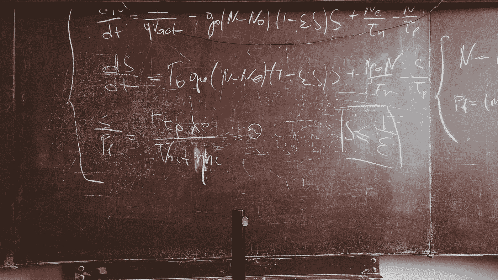

# 为什么世界需要多面手，而不是专家

> 原文：<https://medium.com/swlh/why-the-world-needs-deep-generalists-not-specialists-b7c32e223c70>

## 你应该雇一个博学的人，但你可能找不到。

Originally published on [**JOTFORM.COM**](http://jotform.com)

这是一次思想的聚会——世界上三个最非传统的思想家在一个令人愉快的传统环境中的聚会。

烛光的光芒。新鲜牛至的香味。