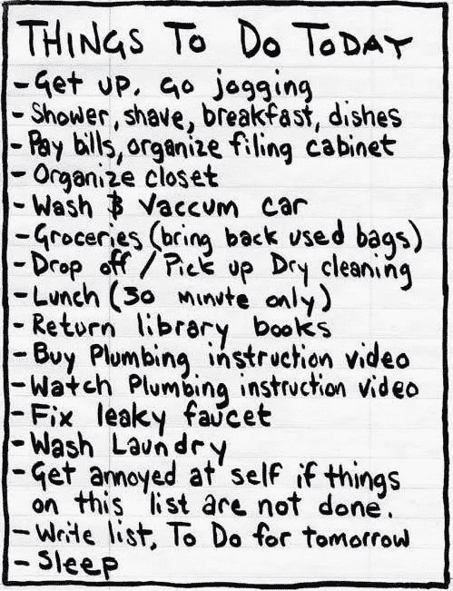
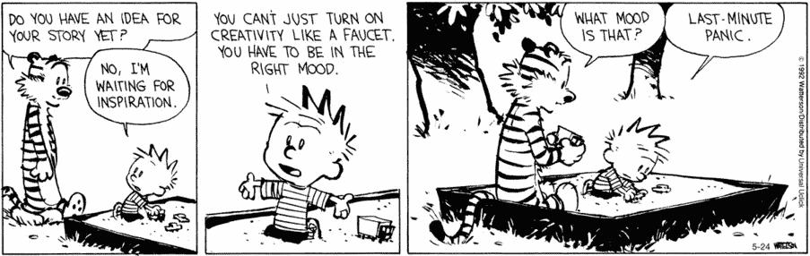

# 为什么待办事项清单不起作用

> 原文：<https://medium.com/swlh/why-to-do-lists-dont-work-568063af5067>

当你在一家快速成长的初创公司工作时，没有固定的角色和职责，总是有大量的事情要做。从零开始创建并优化登录页面，编写销售宣传材料，制定内容策略，构建并发布新功能，敲定合作伙伴关系，进行 A/B 测试，构建案例研究，管理广告活动。。你明白了。

在这些匆忙完成的事情中，很容易失去注意力，分心，而没有完成任何真正有影响的事情。当我们有太多事情需要关注时，我们倾向于拖延，做低努力、低影响的工作，而不是专注于一两个会产生不相称影响的高努力任务。

今天，我想分享我偶然发现的最大的生产力黑客，就整体影响而言，它对我来说很有魅力。但是首先

# 停止列待办事项清单。

我认识的最有效率的人不会。

我知道这听起来很疯狂，但这是真的。

我们大多数使用待办事项清单的人会拿出一张纸，写下所有我们想做的事情，比如说在周一或一整周。它看起来像这样。

关于待办事项清单的事情是，虽然在你的待办事项清单上添加一些东西几乎不需要花费时间和精力，但实际完成你的待办事项就不一样了。在你的待办事项列表中添加项目几乎没有障碍或者障碍很小，这是待办事项列表的主要缺点。

待办事项清单可以很好地记录我们需要完成和还没有完成的事情。真的是这样。他们并不是真的在那里推动我们去完成事情或者更有效率。

## 待办事项列表非常容易制作，这是一件坏事。

因为添加东西非常简单，这些列表会越来越多。更糟糕的是，他们鼓励我们默认“是”而不是“否”

构思和设计一个新的登陆页面？我可以做到。监督新的广告活动？是的，我也可以挤进去。一篇新的博文？嗯，当然，算我一个。如此循环往复。

难怪我们感到压力大，充满焦虑。我们觉得在清单上添加越来越多的东西很好，但是清单越长，它下意识地增加了更多的精神负担和压力。

# 待办事项清单的根本缺陷是它假设我们有无限的时间，因此鼓励我们不断添加我们想要的任务。当我们对上百件事情说不，并且只关注少数几件真正重要的事情时，我们才能做得最好。待办事项清单将注意力从我们需要做出的艰难选择上转移开，让我们尽可能多地囤积我们想要的任务。

他们鼓励拖延，因为在你的清单上总有一堆事情要做，却没有任何时间限制。你真的可以永远把它们从清单上划掉。直到你没有。

待办事项列表的解决方案其实很简单。你只需要做一些改变。

# **1。将每个任务分解成许多小任务**

我们推迟一项任务的一个重要原因是，当我们想到“必须开展营销活动”或“需要计划这次旅行”时，*这些任务实际上包含了如此多的子任务*，以至于它造成了**精神超负荷**，所以我们宁愿选择阻力最小的路径，等到帕金森定律生效。

解决这个问题的唯一方法是将任务分解成多个微任务。

如果我要“写一篇博客文章”，它可能会是这样的:

*   想出 5 个主意，
*   再想出 5 个主意，
*   将列表缩小到 1-2 个想法，
*   创意 1 的基础研究，
*   想法 2 的基础研究，
*   挑选最有趣/最合适的想法，
*   对理念的深入研究，
*   创建博客大纲，
*   写初稿，
*   进行编辑，
*   等等，等等

如果你一次迈出一小步，这一点也不令人畏惧。随着每一个子任务的完成，我确切地知道我进行了多远，任务还剩多少。

**想出 5 个点子？糟糕，我现在就能做到。也许，如果我感觉良好，我甚至会做 7！**

**对一个想法做基础研究？谷歌一下。很简单！**

就这样，我不再为一项漫长的任务感到压力，而是已经完成了一些花费较少时间和精力的子任务，感觉很好！

任何人都可以这样做。

# 我们拖延的倾向与我们需要做的看似艰巨的任务成正比。把任务分成花费较少时间和精力的小的子任务，然后去做，会让任务看起来容易和不费力。

这正是 Duolingo 和 Treehouse 如此成功的原因。不要把它想成“我要学习如何编码”并对任务感到害怕，因为你觉得你必须沉浸其中，找一个家庭教师，参加有关它的课程，或者每天学习 3 个小时…你只需要每天花 10-15 分钟…一次上一课。

我完成和检查清单上的子任务越多，我就越感觉良好和富有成效，将它变成一个良性循环。这不像在我的待办事项列表中有一个巨大的未检查的任务的精神负荷。

> 就像我说的，待办事项清单的最大问题是它假设了无限的时间，并鼓励你不断地向它添加任务。这个问题的理想解决方案将迫使你审视你所拥有的非常有限的时间，并做出艰难的选择来定义你所做的工作。

这就引出了我们需要对待办事项列表进行的第二个改变。

# 2.安排待办事项

当你安排事情的时候，你不得不面对一个事实，那就是一周只有那么几个小时。你被迫做出选择，而不是在永无止境的待办事项清单上添加只会成为焦虑来源的东西。你不能只安排重要的工作和创造性的东西。你需要安排休息和恢复的时间，以及像电子邮件这样的琐事。

这个星球上一些最成功的人安排好了一切事情，从睡觉到与家人共度时光。安排事情迫使你优先考虑并专注于真正重要的事情，同时也为你实际上如何度过时间创造了一个视觉反馈机制——这是我们在漫无目的地追逐待办事项时所忽视的。

安排时间也迫使你给所有的子任务分配严格的截止日期，因此让你利用帕金森定律，该定律指出“*工作扩展以填满完成它的可用时间*”。

我把工作安排在 20-30 分钟的突发事件中，并在中间安排休息时间。这让我在这些突发事件中专注地工作，并拿出我真正感到自豪的作品。这实际上类似于加州纽波特在*深度加工*中教给我们的，也类似于世界闻名的番茄工作法。

更有效率并不总是意味着做得越来越多，而是要意识到你在做什么以及你是如何度过时间的；把你的精力放在两三件最终真正重要的事情上。