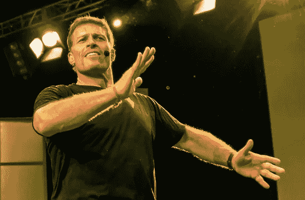
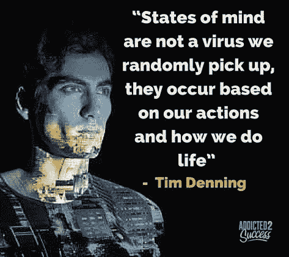
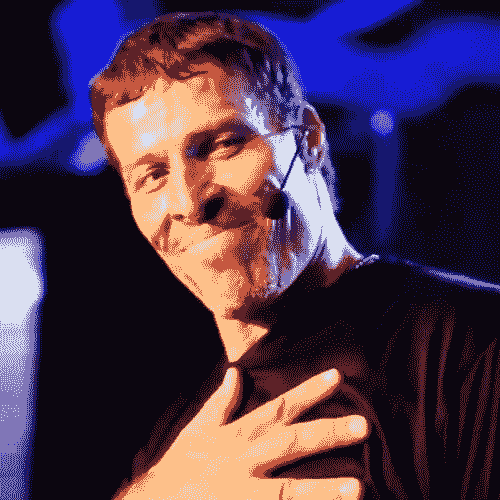
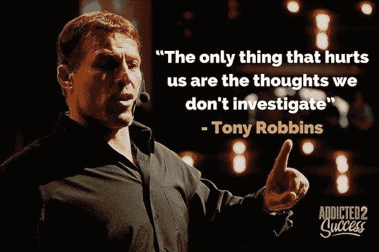
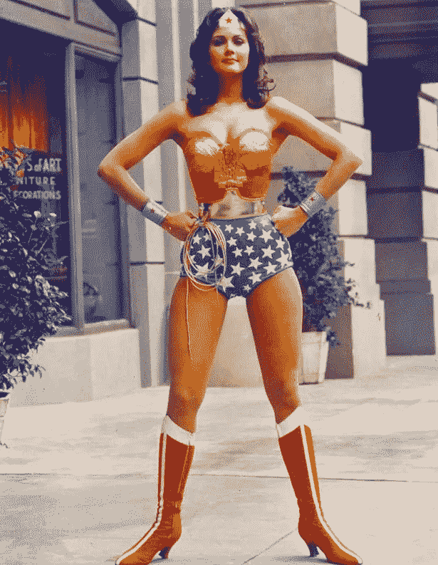

# 为什么托尼·罗宾斯帮助了我并改变了我的生活。

> 原文：<https://medium.com/swlh/why-tony-robbins-helped-me-and-turned-my-life-around-7aff43b90f7f>

说好！说好！说 yyyyyyyy 是！这只是你将在世界著名的托尼·罗宾斯活动中听到的著名台词之一。2013 年我第一次见到他时，他在学习上给了我很多帮助，彻底改变了我的生活。

从那天起，我参加了他参加过的其他活动，虔诚地阅读他的内容，进一步充实我的结果。上周，我很幸运地在澳大利亚墨尔本的一次活动中见到了托尼，他给我带来了一种我没有预料到的真正独特的体验。

这个活动本来应该是 Tony 的两个小时，但他一如既往地夸大了价值，很快就变成了四个小时。和我一起参加活动的是我的一个好朋友，我从来不知道他也被托尼改变了生活。

在高成就者中，托尼的作品(或莱斯、布朗、布莱恩·特雷西和埃里克·托马斯等人的类似作品)非常普遍。我的朋友在很多年前做出了一个重要的决定，离开他的国家去西方世界，但是我从来不知道为什么。

这一天，在托尼的活动上，他告诉我，是因为他当时听的一些托尼·罗宾斯的 cd，引发了他的改变，引领他走上了一条新的道路。

通过阅读这篇文章，我希望你能在生活中获得同样的灵感和改变。我想成为一个小小的催化剂，让你改变生活中对你来说很重要的事情。

## 托尼·罗宾斯帮助了我，并改变了我的生活，他教了我以下 14 课:

# 1.积极思考是废话

许多人误认为托尼·罗宾斯是一个积极思考的人，他的存在是为了激励人们。这与事实相去甚远。托尼·罗宾斯教给我的是，积极思考是废话，当你强迫自己只去积极思考时，你最终所做的只是逃避你的恐惧。

与其告诉你自己你必须总是积极的，不如关注你的消极想法是如何与你害怕的事情直接相关的。

# 2.你不会得到一种精神状态，你会得到一种精神状态

人们很容易对发生的事情生气。我过去也经历过同样的事情，直到托尼告诉我，像“生气”这样的心理状态不是我们从某个地方获得的，而是我们在生活中身体上做的和表现的心理状态。

如果你想得到更多的爱，那么你必须更经常地去爱。表现出你想要的精神状态，你会得到更多的那种精神状态或感觉作为回报。

# 3.我们大多数人已经很富有了

感恩是托尼的作品多次以不同的方式教给我的一课。托尼给出的统计数据是，在我的国家(澳大利亚)，被认为是穷人的人比地球上 99%的人都富有。

当你认为你已经很糟了，你没有。当你认为你的生活很悲惨时，总有人比你过得更艰难。你如何看待发生在你身上的事情，以及你如何看待金钱，决定了你的现实。

另一个值得一提的教训是，当你赚了很多钱的时候，你也可能会失去它。可怕的事实是，99%的人在长期投资中亏损，所有金融市场都会在某个时候崩溃。

所以关键是要珍惜你现在所拥有的，并意识到你在心理上和经济上都已经很富有了。

# 4.痛苦是我们自己的错

根据托尼的说法，大多数痛苦都是因为我们沉迷于自己而造成的。我们害怕我们拥有的更少，或者失去了什么，或者我们永远不会拥有什么。**当我们有很高的期望却没有得到满足时，痛苦最明显。**

事实是，每个人都会在某个时候失去所爱的人，经历一场可怕的悲剧。

你是否遭遇这些事件，百分之百是你自己的错。你越是让自己受苦，就越会影响到你生活的其他方面，比如你的健康。

**治疗痛苦的方法是像你小时候一样，重新开始看到事物中的奇迹。我们总是乘坐商业飞机旅行，然而我们却忘记了这有多神奇。意识到将要发生的悲剧，但不要让自己受苦。**

# 5.对成功者来说，压力是伪装的恐惧

托尼在他的教导中提出的一个区别是，成功者往往不满足，这是人生中最大的失败。成功人士表现得好像他们是不可战胜的，他们是少有的拥有这种超人的自信的人。

同样是这些成功者相信他们没有恐惧，只是处理不同程度的压力。

事实是，他们所经历的压力实际上是每个人伪装的恐惧。下次你感受到压力时，深入挖掘一下，看看它是否与你可能害怕的事情有关。

恐惧没有错，但是如果你想成功，你需要让恐惧成为推动你前进的动力。你需要直面你的恐惧，并意识到所有的进步都包括某种程度的恐惧征服。

# 6.消费信息必须带着感情

如果你以前从未参加过托尼·罗宾斯的活动，那么当你从外面看而不知道到底发生了什么时，你很容易相信这是某种类型的邪教(我向你保证这不是)。

在托尼的活动中，有很多舞蹈、欢呼、在房间里走动、表演，以及与完全陌生的人交谈。所有这一切的原因是，托尼说，如果你静态地消费信息，你将永远学不到任何东西。

为了获得新的策略并真正采取行动，你需要同时沉浸在一系列积极的情绪中。在托尼的活动中，大约每 30 分钟就有一个要求，听音乐，跟着托尼做什么。

这些音乐时刻为人类大脑创造了锚，以潜意识地改变状态，并创造新的神经通路。很简单，托尼说运动创造情感，而情感对学习至关重要。

情绪让你换个角度思考，走出自己的舒适区。情感是所有人真正追求的东西的命脉，而不是金钱或财产。

# 7.任何人都可以实现不可能的事情

托尼教导的一个元素一直让我对他的工作以及它如何改变我的生活感兴趣，这就是他的信念(和证据)，即我们所有人都可以实现不可能的事情。

***这不是我们童年的境遇或我们过去的经历；我们此时此刻的信念决定了我们是否有能力实现不可能的事情。***

为了改变我的生活，我用托尼的三个步骤实现了不可能的事情:

第一步——我开始痴迷于一件事，对它如饥似渴，不愿放手。

第二步——我采取了大规模的行动，却不知道答案或者什么会有效。

第三步——我不断改变我的方法，直到我执行了我所追求的一件事，并尽可能地让自己沉浸其中。

# 8.没有成就感的成功是最大的失败

托尼在他的所有作品中反复传达的信息之一帮助了我，那就是理解仅仅取得成功是不够的。你必须能够在获得成功的同时感受到成就感。

除非你通过实现梦想所取得的成就让你感到快乐和满足，否则你不会感到满足，这是最大的失败。

这就是为什么如果你花时间在像好莱坞这样的地方，你会很快发现有很多钱和很多成功，也有很多不快乐的人。

这些成功人士并不快乐，因为他们拥有我们许多人认为的一切，但在内心深处，这些有影响力的人并不满足，并通过整形手术和药物麻木了他们生活的痛苦。

不要只是创造你的梦想，当你实现梦想时，退后一步，开心起来——这是你应得的！

# 9.幸福是一个决定

我们都想快乐，但我们忘记了快乐是一种决定。你快乐的唯一方式是你决定快乐。

然而，光有决定是不够的:你必须选择此时此刻快乐，否则你很有可能永远不会快乐。

对自己说，当未来发生什么事情，或者你实现了某个童话般的目标时，你会很开心，这会让你变得痛苦和不开心。

托尼告诉我，总会有一些事情时不时地突然出现，有可能夺走你的幸福。

当这些事件发生时，托尼说他“在怪物还小的时候杀死了它。”

他进一步补充说，他尽量不让任何负面事件在他脑海中停留超过 90 秒，这样这种感觉就永远没有机会发展成巨大的东西。

在生活中，每天总有一些担心的事情，但是你可以通过做出不让这些担心接管的决定而感到快乐。战胜这场战斗需要坚持，因为托尼告诉我，你的大脑不是为了让你快乐而设计的，而是为了让你生存下去。

快乐的唯一方法是违背你的人类程序，决定不管发生什么外力都要快乐。这一课是我转变的一个重要部分，如果你致力于它，它也能为你做同样的事情。

# 10.生活是关于我们的

企业家整天都在犯一个严重的错误:他们推销的想法都是关于他们的，而不是关于我们的。**托尼的一生是一个例子，说明了为什么我们应该以自己为中心，而不是以自己为中心。**

当你只尝试和实现对你有帮助的事情时，生活会变得非常沮丧。你是否有过这样的感觉:经历了一些非凡的事情，然后你做的第一件事就是告诉别人？

我们都有这种感觉，我们这样做的原因是因为当我们一起做事时，生活会好得多，我们在一个为他人做事的环境中工作。为他人做事是我们如何让生活更上一层楼，同时让自己快乐。

# 11.不要拍，要体验

在许多不同的环境中见过托尼之后，我注意到他身上有一点似乎总是正确的；你永远看不到他看手机。

他在他的一次活动中告诉我，他不迷恋电子设备的原因是，他宁愿在那一刻经历一些事情，而不是通过手机间接看到，或者更糟的是，拍摄下来，也许以后再也不会播放。

**如果你想过精彩的生活，你需要更关注当下，抵制用手机拍摄一切的诱惑。**拍摄一些东西永远不会像在现实生活中一样，完全专注，完全沉浸在体验中。

我将在下面发布一个视频来反驳这一点，但这只是因为我想让你看看托尼的事件是什么样的，以及为什么他能够将我的生活，以及他接触的每个人的生活，转向更积极的方向。

# 12.人们找你是因为他们想要你知道的东西

世界上收入最高的专业人士都知道一个事实:人们找你是因为他们想要你知道的东西。如果你不想推销你的服务，托尼教导说，除了你的竞争对手，你还需要为别人做更多。

你需要重新定义你的类别或定位，并尽你所能专注于给予更多的价值。给人们的生活增加价值是现存的最好的营销形式。托尼通过他的事件的巨大力量教会了我这一点。

当你参加托尼的任何活动时，不仅你的生活会改变，而且你会觉得你得到了比你预期的更多的价值！

几天前我见到他的时候，我期待两个小时的价值，结果我得到了四个小时，外加一大堆他在活动开始时没有提到的新策略。

# 13.勇气未用会衰退

在我们的生活中，我们都有过长时间感到勇敢的时候。最近托尼的教导提醒了我，如果你不继续练习，这些勇气的时期会减少。

就像肌肉一样，你必须不断地寻找勇气；否则久而久之肌肉就变小了，真正需要的时候就用不上了。

对我来说，当我暂时不去给陌生人推销东西时，这是真的。当我把这项技能闲置一段时间后，我发现用新想法接近一个陌生人所需的勇气就像魔药一样消失了——每天练习勇气。

# 14.峰值性能来自峰值状态

要过上精英级别的生活，你需要能够持续地在巅峰状态下运作，托尼教导说，这只能从巅峰状态开始。在正确的心态下，你会在那一刻采取正确的行动。

**在错误的心态或愤怒的状态下，不可能采取有效的行动。托尼教授的秘诀是进入一种新的状态，而这可以在几秒钟内完成。这就是为什么在他的活动中有如此多的运动，因为他想证明你的状态可以改变得多快。**

当你看到你的状态在他 50 多个小时的研讨会中一次又一次的改变，你会发现这是多么的容易。你不需要借口来感觉良好，你只需要改变你的状态。

改变你的状态就像改变你的身体和你的注意力来创造一个新的状态一样简单。托尼最近分享的一个简单的技巧是，你可以试试哈佛大学认可的力量姿势。

我喜欢的一个叫做“神奇女侠姿势”你基本上像神奇女侠一样站了 20 秒，然后你会很快见证一个新的状态在你的身体里产生。

【Addicted2Success.com】原帖

# *行动呼吁*

*如果你想提高你的工作效率，学习一些有价值的生活窍门，那就订阅我的私人邮件列表吧。你还将获得我的免费电子书，它将帮助你成为改变游戏规则的在线影响者。*

*[**点击这里马上订阅！**](http://timdenning.net/free-ebook)*

**

## *这篇文章发表在《T4》杂志《创业》(The Startup)上，这是 Medium 最大的创业刊物，有 300，118+人关注。*

## *在这里订阅接收[我们的头条新闻](http://growthsupply.com/the-startup-newsletter/)。*

**