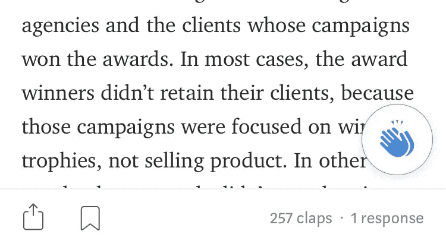
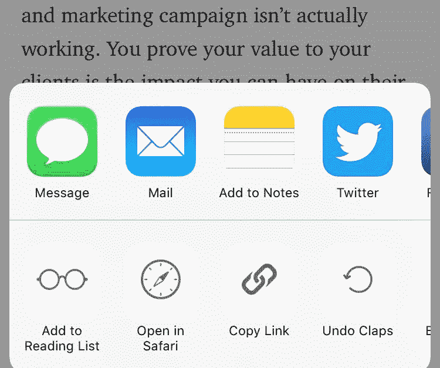
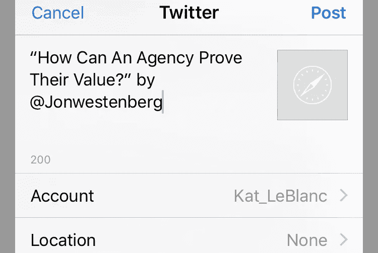

# 为什么 Twitter 是扩大你的中型客户的关键

> 原文：<https://medium.com/swlh/why-twitter-is-the-key-to-growing-your-medium-account-ca88a92a83a>

## 灵媒上有一个你们很多人都错过的机会。

在过去的一个月里，我注意到许多作家没有把他们的 Twitter 账户和他们的媒体简介联系起来。乍一看，这似乎是一个小问题。毕竟，Twitter 在几年前达到顶峰，Medium 是它自己强大的平台。

然而，如果作家没有将 Twitter 整合到他们的媒体策略中，他们会错过*的大好时机，这有几个原因。*

*首先，Medium 是一个社区，作者在这里创造自己的内容，并向其他作者学习。很多“如何在媒介上成功”的文章都解释了评论文章是获得追随者的一种战略方式。然而，这些文章通常没有提到该平台与 Twitter 的完美整合几乎 ***将*** 媒体延伸到了 Twitter。你可能知道，Medium 和 Twitter 有一个共同的创始人，Ev Williams，他在离开 Twitter 后创建了 Medium。*

## *首先，就像许多网站一样，Medium 有一个功能，让你点击三次就可以发布一篇文章。*

*这在手机上看起来是这样的:*

**第一步是点击左下角的标志**

**

**第二步是点击 Twitter 图标**

**

**第 3 步是点击“发布”或(编辑推文，然后点击发布)**

**

*同样为了简单起见，我称这个过程为“三次点击法”。*

*Medium 允许用户通过三次点击的方式发布文章。由于他们的平台与 Twitter 紧密结合，Medium 发布文章的三次点击方法包括作者的 Twitter 句柄。当然， **Medium 只能对已经输入了自己 Twitter 句柄的用户支持这个。***

*这意味着，如果你没有将你的 Twitter 链接到你的 Medium 帐户，而有人使用双击 tweet 功能来分享你的文章，那么它将显示如下:*

*这意味着你的名字会出现在推文中，但你的 Twitter 句柄不会被标记，你也不会收到通知。你不会意识到有人在推特上对你的工作大加赞赏。没有通知，你不知道如何与你的读者交流——这是一个错失的机会。*

*在你链接了你的 Medium 和 Twitter 账户之后，当有人通过 Medium 的三次点击方法在 tweet 上发布你的文章时(你在 tweet 上被标记了)，看起来是这样的。*

*即使你有一个 Twitter 账户，如果它没有链接到你的媒体账户，那也是不够的。想一想；当你在推特上发布一篇文章的链接时，你不想浪费 30 秒去搜索作者的推特账号。我知道每当我在推特上发布一篇文章时，我通常不会采取额外的步骤来标记记者(除非我已经关注了他们)。*

## *其次，在推特上发布你最喜欢的作家的文章是吸引他们注意力的好方法。*

*很难摆脱媒体上持续不断的噪音。你最喜欢的作家被评论轰炸，当粉丝给他们的文章打满 50 分时，他们可能不会注意到。*

*当你试图引起作者的注意时，我的第一反应是查看他们在 Twitter 上有多少粉丝。如果他们在 Twitter 上有 1000 名粉丝，但在 Medium 上有高达 40k 的粉丝，那么我想你可以猜到我会把精力集中在哪里。我建议把在 Twitter 上和在 Medium 中与作者互动结合起来。在 Medium 上发表评论仍然是对某人的文章进行深度解读的最佳方式。*

*总之，媒体和 Twitter 有着千丝万缕的联系。利用你的 Twitter 个人资料与媒体用户互动将有助于建立你作为作家的品牌。只要记住，媒体延伸到 Twitter，转发你的追随者的赞美，以及你自己真实的自我。互动从长远来看会有回报的！*

## *凯瑟琳·勒布朗是居住在加拿大渥太华的作家和数字战略家。她的文字可以在 [LinkedIn](https://www.linkedin.com/in/kathrynmarieleblanc/) 、 [Medium](/@kathrynleblanc) 、 [Vice](https://www.vice.com/en_ca/article/8x99k4/campus-food-banks-are-more-necessary-than-you-think) 上找到。在 [@kat_leblanc](https://twitter.com/Kat_LeBlanc) 发推特向✌️问好*

**

## *这篇文章发表在 [The Startup](https://medium.com/swlh) 上，这是 Medium 最大的创业刊物，有 303，461+人关注。*

## *在这里订阅接收[我们的头条新闻](http://growthsupply.com/the-startup-newsletter/)。*

**