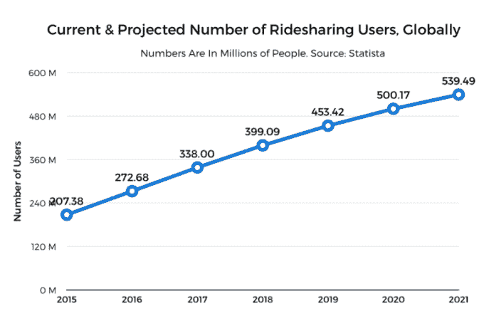
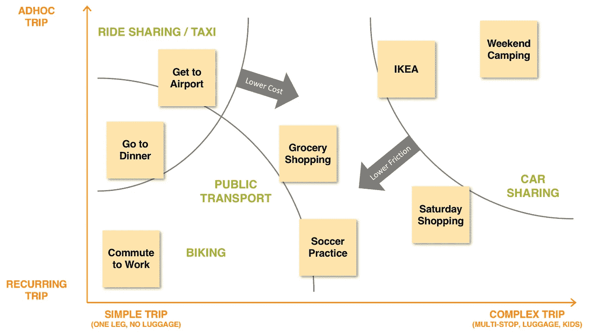
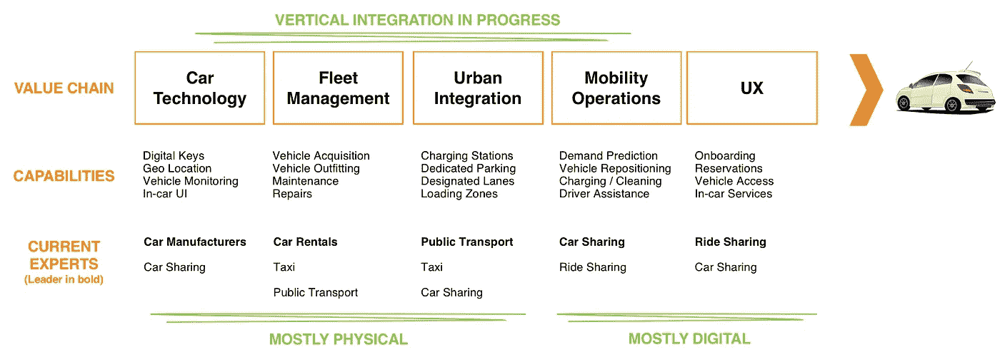

# 为什么优步、Lyft 和滴滴不会主宰城市交通(但谁会呢)

> 原文：<https://medium.com/swlh/why-uber-lyft-and-didi-wont-dominate-urban-mobility-but-who-might-c41823d10397>

Photo by [Joey Kyber](https://unsplash.com/photos/45FJgZMXCK8?utm_source=unsplash&utm_medium=referral&utm_content=creditCopyText) on [Unsplash](https://unsplash.com/?utm_source=unsplash&utm_medium=referral&utm_content=creditCopyText)

[2018 年 6 月更新:现在有了这篇文章的“第二部分”[这里](/swlh/uber-and-lyft-are-taking-on-google-maps-4f4de68fea8b)

如果你从事商业战略或产品管理，即使是在不同的行业，城市交通也是你未来 5 年应该关注的市场。这篇文章将让你对正在发生的事情有一个透视，并解释几乎每天都有头条新闻和公告出现在我们身后的动力。

以下是你应该知道的:

*   卓越的用户体验、纯数字策略和绕过监管推动了第一波拼车浪潮
*   下一波浪潮将需要垂直整合和资本投资，而优步和类似的拼车公司在这方面没有做好准备
*   汽车共享平台、租车公司和汽车制造商将在新的城市交通中发挥重要作用

# 乘坐共享的变化状态

在过去 10 年里，优步和 Lyft 等公司的拼车服务几乎不知从何而来，并在城市和郊区的移动市场占据了相当大的份额。虽然现有的交通工具(公共交通、汽车等)在不断发展，但拼车扰乱了出租车市场，并开始解决邻近的使用案例。

拼车预计将继续线性增长，几年后将达到 5 亿用户:

Source: Statista.com

发生了什么事？是什么让一项新服务在相对较短的时间内占据了出租车市场如此大的份额？

优步和类似的服务基于一个几乎完全“数字化”的战略快速增长:

*   利用个人拥有的汽车，从而避免车队的资本投资
*   承包司机，从而逃避雇佣责任
*   绕过法规，从而避免出租车执照、职业驾照、机场费等费用

在这种新的商业模式之上，他们提供了非常卓越的用户体验(UX)，主要由易于使用和引人入胜的移动用户界面(UI)驱动。由于出租车行业多年来一直受到保护且不景气，UX 的巨大差异推动了人们通过口碑迅速接受拼车服务。

在未来十年，预计会有进一步的变化:

*   电动汽车将成为主流
*   城市将寻求进一步减少拥堵
*   无人驾驶汽车将逐渐进入市场

优步、Lyft 等公司会继续快速增长并成为赢家吗？

要做一个有根据的预测，我们需要看看到底是什么驱动和塑造了城市交通。

# “城市移动”市场

一如往常，在观察市场时，需要考虑两个方面:一方面是*用户问题/用例*，另一方面是*提供的解决方案/产品*。

以下是城市交通中*用例*和*解决方案*的概述。没有显示自有车辆，因为它们实际上服务于所有用例。

Use Cases and Solutions for Urban Mobility (self-owned cars excluded)

乘车共享和汽车共享正从不同的起点进入市场，并解决不同的使用案例。两者都没有在中等复杂性的重复用例中取得显著进展。因此，每个人的成长道路是不同的。

# 拼车的成长之路

拼车——本质上只是出租车 2.0——主要解决了临时和不频繁的使用情况，通过增加便利性和降低成本，从出租车市场中分一杯羹，并在一定程度上扩大了市场。然而，优步还没有成为乘坐公共交通工具的普通城市通勤者的主要选择，也没有被拖着孩子、装备和杂货在活动间隙出行的父母们经常使用。

为了有效地解决这些额外的用例，拼车需要进一步降低成本，以击败重复出行的公共交通，并找到货物和设备可以在多站行程中运输的解决方案。如果没有这些新增功能，拼车本质上仍将是出租车 2.0。

然而，迄今为止，优步等人只关注数字技术，这意味着这些公司还有几项核心能力没有开发出来。他们没有汽车，因此没有像汽车租赁和运输公司那样的车队管理经验。他们没有与市政当局和公共交通公司合作的良好记录，所以如果你和优步一起搭车，你不会在出租车和公交车道上超速行驶，也不会在火车站或机场出租车等候的特殊区域被接走。可以说，这些都是遵从法规和支付费用带来的奢侈品。

# 汽车共享的增长路径

虽然拼车在过去几年吸引了大部分注意力，但汽车共享公司*却在幕后悄悄发展，在全球越来越多的城市推出服务。他们提供短期租车服务，按小时或英里收费，当你需要一辆车时，他们提供了一种便捷的取车方式。*

ZipCar 和 Car2Go 等先行者最初的服务通常是基于站点的。你必须从一个特定的地点取车和还车，类似于传统的汽车租赁。在过去的几年里，这些服务已经转向“自由浮动”车队，在那里你可以在任何公共停车位上取车和放车。车辆进入也得到简化，通常只需在智能手机上触摸一下，就可以打开和进入汽车。这些和其他改进大大降低了当你需要时获得汽车的摩擦，并使汽车共享进一步发展成为经常性的使用案例。

汽车共享市场目前有三类玩家。

## 1.拥有专有平台的多城市运营商

汽车制造商和汽车租赁公司现在拥有最大的运营商:

*   Car2Go(现为戴姆勒所有)
*   ZipCar(现为 Avis 所有)
*   ReachNow 和 DriveNow(由 BWM 与 Sixt 合伙拥有)
*   赫兹 24/7(归你猜对了，赫兹所有)
*   Maven(归通用汽车所有，基于收购的 Sidecar)

福特、丰田、企业等也进行了类似的投资或合作。总的来说，这些公司既开发数字平台，也在选定的城市运营汽车共享。

汽车租赁公司是车队管理的专家，而汽车制造商不是，这就是为什么后者要么收购了现有的汽车共享创业公司，要么与汽车租赁公司合作。

## 2.使用第三方平台的本地和区域运营商

除了上面列出的较大的参与者，还有几十个，也许几百个[汽车共享运营商，它们的足迹](https://en.wikipedia.org/wiki/List_of_carsharing_organizations)更小。有时，这些运营商只在一个城市或一个国家运营，他们与平台提供商合作，而不是自己开发软件和硬件。虽然他们确实需要在购买汽车方面进行资本投资，但 UX 和后端来自平台提供商。

## 3.汽车共享平台提供商

几个创业公司提供运营汽车共享的平台，本身不是运营商。这个角色的主要玩家包括 [Vulog](https://www.vulog.com/) 和 [RideCell、](https://ridecell.com/)都有两位数的运营商使用他们的平台。通常，这些平台包括成为运营商所需的所有组件，除了汽车本身:为车辆配备数字接入和地理位置所需的硬件，为司机提供的移动 UX，以及支持车队重新定位、车辆维护等操作的分析。

平台和运营商为什么会有这种区分？看看价值链——从实体汽车到数字 UX——会对此有所启发。

# 乘车/汽车共享的价值链

虽然优步等人通过纯数字平台走了一条简单的路线，但汽车共享需要不同水平的资本投资和垂直整合。这是价值链，说明了这两者。

Value chain for the car-based urban mobility (future merge of ride- and car sharing)

虽然拼车占据了出租车市场的一部分(特别，简单行程)，但汽车共享正在解决更复杂的用例(例如，在带着孩子和货物的多站旅行中使用同一辆车)。交付这些更复杂的用例需要在这个价值链中进行所谓的向后集成。

例如，汽车需要配备数字钥匙，这样司机就可以用智能手机打开(汽车技术和 UX 的集成)。需要对车辆进行监控，以满足服务需求，并对车辆进行远程地理定位(整合车队管理和机动性操作)。需要收购和管理停车和充电站(城市一体化和移动运营之间的协调)。

人们很容易想象这一价值链可以模块化，即清晰的界面和标准将出现在汽车硬件、数字钥匙、车内服务等方面。然而，移动平台实现标准化，同时仍能处理特定城市的法规、交通模式和需求，可能还需要几年时间。在那之前，将需要向后集成来交付获胜的 UX。

# 总结和预测

优步、Lyft 和滴滴等拼车运营商目前依赖司机维护、加油和监控他们的车辆。随着无人驾驶汽车出现并形成车队，电动汽车需要充电基础设施，当前的乘车共享运营商需要大量的学习和投资，而*汽车共享运营商已经在管理*。这包括汽车技术、车队管理和城市一体化。

汽车共享公司——通常由汽车租赁公司、汽车制造商和移动平台提供商联合运营——在许多方面更有能力覆盖将城市移动性提升到一个新水平所需的整个价值链。

> **拼车颠覆了陈旧的出租车行业。下一波城市交通浪潮将带来更加激烈的竞争。**

*格雷格在 IBM 工作，常驻法国。以上文章为个人观点，不一定代表 IBM 的立场、策略或观点。*

## 这篇文章发表在 [The Startup](https://medium.com/swlh) 上，这是 Medium 最大的创业刊物，有 285，454+人关注。

## 订阅接收[我们的头条新闻](http://growthsupply.com/the-startup-newsletter/)。

