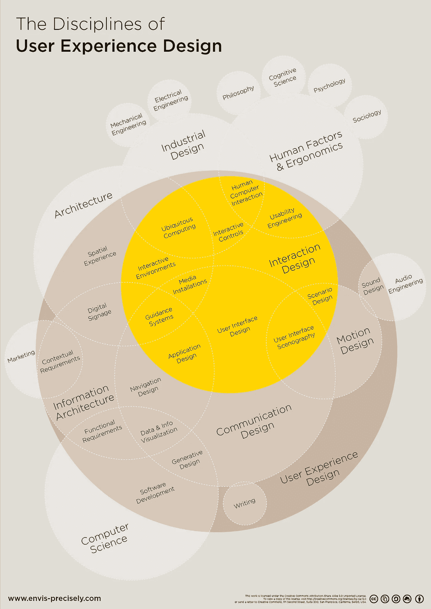

# 为什么 UI 设计师不会很快失业

> 原文：<https://medium.com/swlh/why-ui-designers-won-t-be-unemployed-soon-c27ecaa4b2da>

## 这是对 Ariel Verber 文章的回应。

本质上，Ariel 说你应该在失去 UI 设计师的工作后开始考虑你的下一步职业发展。我也明白他在告诉我们:a)工作很容易，b)另一个设计师可以取代你。

据他说，如果…

> 按照 KISS 原则生活，坚持品牌方针，确保不要搞砸 UX。这些都做对了吗？干得好！你可以在硅谷的顶级科技公司做 UI 设计师，赚很多钱。

我强烈反对。

1.  如果你是一个经常上网的人，你会同意我的观点，至少 10 个我们看到的设计“东西”中有 9 个是糟糕的。
2.  你也可以说没有那么多顶级设计师……而顶级设计师通常是硅谷公司花大价钱雇佣的人。
3.  最后，和其他行业一样，高薪职位也是有限的。因此，不是每个人都会因为理解了三个简单的概念而最终为一家利润丰厚的公司工作。许多人可以理解一千个概念，但在实践中仍然做得不好。在这个意义上，我们可以*把设计比作运动*。没有人不知道如何踢足球，然而，只有少数人踢得非常非常好，而更少的人通过踢足球赚钱。

总而言之…理解 3 个简单的概念不会让你成为一个伟大的 UI 设计师，最终在硅谷赚到财富。

> 但是等等，就一件事……**如果这些是你唯一做的事情，那我们为什么需要你呢？**我的意思是，有人已经为整个产品做了 UX，我们的设计团队的“组件”库中已经准备好了任何应用的所有组件。我们只需要替换一些图标(我们将从图标集中取出)和按钮文本，就可以了。

我们来看看:这有多荒谬？将 UI 设计所涉及的一切都简化为“你唯一要做的事情”有点侮辱人。

每一个数码产品都有一个用户界面。回到我之前说的…我们在网上看到的大部分东西都很糟糕。总的来说很糟糕。不仅仅是图片和插图。所有组件的整体接口。如果设计用户界面真的那么容易，为什么我们看到的不是“苹果标准”？

认为公司支付超过 100，000 美元的薪水来做任何人都可以做的简单工作是荒谬的…

试图进一步揭露 Ariel 糟糕的逻辑…我很想问他:*那些现在在设计团队“组件”库中的组件都是从哪里来的？我打赌这不是魔法。*

> 好吧，我告诉你我作为一个 UI 设计师的观点:
> 
> 你最好开始考虑新的方向，否则你会丢掉工作。

好吧。不…

在我继续之前，请检查这张信息图(取自[这里](https://github.com/envisprecisely/disciplines-of-ux))。

**The Disciplines of User Experience Design by Envis Precisely**

用户界面设计是产品设计的一个广泛的方面，它也与其他领域有很多共同点。我们可以同意 UI 设计并不简单。它实际上非常复杂，而且分支广泛。

用户界面的视觉设计是整个用户体验的核心组成部分，尽管它不是用户体验(很明显)。用户体验是产品的一整套部分，它集合了设计师的许多职责和责任。因此，说任何 UX 设计师都可以做出 UI 设计师通常会做出的视觉设计决策是不合逻辑的。实际上，UX 设计比 UI 设计更科学，这是一个更艺术的角色。我并不是说没有 UX/UI 设计师。其实有很多。但事实是，产品越简单，就越容易成为 UX 和 UI 设计师。但是，随着产品变得越来越复杂，也许是盒子外面的 T2，无缝地完成这两个角色就越来越难。

因此，当处理更复杂的产品开发时，你应该理想地划分设计角色，特别是 UX 和 UI，以便(非常简单地……)让用户体验设计师专注于功能和研究，让用户界面设计师专注于视觉和美学。

如果你真的理解用户界面设计所代表的复杂性，你会意识到它不仅仅是关于“几个图标和按钮”…产品设计涉及研究、A/B 测试、迭代、视觉设计、交互设计、信息架构、运动设计、品牌、可用性等等…所以怀疑某些角色的可分配性是荒谬的。

> 我不确定很多人还会如此关注界面的外观。

每个人都会的，爱丽儿。

在许多情况下，整体设计和体验可能是区别因素。

我发现很难理解你的立场，因为你经历了松弛革命。Slack 的聊天应用程序的差异化因素削弱了它的竞争，这是通过界面实现的，我引用一下:

> Slack 已经成为风靡一时的热门产品。它因其华丽、活泼的界面和应用程序中大量令人愉快的小互动而备受喜爱。

那么，我们真的认为用户界面设计即将停止吗？我们真的通过把工作降低到任何人都能理解的 3 个简单概念的理解来贬低和贬低它吗？

拜托，设计师们，让我们认真对待这件事。

**让我们认真对待自己。**

## 其他想法…

尽管如此，我并不想暗示我反对 Ariel 所说的一切。

**的确，任何了解数字世界的人都知道，保持与时俱进以避免失去价值是很重要的。**

然而，我确信世界上成千上万的 UI 设计师每天完成的工作不会像 Ariel 建议的那样很快消失。鉴于我们人类每天都与用户界面互动，想象一个没有人致力于创造的世界变得不可思议。

即便如此，如果你真的对拓展你的技能感兴趣，正如 Ariel 所建议的，我建议你学习插画、3D 设计、用户体验设计、交互设计、开发，以及任何能吸引你注意力的东西。

话不多说，我希望我消除了那些认为很快就会失业的人的震惊(如果有的话……)。

感谢您的阅读。来自阿根廷的问候！