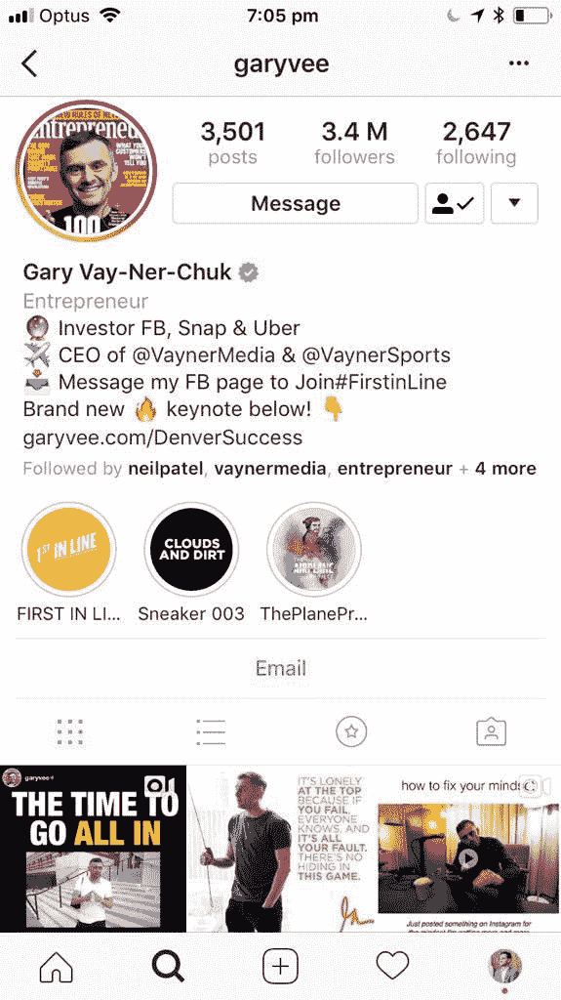
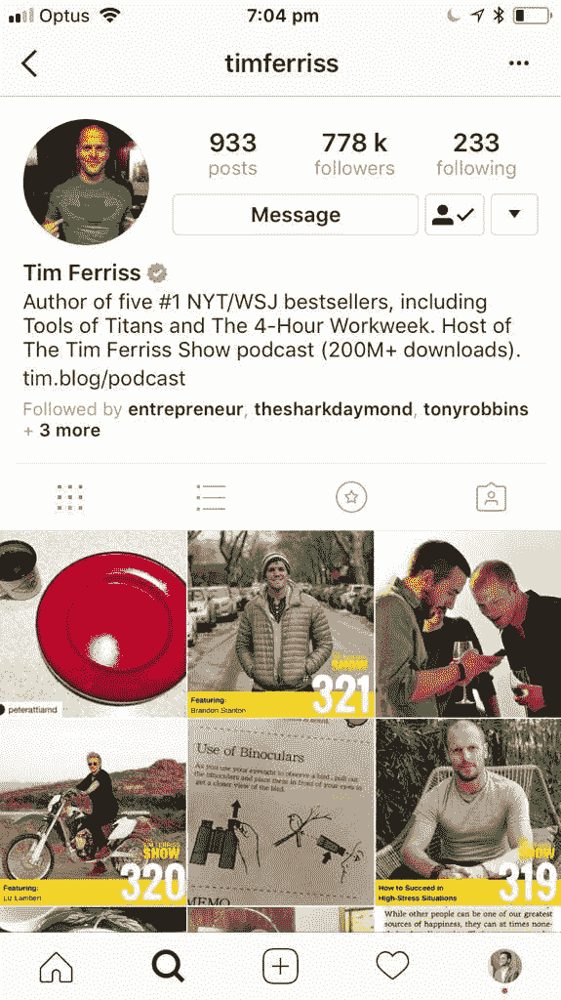

# 为什么使用 GaryVee 方法来打造个人品牌会奏效

> 原文：<https://medium.com/swlh/why-using-the-garyvee-approach-to-personal-branding-works-54518e3a47b1>

> 尽可能大声地喊叫

如果你想把你的个人品牌建设成能为你赚钱的东西，你需要利用这句话。

大声的能力不是天生的。尤其是对于我们这些内向的人来说。

你必须是一本打开的书，让你的追随者进来。你需要分享让你尴尬的事情，你需要经常这样做。

# 诚实的艺术

建立个人品牌最重要的一点是诚实。

***诚信铸就忠诚，忠诚卖出。***

想想你联系和钦佩的人。他们都敞开了自己，没有隐藏任何东西。

这是因为人们在一英里外就能闻到狗屎味。

如果有人假冒他们的品牌，每个人都能看出来。

他们不会有同样的热情或同样的动力，他们也无法与他们的追随者建立可持续的个人品牌所需要的关系。

对我来说，这是分享我患溃疡性结肠炎的故事，以及在我失败或搞砸的所有时候对我的事情非常开放。

这不仅展示了我是谁，也让我能够交流大部分人都经历过的重要教训。

它给了我一些可以与人交流的东西。

如果你要建立一个个人品牌，就要开放。

然后你可以利用这一点比你的竞争对手更响亮。

# 大声的重要性

关于个人品牌，你不能半途而废。你不能在喜欢的时候上传内容，也不能几天不活动。

你需要不断地做，你需要做很长时间。

很多人已经在做了…

输出内容和参与社交媒体，但你可以轻松地做得更多。

你是否曾经观察过他们这样做的频率，并注意到他们所做的互动水平很容易被击败？

例如，某个努力的人可能会上传两张图片到社交媒体上。做 3、4 真的没那么难。或者评论 10 篇中等文章而不是 5 篇。

付出一点额外的努力会让你领先。

我给你看几个例子:

看看这 2 个 [Instagram 简介](https://www.instagram.com/jessekerema/)。

我选择这两个品牌的原因是，它们都是非常强大的个人品牌，但一个比另一个响亮。

蒂姆·费里斯每隔几天就更新一次他的 Instagram，老实说，我几乎看不到他的任何东西。如果我不知道他是谁，我可能永远也不会知道。

另一方面，我他妈的不能从我的卧室走到厨房而不看到他的东西。他无处不在。他每天更新他的 Instagram 大约 20 次，在其他社交平台上也是如此。

他很大声。

你不会错过他的。

不管你喜不喜欢他，你听说过他。

现在，我知道他有一个完整的团队来帮助他，但这并不意味着你不能付出更多的努力。

如果你想引起别人的注意，让你的追随者暴涨，你需要比其他人都大声。

# 克服烦恼因素

关于 GaryVee 的事情是，很大一部分人讨厌他，他们积极地告诉人们，但这也帮助了他。

不管你恨不恨他，你还是在说他。

你还在提拔他。

这就是为什么克服你头脑中的那种“闭嘴，你很烦人”的声音变得如此重要。

如果你觉得自己很讨厌，那你就对了。

继续传递你的信息，从今天开始，比以往做得更多。

这是超越噪音的唯一方法。

**感谢阅读！如果你喜欢这篇文章，请不要留下评论！！**

# [订阅我的免费目标规划！](https://mailchi.mp/5ad4f463d475/freegoalplanner)

## 这篇文章发表在 [The Startup](https://medium.com/swlh) 上，这是 Medium 最大的创业刊物，拥有 337，320 多名读者。

## 订阅接收[我们的头条新闻](http://growthsupply.com/the-startup-newsletter/)。

