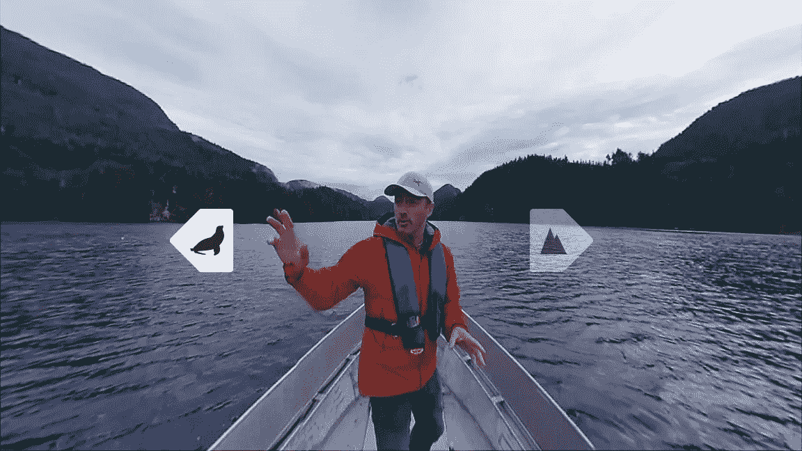

# 为什么虚拟现实正在革新营销(以及如何在今天使用它)

> 原文：<https://medium.com/swlh/why-vr-is-revolutionizing-marketing-and-how-to-use-it-today-cc69c077e0c8>

[https://unsplash.com/photos/mlZzMow-CQw](https://unsplash.com/photos/mlZzMow-CQw)

## 虚拟现实营销将有可能成为一个新的商业主食，你不想错过。

虚拟现实不再是高科技实验室或科幻电影的专利。事实上，它已经变得相当突出，专家预测它的受欢迎程度将在未来一年左右爆发。

不要只相信我的话:研究发现[2240 万](http://www.emarketer.com/Chart/US-Virtual-Reality-Users-2016-2019-millions-change/208036)美国人每月至少使用一次虚拟现实。据预测，到 2018 年底，美国虚拟现实用户的数量将增长到 3670 万(仅一年就增长了 60%以上)。

这种增长也不是来自高端游戏设备。几乎 90%的虚拟现实应用源于智能手机(比如[谷歌的 Daydream View](https://store.google.com/product/google_daydream_view?srp=/product/daydream_view) )。

## 那么什么是 VR(你为什么要关心)？

综上所述，VR 是一种基于计算机的交互环境的模拟。它提供了身临其境的 4-D 体验，而不仅仅是盯着屏幕点击。

例如，这个沃尔沃的广告允许你在客厅里“试驾”他们的汽车:

至于自己实际体验，可以简单到[不到十块钱](https://www.walmart.com/ip/Google-Cardboard-Kit-3D-Virtual-Reality-Glasses-DIY-Valencia-Quality-Tool-Compatible-5-inch-Screen-Android-Apple-Smartphone-Easy-Setup-Machine-Cut-Co/120513459?wmlspartner=wlpa&selectedSellerId=4556&adid=22222222227072499984&wmlspartner=wmtlabs&wl0=&wl1=g&wl2=c&wl3=183100413114&wl4=pla-285077053660&wl5=9004235&wl6=&wl7=&wl8=&wl9=pla&wl10=113727862&wl11=online&wl12=120513459&wl13=&veh=sem)买个谷歌纸板护目镜。你也可以选择更花哨的东西，比如三星一直很受欢迎的 Gear [耳机，价格不到 100 美元](https://www.amazon.com/Samsung-Gear-Controller-Discontinued-Manufacturer/dp/B06XJJ7CRQ)。

至于你为什么应该关心，虚拟现实不仅正在成为主流，而且它也证明了自己是一个非常有用的营销工具。

以下是一些虚拟现实营销的方式(请随意下载):

## 它在很大程度上驱动了情感

众所周知，情感是广告的有力工具。想一想讲故事是如何轻易地吸引观众，让他们对品牌产生好感的(或者，汽车/啤酒广告几乎总是有一个故事，却对产品本身只字不提)。

并且[尼尔森发现](https://www.businesswire.com/news/home/20161109005274/en/Groundbreaking-Virtual-Reality-Research-Showcases-Strong-Emotional)虚拟现实甚至比传统的讲故事(或者，我敢说，甚至是浪漫喜剧)更能驱动情感。他们实际上发现，虚拟现实用户比测试它的任何其他平台都更加投入。

看看不列颠哥伦比亚省就知道了——他们利用虚拟现实创造了一种情感体验，人们可以通过对最美景点的真实探索，在情感上与自己的国家联系起来。这在很大程度上推动了旅游业的发展。

当我们的[的注意力持续时间确实比金鱼](http://time.com/3858309/attention-spans-goldfish/)短时，虚拟现实是一种久经考验的工具，可以真正抓住它们。

## 创造体验

我们生活在一个[体验经济](/writers-guild/will-virtual-reality-will-save-the-art-world-cec6c3678739)——人们重视事件并分享它们(甚至超过产品本身)。所以也难怪 VR 被当做工具，通过这种方式进行销售。

例如，在一个购物中心正在消亡的世界里，宜家通过允许购物者通过增强现实在家中放置家具，并通过虚拟现实在宜家厨房进行互动来提高销售额。

甚至万豪也利用这一点让人们在他们的酒店房间里体验虚拟现实，以查看其他目的地，51%的人说他们想更多地利用万豪。

简单来说，就像内容营销增压。它提供了一种体验，通过一种身临其境的情感工具，在担忧和购买之间架起了一座桥梁。

底线是，脸书、Valve、微软、谷歌、HTC、三星、宏碁(以及许多其他大公司)正在向 VR 和 AR 投入数十亿美元，并且它已经被证明是一种强大而迷人的营销工具。你会是下一个吗？

## 行动号召:

在 LTProject.com 了解更多关于虚拟现实和市场营销的信息。如果您对 VR 如何用于营销有任何见解，请在那里联系我或给我留下评论！

## 这个故事发表在 [The Startup](https://medium.com/swlh) 上，这是 Medium 最大的企业家出版物，拥有 312，596+人。

## 在此订阅接收[我们的头条新闻](http://growthsupply.com/the-startup-newsletter/)。

