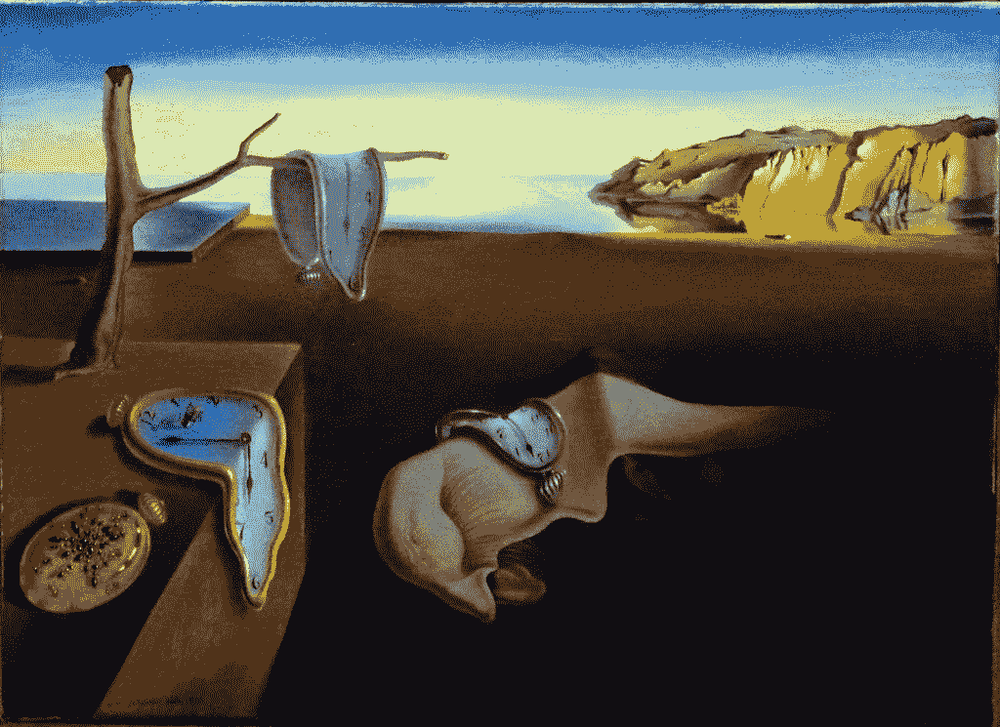

# 为什么浪费时间是产生创造性想法的关键

> 原文：<https://medium.com/swlh/why-wasting-time-is-a-key-to-generate-creative-ideas-5159cedb856a>

The Persistence of Memory by *Salvador Dalí. (Photo: Flickr)*

我真的不喜欢在徒步旅行中从水袋的吸管中吸第一口。刚开始还比较暖和，在稻草堆里呆一会儿。但我还是强迫自己喝下它来保持水分。然后，当我从袋子底部拿到水时，它的味道又变得更好了，终于解除了我的口渴。

喜欢水，喜欢想法。

最初的想法几乎从来都不是你能想到的最好的想法。任何种类的第一个想法——创新、解决方案、策略、标题、名字——都只是大脑为深入主题所做的准备。然而，如果我们在准备后立即停止构思过程，而不是深入思考并深入表面之下，我们就会错过宝贵的想法。

如果你曾经参加过一个会议，会上提出的想法都很无聊、无趣，而不是创新和有创造力的，那么很有可能有人没有给好想法足够的时间来开始流动。要么你放弃得太快，要么停下来太频繁，让你分心。无论是哪种情况，结果都是一样的:热身的想法抢了风头，而耐心的等待会产生真正的明星——新的、罕见的、非传统的想法。

实际上，研究已经足够清楚地证明了这一点。例如，[发现](http://online.wsj.com/article/SB10001424127887324339204578173252223022388.html)在中断后平均需要 25 分钟才能回到任务中。在另一个[实验](https://www.nytimes.com/2013/05/05/opinion/sunday/a-focus-on-distraction.html)中，研究人员发现干扰造成的注意力分散使考生出错的可能性增加了 20%。

人们可能会认为花额外的时间在一个彻底的(漫长的……)构思过程中只是浪费时间，讽刺的是——给的时间太短会在有趣之前打断思考过程，这意味着新想法永远不会浮出水面，或者你必须尝试几次(更多时间)才能实现它们。

Take the time for an ideation process (OK, maybe not that long). Photo by [Mathew Schwartz](https://unsplash.com/photos/8rj4sz9YLCI?utm_source=unsplash&utm_medium=referral&utm_content=creditCopyText) on [Unsplash](https://unsplash.com/search/photos/thinking?utm_source=unsplash&utm_medium=referral&utm_content=creditCopyText)

# **我们能做些什么来促进创造性的、独特的和真正原创的想法的良好流动？**

## *花时间准备设置*

清理桌子，制作你最喜欢的饮料，随身携带任何需要的材料(床单、记号笔、便利贴——你能想到的)。当你的环境准备好了，你就可以避免不必要的干扰来来回回地寻找小而重要的细节。

## *“浪费”一些时间在签到上*

签到是一个很好的方法，它不仅能让你的身体，也能让你的思想成为任何会议或思考会议的焦点。无论是团体签到还是个人签到，都是为了让人们关注我们当前的状态(我们感觉如何，我们从哪里来，我们期待什么，等等)。).

对于一群人来说，有一个签到圈可能是有用的，时间有限但有足够的空间来表达。参与者的联系需求得到了满足，对相关主题的关注度和关注度将会大大提高。

自我检查也可以用一个引导性问题来完成，但目的是在构思过程之前与我们自己联系起来。当我们有意识地逐一检查时，我们为更有效的思维模式做好了准备，这种思维模式可能会受到保护，不受其他问题的影响。

## 在一长串可笑的平庸想法上浪费更多的时间

出色的头脑风暴会议的重要规则之一是:以数量为目标，而不是质量。你希望好的、坏的和丑陋的想法出现在你最初的清单上。你想要所有你能想到的疯狂的、不可行的、不合理的想法。你需要有这个长长的清单才能进入下一个阶段——在这些想法的基础上增加一些更奇怪的想法。只有到那时，可能还需要几个回合，你才会开始产生最有创造力、最聪明、最有创意的想法。

## *计划您的休息时间*

如果你是人类，你会在某个时候需要休息，比如喝水、吃饭、上厕所和伸展肌肉。如果你不需要休息——请重新考虑你的优先事项(说真的——每个人都需要休息，即使工作堆积如山)。

你能做的最好的事情，允许适当的休息，同时尽量减少干扰，是提前计划休息。无论是团队集思广益还是你一个人——工作休息都应该被安排在日程中，并且尽可能放松。思考时段休息的目的是恢复体力和大脑的处理能力。因此，你要减少任何能激发你肾上腺素、引发你思考(在相关话题之外的其他方向)或带来新问题的活动。

是的，你没看错字里行间的意思:在思考过程中，休息时间不允许打电话、发短信、发邮件或做其他工作。你真的想带着满脑子需要你注意的无关问题开始一个新的会话吗？

因为我们生活在那个时代，这个要求很可能并不总是能够被满足。在这种情况下，你可以选择将你的交流限制在必要的范围内，并在结束后制作一份需要注意的硬拷贝清单(纸笔)。这样，你的大脑——知道任务都列出来了——就可以从你在构思过程中停止的地方自由地重新开始。

Even a good break has its rules. Photo by [Daria Nepriakhina](https://unsplash.com/photos/gm3bxHin8VA?utm_source=unsplash&utm_medium=referral&utm_content=creditCopyText) on [Unsplash](https://unsplash.com/search/photos/break?utm_source=unsplash&utm_medium=referral&utm_content=creditCopyText)

> *“不管别人跟你说什么，文字和思想可以改变世界”。罗宾·威廉姆斯*

花在文字和想法上的时间从来不会浪费。捕捉更多建议的努力最终会有回报。虽然花额外的时间和精力去想更多的想法似乎会适得其反，但事实恰恰相反。只有让我们的头脑参与到一个彻底的思考过程中，真正尊重自然的流动，我们才能真正与我们的创造性思维接触。当我们最小化干扰，最大化耐心，我们就能挖掘出等待被发现的宝贵想法。

**喜欢你读的书吗？不要害羞——分享它来帮助别人找到它。谢谢！**

## 这篇文章发表在[《创业](https://medium.com/swlh)》上，这是 Medium 最大的创业刊物，有+ 382，862 人关注。

## 在这里订阅接收[我们的头条新闻](http://growthsupply.com/the-startup-newsletter/)。

