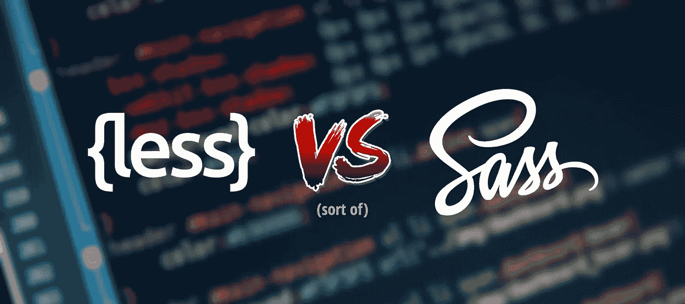
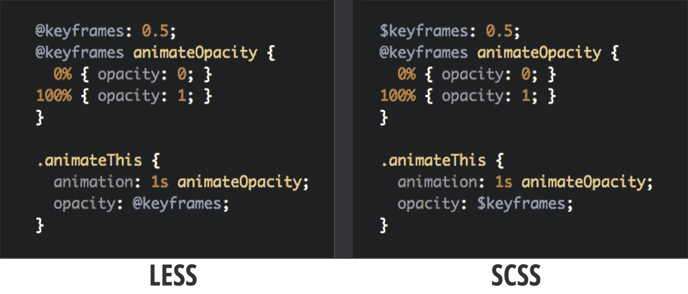

# 为什么我们决定少去 SCSS

> 原文：<https://medium.com/swlh/why-we-decided-to-drop-less-for-scss-d7d27a5915f9>

## 或者我们是如何学会停止担忧并热爱前处理器的

The great debate continues…

## 首先，什么是预处理器？

简而言之，预处理器是一个计算机程序，它修改数据以符合另一个程序的输入要求。对于 CSS，预处理器是一种脚本语言，它用变量、嵌套规则、函数和逻辑块扩展了常规 CSS 的功能。

## 为什么我应该考虑使用一个？

通常，您会发现自己在样式表的几个地方为特定的 CSS 属性使用了相同的值。例如，你已经开始把你网站的主色设为红色。后来，你想把它变成绿色。

当你使用变量时，你不需要担心寻找和替换每一个红色的出现。相反，您只需定义一次变量的值，比如说“原色”，然后使用该变量作为值。

重新定义“原色”的价值只需要在一个地方完成。也可以从其他来源导入 CSS 文件，而不用担心太多的网络请求，因为在编译时可以预先组合它们。

由于 CSS 预处理程序的嵌套性质，在相同的输出下，您将得到更精简的代码。LESS 和 SCSS 都是基于[干原则](https://en.wikipedia.org/wiki/Don't_repeat_yourself)，意思是:“不要重复自己。”

**少有什么不好？** 既然已经有很多关于 LESS vs SCSS 的讨论，我就不打算深入探讨每个话题了。相反，我会提出我们遇到的小问题。

SCSS 使用符号`$`来定义变量，较少使用`@`。由于 CSS 还使用`@`进行媒体查询和导入，并作为动画关键帧，这可能会给开发人员造成混乱。

另一方面，`$`在 CSS 中没有任何意义。`@`在 SCSS 仍然存在，但仅用于控制指令，如`@if`、`@else`、`@each`、`@for`和`@while`。

The only difference in the first two lines is the single colon while writing LESS.

虽然对每个人来说这可能不是一个真实的场景，但是为不同的项目使用不同的标识符总是受欢迎的。

SCSS 对更传统的逻辑语句有更好的支持，比如 if/else 块和循环。LESS 提供的守护混合可能看起来更容易，但是它们很难掌握。

You can do this with LESS…

…or simply this with SCSS.

因为 LESS 只匹配一个受保护的 mixin，所以不能只传递第二个参数并在同一个 mixin 中处理它，而不对所有可能的场景都写两遍。少就是多。

我知道这可以通过使用参数值作为这种情况下的属性名来缩短，但问题是:我不能有条件地用更少的参数匹配同一个 mixin 的两个不同部分。

This is definitely more headache inducing…

…than this.

为了用更少的资源获得相同的结果，我必须预定义所有内容，编写一个 mixin，获取索引位置，用我的逻辑迭代它，直到索引值为零，然后手动调用 mixin。

虽然这是个人偏好，但我觉得 SCSS 总体上更好地处理了计算值和数学值。

Why?

What is wrong with this?

另一方面，少则困难得多。例如，当我使用它的时候，我并没有试图去计算。但即使我是，什么时候 100%减去 50px 等于 50%了？

*为什么忽略单位值，少？*

为什么你要让我在我已有的 CSS 知识上学习你的怪癖？

最后，由于 LibSass 项目，SCSS 有许多其他语言的包装器，如 C、Go、PHP、Python、Dart 等等。

## 为什么我们决定少去 SCSS？

当我们在开发 [JotForm Cards](https://www.jotform.com/cards/) 时，我们的工作要求我们处理变量值——同时进行预编译和服务器端缓存；这一切都必须毫无差错地完成。

我们希望用户能够定制他们的表单的外观和感觉，用户所做的任何更改都会立即显示并缓存在服务器上。为了我们的用户，我们不想运行客户端 LESS 包装器，因为那将需要客户端的处理能力——并且很多事情可能出错。

我们并没有打算从 LESS 转向 SCSS 来开始我们的开发周期。但是在开发过程的中途，处理这些小问题却找不到一个更好的包装器，这是压倒骆驼的最后一根稻草。

也就是说，LESS 和 SCSS 之间的差异没有他们的共同点重要。说到底，你用哪个预处理器都没关系，只要你**用一个**。

试图用一个 CSS 文件和传统的 CSS 结构来管理一个巨大的项目，比使用带有一些小麻烦的预处理器要困难得多。

> 感谢阅读。
> 
> 如果你喜欢这篇文章，请随意点击那个按钮👏帮助其他人找到它。

*原载于*[*www.jotform.com*](https://www.jotform.com/blog/408-Why-we-decided-to-drop-LESS-for-SCSS)*。*