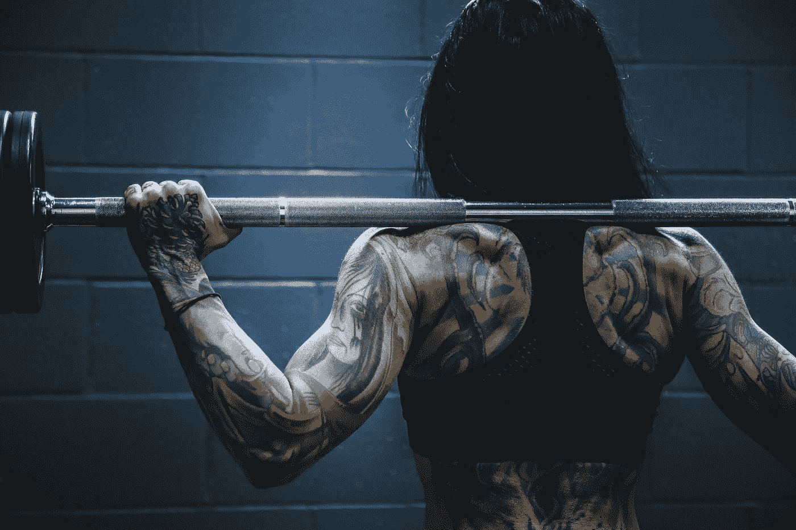

# 为什么我们要做我们所做的

> 原文：<https://medium.com/swlh/why-we-do-what-we-do-5f9af22f6c2d>

Be in control of your life. Know your whys. Photo by [Alora Griffiths](https://unsplash.com/photos/aVrZMPgN_Vg?utm_source=unsplash&utm_medium=referral&utm_content=creditCopyText) on [Unsplash](https://unsplash.com/?utm_source=unsplash&utm_medium=referral&utm_content=creditCopyText)

“呃，该死的，你会杀了我的，提姆！”

*“不要让体重控制你。你控制体重。”*

那是我的私人教练蒂姆。

我的疗程快结束了。我累了。身体上。还有精神上。所以利用重物的动量上下摆动变得很有诱惑力。