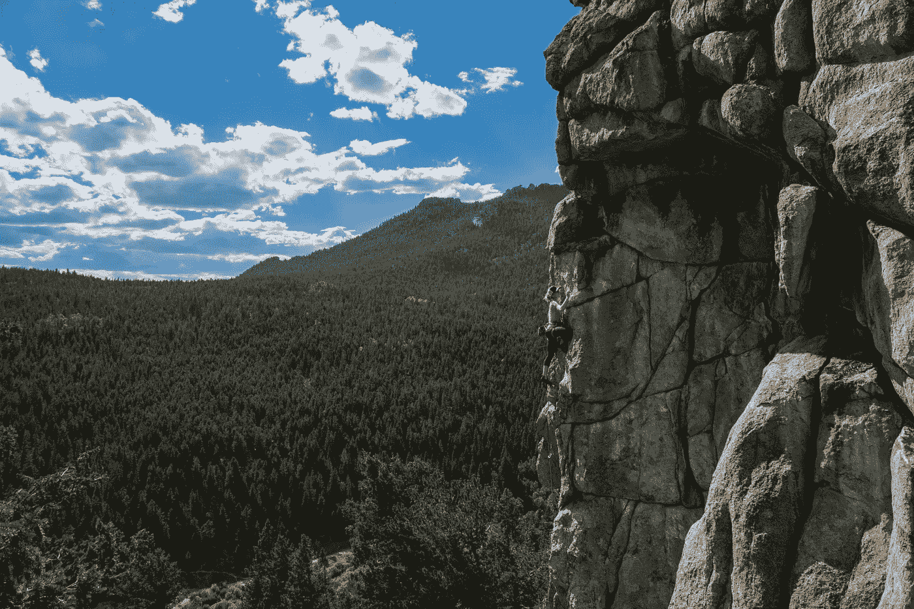

# 为什么我们需要做艰难的事情

> 原文：<https://medium.com/swlh/why-we-need-to-do-hard-things-cc7eec981fc5>

They won’t believe we can. Photo by [Lionello DelPiccolo](https://unsplash.com/photos/uJfwRhfgSnw?utm_source=unsplash&utm_medium=referral&utm_content=creditCopyText) on [Unsplash](https://unsplash.com/?utm_source=unsplash&utm_medium=referral&utm_content=creditCopyText)

> 他爬上了 3000 英尺高的垂直悬崖——没有绳子。

踮着脚尖，用他完全发育成熟的身体抓住比铅笔宽度还小的边缘。

为了通过路线中最难的部分，他练习了一年的空手道踢腿伸展，这样他就可以通过一个特定的动作到达他的腿。