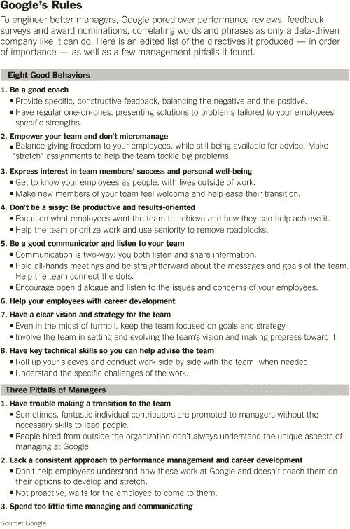

# 为什么我们应该更像谷歌

> 原文：<https://medium.com/swlh/why-we-should-be-more-like-google-fcbfaed3751e>

## 商业和文化

Courtesy: [Unsplash.com](https://unsplash.com/search/photos/google)

在任何学校、组织或企业中，都存在一种文化。

有时，现有的文化是动态的、有感染力的，并孕育着创造性的成功，每个人都想成为其中的一部分。

其他时候就没那么多了。

几周前，我的一个朋友告诉我，“瑞安，如果你想去什么地方，就一个人去吧。如果你想走得远—一起走”。他是对的。

难怪像 T2 谷歌 T3 这样的公司不能足够快地拒绝人们。他们是目前美国最适合工作的公司之一，员工的满意度也很高。他们在公司内部创造了一种成功的文化，继续吸引和留住那些感到被重视、被支持和被倾听的优秀人才。

这里列出了谷歌经理的一些基本规则。

Courtesy: [kissmetrics.com](http://www.kissmetrics.com)

除了这些规定，以下是[谷歌](https://medium.com/u/be36e94a7e47?source=post_page-----fcbfaed3751e--------------------------------)提供给员工的一些主要福利:

> 免费早餐、午餐和晚餐。有机食物是厨师准备的
> 
> **免费健康和牙科**
> 
> **免费理发**
> 
> **免费干洗**
> 
> **补贴按摩**
> 
> **健身房和游泳池**
> 
> **混合动力汽车补贴**
> 
> [**午睡豆荚**](http://www.geek.com/articles/gadgets/google-uses-high-tech-nap-pods-to-keep-employees-energized-20100618)
> 
> **电子游戏、桌上足球、乒乓球**
> 
> **现场医师**
> 
> [**死亡理赔金**](http://www.forbes.com/sites/meghancasserly/2012/08/08/heres-what-happens-to-google-employees-when-they-die/)

*来源:*[*www.kissmetrics.com*](http://www.kissmetrics.com)

创造成功文化实际上比我们想象的要简单。很多时候，组织陷入了盈利或生产力的循环，而忘记了如果他们围绕他们雇佣的人来建立他们的组织，这是创造成功文化的最终关键。

这里有四种方法，你可以建立成功的文化，或者确定一个有成功文化的组织。

# 1.关系先于资源

任何行业、任何职业的人都希望首先被倾听。这是永恒的人性基本法则。这可以追溯到几千年前。古埃及人把符号刻在石头上，让人们听到。如果你能发现一个重视关系甚于资源的组织，你就走上了创造成功文化的正轨。

# 2.生产力过剩的人

这似乎很清楚。然而，许多组织文化已经忘记了这在 21 世纪的重要性。理应如此。要经营一个高效但重视员工多于生产的组织是极其困难的。说起来容易做起来难。如果你找到一个这样做的组织，你就找到了一个*独角兽*。如果你是遵循这一点的组织的一部分，祝贺你赢得彩票！

# 3.逆向领导

领导力应该贯穿于组织的每一层。你应该在每个层次都有，但最重要的是；你应该以一种不具威胁性的方式在每个层面感受到它。绝对最好的领导是当你的高层领导愿意为组织中的每个人做脏活的时候。他们会主动为他人服务，确保组织中的所有成员都感受到自己的价值、支持和重要。

# 4.全体船员注意政策

在纽约时，我曾为一位杰出的领导者工作，他教会了我在一个组织中“全员参与”政策的价值。每天早上我们都有领导会议，他从来不害怕叫我们中的任何一个人换一个不同的任务，或者在一个特殊的情况下提供帮助，或者帮助解决一个需要注意的问题。我在其他组织中也看到过这种“全员参与”的政策，当这种政策被允许、鼓励并根植于领导层的组织结构中时，看到领导们一次又一次地聚在一起完成工作是很有趣的。

# 结论

最终，创造一种成功的文化是关于人的，应该始终首先关注牢固的关系。将你自己与正确的团队、哲学和创造力紧密结合会产生惊人的结果。[谷歌](https://medium.com/u/be36e94a7e47?source=post_page-----fcbfaed3751e--------------------------------)继续这样做，并继续成为公司如何迎合员工的灯塔。

## 这篇文章发表在[《创业](https://medium.com/swlh)》上，这是 Medium 最大的创业刊物，有 292，582+人关注。

## 在这里订阅接收[我们的头条新闻](http://growthsupply.com/the-startup-newsletter/)。

