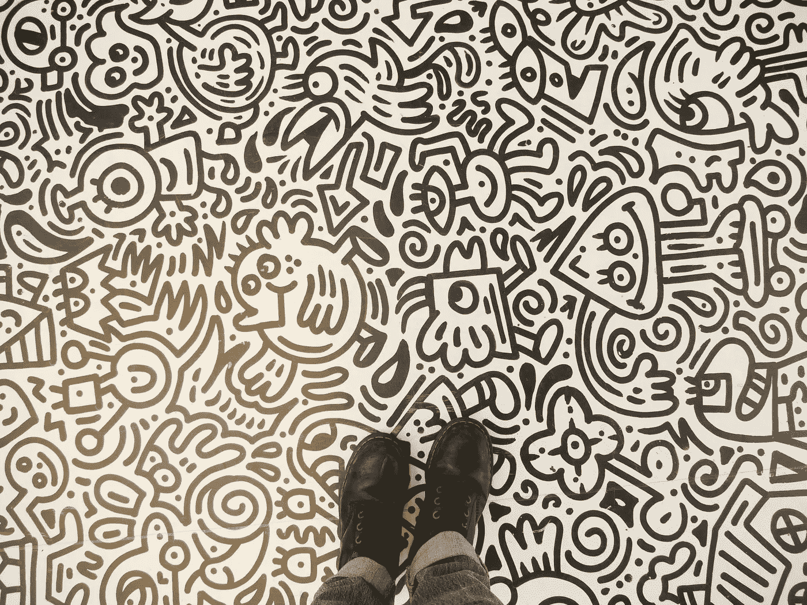
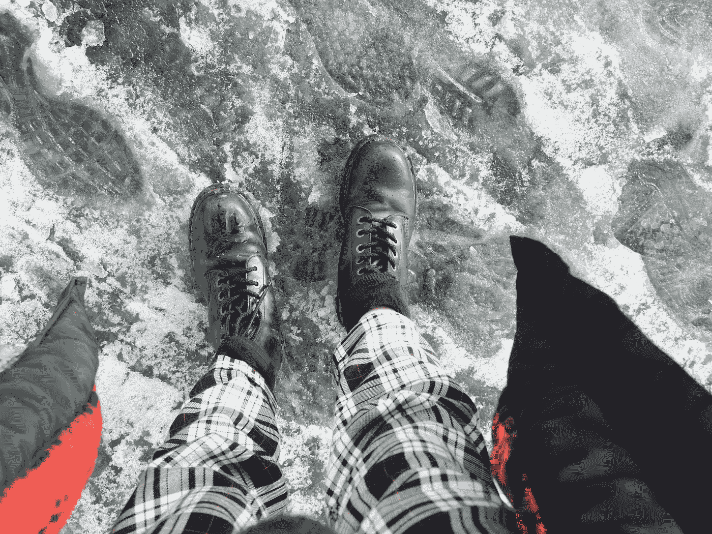

# 为什么你不擅长理解情感

> 原文：<https://medium.com/swlh/why-we-suck-at-understanding-emotions-59ac56a3c3a6>

The Doodle room at the Sense of Space exhibition in London.

# 情绪，正如 Dylan Evans 在 [*中所说情绪:非常简短的介绍*](https://www.amazon.co.uk/gp/product/0192804618?ie=UTF8&tag=rosieleizr06-21&camp=1634&linkCode=xm2&creativeASIN=0192804618) *，*有两个目的:**沟通和激励。**

*向他人传达我们的感受，并激励我们采取行动。*

听起来真的很明显吗？你的鼠标是否已经开始移动，点击鼠标，寻找一个教你如何通过 7 个简单的步骤征服和控制情绪的替代工具？

**不是的。**和*请不要。*一点都不明显，也不是我们一般认为的情绪。

我们以一种片面的方式看待他们，过多地关注沟通部分。

## 我们大多数人都非常非常擅长交流自己的感受。

在来到这个世界的 0.3 秒内，我们开始表达我们的情感。作为微小的人类，由于周围的反馈回路，我们很容易掌握这项技能:

> ***感受负面情绪→表达负面情绪→让他人解决导致情绪的任何问题(如饥饿、不适、疾病)→感受正面情绪。***

这个循环强化了一个观念，即解决不好的感觉的方法是把它传达给其他人，然后他们会被激励采取行动，解决任何错误。

几年来，这是可行的。我们成为操纵大师，毫不费力地熟练地让别人做我们想做的事。这是必要的——我们自己无法照顾动作部分。

> 人类的喜剧是这样开始的:我们的大脑对于我们母亲的臀部来说太大了。因此，大自然，她预言了这种选择:我们以半成形的形式出现，并希望在另一端与我们打招呼的人足够友好地将我们填满。'
> 
> ——约翰·米斯蒂神父，[纯喜剧](https://www.youtube.com/watch?v=wKrSYgirAhc)

## 但这不会永远有效。在某种程度上，表达我们的情感已经不够了。

其他人不再绊倒自己来帮助我们，并开始期待我们为自己做更多的事情。

当然，当我们成年后，我们都会变得擅长处理我们的基本需求。否则我们无法生存。

然而，我们大多数人在生活中仍然过于强调交流我们的情感，而很少理解它们打算激励我们做什么，以及为什么。

# 我们生活在情感表达的黄金时代。

我们如此在意将它们外在化，在意让世界知道我们的感受，在意在网上分享它们，这样别人就会同情我们，在意感觉我们的情感得到了认可。

> 但一切都到此为止了。我们发泄自己的情绪，然后继续前进。或者说，我们没有。

> *他们说，疯狂的定义是重复做同样的事情，并期待不同的结果，这意味着* ***这种不断表达情感而不采取行动的文化是相当疯狂的。***

这么想吧。如果我们的祖先吃了一种味道不好的浆果，然后厌恶地皱起了脸，他们的朋友就会明白了:*好了，伙计，我们不要再吃那些浆果了。*

## 他们不会做的是大声表达他们的厌恶，被他们的伙伴安慰，然后第二天去做同样的事情。或者至少，那些活下来的人不会。

厌恶的表情会告诉他们的朋友不要吃那些浆果。

厌恶的实际感觉会促使他们也不再吃浆果。

# 情绪意味着教会我们用不同的方式做事。

它们旨在告诉我们什么是应该接受的，什么是应该避免的。它们旨在促使我们奔跑、战斗、躲藏、狩猎、繁殖、社交、吃饭、睡觉等等。

只是，不知何故，这个等式的一部分已经丢失了。

文明社会的整个症结在于，我们注定要压制和践踏我们的许多自然本能。

> 我们应该保持整洁，穿着得体，有礼貌并且非暴力，容忍我们不喜欢的人，养育健康的孩子，在我们宁愿睡觉的时候工作，遵循复杂的社会准则，并且通常不根据我们的感觉行事。

然后，我会用我有限的社会学知识争辩说，过去的两个世纪左右已经远离了情感压抑，转向了压倒性地强调将一切外在化。借助浪漫主义运动和弗洛伊德心理学。

> 我们有无限的机会来表达和合法化我们的感受，我们也变得痴迷于给它贴标签。

心理学的历史就是寻找标签，并通过极端的视角对人们的感受进行分类，而不是去理解为什么。

# 想想你认识的一个人(我们都认识一个)不停地谈论他们悲惨的关系。

每次你碰到他们，或者打电话，或者出去玩，这是他们谈论的第一件事。他们有多沮丧。他们有多愤怒。他们有多难过。一切都是错的，都是他们伴侣的错。

所以你安慰他们。你提供了有益的建议。但是什么都没有改变。也许他们离开了那个特别的伴侣，只是为了和下一个重复整个事情。还有下一个。或者他们没有——他们停留在完全相同的情况下。

*看，我对* [*关系*](https://www.rosieleizrowice.com/blog/hellisotherpeople) *一窍不通。它们列在我曾经做过的事情的长长的清单上，我也明白这些事情的好处，但是我再也没有时间去做了(比如冥想、吃素、去健身房、戴耳环)。)*

然而，我认为他们是这方面的完美例子。任何关系都会有问题，与其他人讨论这些问题显然是个好主意。

## **问题在于，当有人认为这就够了，而不去考虑任何可能改善事情的事情时:**

> *实际上和他们的伴侣讨论事情，而不是期望他们是一个读心术者，去夫妻治疗，评估他们的期望，重新规划他们如何看待关系，或者如果需要的话离开——或者，见鬼，只有在关系中让他们快乐，才是真的，而不是因为他们害怕孤独。*

在过去的一年半时间里，我很少有机会以诚实的方式向他人表达我的情感。

如果我在糟糕的一天工作后回到家，我不能通过向某人诉说来发泄，他会安慰我明天会更好。如果我有一些令人兴奋的好消息，我不能庆祝或告诉别人，除非我打电话给一个不会真正关心的家人。

如果我对自己的死亡感到压抑，对自己的人生方向感到困惑，需要一个拥抱，被能源公司激怒，被践踏，或者兴高采烈，我的主要选择是告诉我的猫。我交谈过的少数人厌倦了听到我的声音，我尽量不去打扰他们。

## 结果是我看待自己情感的方式发生了非常奇怪的转变。

我感觉到了。我吞下它们。我对他们采取行动。我没有经常以一种有意义的方式明显地表达出来。可能一周一次我会哭(很多次。)

如果你独自一人，表现出强烈的情绪是不被社会接受的。在街上哭或笑被认为是疯狂的表现。因为我们太习惯于认为我们的情绪是为了他人，而不是为了我们自己的利益。

> 但是他们应该这样。事情就是这样— 你不需要总是分享一切。*完全有可能只是带着一种感觉坐着，感受它，然后找出它试图激励你做什么。*

我还意识到，我们完全有能力满足自己的许多需求。我们不需要总是依赖别人。

> 我们可以独立，不是拒绝他人，而是[接受自己。](https://www.rosieleizrowice.com/blog/self-acceptance)

# 三月，我走过哥本哈根一个结冰的湖，它教会了我一些重要的事情。

我第一次来到这个城市。我的 Airbnb 房东不经意地提到附近的湖冻得结结实实的。所以我放下我的包，跑去看它。

到了那里，映入我眼帘的是一片灰白色的冰原，覆盖着白雪。除此之外，我是一个明智而谨慎的人——我从来不会不闻一下就往咖啡里放牛奶——但我不会三思而行。我甚至懒得谷歌一下是否安全，就踏上冰面，从一个河岸走到另一个河岸。这是中间的视图:

> 整个经历就像是一次长期的信任跌落:肾上腺素、恐惧和对自身稳固性的意识交织在一起，我向后跌倒，希望大自然能接住我。

是的，这是一件不负责任的事情。但这也是一个充满奇异魔力的令人兴奋的时刻。在某种程度上，我希望有人能和我分享这一刻。独自旅行的陷阱之一是没有人可以分享美好的时刻。

但都过去了。我吸收了这种感觉，把它全部藏在心里，然后带着对这种经历的主人翁感继续走下去。它是我一个人的。和其他人交流这种恐惧和兴奋，把它变成一种共同的记忆，这是一件很好的事情，我让这种美丽鞭策着我。

总而言之，这种长时间的隔离让我更善于根据自己的情绪采取行动，并试图解决问题。表达可能感觉很好，并提供了一个连接的时刻，但它不能解决负面情绪。它只是简单地取代了它们。

# 认为表达和分享我们的情感是浪费时间是可笑的。

当然值钱了。压抑自己的感受当然是不健康的。我说的不是这个。

有时候，我们甚至很难知道自己的感受，直到我们把它外在化。很多时候，我们需要别人来调节我们的反应，帮助我们想出如何行动。

我也不是说我现在处理的隔离程度是有抱负的，有趣的，甚至是健康的。

但它教会了我很多，也就是说，仅仅表达是不够的，尤其是当涉及到强烈的感情时，这种感情就像是赶牛棒一样。尤其是当我们从来没有面对他们的原因。

*附:如果你希望我的帖子每月发送一次到你的邮箱，在这里* *注册* [*。*](https://rosieleizrowice.substack.com/welcome)