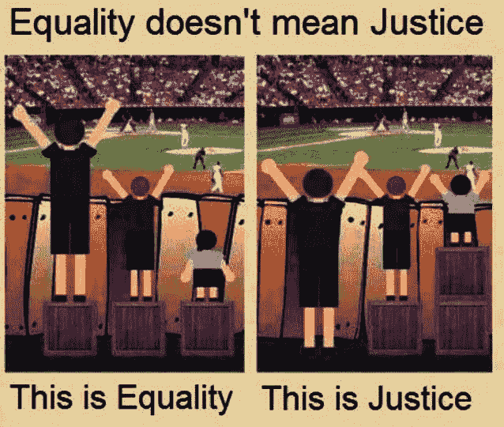

# 为什么我们支持有家眷的队友(以及为什么它不再是我们工资公式的一部分)

> 原文：<https://medium.com/swlh/why-we-support-teammates-with-dependents-and-why-it-s-no-longer-part-of-our-salary-formula-b7d63d330c77>

在 Buffer，我们一直感兴趣的事情之一是以不同的方式看待薪酬，并且[透明](https://buffer.com/transparency)。

在我们的[透明工资公式](https://open.buffer.com/transparent-salaries/)的最新更新中，一个关键的变化是，如果队友有家眷，或家庭成员依赖他们的收入，我们开始支付更多的钱。

我们最初想出的方案为每个直接依赖你收入的家庭成员每年提供额外的 3000 美元。这可以是相当广泛的——例如，一个正在上学或失业的配偶或伴侣，或者你要寄钱帮助支付费用的祖父母。我们相信每个队友都会做出对他们最有利的决定，不会问任何问题。

**缓冲的家眷政策**

*   每个依赖您工资的受抚养人 3000 美元
*   可以是配偶、伴侣、子女、祖父母、姑姑或叔伯等。
*   你可以根据需要拥有更多的家庭成员

随着[美好生活曲线](https://open.buffer.com/transparent-salaries/)，这是我们最近分享新公式时得到最多问题和评论的要素之一。

我想花点时间解释一下，为什么我们最初让团队成员将那些依赖他们收入的人纳入他们的工资中，以及为什么我们现在有了一条不同的道路，在听到你们许多人的真知灼见之后。

# 为什么包括家属和家人？

为什么要把家人或家属扯进来呢？

乔尔和我在欧洲长大经历的事情之一是从政府的角度支持家庭的想法。在奥地利，我的家庭每个孩子每年可获得 2000 美元的补助，在英国，针对特定收入水平也有类似的项目。

我们一直认为这是一件好事，作为 Buffer 的共同创始人，我们现在有机会以类似的方式表达对我们团队的支持。

抚养孩子和其他家庭责任要花很多钱。我们认为这是我们应该支持的事情。

我们的直觉是，3000 美元不足以激励任何人生孩子，这也不是这项津贴的目的。相反，我们希望帮助我们的队友，如果他们碰巧有孩子或其他家庭成员依靠他们的收入，他们会感到被照顾。

这在一定程度上是一种自私自利的尝试，试图让人们远离一些挑战，这样他们在 Buffer 上工作(或做其他任何事情)时就不会那么担心钱了。

我们知道还有很多其他情况下人们可能也需要帮助，例如，学生贷款，或者你房子的抵押贷款，我们不想排除这些情况。

从长期发展 Buffer 的文化和价值观来看，我希望我们能解决更多对团队成员来说是负担的问题。

首先，我们选择了一个依赖者，因为它感觉像是一个共同的、适用的、有用的起点。

# 听取您的反馈:我们从工资中删除了这一要素

令人难以置信的是，围绕这一点提出了许多惊人的、深思熟虑的评论和讨论点。我们一直在听他们所有人的歌！

在我们进行了所有的对话之后，我们仍然认为用这些相当小的赠款来支持队友是正确的。

但我们得到了许多有益的反馈，即把这笔钱纳入一个人的整体薪酬感觉很糟糕，好像我们对有家庭责任的人的评价与其他队友不同。

这里有一个例子:

> [*@ joelgascoigne*](https://twitter.com/joelgascoigne)*[*@ buffer*](https://twitter.com/buffer)*家庭跟工资有什么关系？如果我有孩子，会让我成为更好的员工吗？如果我不能拥有它们呢？**
> 
> **—克里斯 C(@克里斯 _ 坎贝尔)*[*2015 年 11 月 24 日*](https://twitter.com/chris_campbell/status/669267619531354112)*
> 
> **我无法决定，我是否赞同*[*@ buffer*](https://twitter.com/buffer)*的决定付出的人，有家庭的人多/单身的人少。嗯。—Kathrin Folkendt(@ kath aka)*[*2015 年 11 月 24 日*](https://twitter.com/kathaka/status/669236203049349120)*
> 
> *[*@ joelgascoigne*](https://twitter.com/joelgascoigne)*[*@ buffer*](https://twitter.com/buffer)*为什么有家庭得到的多？有点歧视单身人士。***
> 
> ***—安迪 P(@ andypngr)*[*2015 年 11 月 25 日*](https://twitter.com/andypngr/status/669348009222799360)**

**我们听你的，我们完全同意。**

**因为一个人的家境而多给一个人工资是没有意义的。尤其是当涉及到公平时——在我们现有的公式中，有孩子的人或其他依靠他们工资的人会得到更多的公平，这感觉一点也不正确。**

**因此，我们已经将家庭因素完全从薪资公式中移除。它不再是我们[工作电子表格](https://docs.google.com/spreadsheets/d/1l3bXAv8JE5RB9siMq36-Ogngks2MT6yQ5gt8YXhUyAg/edit#gid=1533208969&vpid=G2)中公式的一部分，也不再出现在我们[工资计算器](https://buffer.com/salary)中。**

**相反，我们在福利中增加了一项新的家属补助。我们已经有了许多由 Buffer 提供和支付的[津贴和福利](https://open.bufferapp.com/buffer-perks-startup-perks/)，家属补助金感觉它有一个更合理的位置。**

**我们仍在围绕它开发一个流程，但这将是一个年度资助，任何队友都可以通过分享他们特定的家庭情况来申请。(之前通过工资公式获得这笔钱的队友已经在今年获得了这笔钱)。**

****本次变更前的公式:****

**(总体基数+地点基数+生活成本)*角色价值*经验+风险+家属=工资**

****本次变更后的公式:****

**(整体基数+位置基数+生活成本)*角色价值*经验+风险=薪资**

**这里有一个例子，将所有这些放在一起:**

**一个 ***高级*** 工程师，住在 ***开普敦*** ，选择 ***更多股权*** 并有 ***两个孩子和一个*** 丈夫的人根据她的收入，会在之前做出这样的决定:**

*   **60 662 美元 x 1.20 美元+9 000 美元+0 美元= 81 794 美元**

**现在这位队友做出了:**

*   **60，662 美元 x 1.20+0 美元= 72，794 美元**

**然而，她可以申请高达 9000 美元的家属补助金，以帮助支持那些依赖她的工资的人。**

**我们觉得我们正在描绘一幅更清晰的画面，我们很想听听你们的感受。**

# **这公平吗？**

**当我们继续用这些相当少的赠款支持队友时，我们觉得可能会存在的一个问题是:这公平吗？**

**这个问题我们想了很多，我们得出的结论是，公平并不总是意味着平等。**

**我们可以付给每个人完全一样的工资(这是我们过去实际考虑过的事情！)但我们不是完全一样的人。我们有不同的地点，不同的喜好，不同的生活状况。我们认为，这些差异应该有机会反映在我们的薪酬中。**

**总的来说，Buffer 的目标是尽可能慷慨，把钱拿出来作为对任何队友的关心。因此，对于那些在经济上面临额外负担的人，我们希望给予他们支持。**

**我们希望用整体性、同理心和同情心来看待薪酬。**

**这张图片最能帮助我理解这个概念:**

****

**Dependents 可能是我们朝着这个方向发展的第一个例子，我有一种直觉，这些变化不会总是对每个人都公平。**

**将来，我们可能会添加更多这样的元素，例如:**

*   **为我们的“数字游牧者”队友提供额外津贴，他们会因环游世界而产生额外费用。我们希望帮助人们找到他们觉得最快乐的地方。**
*   **汇率和税收的调整，因国家而异。(例如，我们知道在法国[的 Buffer 团队成员支付了很多其他人没有支付的额外税款](https://open.buffer.com/international-pay/)。)**

**我知道我们会从这些经历中学到很多。**

**我非常感谢许多人在这个问题上发表意见，并帮助我们做出我们认为是更好的决定。**

**这一经历提醒我，保持透明有一个惊人的好处，那就是帮助你听取许多非常聪明的人的意见。没有他们，我们不可能得出这个结论。**

**我知道我们的公式仍然远非完美，听到你们所有人关于我们如何使它在未来变得更好的宝贵意见。**

**如果你准备好了，我很想听听你对这个变化的想法，感觉如何，以及它可能会错过什么。我听着呢！**

## **附:在你的电子邮件中获取我们关于工作场所文化、生产力、透明度等的所有帖子。[现在报名](http://buff.ly/1OmnSUx?utm_source=medium&utm_content=dependents-textlink&utm_campaign=cta-bottom)。**

***原载于 2016 年 1 月 14 日*[*open.buffer.com*](https://open.buffer.com/dependents/)*。***