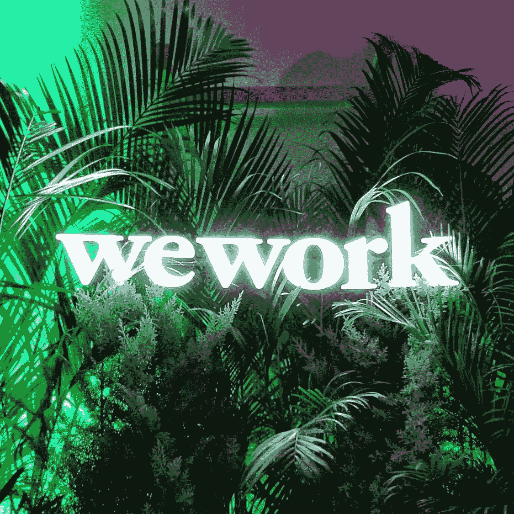

# 为什么 WeWork 的名字这么好

> 原文：<https://medium.com/swlh/why-weworks-name-works-so-well-6ff6953fd184>

给企业命名是你做过的最重要的事情之一，也是最难做对的事情之一。

今天，我将重点介绍一家公司，当提到他们的名字时，这家公司完全做到了——并告诉你如何让你的名字像他们的一样成功。

WeWork 将自己描述为“一个全球性的工作场所网络，公司和人们在这里共同成长。”

随着共同工作革命开始变得强大，他们已经将“工作空间”重新想象为**，而不仅仅是一张你整天盯着屏幕坐着的桌子**。

对他们来说，工作场所是一种社区体验——他们花了大量的时间和精力在**创造独特、友好、旨在促进联系的动态环境**。

凭借“做你喜欢的事情”和“创造生活，而不仅仅是谋生”等口号，WeWork 对社区的承诺在他们的营销和空间中都清晰可见。

# **现在，关于那个名字…**

最棒的名字**让人们在听到它们的时候感觉到或想象到一些事情**——这就是它们如此令人难忘的原因。我们的工作碰到了这两个桶。

“我们”+“工作”:两个简单而强烈的词串在一起，就 2 个音节。以下是单词组合如何唤起一种感觉和视觉。

# 这种感觉

当你听到“WeWork”时，听起来像是行动的号召。WeWork 让人想起团结、社区和共享创作。你把自己放在图片中(我正在努力做一些东西！我确实想一起工作！我将征服世界！).

# 视觉

你正坐在一个色彩缤纷的会议室里——文件散落在桌子上；有人兴奋地用记号笔在黑板上写字；你和你的搭档互相击掌。你的团队，你的部落，你的网络…你可以看到他们都走到一起，朝着一个伟大的目标努力。

# ⚡️ **贵**小见识**⚡️**

想想当你的客户听到你公司的名字时，你希望他们有什么样的 **(1)感受或者(2)想象**——并以此为灵感。或者你已经有一些名字上桌了，就用这些词来评判。

这就是如何确保你的名字对你来说足够努力。

## 喜欢这篇文章吗？按下拍手按钮👏帮助其他人找到它。

> 关注我，获取每日发布的创业公司品牌洞察:[LinkedIn](http://www.linkedin.com/in/kimberly-brizzolara-0b95093)| |[insta gram](https://www.instagram.com/kimberlybrizzolara/)| |[脸书](https://b-m.facebook.com/brandsthatgetyou/)
> 
> 你也可以[注册我的电子邮件](http://kimberlybrizzolara.com)并在媒体上继续关注我[。](/@Kbrizz)

## 这篇文章发表在《T4》杂志《创业》(The Startup)上，这是 Medium 最大的创业刊物，拥有 337，320 多名读者。

## 在这里订阅接收[我们的头条新闻](http://growthsupply.com/the-startup-newsletter/)。

