# 为什么 WordPress 是建立你的商业或创业网站的最佳平台

> 原文：<https://medium.com/swlh/why-wordpress-is-the-best-platform-to-build-your-business-or-startup-website-on-df3fe932fad7>

很多企业和创业公司不知道 **WordPress** 有多棒**，或者为什么**他们应该为他们的企业使用 WordPress，所以在这篇文章中我将告诉你**为什么你应该为你的企业或创业网站使用 WordPress。**

抛开 **WordPress 是免费的**不谈，WordPress **是牛逼的。它很容易使用，超级强大，你可以用它做任何事情。**

不仅如此，还有一个巨大的 **WordPress 开发者**社区，**无数的教程、指南、视频、电子书**甚至**整个企业**致力于**帮助**你**成长**和**维护** **你的 WordPress 网站**。如果这还不够，根据 w3techs.com 的说法:

> “WordPress 被**的 **60.3%** 所有**的**网站**使用，我们知道这些网站的内容管理系统。这是所有网站的 **30.2%** 。”

如果有 30%的网站是由 WordPress 驱动的**网站**还不足以证明你还在问自己为什么要使用 WordPress，让我告诉你，它也驱动了一些[世界上最大的品牌](http://www.wpbeginner.com/showcase/40-most-notable-big-name-brands-that-are-using-wordpress/)的网站，包括 [**TechCrunch**](https://techcrunch.com/) **、** [**MTV**](http://www.mtv.com/news/) 、** [**Sweden.se**](https://sweden.se/)**

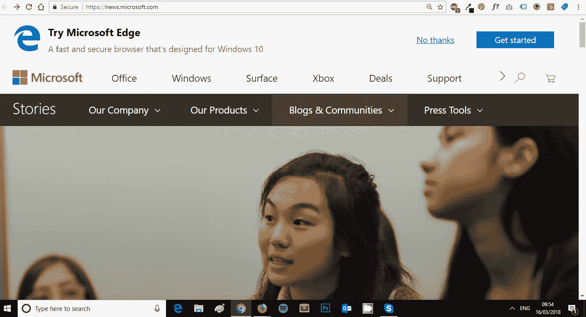

Microsoft Edge News on Wordpress

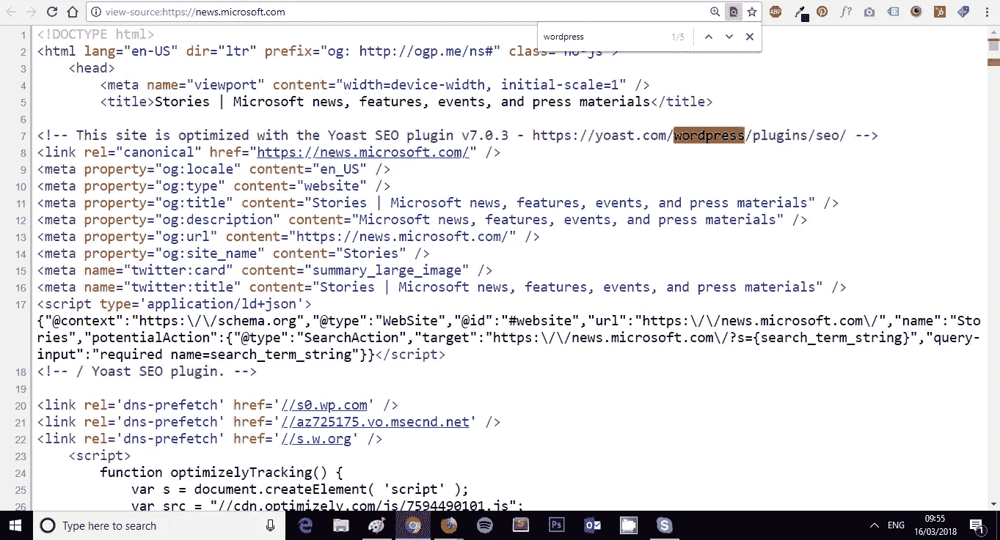

Microsoft Edge Wordpress source code

如果**还不够的话，**看看这个**使用 WordPress** 来推动业务的成功创业公司的列表 **:**

1.  [**Kokoon**](https://kokoon.io/)——根据他们的网站，Kokoon 提供世界上第一款“睡眠感应耳机”。已经在 Kickstarter 上筹集了 200 万英镑并卖出了 1 万英镑，我们可以期待在未来看到更多的 Kokoon。
2.  [**Primal Pantry**](https://www.primalpantry.com/)——2014 年推出的清洁饮食创业公司，入围[年度出口企业奖](https://startups.co.uk/startups-100/2017/23-the-primal-pantry/):“今天，产品范围已经扩大到五种口味和三种高蛋白棒，通过 Ocado、Waitrose、Tesco、Sainsbury's、Holland & Barrett、Planet Organic 和 Wholefoods 在英国销售，并通过国际经销商在全球 28 个国家销售。”
3.  [**Litmos 英雄**](https://litmosheroes.com/) — Litmos 英雄正在从‘无聊的 e 学习视频’中拯救世界。Litmos Heroes 被称为“学习的网飞”,在英国、美国和澳大利亚拥有 300 多个客户。Litmos 英雄预计在 2017 年为[赚 200 万英镑！](https://startups.co.uk/startups-100/2017/26-learning-heros/)
4.  **——这个超级酷的、名人领导的美食糖果品牌正试图用无麸质的“舌头刺痛糖果”来“重振糖果市场”。Candy Kittens 是一家基于 WooCommerce 的 WordPress 公司，由切尔西制造明星杰米·莱恩和他的朋友兼商业伙伴爱德华·威廉姆斯一起创办。据 Startups.co.uk: 报道，“糖果小猫在 2016 年实现了 130 万英镑的丰厚收入和 40 万英镑的丰厚利润，并有望在 2017 年实现超过两倍的营业额。”**

# **什么是 WordPress？**

**对于那些不熟悉 [**WordPress**](https://wordpress.com/?aff=6349) 的人来说，WordPress 是一个 **CMS** ，或者内容管理系统。一个内容管理系统允许你**编辑**和**改变你网站的外观**，**而**不必使用**代码**。**

**想象一下像微软的 Word 一样的网站，拥有大量的额外功能，并且能够为你的网站拖拽个功能块，你可能会做得很好。**

**也许[WP 初学者描述](http://www.wpbeginner.com/glossary/content-management-system-cms/)确实 WordPress 更正义。他们定义了一个 CMS，而 **WordPress 明确地把**定义为:**

> **“内容管理系统(CMS)是一种便于创建、编辑、组织和发布内容的软件。WordPress 是一个内容管理系统，允许你在网上创建和发布你的内容。虽然它主要用于 web 发布，但也可用于管理内部网或单台计算机上的内容。**

# **为什么使用 WordPress？**

**于是开始了**的**永无止境清单**酷的理由**你**应该为你的生意**网站**使用 WordPress** ，系好安全带，尽量不要太兴奋。**

# **它是免费的**

**WordPress 是一个免费使用的 CMS 系统，可以安装在任何网站上。[WP 初学者总结得好:](http://www.wpbeginner.com/beginners-guide/why-is-wordpress-free-what-are-the-costs-what-is-the-catch/)**

> **“WordPress 是一个开源软件。它是自由意义上的免费，而不是免费啤酒意义上的免费。你可能会问这两者有什么区别？开源软件可以让你以任何你喜欢的方式自由地使用、修改、构建和重新发布软件。”**

# **它有主题和页面生成器**

**WordPress 运行在**主题**和**页面生成器上。****

**什么是主题或页面生成器？我听到你问，几乎无法抑制的兴奋。**

**嗯，关于什么是 WordPress 主题，有很多非常专业的定义。我从[WordPress.org](https://codex.wordpress.org/Themes)找到了这块宝石，比如:**

> **WordPress 主题是一组文件的集合，这些文件一起工作来产生一个图形界面，该界面为一个博客提供了一个潜在的统一设计。这些文件称为模板文件。主题改变了网站的显示方式，而不改变底层软件。**

**我试着去定义它，我想到了这个:**

> **WordPress 主题是一个代码、**功能**和**风格**的**集合，你可以**将**以**主题**的形式安装到你的网站上。在你的 WordPress 网站上安装这个主题允许你使用**WordPress**CMS**界面、页面生成器和你的主题**提供的任何插件**访问**和**使用**的**功能**和**样式****主题******

****无论你从哪个角度看，WordPress 是你网站建立的基础。你选择的 **WordPress 主题或框架**就是你决定用来建立网站的**工具包**。****

****如果你有兴趣看看这些**工具包能做什么，**看看下面介绍的 **Divi** ，这是最受欢迎的工具包之一****

********

****Divi Page Builder****

# ****理解 WordPress 主题和页面生成器****

****就 web 开发而言，WordPress 主题和页面生成器是小企业有史以来最好的事情。****

****市场上最好的软件能为你提供数万英镑的开发工作，价格在 50-250 美元之间。****

****这些主题包含的价值是无法计算的。像 [**迪维**](https://bit.ly/2La9N66) **页面生成器**这样的市场领导者包含了来自熟练的设计师、开发人员成千上万小时的工作。****

****开箱即用，这些工具可以用来构建任何东西。****

****它们带有内置的**易于使用的页面生成器**，完全响应，捆绑了惊人的插件，包含无限的样式和定制选项以及大量易于安装的演示。****

****我推荐的一些主题和框架是:****

1.  ****[**Divi 页面生成器**](https://www.elegantthemes.com/affiliates/idevaffiliate.php?id=47225&url=42273)——如果你不是技术人员，并且想要在视觉上构建一个**漂亮的网站**，**的最佳选择。易于使用的可视拖放****，大量免费模板、元素和演示内容，强大的客户支持和大量免费在线教程。******

******2.element or——构建 WordPress 网站的另一个好选择。Elementor 附带了大量用于构建动态网站的**高级**选项，以及一个易于使用的页面生成器，可用于构建网站的所有部分。******

****Elementor Builder****

****3.Total 主题——Total 是另一个伟大的通用 WordPress 主题，使用流行的 WPBakery 页面生成器。Total 提供了大量的定制选项，这限制了你对定制 CSS 的依赖，也限制了你寻找编码者来做主题中没有的事情。****

****如果你决定在 **Wordpress** 上建立你的网站，选择一个**适合你的**技术经验水平**和网站目标**的主题。********

**反正关于主题已经说得够多了，**暂且不提。****

# **它很容易使用**

**WordPress 是**直观的**和**易用的**。起初，这可能看起来有点令人生畏，因为它看起来不像 Shopify，没有花费数百万美元进行营销，也没有企业主每周在海滩上工作 4 小时的漂亮照片，而他们的 drop shipped doggie t 恤商店让他们赚了数百万美元，**但是，**一旦你超越了最初稀疏设计的界面，你就会意识到 **WordPress 非常容易使用。****

**你可以从 WordPress CMS **、**中**访问**和**编辑**基本上所有你需要的东西，如果你发现一些你不能**的东西，通常你可以安装一个插件来帮助你。****

**比如这个 [**方便的插件**](https://en-gb.wordpress.org/plugins/google-analytics-dashboard-for-wp/) 用于在你的网站上安装**谷歌分析**。**

**这个插件消除了对“代码解决方案”的需求，你只需输入你的谷歌分析 ID 就可以连接你的谷歌分析账户和你的 WordPress 商业网站。**

**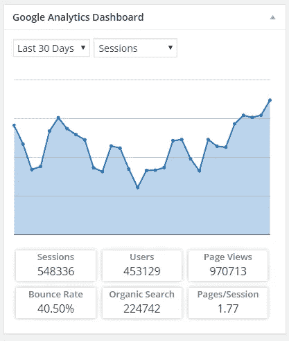**

**Google Analytics Dashboard**

**不像封闭的 CMS 系统，如 **Shopify 或 Wix，**你可以编辑和访问的内容受到限制， **WordPress 是一个开放的 CMS 系统**，在这里你可以编辑和访问一切！**

# **你不需要接触任何代码**

**WordPress 的设计使得你不需要接触任何代码，如果你不想的话。 **WordPress 主题**被**设计为**与 **WordPress CMS 接口**一起工作，因此它们可以通过 WordPress 后端和你的主题的内置**页面生成器**插入并提供它们的**功能**。**

**你可以从像 [**Themeforest、**](https://bit.ly/2zCXARa) 这样的市场上购买任意数量的**开箱即用主题**，这些市场对某些行业有特定的主题，也可以购买许多流行的**通用主题**，这些主题带有内置的**页面生成器**，并且**易于扩展**。**

**[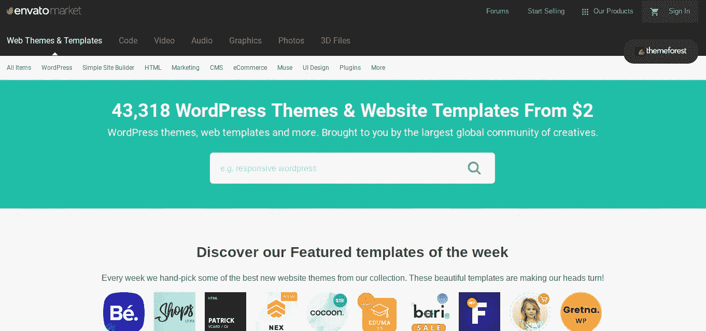](https://bit.ly/2zCXARa)

Themeforest marketplace for WordPress business themes** 

**一旦你购买了**主题，**你需要做的就是**上传并安装**压缩的 **WordPress 主题文件**到你的网站上。这将使你能够激活**并使用**内置的**模块和你的**主题**的页面构建器**，这样你就可以开始**构建你的网站而无需任何代码。****

**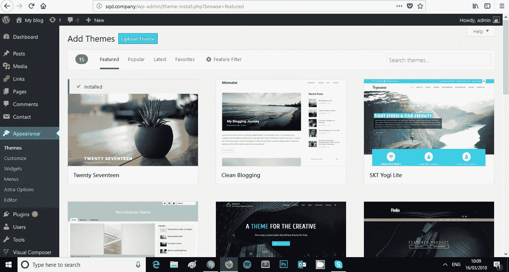**

**Uploading a Theme**

# **它是可扩展的**

**WordPress 是可扩展的。一旦你的流量达到一定水平，或者如果你想添加或解锁新功能，就像购买视频游戏一样，你不需要每月支付额外的 100 美元。**

**WordPress 通常会直接安装在你的**域名**上，你需要支付的只是你的**域名和主机**。你可以得到便宜的 WordPress 主机包，从每月几美元开始，随着你的扩展，你可以得到高质量的主机计划。**

**对于 WordPress 虚拟主机，我推荐 [**Siteground、**](https://www.siteground.com/go/squareinternet)**who**提供技术上优越的虚拟主机包和支持，是一个很好的起点。******

# ******扩展 WordPress vs Shopify******

******假设你想建立一个网上商店。让我们比较一下在 **WordPress** 开放的 CMS 上扩展在线商店和在 **Shopify 这样的封闭平台上扩展在线商店，例如**。******

****在你问之前，你肯定可以通过 **WordPress** 使用 [**Woocommerce**](https://woocommerce.com/?aff=6349) 建立难以置信的专业在线**商店。******

****他们甚至提供了一个免费的、漂亮的、功能丰富的电子商务主题，你可以直接**插入**到你的 **WordPress 网站**，然后直接在线销售。****

****但无论如何，回到 Shopify。****

# ****Shopify 的价格是多少****

****常规**[**Shopify 月计划**](https://www.shopify.co.uk/pricing) 每月花费你 79 美元，含税大概是每月 95 美元。这只是为了**实际存在于 Shopify 平台上。**因此，Shopify 的年成本约为**1140 美元**。******

****用 Shopify 自己的话说，如果你想使用**高级**计划，意在**扩展你的业务，**费用是**每月 300 美元**，所以**每月 360 美元**，每年**4320 美元**。****

****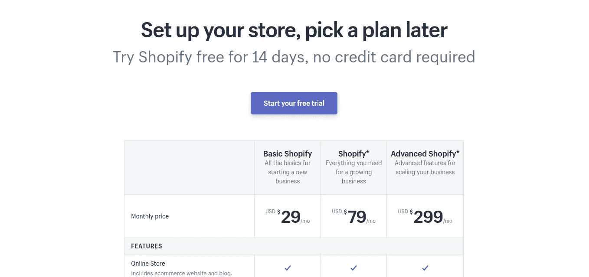****

****Shopify pricing****

****我希望你最终能够**扩大你的业务，**因为这对刚起步的小企业来说是一个严重的打击**,仅仅是为了获得一些通过像 **Woocommerce 这样的平台免费提供的功能。********

**这还不包括运营一家成功的 Shopify 商店所需的应用成本。在 **WordPress** 中，插件是一种**通常免费和开源的**为你的商店添加功能的方法。在购物时，大多数东西都要付钱。下面我概述了一个成功的 Shopify 商店的典型月应用费用。**

**$15 **补货提醒**
$15 **批量产品 Edi** t(因为在 Shopify 中批量编辑产品太可怕了！)
**15 美元【结帐英雄】**(在购物车中显示折扣或优惠券)
**7 美元**(应用程序控制客户看到哪些推荐产品)
**45 美元&送货**(应用程序提供店内提货或本地送货给客户)
**20 美元**粉碎图片(图像压缩以加速您的网站并确保高质量的图像不会显示出来)**

**另外每月 150 美元(T51)和 150 美元(T52 ),这些基本的东西大部分都是免费的。这些都不适合小型成长型企业的可伸缩性！**

**标准 Shopify 计划+基本应用的总成本=每月 245 美元或每年 2940 美元。**

# **相比之下，WordPress 的价格是多少**

**有了 WordPress，我们唯一需要付费的是我们的**域名、主机和主题。你的域名和主机是每年的固定费用，你的主题是一次性费用。****

**对于托管，如果我们使用我们推荐的托管合作伙伴****，那么如果您现在使用他们的 GrowBig 计划注册为新客户，托管费用大约为每月 7 美元。一个域名每年花费你大约 10-30 美元。******

******[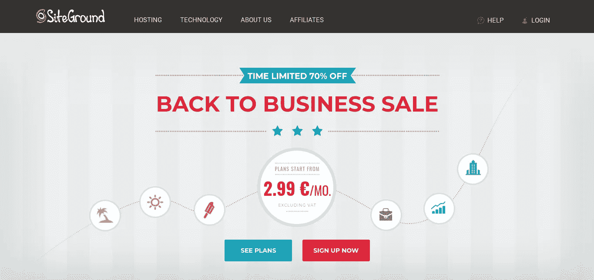](https://www.siteground.com/go/squareinternet)

Siteground Hosting****** ******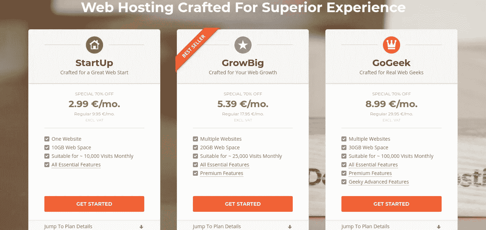******

******[Siteground Grow Big Plan](https://www.siteground.com/go/squareinternet)******

******我已经是一个 [**Siteground**](https://www.siteground.com/go/squareinternet) 的客户很久了，用过大部分的主流托管公司。它们是目前市场上共享主机的最佳选择。******

****他们有世界一流的客户支持(来自真正的开发者)，有成本效益，有快速的服务器，最新的 PHP 版本，运行在 CPANEL 上。****

****分类域名和托管后，我们现在只需要购买一个主题或页面生成器。我上面推荐了几个。例如，Divi 的价格是 80 美元，可以用来建立任何类型的网站，不需要代码。所以让我们算出我们的总成本。****

****从到**woo commerce 在线商店的总成本 WordPress =每年 80 美元+主机托管。******

****如果你想开一家网上商店，并选择[WordPress](https://wordpress.com/?aff=6349)with[**woo commerce**](https://woocommerce.com/?aff=6349)**而不是 Shopify，恭喜你，你每年为自己节省了几千美元。******

# ******缩放 WordPress 与 Wix******

******在**对比**中， [Wix 计划](https://www.wix.com/upgrade/premium-plans)实际上**相当便宜**，相当于为**托管**付费。******

****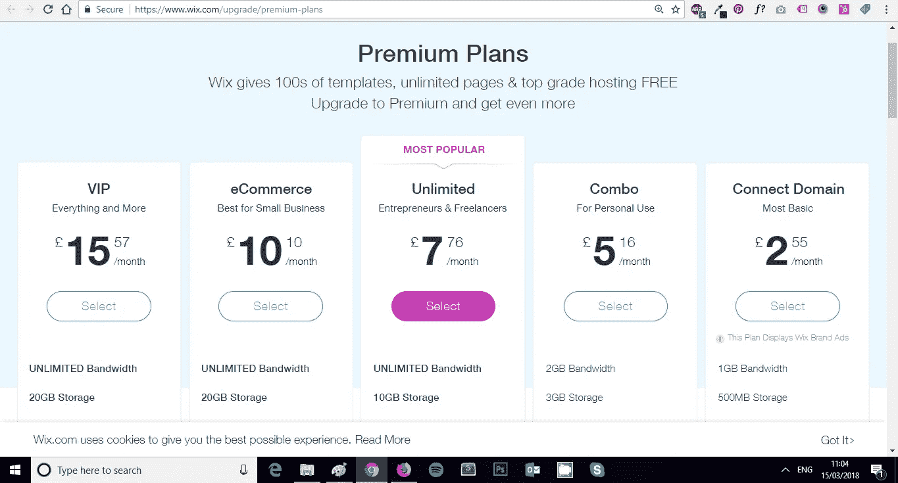****

****Wix paid plans****

****扩展 Wix 网站的问题是**功能有限**，Wix 对于可扩展的 SEO 来说是糟糕的[，尽管没有以前那么糟糕](https://moz.com/community/q/is-wix-still-terrible-for-seo)，设计**也不是很好。******

****不仅如此，你还被 [**禁止从 Wix**](https://www.wix.com/about/terms-of-use) **移动你的网站。根据 Wix 的**自有 Ts & C:****

****2.3.您同意并承诺不会:****

1.  ****复制、修改、创建 Wix 网站的衍生作品、下载、改编、逆向工程、模拟、迁移到另一个服务、翻译、编译、反编译或反汇编 Wix 网站****

****所以这种方式从一开始就消除了任何扩展 Wix 网站的方法。****

****如果你不能把你的网站从 Wix 平台**上移走，或者在其他地方复制类似的东西，那还有什么意义呢？******

# ****缩放 WordPress 与 Drupal****

****根据 [w3techs](https://w3techs.com/technologies/history_overview/content_management) 的数据，3.7%的网站使用 Drupal。****

****买一辆**法拉利**和坐公共汽车哪个更贵？我希望你不会花 20 万美元买车票。法拉利价格如此之高的原因是因为它是奢侈品，而且相对于丰富的资源来说是稀缺的。相对来说，周围没有很多。****

# ****WordPress 更便宜****

****相同的**论点适用于**和 **CMS 系统**。相对而言， **WordPress 开发者**丰富， Drupal 开发者**稀缺**。****

****这也是为什么一个开发人员越熟练，他们的需求就越大，他们得到的报酬也就越多，因为随着开发技能的提高，富足会减少。****

****看看 Freelancer.com**，**一个招聘自由职业者的热门市场。他们有一个专门用于 WordPress 的主页类别，还有一个专门为寻求 WordPress 帮助的人设置的[登陆页面。Drupal 和 Joomla 不见了。](https://www.freelancer.com/hire/wordpress/)****

****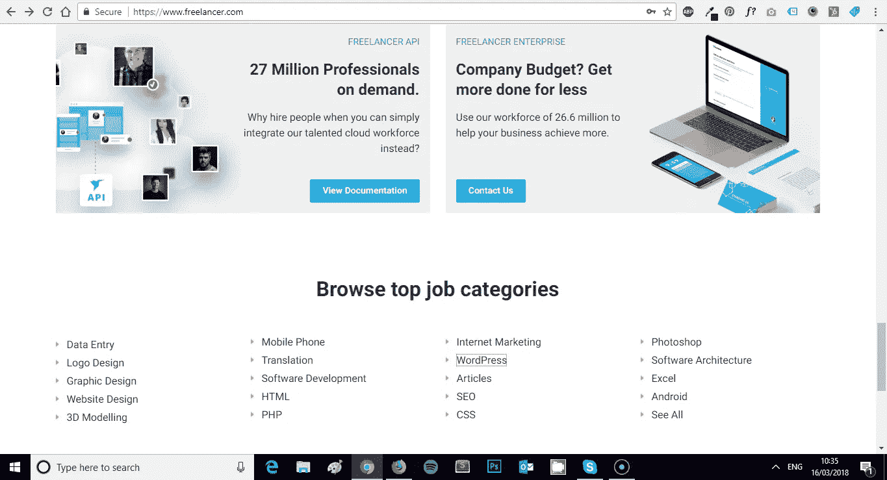****

****Freelancer.com (where’s Drupal and Joomla?)****

****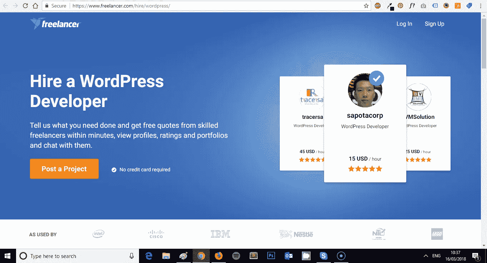****

****Wordpress landing page on Freelancer.com****

# ****WordPress 更具创新性****

****充裕不仅决定价格，还推动创新。要在竞争激烈的市场中生存，你必须**创新**或者**做一些与众不同的事情**，或者**比其他人做得更好**，才能保持增长。****

****我们已经看到了这一点，许多创新企业围绕着 **WordPress、**涌现，像[**woo commerce**](https://woocommerce.com/?aff=6349)**和**[**automatic**](https://automattic.com/)**许多流行的 WordPress 插件背后的母公司**。****

****作为一个平台，WordPress 有更好的集成、插件和增长工具，稍后会有更多的介绍。****

# ****WordPress 更容易使用****

****对于一个**非技术人员**来说，Drupal 更难使用。Drupal 被称为内容管理框架，而不是内容管理系统。如果你不是一个开发者，你几乎肯定需要一个人的帮助来建立和维护你的网站。****

****不要相信我的话，这是一位 [**Drupal 社区专家**在 Quora](https://www.quora.com/How-difficult-is-Drupal-to-use-for-someone-with-no-prior-programming-knowledge) 上说的话:****

****“好吧，如果您之前没有编程知识，可以借助 Drupal 的大量模块在 Drupal 上构建一个简单到低复杂度的站点。****

****然而，Drupal 更像是一个 CMF(内容管理框架)，而不是 CMS(内容管理系统)。记住这一点，当您开始创建自己的模块或定制 Drupal 以满足自己的需求时，Drupal 的真正力量就会释放出来。对于有复杂需求或迎合企业的网站，经常需要 PHP、HTML、CSS 和 JavaScript 的知识。****

****希望这回答了你的问题。"****

# ****缩放 WordPress vs Joomla****

****在权衡 **WordPress vs Joomla** 的时候，使用 WordPress 的理由和使用 **Drupal 的理由是一样的。******

******WordPress 是最用户友好的 CMS** ，由于大多数用 WordPress 建立网站的人都不是开发者，CMS 的全部目的应该是尽可能容易**建立一个干净、好看的网站**,可以随着你的业务扩展。****

****正如 WP 初学者所说:****

****“Drupal、Joomla 和 WordPress 都是很棒的内容管理系统。……然而，WordPress 凭借其易用性、庞大的全球社区、插件和主题击败了他们。我们认为大多数非开发者用户会发现用 WordPress 比 Joomla 或 Drupal 更容易构建。****

****WordPress 的成功在于其庞大的社区、插件以及高级主题所提供的惊人力量，鉴于它们所提供的大量功能，这些主题的价格低得令人难以置信。****

****安装一个构建好的主题，你就有了一张空白的画布来构建你想要的东西。****

# ****它可以快速构建****

****作为一个每天使用 WordPress 的人，我可以告诉你，使用 [Elementor Pro](https://elementor.com/?ref=2878) 这样的工具，可以很快地用**线框出新的网站。******

****作为一个**创业或新业务，**快速移动**并基于**数据**进行改进是关键。******

****在我看来，与其花费数千美元去获得一个完美的网站，不如用 WordPress 快速构建一些东西，并根据数据进行改进，这样会更有成本效益和效率。****

****尤其是对于初创公司，在未来的 6-12 个月内，你对客户和产品的所有想法都有可能改变，给你留下一个口袋空空如也的网站。****

****我们在 WordPress 上建立了自己的网站，在我们找到我们喜欢的风格和布局之前，它经历了几次完全不同的迭代。它仍然定期更新，有时甚至每隔几个月就彻底改变！****

****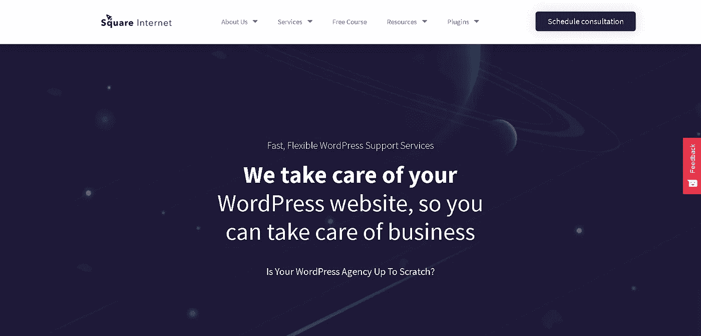****

# ****有反应了！****

****现在是 2018 年，所以到现在为止，你的网站肯定应该是**移动**和**平板友好的。**如果不是，加油！****

****没有理由在 2018 年没有一个**响应式网站，然而不知何故回到 2015 年，相对而言，并不是很久以前，只有 11.5%的企业有一个响应式网站，根据搜索引擎网站。******

****默认情况下，任何正确编码的 WordPress 主题都应该是完全移动响应的。购买之前，请务必阅读主题的说明。****

****我还没有看到一个好的**高级主题**不是响应式的，所以如果你做了功课，买了一个**好评如潮、推荐良好的主题**，你的网站将会使用响应式网页设计框架来构建。****

# ****有大量的免费教程和指南****

****由于 WordPress 拥有最大的 CMS 市场份额，它也拥有最大的**教程、指南和内容库**，这使得 [WordPress 的维护](http://wpstaged.com)也变得更加容易。****

****一些很棒的免费资源 **WordPress 教程和指南是:******

****[**WP 初学者**](http://www.wpbeginner.com/)****

****[**WPMUDev**](https://premium.wpmudev.org/)****

****[**WP waring**](https://wpwarfare.com/)****

****[**WPExplorer**](http://www.wpexplorer.com/)****

****或者，你可以观看我们的**免费视频课程—** [**如何建立一个 WordPress 网站**](https://squareinternet.thinkific.com/courses/how-to-build-a-wordpress-website)——其中包含我为小企业主、自由职业者和营销人员制作的 3 小时视频教程。****

****我们在这里为你做了艰苦的工作，把你需要的所有 WordPress 知识浓缩成一个容易跟随的视频课程。****

****

Enroll for free to access our video course — How To Build A WordPress Website**** 

****如果你更喜欢文字资源而不是视频内容，我也写了一个非常长的教程[如何建立一个网站——终极指南](https://squareinternet.co/how-to-build-a-website-ultimate-guide/),其中包含了很多建立 WordPress 商业网站的有用技巧。****

# ****它是为代表团建造的****

****整个团队都可以使用 WordPress。WordPress 自带了一个内置的**用户部分**，这使得**根据合适的访问级别**将访问权限委托给新用户**变得很容易。******

****例如，如果你想给你的**开发者**访问权限，他们可能需要**管理员权限**来访问网站的源代码。****

****这**与您博客**的**投稿人所要求的**访问级别不同，因此您可能希望**分配一个较低的权限级别。******

****如果你想看看中的**用户权限，看看我录制的这个简单的视频，向你展示如何在你的 WordPress 网站上创建一个新用户。******

# ****你能用 WordPress 构建什么？****

****有了 WordPress，你就有能力用 Woocommerce 构建简单如博客的**，复杂如多供应商市场的** [**。**](https://woocommerce.com/products/product-vendors/?aff=6349)****

****以下是你可以用 WordPress 做的一些事情:****

1.  ****建立一个**单页网站或登陆页面。******
2.  ****搭建一个**专业的商务网站。******
3.  ****建立一个**博客。******
4.  ****建立一个**登陆页面。******
5.  ****建立一个**销售页面。******
6.  ****建立一个[**作品集。**](https://colorlib.com/wp/best-portfolio-wordpress-themes/)****
7.  ****建立一份**简历。******
8.  ****建一个 [**目录网站。**](https://premium.wpmudev.org/blog/create-your-own-directory-site-powered-by-wordpress/)****
9.  ****用 [**Woocommerce**](https://woocommerce.com?aff=6349) **搭建一个**网店**。******
10.  **用 [**Woocommerce 产品供应商**](https://woocommerce.com/products/product-vendors/) **构建**多供应商市场**。****
11.  **用[**woo commerce Sensei**](https://woocommerce.com/products/sensei/?aff=6349)搭建一个基于**课程的在线学习平台**。**
12.  **用 [**Woocommerce 会员**](https://woocommerce.com/products/woomembers-bundle/?aff=6349) 搭建一个**会员订阅**网站。**
13.  **用 [**Woocommerce 订票建立一个**订票网站**。**](https://woocommerce.com/products/woocommerce-bookings/?aff=6349)**

**名单是**没完没了的**。你能想到的任何东西，都有可能有一个**插件、扩展**或一些开源代码来帮助你。**

# **它与一切融为一体**

**由于 WordPress 是世界上最**常用的 CMS，**它集成了**一切**(足够接近)。如果你想把某项服务整合到你的网站上，很有可能会有一个 WordPress 插件，或者至少是一个易于使用的 API。**

**例如，这里有一些最受欢迎的**服务**，这些**将**与你的 WordPress 网站**整合在一起:****

1.  **[**支付宝**](https://en-gb.wordpress.org/plugins/wp-paypal/)**
2.  **[**条纹**](https://en-au.wordpress.org/plugins/stripe/)**
3.  **[小清新 ](https://woocommerce.com/products/woocommerce-freshbooks/?aff=6349)**
4.  **[**Xero**](https://woocommerce.com/products/xero/?aff=6349)**
5.  **[**轮毂**](https://www.hubspot.com/integrations/wordpress)**

# **如果你不能集成它，你可以插入它。**

**还好那艘可怕的潜艇航向一旁，**外挂。****

**对于你**想要添加到你 **WordPress 网站**的其他东西，有一个**插件。******

**插件是中很大的一部分****到底是什么让 WordPress **如此伟大。********

**WordPress 将插件定义为:**

> **"插件扩展了 WordPress 的功能."**

**又短又甜，对吧？**插件**是**功能**的小魔法**盒子**，你可以将其安装在你的网站上，以添加**准备就绪** **功能。****

****例如，**假设您的网站需要一个**联系人表单**，但您目前没有该**功能。你可以从插件市场下载 [**联系表 7**](https://en-gb.wordpress.org/plugins/contact-form-7/) 并激活它。****

**我上周实际上在 [**上录制了一个相当长的视频，关于如何用联系人表单 7**](https://www.youtube.com/watch?v=Ccxbu3fFSY0) 创建 WordPress 联系人表单，我从不错过一个推送自己内容的机会所以，**来看看吧。****

# **有哪些类型的插件？**

**我很高兴你问了，因为我实际上为下面的 WordPress 准备了一个列表一些**最流行和最有用的插件**。**

## **谷歌分析**

**如果你不熟悉，**谷歌分析**是一个免费使用的平台，用于**测量**你的网站的性能。有很多免费插件**可以在你网站的每个页面上安装谷歌分析**，比如这个[。](https://en-gb.wordpress.org/plugins/google-analytics-dashboard-for-wp/)**

**如果你不确定你的**网站**上是否安装了 **Google Analytics** ，看看这个关于[如何检查你的](https://goo.gl/vfaP4R)网站上是否安装了 Google Analytics 的有用指南。**

## **Yoast SEO**

**Yoast 是一个管理你的搜索引擎优化的神奇插件。 [**尤斯特形容自己**](https://yoast.com/wordpress/plugins/seo/) 为:**

> **Yoast SEO 是一个一体化的 WordPress SEO 插件。这个插件为搜索引擎处理你的站点的完整的技术优化。它还通过提供可读性建议，帮助你写出访问者喜欢阅读的内容。”**

**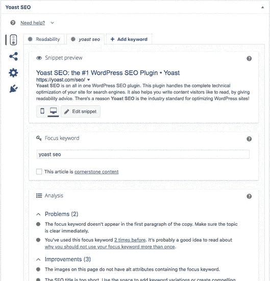**

**Yoast SEO — image by Yoast**

**听起来**牛逼**对吧？你可以在这里 **下载 [**Yoast 插件。**](https://en-gb.wordpress.org/plugins/wordpress-seo/)****

## **Mailchimp**

**Mailchimp 是**电子邮件营销**的市场领导者，所以当然，他们有一个 **WordPress 插件**，你可以在这里 [**下载。**](https://en-gb.wordpress.org/plugins/mailchimp-for-wp/)**

****插件**允许你轻松地将 Mailchimp **注册表单**嵌入到你网站的任何地方，这样你的网站电子邮件注册就可以与你的电子邮件营销平台无缝集成。**

**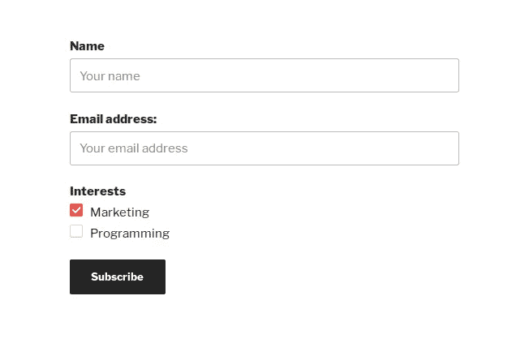**

**Mailchimp plugin — image by Mailchimp**

## **轮毂点**

**Hubspot 是一个一体化的营销自动化平台，几乎征服了这个领域。Hubspot 与 **WordPress** 很好地集成在一起，并且有一个易于设置的 **WordPress 插件**，它用自己的[的话](https://www.hubspot.com/integrations/wordpress)允许你:**

> **“HubSpot for WordPress 插件允许 HubSpot 客户和 WordPress 用户将他们的博客和网站与 HubSpot 的集客营销和销售软件相结合。”**

**你可以在这里下载 [**Hubspot 插件**](https://wordpress.org/plugins/hubspot-tracking-code/) **。****

**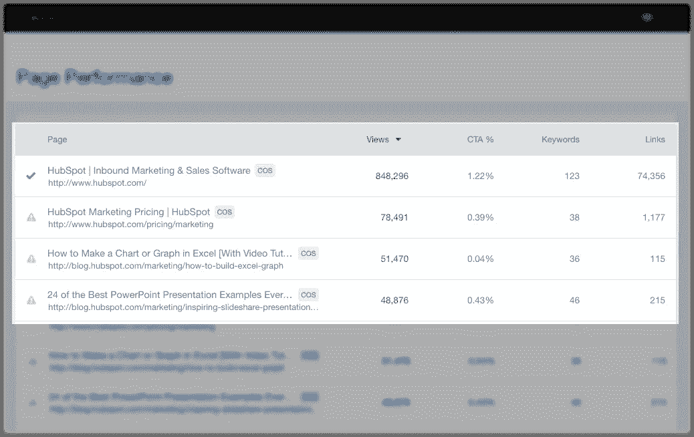**

**Hubspot — image by Hubspot**

## **忍者弹出窗口**

****弹出窗口**。爱他们，恨他们，他们似乎很受欢迎，必须工作。**忍者弹出窗口**是一个插件，允许你**构建**和**在你的网站上部署**弹出窗口(当然不需要编码)。**

**你可以在这里下载[忍者弹出窗口](https://codecanyon.net/item/ninja-popups-for-wordpress/3476479)。**

**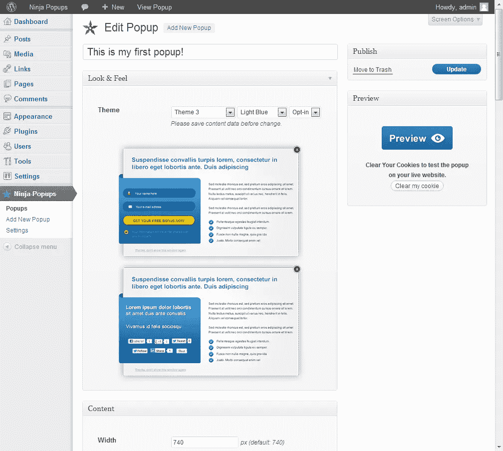**

**Ninja popups in action — image by Ninjapopups**

## **页眉和页脚**

**页眉和页脚是我最喜欢的插件之一。它为我的客户提供了一种**简单的方式**将**脚本**插入到他们网站的**页眉或页脚**中，而无需使用 PHP。**

**这对于**添加必要的跟踪代码**和**脚本**来**将**服务与你的网站整合特别有用。**

**你可以在这里下载[页眉页脚](https://en-gb.wordpress.org/plugins/header-footer/)。**

## **网络商务**

**我的最爱。使用 **Woocommerce 插件**可以在你的 WordPress 网站上免费**安装 **Woocommerce** 。 **Woocommerce** 用他们[自己的话说](https://woocommerce.com/?aff=6349):****

> **"一个完全可定制的开源电子商务平台."**

**你可以在这里下载 [Woocommerce 插件。](https://woocommerce.com/?aff=6349)**

## **Woocommerce 多语言(货币)**

**对 **Woocommerce** 的一个简洁的小扩展是**多语言插件**，它允许你用**多种语言和货币**为你的商店服务。**

**你可以在这里下载 WPML 插件。**

**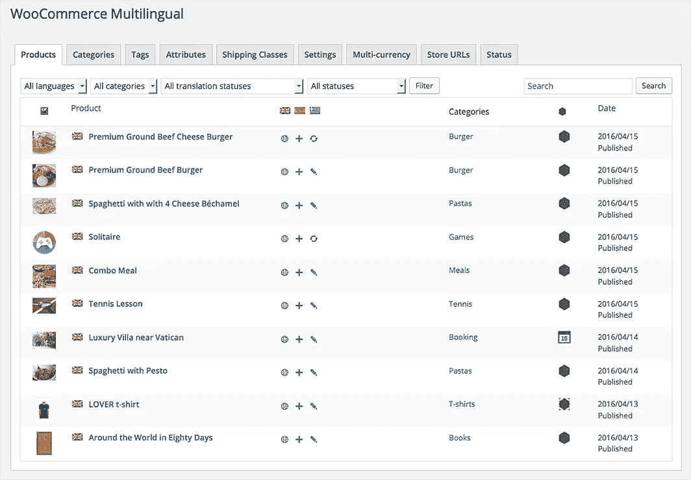**

**Woocommerce Multi Lingual — image by WPML**

## **波利朗**

**10 年前，用多种语言为你的网站提供服务的能力可能不会被一般的小企业所拥有。今天你可以使用像 Polylang 这样的**工具，它允许你在你的 WordPress 网站上为页面、帖子和媒体**分配多种语言。**

**你可以在这里下载 [Polylang 插件](https://en-gb.wordpress.org/plugins/polylang/)。**

**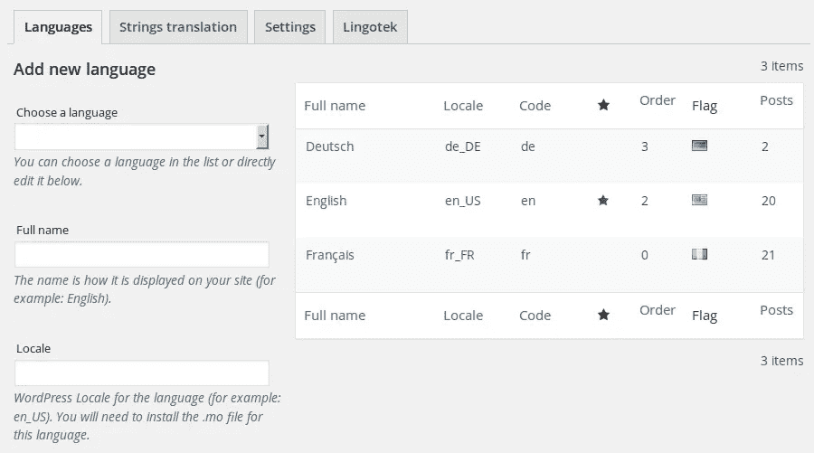**

**Polylang in action — image by Polylang**

## **成员压力**

**Memberpress 是一个易于使用的会员插件。你可以用会员制来建立**会员制订阅**网站。[按下](https://memberpress.com/)按钮:**

> **“MemberPress 将帮助你建立令人惊叹的 WordPress 会员网站，安全地接受信用卡，控制谁能看到你的内容，并出售数字下载
> ……所有这些都不需要复杂的设置。”**

**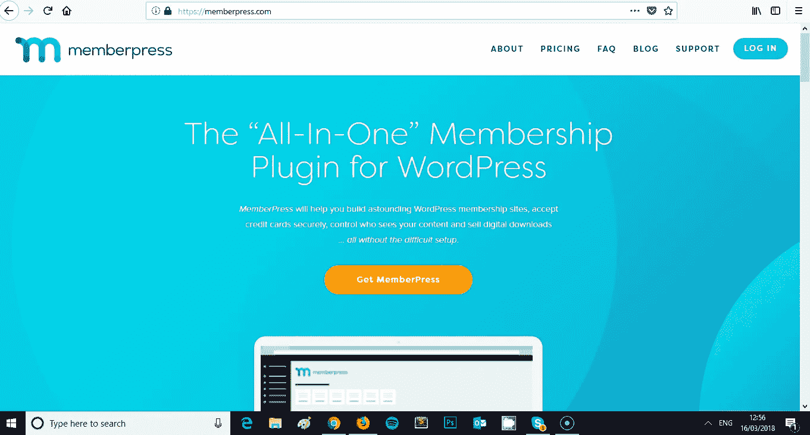**

## **W3 总缓存**

**缓存**通过减少网站内容和文件的下载次数来提高网站的性能**。W3 Total Cache 是一个流行的**缓存插件**，你可以把它安装在你的 **WordPress** 网站上来提高它的性能。**

**你可以在这里下载 [W3 总缓存。](https://en-gb.wordpress.org/plugins/w3-total-cache/)**

## **简单的社交分享按钮**

**每一个网站博客都需要社交媒体分享功能，如果你不使人们分享你努力工作的内容变得更容易，你还能怎样传播这个消息呢？**

**我已经尝试了相当多的**社交媒体**插件，目前我最喜欢的是 WordPress 的**简易社交分享按钮。它的价格是 19 美元，但是非常值得，因为你不希望一个又慢又臃肿的社交分享插件拖慢你的网站。****

**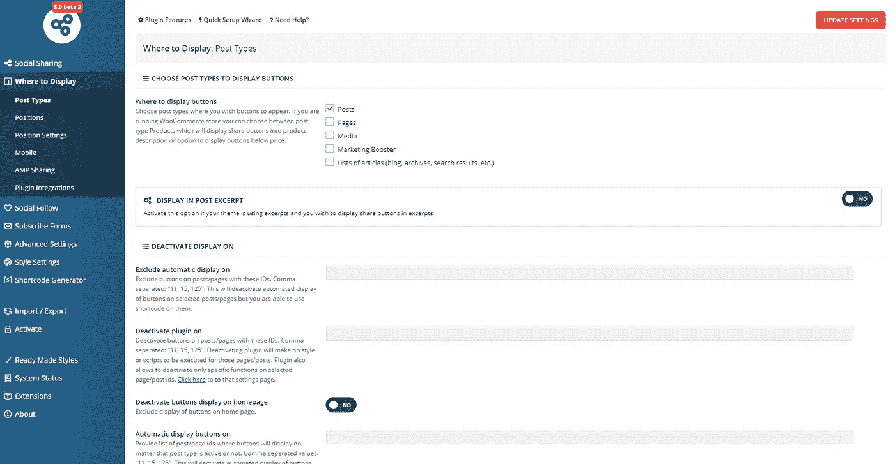**

**Easy Social Share Buttons — image by Easy Social Share Buttons**

**你可以在这里下载 [**简易社交分享按钮。**](https://codecanyon.net/item/easy-social-share-buttons-for-wordpress/6394476)**

## **阿基斯米特**

**Akismet 是一个免费的反垃圾邮件解决方案。 Akismet 有助于屏蔽评论和表单提交垃圾邮件，相当烦人。虽然是免费提供的，但是他们也接受捐赠，所以如果你发现这个插件很有用，并且在多个网站上使用，那就给他们适当的捐赠。**

**你可以在这里下载 Akismet。**

## **SumoMe**

**SumoMe 是一个流行的一体化营销解决方案**,用于发展你的 WordPress 网站。SumoMe** 为您的网站提供了一系列工具，包括**欢迎垫、** **列表生成器、社交分享按钮和智能栏。****

**可以在这里下载 [SumoMe。](https://sumo.com)**

**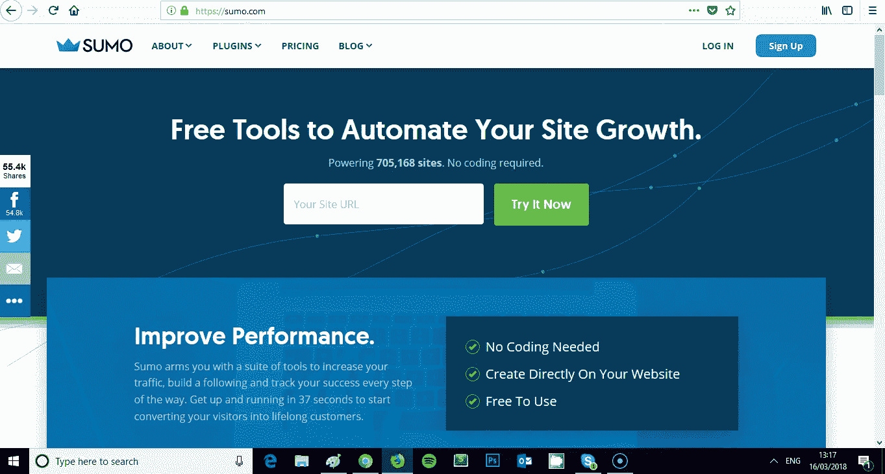**

**SumoMe — image by Sumo**

****

**SumoMe Popup — image by Sumo**

## **证明**

**一个真正有用的电子商务插件。[证明是](https://themetrust.com/proven/):**

> **" Proven 是一个易于使用的 WordPress 插件，它利用社会证明来增加你的转化率."**

**Proven 通过利用**社交证明的力量来帮助**提高销售额**。每个人都想要每个人想要的东西，但是没有人想要没有人想要的东西。****

**你可以在这里下载 Proven。**

**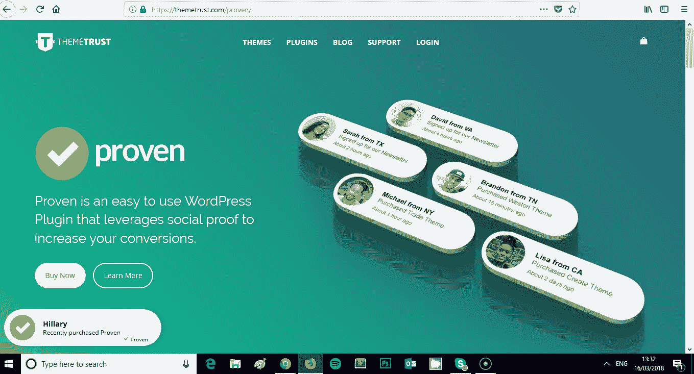**

**Proven ecommerce social proof**

## **Envira 画廊**

**Envira 是一个流行的图库插件，用于漂亮的响应媒体图库。Envira 把[自己描述为:](https://enviragallery.com/)**

> **“最佳高级 WordPress 图库插件”**

**你可以在这里下载 Envira。**

**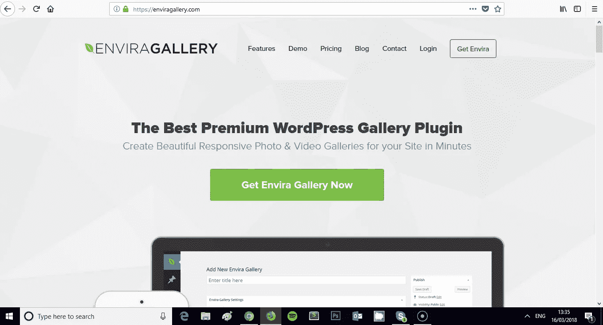**

**Envira Gallery WP plugin**

## **大型菜单**

**当你的网站需要一个简单的菜单之外的东西时会发生什么？进入 **Max Mega 菜单**，解决您所有复杂的菜单烦恼。 **Max Mega Menu** 提供了一个易于使用的**拖放**菜单生成器，它建立在 **WordPress 菜单系统之上。****

**他们甚至有一个简单的视频来解释它是如何工作的**

**Max Mega Menu in action**

**你可以在这里[下载 **Max Mega 菜单**。](https://wordpress.org/plugins/megamenu/)**

## **WP Smush**

**出于某种原因，smush 这个词总是让我想起那场泽西海岸秀。更简单的时代。**总之，** WP Smush 是一个**超级棒的**插件，用于在你的网站上**压缩**媒体。**

**大图片和视频会降低你网站的速度，不利于网站的可用性。**

**WP Smush 可以很好地插入你的网站，允许你批量压缩任何需要压缩的东西。**

**再次，我们很幸运有一个很酷的视频来解释我们的服务。**

**你可以在这里下载 [WP Smush。](https://wordpress.org/plugins/wp-smushit/)**

## **Wordfence 安全性**

**拥有一个设计精美的 WordPress 网站是一回事，但不保护它不受互联网上所有垃圾的影响是另一回事。 **Wordfence** 为您的网站提供防火墙和恶意软件安全保护，帮助阻止**恶意流量和感染**。**

**遗憾的是没有很酷的视频，但有很多有用的截图显示它在行动。**

**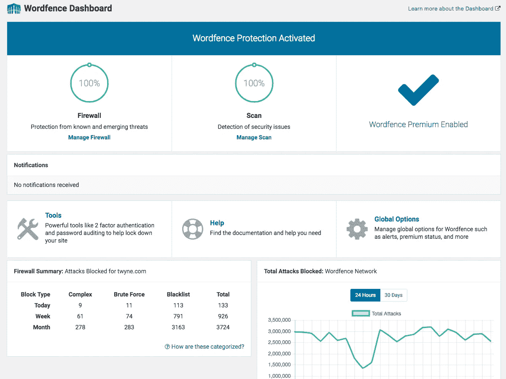**

**Image by Wordfence**

**你可以在这里下载 Wordfence。**

# **附属管理**

**市场上有一些针对 **WordPress** 的联盟管理解决方案，但是我喜欢 **Tapfiliate 的解决方案**的外观。管理分支机构曾经是一件非常困难的事情，现在小企业主通过 WordPress 就能掌握这件事，这一事实令人惊讶。**

****

**Tapfiliate Affiliate Management for WP**

**你可以在这里查看 [Tapfiliate。](https://tapfiliate.com/integrations/wordpress-affiliate-marketing/)**

# **更多酷的 WordPress 插件**

**如果这些对你来说还不够，这里有一些 WordPress 插件列表的**集合**，你可以浏览一下，看看是否还有其他对你的业务有用的东西。**

**29 必须有 WordPress 插件**

**[24 商业网站必须有 WordPress 插件](http://www.wpbeginner.com/showcase/24-must-have-wordpress-plugins-for-business-websites/)**

**[37 个你应该安装的插件，如果你还没有安装的话](https://premium.wpmudev.org/blog/essential-wordpress-plugins/)**

# **选择一个易于使用的 CMS，选择灵活性，可伸缩性，可负担性，可扩展性，丰富性，集成，插件，快乐的开发者，快乐的营销者，快乐的企业主，选择 WordPress。**

**我最近才看了《猜火车 2》,所以请原谅引用(它很好)。抱歉，我没有 WordPress 素材的剪辑。**

**但本质上，**参考听起来是真的**。出于以上所有原因，我建议你在 **WordPress** 的基础上进行构建，如果我在本文中设法帮助你对 WordPress 多了解一点点**并且**考虑将它用作 CMS** ，那么就我而言**是成功的**。****

**感谢您的阅读，如果您对 WordPress 有任何问题，请随时留下您的评论，我会尽力帮助您！**

# **对 WordPress 感兴趣？获取我的免费视频课程**

## **按照逻辑顺序的 3 小时免费视频教程，帮助你从头到尾建立一个 WordPress 网站。**

**

Enroll for free to get instant access to the course.** ****

## **这篇文章发表在 [The Startup](https://medium.com/swlh) 上，这是 Medium 最大的创业刊物，拥有 308，471+读者。**

## **在这里订阅接收[我们的头条新闻](http://growthsupply.com/the-startup-newsletter/)。**

****