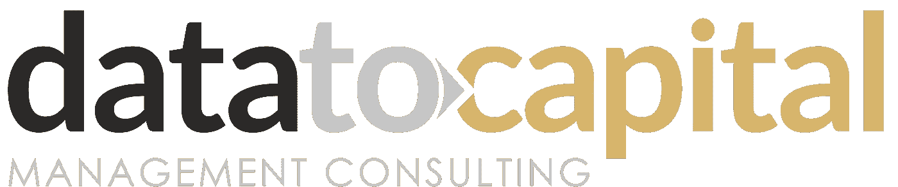

# 为什么首席执行官会寻求外部建议？

> 原文：<https://medium.com/swlh/why-would-a-ceo-seek-external-advice-b91484077e4>

不管是什么行业、产品线的构成还是公司的成熟度，经营一家企业都是艰难的……可悲的是，它远没有看上去那么有吸引力……

从自下而上的角度来看，身为首席执行官意味着最终要对所有日常管理决策以及公司长期和短期计划的实施负责。

然而，从自上而下的角度来看，首席执行官是董事会和公司管理层之间的直接联络人，代表管理层与董事会沟通。

> ***在大多数情况下，首席执行官对业务了如指掌，可能已经花了几个月/几年的时间来建立一个强大的管理团队。那么，一位首席执行官究竟为什么要寻求外部建议呢？***

首席执行官对公司的成败负全部责任，但事实上，他无法控制许多决定结果的因素。他需要在一个充满不完美决策的漫长旅程中航行，保持良好的状态和务实的态度，并知道如何为了公司的利益而改变现实。他还必须知道在组织内部和外部提出好的问题，知道如何解读和整合矛盾的信号，知道如何快速建立和取消计划，知道如何雇佣和解雇员工，而技能列表实际上非常长…

**以下是从我们的 CEO 客户那里收集的部分项目后调查理由摘录**

# 获得新的视角

对业务了如指掌有其“硬币的另一面”效应。当深入日常运营或总是被同一批人包围时，首席执行官很可能看不到创新机会。他们会倾向于重复他的次优例行程序，以如何解决过去遇到的特定问题。让一些人参与进来，可以对已知的问题有一个新的看法，并就如何解决一个给定的问题提供一个新的视角，这肯定会是一个真正的推动，甚至会给一个计划注入新的活力。

# 与一个不参与公司日常政治且没有议事日程的人一起工作

从经验来看，与顾问合作时，达到正确的信任水平可能需要一些时间，但对于首席执行官来说，能够说出真相(大写的“T”)，没有摩擦或不必要的故事，无论多么丑陋，不仅是高潮(不少)，而且是真正映射解决方案空间中所有现有备选方案的关键。能够把一个具体的问题和它的所有含义分离出来，并让你信任的人知道，他们不会对你评头论足，这就解决了问题的一半。此外，在某些情况下，首席执行官需要处理敏感话题，如继任、重大重组和项目重组，或者如何重振高管团队，出于显而易见的原因，这几乎会涉及其下属，甚至是部分下属。

# 不需要管理顾问

从长远来看，在一个特定领域与一个聪明能干的顾问一起工作可能会很有趣；你只关注一件事:获得你需要的价值…你不必关心职业发展、激励计划、正式的绩效评估或与同事的个人冲突…锦上添花的是，你不必通过繁琐的官僚程序来让他/她加入或终止合作。

# 一个停止日常工作，进行战略性思考的借口

有时候，外部顾问只是一个必要的借口，让你走出办公室，理清思路，把所有的脑力集中在一个特定的任务上，这样你就可以做出决定。该顾问可用于初步数据收集和促进决策过程。例如，我们为之工作的一位总经理坚持要在我们特拉维夫的办公室举行每周一次的会议，尽管他必须开车 40 分钟。

# 在预先确定的时间段内利用外部功能

在某些情况下，首席执行官和他/她的管理团队不具备解决特定问题的专业知识。别担心…没有人知道全部…这也是降低首次或异常公司事件的执行风险的常见做法:第一次收购…第一次处理新法规、IPO、退市事件等…

# 更快地处理不愉快的流程，例如裁员

大多数时候，外部顾问不会情绪化地参与到这个过程中，他可以帮助你照照镜子，迅速做出痛苦的决定。就执行而言，在重组或裁员过程中，快速行动是减少公司痛苦的决定性因素。

# 被告知你走错了路

假设你雇佣了一个不相信“客户永远是对的”的好顾问，尽管你付钱给他，顾问还是会告诉你他认为你错了。就我个人而言，这种情况发生过很多次，我告诉我的高管客户，尽管他们最初表达了自己的观点，但我认为最符合他们个人利益的是什么。如果顾问能够向你展示支持他观点的数据，你可以节省大量的金钱、时间和精力。由于群体思维和他们的个人议程，你的直接下属不会有太多争斗。这显然取决于文化…我有机会与许多国家合作…例如，在以色列，人们会说出他们的真相，不管你想不想听😉。

# 在你可能无法从你现有的经理那里要求的一段压缩时间内获得很长的工作时间

这种关系的短期性质可能有其好处。在这方面不要太用力😉。

总之，作为一名首席执行官，在商业领域，时间永远不会站在你这边。能够利用值得信赖的外部顾问可能是一个真正的游戏规则改变者，可以更快地产生您正在寻找的出色结果。

了解更多@【https://datatocapital.com/services/ 

**关于我们**

[DataToCapital](https://datatocapital.com/) 是一家精品管理咨询公司，为在以色列运营的全球一线公司和初创公司提供支持，帮助他们实现卓越和市场主导地位。我们为首席执行官、高管(副总裁及以上级别)和企业家设计的核心服务可分为三个领域:市场情报、企业和产品战略，以及对自上而下战略计划的执行支持。我们在上述三个领域提供的服务质量相当于贵公司从在以色列市场运营的前三大咨询公司获得的服务质量，但问题是，为什么我们的一级客户认为我们更优秀。

我们不仅提供明智的建议，我们还与管理团队密切合作，并在幕后或作为代理支持推动他们的战略计划的执行。

我们正处于商业和技术的战略交汇点。由于我们丰富的背景，我们知道如何连接两个世界之间的点，以及如何在先进技术解决方案(机器学习、大数据、数据可视化、企业软件解决方案和我们工具箱中的许多其他工具)的帮助下，在扰乱商业模式或解决次优流程方面极具创造力。

这是一个内置功能。没有客户经理，没有复杂的沟通链，等等…这就是为什么我们公司的目标是用不超过八个人才来主导以色列的管理咨询市场。

我们的长期愿景是成为在以色列运营的最具影响力的企业和机构的值得信赖的顾问，并帮助他们成为所在市场的全球领导者。

# DataToCapital 咨询公司是以色列先进技术产业(IATI)协会和以色列董事联盟的积极成员

## 这篇文章发表在 [The Startup](https://medium.com/swlh) 上，这是 Medium 最大的创业刊物，拥有 283，454+读者。

## 在这里订阅接收[我们的头条新闻](http://growthsupply.com/the-startup-newsletter/)。

