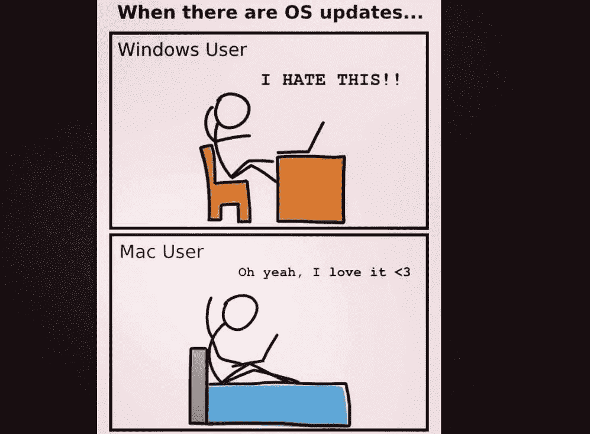
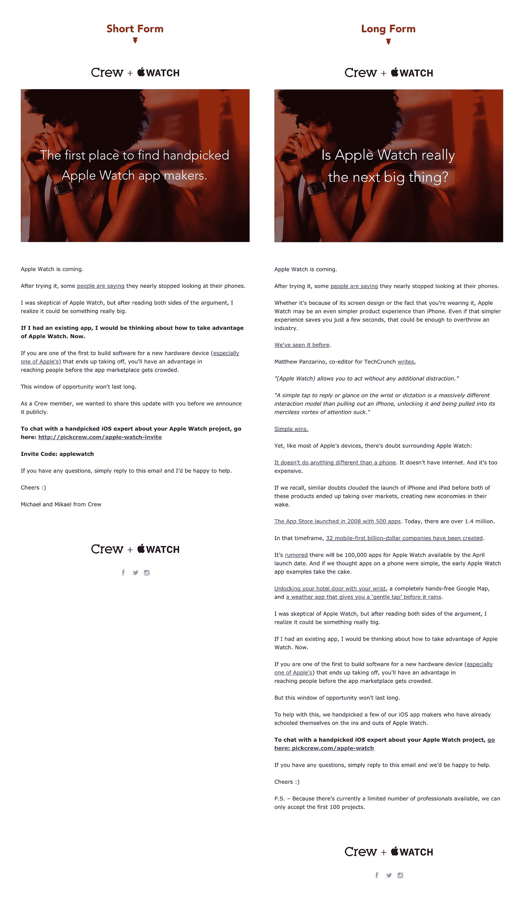
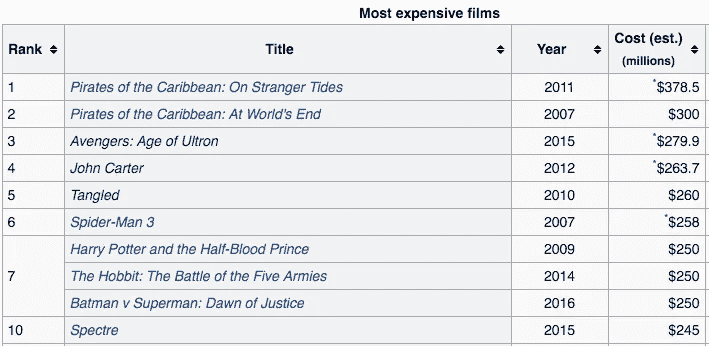
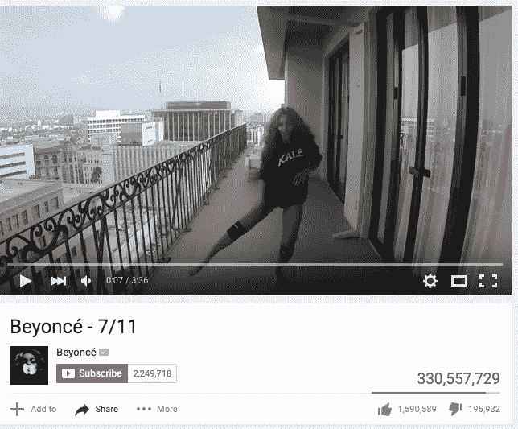

# 为什么不需要苹果那样的设计

> 原文：<https://medium.com/swlh/why-you-dont-need-design-like-apple-a2e6f17064fb>

## 真实与美丽

苹果证明了美不仅仅是作品。它很畅销。

通过结合设计和技术，苹果从一个爱好者的利基品牌发展成为有史以来最有价值的公司之一。

他们成功后，许多公司纷纷效仿，提高设计水平。

如果你不能打败他们…

我们花时间使用的许多产品——我们的手机、笔记本电脑以及附带的软件——最初都是由苹果公司设计的，或者至少是受其启发。随着苹果创建和管理应用商店，软件行业的很大一部分现在需要有“苹果批准”的设计才能生存。

对于设计和美丽，我们作为消费者的期望比以往任何时候都高。产品竞争的未来将越来越取决于深思熟虑、令人愉悦的设计所带来的情感。

作为设计师，我很欣赏这种对设计的关注。

我看着我的笔记本电脑屏幕，图标看起来像糖果。

我流畅地浏览我的应用程序，一路上从精心设计的过渡中获得快感。技术的视觉美感与 10 年前相比有了很大的不同。

过去，电脑给人的感觉就像你在玉米地里的迷宫中导航。不确定性无处不在，直到你最终找到完成某件事的途径。

然而，尽管这种对设计的关注给我们带来了好处，但这种对视觉效果的关注也是有代价的。

在我们对像苹果这样的公司的设计和营销的崇拜中，我们这些创造者忽略了一种更有力的方式来向世界展示我们的想法。

因为我们已经看到了产品设计中视觉美感的结果，我们希望在我们的品牌信息中对视觉美感的这种关注会有同样的效果。

我见过一些公司花费数万到数十万美元来完善一个网站、电子邮件或广告的视觉设计，同时花费最后几个小时来撰写将构成该设计的文字。

我们对视觉设计的强烈关注会让我们忽略信息中最重要的部分:故事。

# 选择实质重于风格

我们已经亲身体验过了。

一年前，我们发出了两个版本的电子邮件活动。

一封电子邮件严格遵循了一封设计良好的电子邮件的外观原则:

*   没有太多的话
*   一个巨大的，吸引人的图像
*   明确的行动号召

另一个版本采取了不同的方向。我们把它写得好像在给朋友讲故事一样。它打破了所有规则:

*   邮件很长
*   在你进入主要的行动号召之前，有 11 个链接
*   行动号召被埋在了最后

以下是[的结果](http://backstage.crew.co/does-size-matter-what-we-learned-launching-our-apple-watch-landing-page/):

尽管我们的“不那么漂亮”的电子邮件打破了许多规则，但较长的故事版本的点击率几乎是较短版本的三倍。

虽然这个例子是有限的，因为它仅限于我们社区中可能更喜欢以故事为导向的方法的人(因为这是我们通常的风格)，但它支持了我们的直觉，即美丽并不总是最好的。

更加真实(比如像对朋友一样讲述我们的故事)会产生比我们想象的更大的影响。

# 皮克斯的一个教训:这不是关于动画，这是关于故事

在所有的创作领域，都有同样偏好一个好故事的例子。

1995 年，皮克斯发布了第一部电脑动画长片《玩具总动员》。当*玩具总动员*继续打破票房纪录的时候，皮克斯却有一个艰难的开始。

[《星球大战》导演乔治·卢卡斯在《玩具总动员》*拍成*](http://movies.about.com/od/animatedmovies/tp/5-pixar-facts.htm)之前卖掉了他在皮克斯的股份，皮克斯差点破产(讽刺的是，如果不是苹果创始人史蒂夫·乔布斯介入投资)。

电影业认为主流观众不会在乎去看动画长片。

他们忽略了故事的力量。

尽管动画是其核心，皮克斯团队知道他们的成功最终将取决于一件简单的事情:他们讲述一个好故事的能力。

皮克斯的联合创始人之一艾德·卡姆尔[在他的畅销书*创意公司*](http://www.amazon.com/Creativity-Inc-Overcoming-Unseen-Inspiration/dp/0812993012) 中写道。关于他的公司的创作过程:

> “尽管你在艺术上投入了很多心血，但如果你没有把故事讲好，视觉上的修饰通常并不重要。”

皮克斯公司的 16 部电影中有 8 部获得了奥斯卡最佳动画电影奖。皮克斯的每一部电影都登上了各自年度最赚钱电影的前十名。

没有其他工作室能达到这个点击率。

讲述一个好的故事，无论是通过电子邮件、电影还是任何媒体，都能创造一种联系。正是这种联系导致了关注，导致了信任，导致了销售。

正如皮克斯早期意识到的，如果你的故事是好的，你可以摆脱较少的视觉效果。但是反过来并不总是正确的。

举个例子，如果我们看看有史以来最昂贵的十部电影，每部电影的平均制作成本是 2.74 亿美元。

根据烂番茄，这些电影的平均排名是多少？59%

(评分最高的电影是迪士尼/皮克斯出品的*纠结*90%)。

与此同时，皮克斯电影的平均成本为 1.45 亿美元，评论家和观众的平均评价为 89%。

更能说明问题的是，如果我们从排名前十的恶评电影中抽取一些影评人的共识，你会注意到，影评人很少说动画质量或特效是他们给出恶评的原因。

他们列举了这个故事的问题:

> “……这部《海盗》搁浅在一个支离破碎的情节和一系列嘈杂的动作场景中。”——[陌生人潮上的加勒比海盗回顾](http://www.rottentomatoes.com/m/pirates_of_the_caribbean_on_stranger_tides/)
> 
> “……混合了太多的人物和太多难以理解的情节线索。”—[加勒比海盗 3](http://www.rottentomatoes.com/m/pirates_of_the_caribbean_3/) 回顾
> 
> “虽然《异星战场》看起来棒极了，并提供了它应有的令人兴奋的部分，但它也有节奏不均匀，偶尔难以理解的情节和人物塑造的问题。”—[异星战场](http://www.rottentomatoes.com/m/john_carter/)回顾
> 
> “……一股由效果驱动的可怕旋风。”—回顾[蝙蝠侠大战超人](http://www.rottentomatoes.com/m/batman_v_superman_dawn_of_justice/)

虽然其他制作人可能有预算制作像皮克斯一样视觉震撼的东西，但他们没有提升自己的故事。

我们可以让一些东西看起来很漂亮。但是如果漂亮不能讲述一个好故事，那也没关系。

# 为什么美丽并不总是有用(尤其是今天)

就像你的产品设计不能只靠美，你不能只专注于美来讲你的故事。

精心设计的信息首先要讲述一个好故事。

正如我们在电子邮件活动的例子中看到的，一个故事足以战胜一个打破所有规则的电子邮件设计。

你可能没有苹果的营销预算(今年 12 亿美元)或设计能力。不过没关系。有时候苹果级别的美颜并不是展现你故事的最佳方式。有时甚至会让事情变得更糟。

在 BBC 最近发表的一篇文章中，夏洛特北卡罗来纳大学的研究人员回顾了关于“太漂亮”是否有缺点的发现。

研究人员发现了几项研究，包括 1975 年的一项研究，该研究发现人们倾向于在小路上远离美女。从约会网站 OKCupid 的个人资料照片中发现了类似的行为。拥有“普通”头像照片的男性比拥有“最有魅力”头像照片的男性获得了更多信息。

研究人员认为这种行为可能是因为吸引力传递了力量。因此，人们觉得他们需要更加尊重一个有魅力的人，并与他保持距离。

这些例子说明美丽可能适得其反。如果某样东西太漂亮了，它会被认为不太容易接近，进一步疏远你想要接近的人。

类似地，像美国之鹰这样的服装品牌最近在停止 photoshopping 模特后，发现[的销售额增加了。](http://www.adweek.com/news/advertising-branding/when-lingerie-brand-stopped-photoshopping-models-sales-went-through-roof-161224)

太多的美丽可以被视为一种销售策略。尽管我们可能会被看起来不错的东西所吸引，但我们也对被推销有着强烈的潜意识厌恶。

而且这种厌恶感越来越强。

首先，由于互联网和像脸书这样的在线网络的力量，我们有更多的机会获取信息，这意味着我们看到更多的坏事。

例如,《T4》是烂番茄有史以来排名最高的纪录片，前 10 名中有 4 部是关于不公正或腐败的故事，它们都是自 2005 年以来制作的。

每部手机都变成了媒体设备。故事传播很快。虽然世界上发生了很多好事，但腐败和不信任的故事往往会浮出水面，因为它们吸引了我们的注意力。

信任度处于历史最低点。正如 2013 年《今日美国》民意调查显示的那样，三分之二的受访美国人表示他们怀疑他人。这是自 1972 年首次调查以来不信任率的两倍。

我们已经变得对胡说八道过敏了。我们对一切越来越缺乏信任，包括美。

美可以被感知为一层扯淡，让人觉得自己是被卖去的。

正如这项研究的首席研究员之一所说:“如果你对吸引力着迷，它可能会改变你的体验和互动。”

正是如此。

如果我们过于关注信息的视觉吸引力，人们对我们的故事的体验可能会受到影响。

# 信息的增加；注意力下降

除了我们天生厌恶被推销之外，我们已经被争夺我们注意力的事物弄得超负荷。

在过去的十年里，随着世界主要在网上移动，信息开始在任何地方攻击我们。这些信息很聪明。有了广告牌，我们可以把目光移开。有了电视/收音机，我们可以把它关掉。但是今天的信息与我们用来交流的所有工具都有联系。由我们信任的人带给我们。

> “如果我们过于关注信息的视觉吸引力，人们对我们的故事的体验可能会受到影响。”

脸书。推特。电子邮件。手机。笔记本电脑。平板电脑。通知从各个角度向我们飞来。因为今天的信息是以比特和脉冲的形式出现的，它们便宜、有效，而且容易传播。

面对如此多的信息，我们只有两个选择:

要么我们尝试消费一切(这是不可能的)，要么我们过滤(即我们不再关注很多东西)。

由于我们不能消耗所有的东西，我们已经成为过滤专家。过滤掉垃圾。过滤掉任何看起来一点都不可信或者有一点点推销暗示的东西。

[引用多白金音乐人蕾哈娜](http://www.harpersbazaar.com/celebrity/latest/news/a12541/rihanna-on-instagram-being-single-and-success-t-magazine/)的话:

> “我的粉丝在很远的地方就能闻到谎言。我不能欺骗他们。”

我们的大脑实际上已经发生了变化，以适应当前的信息过载。

微软最近在加拿大进行的一项[研究](http://cl.ly/2n2G0K0e0l0R)发现，自 2000 年以来，我们的注意力持续时间下降了四分之一，从 12 秒下降到 8 秒；比金鱼的注意力持续时间还短。

有一种普遍的疲劳正在发生。我们被迫成为 B.S .检测专家。

虽然随着数据的增多，广告和营销可能变得更漂亮、更好，但我们在过滤方面做得更好。抗拒。

这是一场军备竞赛。作为创造者，我们似乎注定会失败。没有人会在乎我们要说什么。

但我们没有。有一个简单的解决方案。

# 解决方法很简单，你已经知道怎么做了

当你看到一封朋友发来的电子邮件，说:“嘿，我们周一一起喝杯咖啡吧。你在吗？”它贯穿一切。

尽管它打破了写作的所有标准:没有大写字母，没有标点符号。它抓住了你的注意力。你先接。为什么？

首先，这条信息来自你信任的人，这是一个很重要的因素。但是，增加你对信使的信任的是你知道来自人类的信息。不是机器。

没有花哨的标题、图形或文字，让你感到安全。你没有被耍。你可以放松一下警惕。

有大量的结果支持你不需要视觉美感来与人交流。

多白金音乐人碧昂斯在她的 YouTube 频道上观看最多的音乐视频是她的歌曲 7/11。即使碧昂斯的许多音乐视频具有很高的制作质量，但 7/11 是用低质量的视频拍摄的。然而，它的表现超过了其他碧昂斯的视频。

Kelly Starrett 是一名物理治疗师和教练，他在 YouTube 上有一些最受欢迎的健身视频。他用车库里的手机录制了大部分视频，没有专业设备。

凯利的一些视频甚至显示他的女儿不小心走进来，在剪辑中出现了“错误”。

凯利本可以编辑掉这些东西，但是因为它们被保存在了里面，我感觉和他有了更深的联系。这些“错误”让我觉得凯利是一个人，他没有试图出售我。好像他是我的一个朋友，在他的车库里想出了一些东西，他发了一个视频给我看。

他有孩子，一只狗，一个有点乱的车库。他和我一样拍摄低分辨率，未经编辑的视频。我能理解。他的视频不是最高质量或最好的镜头。但是他们拥有的是我见过的最好的健身教练。他们有实质内容。所以我信任凯莉。当我寻找健身技巧时，我首先搜索凯利。凯利写了一本书，我就买了。

也许如果碧昂斯和凯莉使用专业设备拍摄这些视频，收视率会增加，但他们以原始形式拍摄这些视频的方式在一定程度上使他们有吸引力。这些视频让碧昂斯和凯莉看起来平易近人，令人产生共鸣。

喜剧演员路易斯·C·K 在他写的电子邮件中也做了类似的事情。

路易斯发送电子邮件简讯，感觉就像他只是在给你写信。有些有拼写错误或不正确的标点符号，但这是他们的一部分。我不在乎那些语法错误。事实上，我喜欢他们。这让我觉得路易只是在和我说话，就像和朋友说话一样。

这里有一个例子:

一次又一次，我们看到故事的实质比它的外表更重要。

我们不需要美貌来联系人。当我们感觉到有人对我们“真实”时，我们大脑抵制影响的自然冲动就会平静下来。

你的信息需要的是真实性。你独特的方式来分享你的信息及其所有的瑕疵和不完美的句子。

真实不代表美好。

真实性意味着实质。意思是别废话了。

虽然视觉美感很重要，但它不是将人们与你的信息联系起来的唯一因素。

如果你想让任何人信任你。来关注你。也许有一天会从你这里买。你最好的选择是消除你信息中的所有障碍。听起来更像你和朋友说话时的声音。听起来像另一个人。因为“只是另一个人”比一个公司更容易引起共鸣。

真实性是强大的。很简单。我们都已经知道如何去做。

我们只是有时需要一个提醒，真实是可以的。即使是在生意上。其实，**尤其是涉及到商业**的时候。

当你想到我们公司时，把它想象成一个人。一个品牌听起来应该像一个人，而不是一家公司。无论是一个网站、一封电子邮件、一条推文还是一则广告，所有的东西都应该让人感觉是来自一个人。因为确实如此。

你可能认为你需要使用行业词汇，因为你认为你需要听起来像一个“行业领袖”，或者你觉得你需要注意你所说的话，这样你就不会冒犯合作伙伴、投资者或客户。

或者在某些情况下，可能有超出你控制范围的法律或公司政策原因，要求你忍住不说你真正想说的话。但是你越接近你真正想说的话，你的信息就越容易联系起来。

也就是说，我知道，当我们被训练成认为我们需要在专业运营时发出某种声音时，将业务从信息中抹去有多难。我做的一件事就是为脸书邮报上的任何公司公告打草稿。

在脸书直接写信息的背景有些改变了我的大脑，让我写得像是在给朋友写信。

有时候，我们可能会过分强调一条信息，因为我们用来写这些信息的工具让我们觉得赌注更高。用专业工具写作巧妙地告诉你的大脑，“嘿，这很重要，因为你是在你的 WordPress 后端写的，所以要小心。”这会扼杀你的个性。

试着降低赌注。使用工具写下你的重要商业信息，这样你就可以与朋友和家人交流。我敢打赌你的个性会流露出来。

你向朋友解释你的公司的方式就是你应该向世界解释它的方式。如果你只是因为对其他人有效而过于正式，你听起来会像其他人一样，你会被忽视。

我们都是人。即使穿着西装。

做一些漂亮的东西是好的，只是要确保这种美与物质搭配，因为光有美是不够的。

如果你必须在让东西更漂亮和让信息更真实之间做出选择，选择信息。

没有故事，你将一无所有。没有故事，人们会对你失去兴趣，即使你花了几十万或几百万美元让你的故事看起来很美。

展示你的不完美比假装完美更好。

人们比以往任何时候都更期待直接沟通。Instagram、Twitter 和 Snapchat 等新的交流平台甚至更注重原始的直接联系。

尽管互联世界向我们展示了很多不好的东西，但这种联系是一个独特的机会，可以分享你的信仰，并与大规模的人联系。将您的故事传达给这么多合适的人从未如此容易。

你可能认为你需要美来创造影响力，但你不需要。真实性更强大。真实性是平易近人的。它创造了联系。

真实是你能做的最美好的事情。