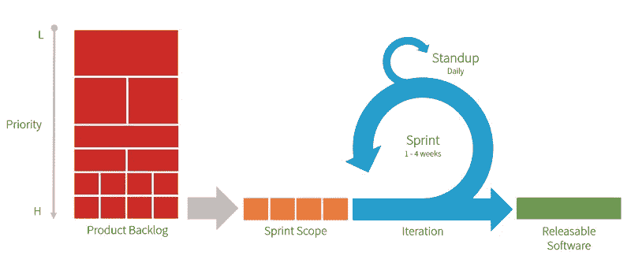

# 为什么你要么喜欢 Scrum 要么不喜欢

> 原文：<https://medium.com/swlh/why-you-either-like-scrum-or-you-dont-200cc9f388ae>

Scrum is effective — if you use it effectively

自从 Scrum 发明以来，它接管了大多数组织的项目管理方法。

最近，我听到很多人抱怨 Scrum，我感觉有些人要么 ***喜欢 Scrum，要么*** 不喜欢 Scrum，这在项目参与者之间造成了隔阂。不得不说，程序员和项目经理之间，或者程序员和公司管理层之间，不一定有差距。更有趣的是，无论来自哪一组利益相关者，双方的 ***总是相似的*** 。那么，这个差距来自哪里呢？

我将分析两家公司的主要论点。支持 Scrum 的一派说 ***在开发中更敏捷******在项目期间更快出成果*** 。反 Scrum 派谈到了对程序员的微观管理和更少的自由。

The Scrum Process — Source : [https://www.devbridge.com/articles/how-to-set-up-dual-track-scrum-in-jira/](https://www.devbridge.com/articles/how-to-set-up-dual-track-scrum-in-jira/)

等等什么？一方感知到更多的自由而另一方没有？

这直接把我们带到了问题上。Scrum 并不总是 Scrum。

首先，每个组织或更好的项目团队似乎都创建了自己的 ***规则集*** 来实现 scrum。此外, ***敏捷宣言*** ，也就是基本规则，在每个 scrum 项目中似乎都有不同的用法。

这就是为什么人们以不同的方式看待 scrum，我想说为什么一些 scrum 项目不如传统方法有效率。

最终是否使用 Scrum 应该取决于很多变量。例如:

*   我的公司对敏捷方法开放吗？
*   我的客户习惯敏捷方法吗？
*   范围固定吗？
*   客户是想缩短时间、降低成本，还是追求质量
*   利益相关者对新技术持开放态度吗？

还有更多。当你分析完这些变量后，你应该看看 Scrum 规则，哪些是值得实现的，但是棘手的部分来了。仅仅使用一些 Scrum 规则是很关键的。

> Scrum 是一个框架，如果你只使用了一些部分，而忽略了不同的部分，你可能不会在你的项目周围创建一个框架，你肯定会创建一个虚线边框。

我这么说是什么意思？人们更愿意(也更有能力)打破对项目没有帮助的框架。必须有整个项目团队的承诺。

那么如何实现 Scrum 框架的一部分呢？同样，这个问题没有最终答案。我会说 ***唯一必须的部分是 Scrum Master。*** 不是因为你需要一个每周工作 40 小时的人来开发一种工作方法，而是必须有一个不是 PO 或者开发人员或者其他利益相关者的人 ***客观地评估*** 流程是如何工作的，并且能够决定哪些工具是有用的，哪些是无用的。

# 总结/结论

让管理层、产品负责人甚至团队来决定 Scrum 的哪些部分是有帮助的，这是你的 Scrum 成功结束的开始。

此外，Scrum 是一种敏捷的方法。如果有人不明白敏捷开发是如何工作的，就不要使用它。仅仅用图表来证明 Scrum 项目需要的预算有多少是不够的。管理层必须明白: ***敏捷意味着产品可能会朝着不同的方向发展。在 Scrum 中，你承诺的是愿景，而不是特性列表。***

## 这个故事发表在 [The Startup](https://medium.com/swlh) 上，这是 Medium 最大的创业刊物，拥有 326，962+人关注。

## 在此订阅接收[我们的头条新闻](http://growthsupply.com/the-startup-newsletter/)。

