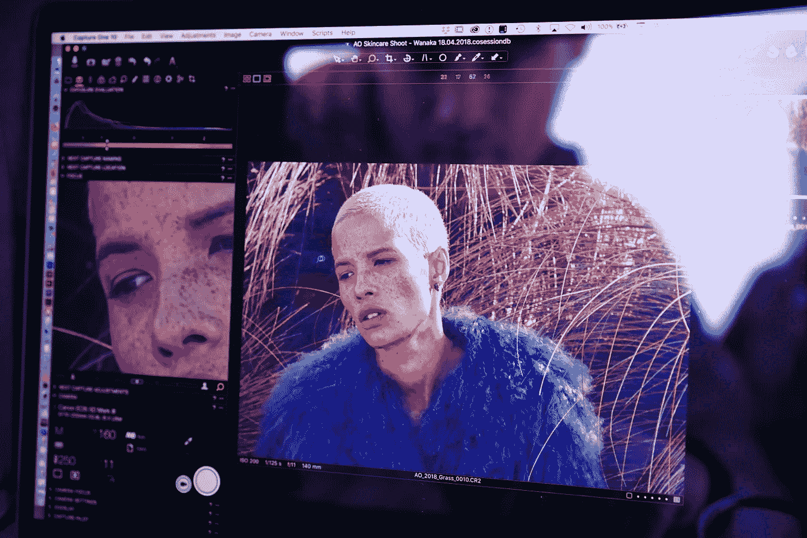
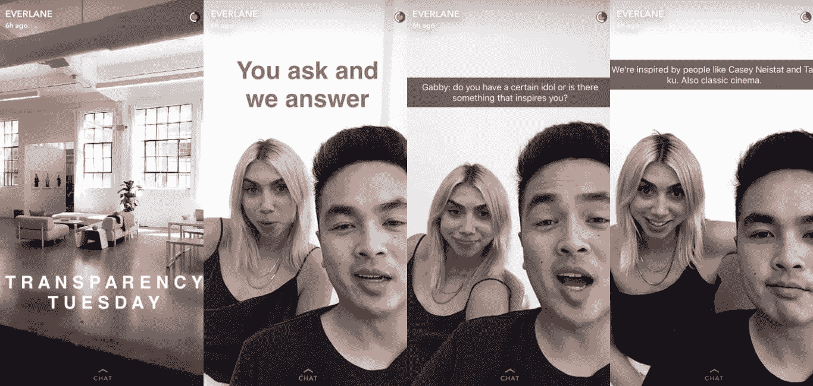
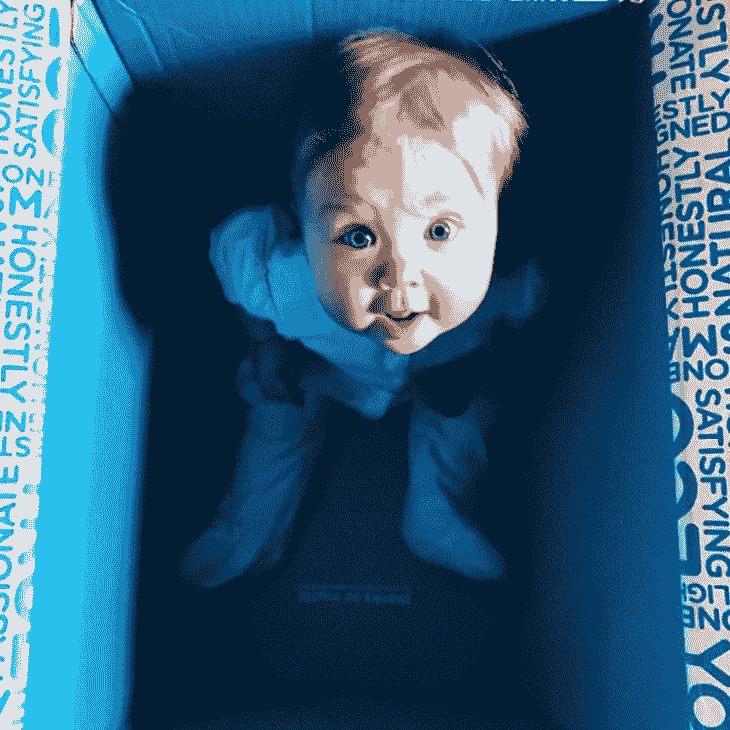
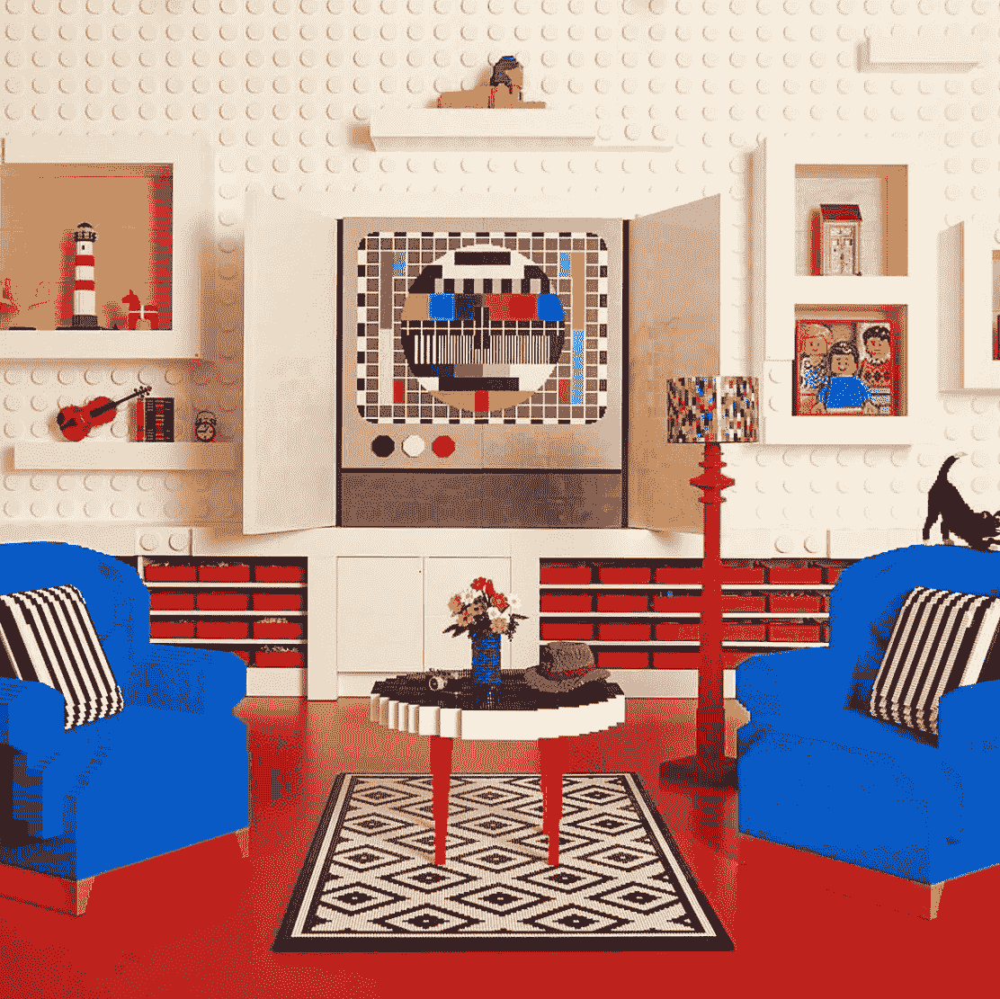
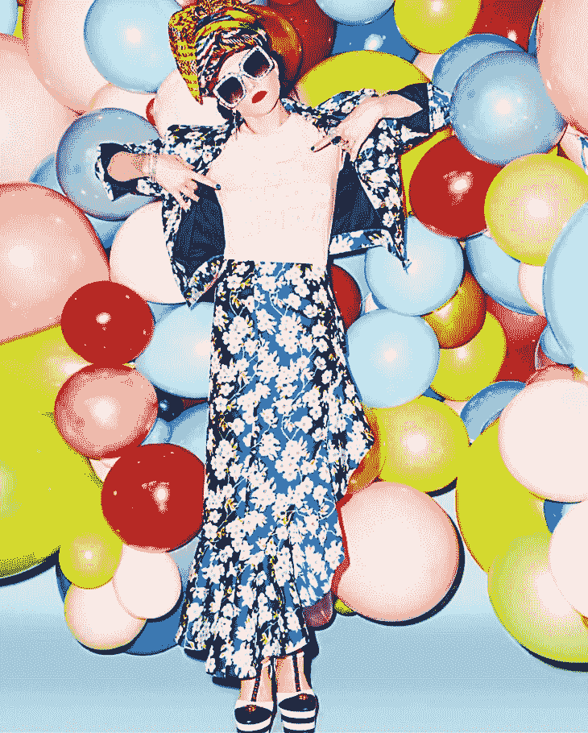

# 还记得故事只是为了抓拍吗？

> 原文：<https://medium.com/swlh/why-you-have-a-constant-content-problem-b6b49b6e696a>

## 满足社交媒体持续内容需求的 5 种方法——来自做得最好的品牌

这里有故事，那里有故事，到处都有故事。在 Instagram、脸书、Snap、Twitter 等之间。—对品牌创造越来越多内容的需求越来越大，越来越广泛。

**我称之为“持续的内容问题”，**无论是大企业还是小企业，不仅要跟上，而且要以一种对你的品牌来说真实可信的方式跟上，这可能会非常困难。

上周在社交渠道上，我强调了一个品牌，他们在解决持续内容问题上做得非常好，以及他们是如何让它为他们工作的。**这里是我所有的小见解。**

# **方式一:一直在拍戏**

创建持续内容的最好也是最简单的方法之一就是让人们在幕后看到你每天都在做什么。你可以拍摄有趣的东西，比如我在 Bartlett Brands 的团队去年为 ipsy 拍摄的这张夸张的照片。或者常规的东西，比如你的工作场所正在发生的事情(办公室狗，有人吗？)或者甚至在公司外部。

⚡️ **小见识** ⚡Every 当你在创造内容的时候，就有机会创造更多的内容。顾客喜欢看到照片等他们通常无法体验的东西的内部运作。人们喜欢看到真实的面孔，听到真实的声音——这有助于他们更好地与你的品牌建立联系。

# 方式二:巧妙运用问答

Everlane 是第一个发起道德时尚运动的人，他们专注于“彻底的透明”——这意味着他们尽可能诚实地对待从产品价格到工厂条件的一切事情。当谈到提供持续的内容时，他们是社交网站的领导者。

他们聪明地做的许多事情之一是**让他们的观众参与到他们创造的内容中。每周二，Everlane 都会加入一个名为“透明星期二”的系列节目他们在 Instagram 上分享了一个帖子，要求人们提交他们的问题。问题可以是任何事情，从产品开发到公司的职位空缺。**

然后他们的社交团队对着摄像机，用快速有趣的片段回答问题。这对每个人来说都是一个简单的双赢局面:Everlane 获得了大量稳定的内容。他们的粉丝能得到答案，知道当下对他们来说什么是重要的。

⚡️ **微小的洞察力** ⚡To 创造持续的及时且相关的内容，利用你的观众作为资产。是超级正+超级共生的关系，让 convo 和内容保持超级新鲜。

# 方式 3:对生活方式保持真诚

不管你有没有孩子，你都可能听说过诚实公司。在为下一代建设无毒世界的使命驱动下，他们为家庭制造安全有效的必需品。

除了对你有益的产品，他们还通过关注千禧一代母亲的生活阶段和她们遇到的真实时刻，掌握了创造对每个人都有益的恒定内容的艺术。

从展示真实的顾客(不仅仅是有影响力的人)，到给新妈妈们提供健身建议，到强调分娩时的“诚实时刻”，再到发布这样一张照片——然后在 Instagram 上发布一个展示婴儿在盒子里玩耍的故事，**他们都变得个性化，并从观众那里获得灵感。**无论是一个故事、一段视频还是一张照片，他们都在和父母一起教育、共情和欢笑。

⚡️ **一口大小的洞察力** ⚡Think 关于进入购买你的产品的人们的生活的所有事情。他们如何使用你的产品？他们什么时候使用它？他们在哪里使用它？任何一个瞬间、地点或感觉都可能为你的内容提供灵感，并提供另一个与故事联系的机会。

# 方式 4:使用 UGC 作为伟大故事的基石

每个人都可以同意 Airbnb 在鼓舞人心的内容方面杀死了它。在旅游领域，他们确实有很多工作要做。谁不喜欢世界上最独特的目的地的华丽照片(就像这个用乐高建造的房子，什么！？！)流过他们的提要？但正是他们对自己的故事所做的事情让他们如此引人入胜。

Airbnb 并不是简单地转贴他们用户的照片。他们创建不同类型的主题，如商务旅行、迷你度假或地点。然后他们把照片串在一起，表达一些独特的东西。

每件作品的结构都像一个真正的快速叙事，有开头-中间-结尾。当他们把这些内容放到故事中时，他们会吸引更多的用户——让他们猜测目的地，在简单的投票中给出答案，并参与竞赛。

⚡️ **小见识** ⚡Simply 转发 UGC 不足以创造吸引人的持续内容。退后一步，用一个宽广的视角看看你的听众正在分享的东西——然后寻找出现的主题。你如何用这个来组织你的故事？看看什么能到位。

# **方式五:将幕后提升到下一个层次**

Alice+Olivia 创始人斯黛西·班戴自称是“设计师、妈妈、妻子、偶尔的俳句爱好者和所有多彩事物的爱好者”，她将自己超级大胆的个性注入到品牌的每个方面。她扮演了一个真正的创始人的角色——在照片和插图中，她戴着标志性的圆形太阳镜。

但是 Stacy 超越了作为品牌代言人的经典理念，真正邀请顾客进入她的奢华生活。 Alice+Olivia 的故事和照片远不止照片拍摄中的“幕后”:你看到 Stacey 去参加活动，Stacey 在迈阿密度假，Stacey 的孩子们(她称他们为影响者)穿着衣服摆姿势，甚至 Stacey 在家里做瑜伽，而她的小影响者在后台跑来跑去。

⚡️ **小见识** ⚡Whether 不管你的品牌是否有创始人的面孔，想想你可以邀请你的观众进入你的品牌的所有方法，以创造持续的联系内容。你参加的活动，新产品的拆箱和测试——任何与你的品牌价值相一致的东西都可能成为新鲜的内容。

**想要更多关于如何创建固定内容的建议吗？说“请再多一点！”在评论里。**

## 喜欢这篇文章吗？按下拍手按钮👏帮助其他人找到它。

> 关注我，获取每日发布的创业品牌洞察:[LinkedIn](http://www.linkedin.com/in/kimberly-brizzolara-0b95093)| |[insta gram](https://www.instagram.com/kimberlybrizzolara/)| |[脸书](https://b-m.facebook.com/brandsthatgetyou/) || [Twitter](https://twitter.com/kbrizz)
> 
> 你也可以[注册我的电子邮件](http://kimberlybrizzolara.com)并在媒体上继续关注我[。](/@Kbrizz)

## 这个故事发表在 [The Startup](https://medium.com/swlh) 上，这是 Medium 最大的创业刊物，拥有 339，876+人关注。

## 在这里订阅接收[我们的头条新闻](http://growthsupply.com/the-startup-newsletter/)。

