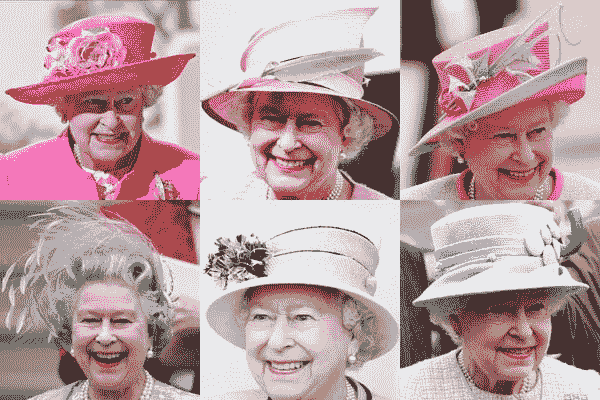
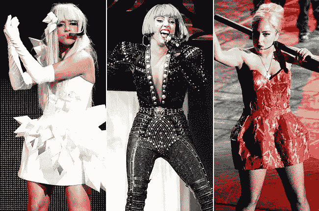

# 为什么你需要一个标志性的外观。

> 原文：<https://medium.com/swlh/why-you-need-a-signature-look-55ddc0b482e5>

Amy Winehouse

## 提示:这会让你更有效率。

汤姆·沃尔夫穿白色，约翰尼·卡什穿黑色，阿尔伯特·爱因斯坦穿灰色。Lady Gaga 穿肉。黛安·冯·芙丝汀宝？那是一个包裹。

沃尔夫、卡什、爱因斯坦、加加和 DVF 有意识地决定穿上并整理他们的标志性装扮。

汤姆·沃尔夫买了一套白色西装在夏天穿。然而，他购买的西装对于夏天来说太重了，所以沃尔夫决定在冬天穿。他的白色冬装引起了轰动，沃尔夫将其融入了一套标志性的、令人放松的制服中。

约翰尼·卡什说，黑色衣服买起来更便宜，在路上洗衣服的间隔时间里看起来更干净，并且象征着“对现状的反叛”这种外观强化了他的个人形象和整个职业生涯的信息传递，使他与众不同。

**阿尔伯特·爱因斯坦**说他穿了几套相同的灰色西装，因为他不想每天浪费“脑力”来选择他的衣柜。灰色西装、白色衬衫和黑色领带成了他的标志性装扮。

黛安·冯·芙丝汀宝。裹裙。句号。

# 覆盖认知:

人们早就知道，我们穿的衣服会影响别人对我们的看法。现在人们明白了，我们的穿着会影响我们对自己的看法。

认知科学研究表明，如果你穿了一件你认为属于医生的白大褂，你的注意力会急剧增加。但是如果你穿着同样的白大褂，并认为它属于一个画家，你就不会有这样的进步。

这是科学家称之为“*覆盖认知*”的现象:服装对认知过程的影响。

在工作面试、会议和公共场合——包括家庭聚餐——记住被覆盖的认知。

标志性的外表是强有力的护身符，影响着别人对你的期望和你的实际行为。它们不仅仅是品牌。

> 你戴的帽子声音太大了，你说的话很难听清。

# 白宫西翼的标志性外观:

美国前总统采取了与爱因斯坦相似的方法。巴拉克·奥巴马总统说:“你会看到我只穿灰色或蓝色的西装。“我正试图减少决策。我不想决定我该吃什么或穿什么。因为我有太多其他的决定要做。”

如今的总统候选人唐纳德·j·特朗普(Donald J. Trump)有他自己的标志性装扮，包括一条纯色、闪亮、长度适中的领带。

# 有时候，只需要一顶帽子

亚伯拉罕·林肯身高六英尺四英寸，不需要他的烟斗帽来增加身材。他偶尔会把文件藏在他的丝绸礼帽里，这顶礼帽是由制帽商 JC Davis 在华盛顿制造的。

林肯的帽子，戴在布斯剧院，那个臭名昭著的晚上。现在在史密森尼博物馆展出

说到帽子，女王伊丽莎白二世殿下在她 64 年的统治中戴了 5500 多顶帽子。数着…

在距离白金汉宫不远的贝克街 221b 号，**夏洛克·福尔摩斯**更喜欢一顶“猎鹿者”帽子。

# 一些标志性的外观甚至更具战略性。

**史蒂文·乔布斯**穿着黑色高领毛衣，李维斯 501 牛仔裤和新的平衡灰色运动鞋。以下是他告诉他的传记作者沃尔特·伊萨克森的话:

> ”在 20 世纪 80 年代初的一次日本之行中，乔布斯问索尼董事长盛田昭夫，为什么公司工厂里的每个人都穿制服。他告诉乔布斯，战争结束后，没有人有衣服穿，像索尼这样的公司必须给他们的工人每天穿的东西。多年来，制服形成了自己的签名风格，尤其是在索尼等公司，它成为了员工与公司之间的一种纽带。我决定要为苹果建立这种关系，”乔布斯回忆道。

注重风格的索尼公司请著名设计师三宅一生设计了它的制服。这是一件由防撕裂尼龙制成的夹克，袖子可以拉开，变成背心。因此，乔布斯打电话给三宅一生，请他为苹果设计一件背心，乔布斯回忆道，“我带了一些样品回来，告诉每个人，如果我们都穿上这些背心，那就太好了。天啊，我被嘘下台了。每个人都讨厌这个主意。”

然而，在这个过程中，他和三宅成为了朋友，并会定期去看望他。

> 乔布斯开始喜欢为自己设计一套制服的想法，既因为它的日常便利性(他声称的理由)，也因为它能够传达一种标志性的风格。“所以我让伊塞给我做几件我喜欢的黑色高领毛衣，他给我做了一百件。”乔布斯在讲述这个故事时注意到了我的惊讶，所以他展示了堆放在壁橱里的照片。“我就是这么穿的，”他说。"我有足够的钱度过余生。"

预言，有足够的高领毛衣。

总的来说，硅谷并不以时尚感著称…

然而，**马克·扎克伯格**，脸书的首席执行官以他的灰色 t 恤和牛仔裤而闻名。他挂起了他标志性的帽衫…

马龙·布兰登也穿了一件 t 恤。

# 通常，不是你穿什么，而是你怎么穿

奥黛丽·赫本更喜欢黑色礼服。

**为安娜·温图尔打扮**的标志性“bob”发型，不戴墨镜(对她来说，墨镜具有实用和时尚的功能)。

我们将把眼镜留给 Iris Apfel 和她的标志性造型，其中眼镜是标志性的下划线。同样很难错过她独特的珠宝选择。

卡尔·拉格费尔德也有独特的外观。眼镜是一个组成部分。请帮我描述一下他标志性的长相。

**伊曼** & **大卫·鲍依**。一对不同寻常的夫妇有两个签名。

也许你的标志性造型并不是一个特定的造型，而是一种永远保持独特造型的承诺。**嘎嘎小姐。**

树立自己的榜样——无论是带扣的、有钮扣的、卡其布的、牛仔布的还是丝绸上的棕榈树。你的签名风格应该符合你希望传达给别人的信息。更重要的是，你的造型应该在剪裁和态度上都适合你。

牢记“覆盖认知”你的标志性外观会影响别人对你品牌的看法。这也会影响你对自己的感觉。

请分享你的标志性造型。我很想去看看。

大卫·j·卡茨，2018 年——纽约市

David J. Katz 是行业领先的跨国消费品公司 Randa Accessories 的首席营销官，也是世界上最大的男士配饰公司。

他的专长是与零售商、品牌和供应商合作，在不断发展的市场中创新并取得成功。

大卫被领英选为 2017 年“[顶级声音。](https://www.linkedin.com/pulse/linkedin-top-voices-2017-must-know-people-inspiring-todays-roth)“他被《女装日报》评为【引领时尚行业】[【变革推动者】](https://www.google.com/url?sa=i&rct=j&q=&esrc=s&source=images&cd=&ved=0ahUKEwjO-M2y7ITYAhUHKiYKHcheAlkQjRwIBw&url=http%3A%2F%2Fwwd.com%2Fwwd-publications%2Fdigital-daily%2Fmondays-digital-daily-april-3-2017%2F&psig=AOvVaw1UUxt9X_VP2djw_y76zFzB&ust=1513180933315355)，被《先生》杂志评为【男装推动者】。

他是一名公共演说家，也是畅销书《设计应对:有效的创意直接营销》的合著者。《纽约时报》、《华尔街日报》、《纽约杂志》、《赫芬顿邮报》、《先生杂志》、《WWD》。

大卫毕业于塔夫茨大学和哈佛商学院，是神经生物学、消费者行为和“刺激与反应”的学生。巴甫洛夫这个名字听起来很耳熟。

— — — — — — — — — — — -

#时尚，#零售，#营销，#创业，#工作，#职业，#广告，#品牌，#覆盖认知，#心理学，#科学

## 这个故事发表在 [The Startup](https://medium.com/swlh) 上，这是 Medium 最大的企业家出版物，拥有 289，682+人。

## 在这里订阅接收[我们的头条新闻](http://growthsupply.com/the-startup-newsletter/)。

