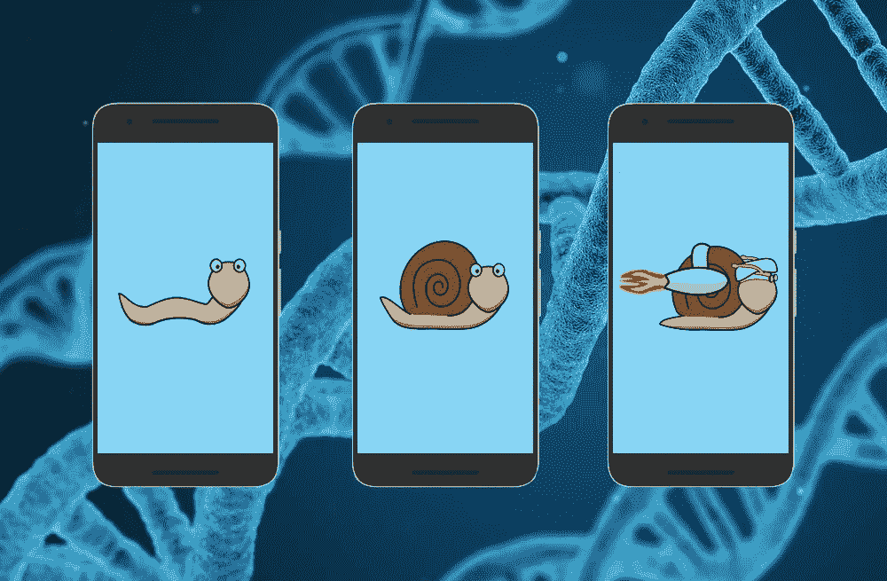

# 为什么你的移动应用需要一个 MVP

> 原文：<https://medium.com/swlh/why-you-need-an-mvp-for-your-mobile-app-4f8046ac52e0>

每个企业都是从一些想法开始的，然而，并不是所有的都是成功的。“这个想法是只对我好还是对很多人好？”—这是一个可能会让你半夜睡不着的问题。唉，企业家发现人们不需要他们的初创公司提供的产品，这种情况时有发生。有了 MVP，你可能晚上睡觉也不会被这个问题折磨。

开发一个新产品，无论是网站还是移动应用，仅仅基于你自己对市场需求的想法，可能是灾难性的一步。在早期阶段从潜在消费者那里获得想法的反馈，跟踪他们的反应和购买产品的意愿是非常重要的。

今天的初创公司创始人越来越了解最低可行产品方法的价值。如果有“创业圣经”的话，它可能会以一句谚语开头:

> ***“一开始是 MVP，那很好。”***

# 为什么有必要建立一个 MVP 应用程序

聪明的企业家使用 MVP 移动应用程序作为运行成功项目的起点。一个 MVP 应用是从一个想法到一项业务的最短路径。它提供了一个快速的市场入口，因此提供了一个评估项目潜力的真实用户体验。

## MVP 是一个 app 的症结所在

一个 MVP 应用程序只专注于一个想法，它不包括次要功能。MVP 方法属于精益创业的思想——在合理的时间内用最少的预算建立的创业。这是一个已经提供了足够价值的应用程序，因此你可以尽快获得客户。风险极小。只有少数几个主要功能降低了移动应用程序的开发成本。

从上面可以看出，MVP 并不是一个“正常”产品缺钱的标志，而是一种快速检查市场真正需要(或不需要)什么的方法。所以，不要犹豫，建立 MVP 应用！

## MVP 开发技术帮助你少猜多赢

假设，你突然有了一个想法，卖加番茄酱的冰淇淋。你不需要和当地的奶牛场签协议，不需要购买巴氏灭菌器、连续冷柜等生产冰淇淋的设备，不需要培育番茄酱制造的番茄田就可以了解到人们不喜欢一个加番茄酱的冰淇淋。拿十个加番茄酱的冰淇淋，走到外面，问人们是否喜欢你提供的产品。手机 app 也是一样。花几个月时间开发一个有很多功能的应用程序，却发现人们并不需要它，这是不合理的。

如果你问人们这个问题:你想要什么？他们会说…实际上，人们真的不知道他们想要什么，也无法给你一个明确的答案。这就是为什么你应该提供几个变种，看看他们中的哪一个是最感兴趣的。都是关于 MVP 的。

> “如果我问人们想要什么，他们会说是更快的马。”~亨利·福特 

## 移动应用本质上是一个 MVP

由于移动设备有多种类型和风格，在定制移动应用程序开发中应该考虑许多限制。所有提供移动应用程序开发服务的公司都意识到移动用户是不同的。他们的行为是不同的。他们不会等到页面加载完毕。他们不会忽略你的应用程序中的一些错误，但会毫无疑问地删除它。一个 MVP app 有最起码的功能，但必须完美，否则用户不会接受。

# 从文字到最小可行产品的实例

试着回想一下你第一次使用 Twitter、脸书或 Instagram 的时候。它们看起来和今天的很不一样，不是吗？这些令人敬畏的服务通过上市做得更好，尽管它们还没有完成。我们来看看以 MVP 开头的热门 app 例子。

*   **优步。优步在第一版移动应用中所做的只是将司机和客户联系起来，并增加了接受支付的能力。似乎很原始。然而，正是这一点让优步迅速进入市场，获得反馈，并逐渐创造了数十亿美元的业务。今天，优步有一个更复杂的应用程序，有数百个功能。**
*   Snapchat。Snapchat 的主要概念是图像和消息短时间可用。斯坦福大学的学生埃文·斯皮格尔、鲍勃·墨菲和弗兰克“雷吉”布朗决定在教育项目中实施一个不同寻常的想法——一个阅读 10 秒钟后就会发出“自毁”消息的即时信使。该应用于 2011 年推出的第一个版本仅用于 iOS 设备和发送照片。2017 年 5 月，Snapchat 拥有 1.66 亿日活跃用户。
*   **四方。Foursquare 公司的 MVP 版本最初以徽章的形式为他们提供签到和奖励。在研究了用户的反应后，MVP 应用程序开发者开始扩展其功能，并为城市添加推荐和指南。今天，这项服务汇集了 5000 万人，他们已经被检查了 80 亿次。**

# 在移动应用程序开发中使用 MVP 方法的提示和技巧

在 MVP 阶段，主要的目标是获得一个清晰的愿景，如何使用你的应用程序，什么对你的客户有用，什么没用。然后，根据用户的反馈，你可以构建一个功能齐全的产品，而不必冒险浪费时间和金钱，因为你的应用程序没有人感兴趣。

在开发 MVP 应用时，请记住以下几点。

## 简化

您需要确定最关键的功能集，哪些功能重要，哪些不重要。当你用 1 到 10 的尺度来评估不同特性时，更容易理解它们的重要性，包括这个特性对产品的重要性，实现的复杂性，以及对用户的价值。

> “任何一个聪明的傻瓜都可以把事情变得更大更复杂……这需要一点天才——以及朝相反方向前进的巨大勇气。”~ E. F .舒马赫 

## 明智地选择

App Store 和 Google Play 的竞争非常激烈，盲目相信 MVP 的错误是可以原谅的，而发布的故障应用会扼杀你的创业。一个既没有经验也没有眼界来在应用程序开发中做出正确决策的团队不是一个好的选择。你应该[为你的 MVP 找到合格的移动应用开发者](https://anadea.info/blog/how-to-find-an-app-developer-for-your-project)。

## 发布前做最后检查

确保你的 MVP 应用程序正常工作。留出排除故障的时间。与您的家人和朋友一起测试该应用的测试版。在成千上万的用户下载你的产品之前，他们会帮助你发现它是否工作正常。如果一切正常，恭喜你，你的 MVP app 准备发布了。

## 你得到了你的 MVP！下一步是什么？

您已经完成了应用程序的第一个版本的开发，激动人心的发布时刻已经到来。这是工作真正开始的阶段，因为现在你需要明白你的想法有多成功。有必要使用分析和数据捕获来做出明智的决策。

通常，人们更倾向于谈论他们不喜欢的东西，而不是他们喜欢的东西。因此，如果你收到的负面反馈多于正面反馈，这并不意味着你的产品不好。事实上，应用程序的生存能力更多地取决于统计数据，而不是用户评论。这里最困难的部分是要弄清楚如何利用你所拥有的信息——得出什么结论，在你的产品中做什么改变来改进它。

# 总结

MVP 是一种策略，它使你能够在一个基本的、完美工作的应用程序的帮助下找到关于一个用户的很多信息，而不会过度花费宝贵的时间和金钱。你所需要的只是制定你的商业假设，确定关键功能，为你的项目选择一个好的[移动应用开发公司](https://anadea.info/services/mobile-development)。

MVP 万岁！

*原载于* [*anadea.info*](https://anadea.info/blog/why-you-need-an-mvp-mobile-app)

## 这个故事发表在 [The Startup](https://medium.com/swlh) 上，这是 Medium 最大的企业家出版物，拥有 272，171+人。

## 在这里订阅接收[我们的头条新闻](http://growthsupply.com/the-startup-newsletter/)。

