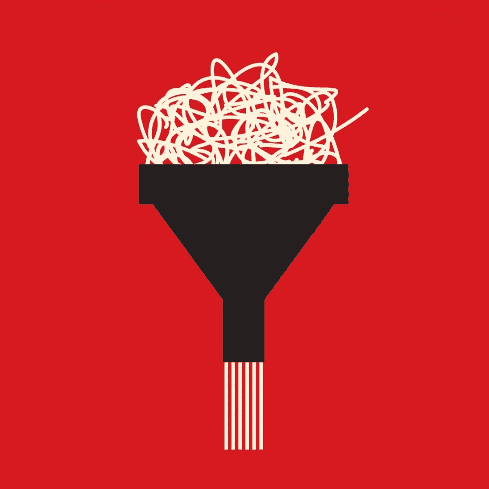

# 为什么你需要阅读，以及如何有效地阅读

> 原文：<https://medium.com/swlh/why-you-need-to-read-and-how-to-do-it-efficiently-ee25fb1ee7f5>

[https://execed.economist.com/career-advice/career-hacks/why-you-need-read-and-how-do-it-efficiently](https://execed.economist.com/career-advice/career-hacks/why-you-need-read-and-how-do-it-efficiently)

阅读不仅仅是作家的事。阅读帮助我们更多地了解我们的职业——无论是营销、管理、工程还是教学。当我们处于低谷时，它会激发新的想法，推动我们前进。最重要的是，它让我们以新的方式思考，逃离我们生活的模式和假设。

世界首富比尔·盖茨说他每年读 50 本书。

当[问](http://www.nytimes.com/2016/01/04/fashion/bill-gates-gates-notes-books.html?smid=tw-nytimes&smtyp=cur&_r=1)阅读在他的生活中扮演什么角色时，盖茨说:

> “这是我学习的主要方式之一，从我还是个孩子的时候就开始了。这些天来，我也可以参观有趣的地方，会见科学家，观看许多在线讲座。但阅读仍然是我学习新东西和测试理解能力的主要方式。”

适应阅读时间是困难的。当你有一份不间断的工作和一个不会放弃的日程表时，很容易说*我只是没有时间读*。但是把它想象成你大脑的一次慢跑:阅读会让你保持敏锐，激发创造力，而[会培养同理心](https://www.farnamstreetblog.com/2011/09/is-reading-fiction-good-for-you/)。

[https://getpocket.com/stats/2015/df6ce5d11a](https://getpocket.com/stats/2015/df6ce5d11a)

有一些策略你可以用来创造高质量的阅读时间。在过去的一年里，我读了相当于 45 本书的书，我学会了如何高效地阅读，同时还能完成我的目标。以下是如何读更多的书，即使你时间有限。

# 找时间阅读

> "诀窍在于教会自己一小口一小口地阅读，同时也要一口气读下去。"—斯蒂芬·金

你今天等了多长时间？

平均来说，我们每次点咖啡要等 7 分钟，每次看医生前要等 32 分钟，而另一个重要的人准备出门要等 21 分钟。还有你等火车或在车管所排队的时间——更不用说等待会议开始所浪费的时间了。

我们打赌我们知道在那段浪费的时间里是什么陪伴着你:你的智能手机。根据移动分析公司 Flurry 的数据，美国人平均每天花 2 小时 42 分钟在手机上。我们在消费内容，浏览脸书和 Instagram，试图跟上 Slack。

太棒了。我们刚刚发现你确实有时间，可以用来阅读的时间。

在那个时候，你不能一本书蜷缩几个小时，但你可以读一点。就像斯蒂芬·金说的那样，“诀窍在于教会你自己一小口一小口地阅读，也要一口气读下去。”

消费还不错。错误的消费方式是不好的。花时间阅读电子书、高质量的网络文章、时事通讯和其他信息内容，你的业余时间就不会再被浪费了。

## 不要在低劣的内容上浪费时间

有没有注意到远见者是如何谈论“点”的？例如，史蒂夫·乔布斯在斯坦福大学的毕业典礼上说“你不能向前看把点点滴滴连接起来，你只能向后看把它们连接起来。所以你必须相信，在你的未来，这些点会以某种方式连接起来。”

点只是想法——来自你的生活、经历、导师和阅读。你拥有的点越多，你就有越多的机会将点连接起来，并提取新的见解。

但你也要确保正确的点进入你的矩阵。阅读来自不同来源的大量内容是收集更多信息的好方法。然而，如果你不努力过滤这些想法和声音，你可能会在点击诱饵帖子上浪费 7 分钟。哪些文章其实值得你花费宝贵的阅读时间？

正如[大卫·艾伦](https://execed.economist.com/career-advice/career-hacks/what-david-allen-has-say-about-getting-things-done-gtd)，完成工作效率系统的发明者所说，“一个工作流程的输出质量从根本上受到其输入质量的限制。”阅读伟大的东西，你会输出更好的想法。

这就是为什么你必须广撒网——而不是在你的脸书朋友中撒网。正如福特实验室的[蒂亚戈·福特](/forte-labs/the-secret-power-of-read-it-later-apps-6c75cc37ef42#.noy92kuvo)所指出的，仅仅依靠你的人际网络来获得想法会确保你永远是房间里最笨的人。

在新闻之外思考。不要把自己局限于只阅读你已经阅读过的典型新闻网站。

## 哪里可以找到好的内容

**行业监管场所**

我是利基监管网站的忠实粉丝，比如面向营销人员的[Inbound.org](http://inbound.org/)和面向开发者的[黑客新闻](http://news.ycombinator.com/)。像这样的网站列出了今天关于某个特定主题的最受欢迎的内容，以及通常来自业内人士和专家的讨论。它们是找到适用于您的工作的优质内容的完美地方。

以下是一些最受欢迎的策展网站，可能符合你的专业领域:

*   [Inbound.org](http://inbound.org/)对于营销人员来说
*   [GrowthHackers](http://growthhackers.com/) 为成长黑客
*   [设计师新闻](http://designernews.co/)面向设计师
*   科技和创业领域的任何人都能看到的黑客新闻
*   企业家的 Quibb
*   [AllTop](http://alltop.com/) 寻找你最喜欢的话题的答案
*   [Nuzzel](http://nuzzel.com/) 查看你在线关注的人的精选文章
*   [Reddit](http://reddit.com/) 包罗万象——不仅仅是双关语和猫的 gif，你会发现几乎任何主题的详细子编辑，就像这张 750 个最受欢迎的子编辑的列表

努力专注于一项资源？试试 [UsePanda](http://usepanda.com/) :这是一个浏览器扩展，可以在一个页面上显示你最喜欢的策展网站的前 10 条内容的三到四个流。这样你就可以花更少的时间寻找内容，花更多的时间阅读。

**Medium:“一个思想的网络**

[Medium](/) 专为长篇文章和社区讨论而设计。这是写博客最简单的方式。这意味着 Medium 上有大量与你的兴趣无关的帖子——还有一些高质量的文章非常适合你。

Medium 主页收集了当天的最佳帖子，您可以关注标签和特定出版物，以跟踪他们的最佳文章。一旦你把这些点连接起来，你就可以在你自己的博客中分享你的想法。

**新闻阅读器应用**

你应该关注与你的行业相关的最好的文章，也许应该关注那些始终如一地就你所关心的观点撰写高质量内容的博客。

为此，你需要一个新闻阅读器应用程序。你可以使用像 [Feedly](https://zapier.com/zapbook/feedly/review/) 或 [Fever](http://feedafever.com/) 这样的 [feed 阅读器应用](https://zapier.com/blog/best-rss-feed-reader-apps/)来关注你喜欢的特定网站，或者使用像苹果新闻或谷歌新闻这样的新闻监管应用来关注一般话题和趋势。

我个人最喜欢的是 [Flipboard](http://flipboard.com/) 。它始终如一地推荐用户感兴趣的主题的最佳文章，然后让他们分享或保存到杂志中，以记录你读过的所有内容。

# 在任何地方阅读优质文章

既然你已经找到了值得阅读的高质量内容，你就需要一种方法在你一天的休息时间里阅读它。

为此，你需要一个*稍后阅读*应用程序。这些工具让你可以收藏和下载有趣的文章，以便在旅途中阅读。当你找到一篇有趣的文章时，只需在你的浏览器或应用程序中按下一个按钮，稍后阅读应用程序就会记录文本，这样你就可以离线阅读了。许多工具甚至包括组织和搜索功能，因此您可以构建自己的内容数据库。

有很多很棒的[稍后阅读应用](https://zapier.com/blog/best-bookmaking-read-it-later-app/)，但这里有 4 个最好的:

## 口袋

[Pocket](https://getpocket.com/) 可以在任何地方工作，包括手机和电脑应用程序、浏览器扩展，以及与许多流行平台的集成。它最大的特点是其闪电般的、类似 Gmail 的搜索功能。这使得 Pocket 成为了一个参考系统，当你需要的时候，它可以立即提供相关的链接。

## Instapaper

Instapaper 是最初的 Read It Later 服务，可以让你阅读定制字体的文章，或者在手机上大声朗读。它非常适合记录文章中最精彩的部分——只要在阅读时突出显示它们，添加任何想要的注释，然后当你回头寻找灵感时，一起浏览所有内容。它还集成了 Kindle 电子阅读器，可以方便地在手机之外阅读网络文章。

## 可读性

[可读性](https://www.readability.com/)是另一个类似的工具，有自己类似 Flipboard 的服务。你可以浏览已经保存为可读性的最受欢迎的文章，关注人们并查看他们的推荐，然后点击一下就可以将它们保存到你的阅读列表中。

## Safari 阅读列表

[Safari 阅读清单](https://zapier.com/blog/best-bookmaking-read-it-later-app/)是你类固醇上的书签栏。保存来自 iPhone 或 iPad 上几乎任何应用程序的链接，或者来自 Mac 上 Safari 的链接，然后即使在离线时也可以从 Safari 打开原始页面。轻按 Safari 地址栏中的四行按钮也可以获得简化的阅读视图。

# 现在收集。稍后过滤。

以后再看应用程序有一个至关重要的问题:当你可以保存任何东西时，保存任何东西都很容易。没关系。你应该试着只把你真正想读的文章保存到你的列表中，但是经过一天的思考后，你仍然会得到一些看起来不那么重要的随机文章。

不过，你不需要回去清理。整个想法是为了节省时间，这样你就有更多的空闲时间来阅读。以下是我如何收集好的内容来阅读，并在真正阅读之前过滤。

## 批量收集文章

我总是以回复电子邮件开始我的一天。我设置了一个小时的计时器，尽可能多的回复，然后休息一会儿，做一些有趣的活动，比如收集文章。我会疯掉，打开我的小心脏想要的标签。这一步就是 [OneTab](http://one-tab.com/) 派上用场的时候了，这是一个浏览器扩展，可以把你所有的标签整合成一个链接页面。

## 自动收集

你甚至不需要搜索有趣的文章来收集。如果你的网站发布了你想以后阅读的内容，Zapier 可以自动从他们的 RSS 订阅源中添加新文章到 Pocket 或 Instapaper。你甚至可以将 Feedly 连接到 Instapaper 或带有 Zapier 的 Pocket，然后只需在 Feedly 中启动文章，稍后即可阅读。

## 稍后过滤

这些策略会给你留下大量的内容供你以后阅读，但并不是所有的都是好内容。这很好:删除你保存的任何不直接给你的生活增加价值或对你寻求的学习有贡献的东西。

正如蒂亚戈·福特解释的那样，[你正在建立一个缓冲区](/forte-labs/the-secret-power-of-read-it-later-apps-6c75cc37ef42)，建立一个选项库，然后在你前进的过程中削减它。决定内容是否真的有帮助，并相应地删除。

许多帖子目前看起来很有趣，但从几天的角度来看，它们可能不像是最重要的阅读内容。别担心。滑动删除，并深入到似乎仍然值得的文章。

# 在旅途中一口一口地阅读书籍

过会儿再看应用程序可以让你了解很多信息，但书籍通常仍然是彻底学习新事物的最佳途径。

电子书是完美的，因为它们可以随身携带(因为它们也可以在我的手机上找到)，所以你可以一点一点地阅读整本书。如果你有多种设备——比如说，除了手机之外还有电子阅读器或平板电脑——你可以同步阅读进度，并从任何设备上继续阅读。

你只需要在手机上安装一个电子书阅读器应用程序。以下是一些最好的例子:

## 点燃

亚马逊的 [Kindle 应用](https://www.amazon.com/gp/digital/fiona/kcp-landing-page/ref=kcp_ipad_mkt_lnd)是我使用的电子书阅读器。它可以在任何 iPhone、iPad、Mac、PC 或 Android 设备上阅读你的 Kindle 书籍，也可以在任何浏览器上运行的 web 应用程序中阅读。而且，如果你喜欢电子墨水屏幕，你仍然可以在 Kindle 的独立设备上阅读它们。

我喜欢 Kindle，因为它在任何地方都可以使用。不管我在哪个设备上阅读，我使用的下一个设备将同步到最远阅读的页面，这样我就不会丢失我的位置。你还可以给页面添加书签，给文本添加亮点和注释，[在线查看你的注释](https://kindle.amazon.com/)。而且，亚马逊的 Kindle 商店几乎有任何你想读的书——其中许多你可以通过 Prime 订阅免费阅读。

## Google Play 图书

[Google Play Books](https://play.google.com/store/books) 类似于 Kindle，但在 Android 设备上运行，并有一个用于 iPhones 和 iPads 的配套应用程序。一个好处是，你可以免费阅读他们图书馆中最多 50%的书籍。你也可以在谷歌图书搜索中搜索图书，阅读你感兴趣的章节的节选，然后购买图书，在游戏图书中完整阅读。

这使得 Google Play Books 非常适合寻找您想要阅读的新内容。然后，你可以更快地从你的书中学习，因为它的参考页可以让你快速找到相关信息。

## iBooks

另一个选择是苹果的 iBooks，这是一个只在苹果电脑、iPhones 和 iPads 上可用的阅读应用。iBooks 与 Kindle 有着本质上相同的功能，尽管在组织上稍好一些。它包括文件夹来整理您的书籍，并自动将系列组合在一起，以便更容易找到您想要阅读的下一个内容。

## 狩猎书籍

许多 Spotify 风格的图书订阅服务都没有成功，但 [Safari Books](https://www.safaribooksonline.com/) 是一个存活下来的服务。这是一个由 O'Reilly press 和其他技术出版商管理的图书馆，拥有超过 30，000 本书、视频、培训课程和会议录音。主题涵盖分析、编程、项目管理、领导力、设计、创新等等。

Safari Books 是一个很好的学习选择，如果你想购买完整的技术书籍，每月 39 美元是一笔不错的交易。

# 在旅途中阅读高质量的时事通讯

糟糕的时事通讯会毁掉你的电子邮件收件箱。它们只会让你更难找到零号收件箱。

但是时事通讯实际上是发现好内容的最好方式之一。多亏了 [Unroll.me](https://unroll.me/) ，它们也不必塞满你的收件箱。它可以清理你的收件箱，并将电子邮件简讯整合到你的电子邮件应用程序的一个文件夹中。然后，我会通读 Unroll.me 为我保存的一些精彩时事通讯，删除不感兴趣的，就像我在 Pocket 中一样，而不是打开 Pocket 或一本书。

Unroll.me 还有一个摘要选项。它可以一次通过电子邮件向你发送你所有时事通讯的摘要。你还可以使用他们的应用浏览时事通讯，快速了解时事。

另一个选择:如果你可以在线阅读时事通讯，你可以把它们保存到 Pocket 或 Instapaper 上，和你的其他文章一起阅读。

## 哪里可以找到好的时事通讯

如今有大量优秀的时事通讯，其中大部分都收集了关于利基主题的最佳内容和技巧。它们可以是有趣的、信息丰富的，而且比大多数网站更少让人分心。

如果你没有订阅任何好的时事通讯，这里有一些收集了最好的内容的网站:

*   [与众不同的邮件](http://newsletters.creativemornings.com/)特别好的创意邮件
*   [简讯收藏点](http://www.newsletterstash.com/)获取最佳电子邮件简讯列表，以及他们自己的关于优秀电子邮件简讯的电子邮件简讯
*   今天最重要的新闻
*   [通过简讯发现最佳电子邮件简讯的名单](http://letterlist.com/)
*   [产品搜索](https://www.producthunt.com/search?q=newsletter&qFeatured=all)寻找最新最棒的时事通讯

# 外卖:学习新的东西来保持竞争力

在一个只有 3%的成年人每天花时间学习的时代，阅读好的内容会给你带来竞争优势。

这就是为什么你应该停止浏览，开始有效地阅读。

这篇文章最初发表在 [*经济学人的高管教育导航上。*](https://execed.economist.com/career-advice/career-hacks/why-you-need-read-and-how-do-it-efficiently)

特别感谢扎皮尔的马修·盖伊和 T2 的丹尼·施雷伯编辑这篇文章。