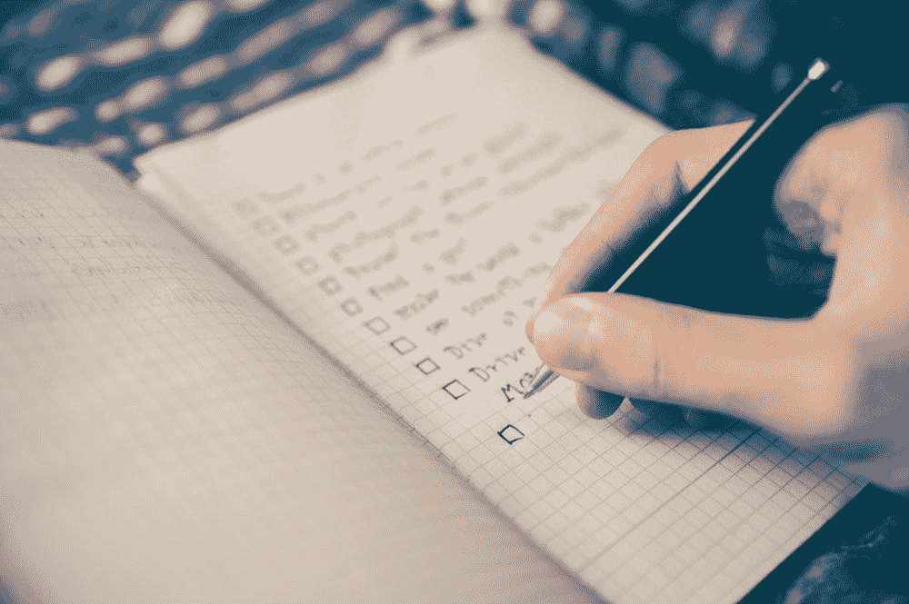

# 为什么你需要开始每天设定 3 个优先事项来获得成功

> 原文：<https://medium.com/swlh/why-you-need-to-start-setting-3-priorities-each-day-to-win-5a9406cf49b9>

credit: [https://unsplash.com/photos/RLw-UC03Gwc](https://unsplash.com/photos/RLw-UC03Gwc)

在过去的两年里，我养成了每天晚上(包括周末)写下第二天需要做的三件事的习惯。

我的发现令人震惊:

*   **2–3 倍**更加关注优先级——基于交付成果的产出
*   效率提高了**~ 2 倍**——大多数时候，我都有充足的时间来开始我认为第二天需要做的事情
*   起初，我只申请工作日——然而，我已经开始把周末包括在内，以确保我做重要的事情，比如在周日给父母打电话

## 以下是我遵循的步骤:

1.  在一天工作结束或晚饭前，我会先写下第二天我能想到的最重要的事情。
2.  我在首要任务之后又增加了两项——如果能完成那就太好了
3.  随着时间的推移，我会在完成的项目上打勾
4.  完成每一项后，我会记录花费的时间。
5.  我每周回顾一次，以确保我的时间得到合理分配，例如**40/40/20**–40%主要工作/ 40%家庭/休息/ 20%新实验
6.  每个月，我都会看看我的实验百分比是否超过了家庭或核心工作，因为事情可以作为一个数据点来决定如何相应地转移你的注意力。
7.  每个月，我都会查看所花费的时间，并根据我生活中的 5 大优先事项进行评估——这有助于指导我如何调整日常工作，以符合更大的优先事项。

最重要的是每天坚持不懈地做这件事，即使前三项看起来很简单。不断意识到什么在占用你的时间，可以让你发现新的时间来花在对你来说最重要的事情上！

有几个方法和伟人做的类似，例如[沃伦·巴菲特-前五名名单](https://jamesclear.com/buffett-focus)

## 第一步

写下你最重要的 25 个目标

## 第二步

圈出你的 5 大目标

## 第三步

只关注你的前 5 名，不惜一切代价避免其他 20 名！在你完成前 5 名之前，不要关注其他 20 名。

> 从上面学到的一个关键是消除噪音和专注

如果你喜欢这篇文章，请鼓掌，谢谢👍

[阅读我的上一篇文章:提升自我形象的 3 种方法](/swlh/3-ways-to-boost-how-you-present-yourself-fd5d88e1516f)

## 这个故事发表在 [The Startup](https://medium.com/swlh) 上，这是 Medium 最大的创业刊物，拥有 339，876+人关注。

## 在这里订阅接收[我们的头条新闻](http://growthsupply.com/the-startup-newsletter/)。

