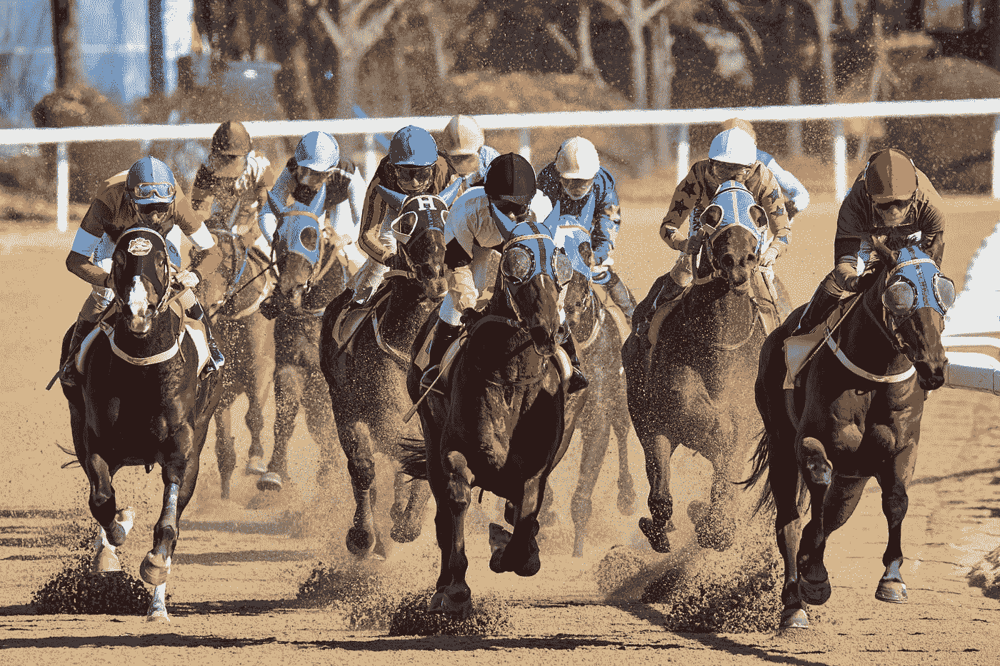

# 为什么你需要停止追逐你的激情

> 原文：<https://medium.com/swlh/why-you-need-to-stop-chasing-down-your-passion-c255638ee6b1>

## 因为找到你的激情是一个瓦罐

[Source](http://"equestrian riding horse at daytime" by Mathew Schwartz on Unsplash)

找到你的激情既不是一份工作，也不是一项运动。也不是比赛…那为什么要选一张赛马的照片呢？因为我喜欢骑师帽子的漂亮颜色。*说真的！*哦，因为在我成长的过程中，迪克·弗朗西斯是我最喜欢的作家之一。*谷歌一下他——他是女王的冠军骑师，去了* …