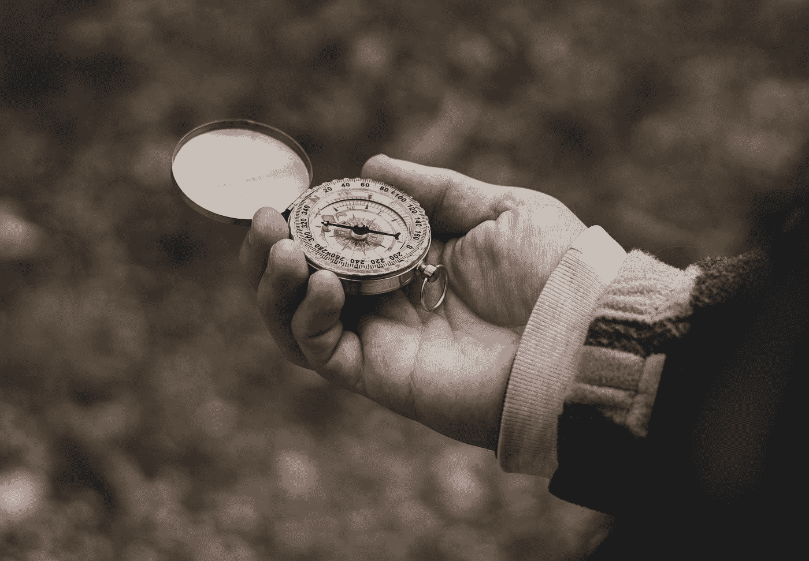

# 为什么你应该成为一名偏转大师

> 原文：<https://medium.com/swlh/why-you-should-become-a-master-deflector-eec154da1350>

“A close-up of a hand holding an embellished compass” by [Ethan Sykes](https://unsplash.com/@e_sykes?utm_source=medium&utm_medium=referral) on [Unsplash](https://unsplash.com?utm_source=medium&utm_medium=referral)

你是否觉得自己每天都被拉向多个方向？

***你是不是觉得每个人的问题你都要知道答案？***

***你是否觉得自己需要不断向自己和身边的人‘证明’自己？***

你觉得有必要对你工作周围的一切负责吗？

如果你对这些问题中的任何一个回答是肯定的，你并不孤单。事实上，这曾经是我。

过去的一年给我的生活带来了巨大的变化。经过伟大的反思，周末在完善我的写作，思考我的价值观和我的生活，我已经开始掌握谨慎偏转的艺术。

当我 9 月份刚开始我现在的职位时，我认为我必须知道所有的事情。我认为我必须成为领导者，我必须为我的角色和我周围的人带来能力。尽管这种期望仍然是现实，但在这份工作中，我很早就意识到了两件事。

## 1.我们每个人每天都有大约 3-5 个小时的最佳工作时间。给的比这多得多是对我自己的伤害。

我说的不是“工作”。我是从“存在的最佳状态”来谈论“最佳工作”的。你知道在你的势力范围内那是什么感觉。

在付出了 3-5 个小时后，你会意识到自己和他人已经所剩无几了。我们为自己没有为配偶、孩子和社交生活留下任何东西而感到羞愧。我们直接回家，在沙发上睡了一觉，只是为了在业余时间睡觉，为下一轮充电。

## 2. ***“我们可以像平常一样习惯任何事情，只是不要问怎么习惯。”*** —维克尔·弗兰克尔。

是的，在你的工作场所看似正常的事情在另一个地方可能并不正常。在一个地方对你的期望在另一个地方会不一样。常态是源于职场文化的一系列不成文的期望。有时这是健康和富有成效的，有时却不是。

“Empty suburban street by a stop light at dusk” by [Jamie Street](https://unsplash.com/@jamie452?utm_source=medium&utm_medium=referral) on [Unsplash](https://unsplash.com?utm_source=medium&utm_medium=referral)

在我自己的生活中做了这样的评估后，我意识到有些事情需要改变。我经历了一场能量耗尽的危机，受够了。是时候放弃我的个人时间、精力和对自己爱好的热情了。尽管我对工作充满感激和充实，但在一天结束时，我需要超脱和足够的精力去追求自己的爱好、欲望和需求。

一旦我做了这个评估，我决定成为一名 ***主偏导*** 。我不再对许多问题回答“是”,并开始推迟和转移问题到其他人身上。我开始承担更少的责任，更多地依靠我的团队来完成工作。我不再接听没有预约的电话，也不再和任何没有预约的人说话。我拒绝给出我的个人电话号码，我开始开车去给别人做决定。我开始自由地提供更少的知识和信息。我说得更少了，不再呆到很晚去“再做一件事”，头脑清晰得令人难以置信。

因为我这样做了，它给了我写两本书、做兼职、写日记、每天做两次锻炼、和我的伙伴一起旅行和建立一个非营利组织所需的时间和精力。

***简单来说:我偏向的心态给了我更多的能力和清晰的思路去调动更大的事情，有更大的影响力和更大的影响。***

# 你在度假中采取什么方法？

# 你能每天都竭尽全力去得到你想要的东西吗？

# 你有价值观吗？

# 你的价值观是有序的吗？

# 你把你的精力放在你的价值观上了吗？

这些是你应该问自己的重要问题，今天就是你要问的日子。你越早将你的*激情与你的职业*联系起来，你越早将你的*价值观与你的能量输出*联系起来，你就会越早发现自己过上了最好的生活。

关于如何在你的生活和职业中变得更有条理、更有偏差和更具反思性的其他策略，我鼓励你拿起我在亚马逊上的新书:[思想领导力。](https://www.amazon.com/dp/1981080147/ref=olp_product_details?_encoding=UTF8&me=)

## 这个故事发表在 [The Startup](https://medium.com/swlh) 上，这是 Medium 最大的创业刊物，拥有 326，962+人关注。

## 在这里订阅接收[我们的头条新闻](http://growthsupply.com/the-startup-newsletter/)。

