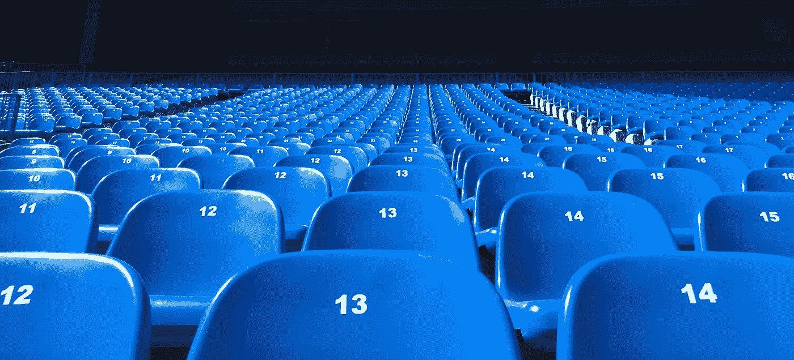

# 为什么你不应该袖手旁观

> 原文：<https://medium.com/swlh/why-you-should-get-off-the-sidelines-fc154d3e68d7>

## 生活发生在进攻中

Courtesy: [Unsplash.com](http://www.unsplash.com)

这一年正进入高潮。许多人制定了新年计划，但在二月的第一周，这些计划很快就淡出了他们的生活。

其他人不做任何决定，只是决定年复一年地继续以同样的方式生活。

无论哪种方式，你都可能觉得你正在创造你想要的生活。

但你是吗？

如果你决定今年不再袖手旁观会怎么样。对于任何需要澄清这一点的人来说，如果你看了超级碗，他们在比赛中经常提到边线。这是球员站在那里，等待他们上场的机会，并以一种有组织的方式释放他们对对手的愤怒。

旁观者是有充分理由的。他们控制着大量的球员，让他们在他们球队正在进行的重大比赛中触手可及。他们作为一层啦啦队员站在场边为他们的队友加油，同时分享有价值的信息，帮助他们获胜。你可能会说旁观很重要。

然而，作为你球队的啦啦队可能是重要的，但它永远不会像站在场外做出重大贡献那样重要。

每个人都想成为那个抓住制胜一球、射进制胜一球，或者只是让全世界看到精彩表演的人。他们的天赋在这项运动中最重要的时刻得到了最大程度的展示。瞬间英雄！

边线有很多兴奋和能量，因为你接近行动。但是边线代表着空谈，没有行动。

在球场上比赛代表着说话和行动，两者缺一不可。

登上舞台需要一个游戏或者一个“路线图”，告诉你如何用*行动*来过你的生活。这里有三个最重要的原因，说明为什么今年你应该从旁观者的位置上站出来，投入到生活的游戏中去。

# 1.在被证明之前，没有什么是被证明的

我喜欢当人们不得不大干一场的时候，他们会立刻怀疑自己。我对此感到内疚，我认识的许多人也是如此。机会终于来到你的门前，你以为你已经准备好了，但事实上你并没有。你的房子没有秩序，你最终完全错过了机会。你必须向自己证明，当机会来临的时候，你已经做好了准备，你已经下定决心不再袖手旁观。用基于行动的步骤向你自己证明你有价值达到你想要的生活。

# 2.太多空谈者

我们是一个旁观者的社会。每个人都想看比赛，但没有多少人想玩游戏。超级碗就是一个很好的例子。它每年有数百万观众，但实际上只有 104 名玩家玩这个游戏。如果有 700 万观众，玩家与观众的比率将是每个玩家 67，308 个观众。不要做空谈家，要做实干家。今年最容易做的事就是你说话。你可能做的最难的事情就是行动。如果你想脱离局外，先做难的事情。

# 3.增长

如果你在今年通过计划、准备和实现你的目标而参与进来，你将会获得前所未有的新的成长。成长转化为信心的增加，信心孕育未来的成长和设定更大目标的动力。当我们在行动中展现出最好的自己时，我们会变得很神奇。

我今天对你们的鼓励是这样的。承诺不再旁观。今年开始花更多的时间在你的目标、爱好和抱负上，成为最好的自己。

少说多做。让你的作品自己说话。从大处着眼，从小处着手。你有一个独特的游戏计划，需要发挥出来。不要让这个机会从你身边夺走。

## 这个故事发表在 [The Startup](https://medium.com/swlh) 上，这是 Medium 最大的创业刊物，有 293，189+人关注。

## 订阅接收[我们的头条](http://growthsupply.com/the-startup-newsletter/)。

