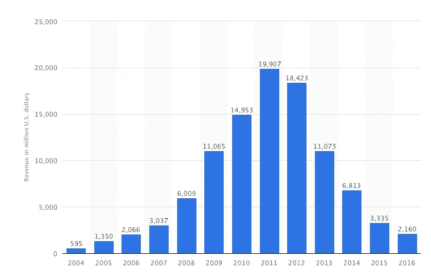
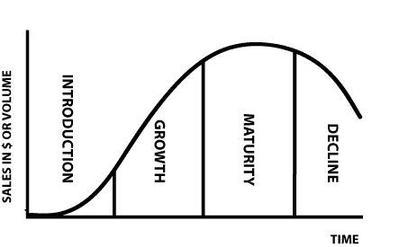
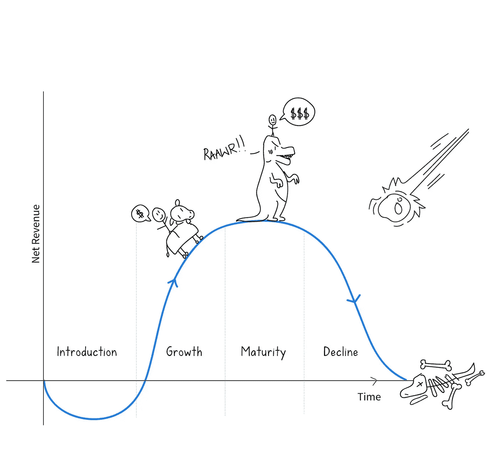
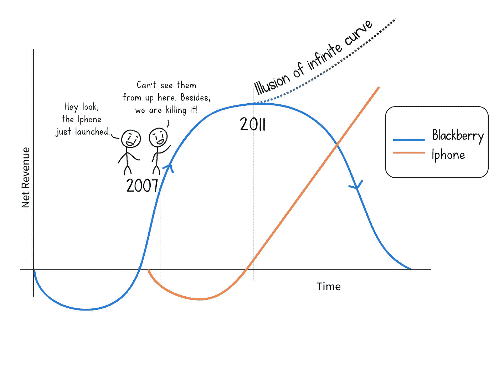

# 为什么你应该杀死你的摇钱树

> 原文：<https://medium.com/swlh/why-you-should-kill-your-cash-cow-3025fa422711>

在车库里的两个人帮你做之前。

Blackberry revenue (in million US dollars)

上周，在 2017 年初，Gartner 报告称，黑莓的硬件业务已经正式土崩瓦解，全球市场份额为 0.0%。

是的，你没看错。

*零。*

零。一无所获。没有。

到底发生了什么？黑莓现在真的就这么死了吗？

不完全是。早在 2007 年 iPhone 发布时，他们就已经死了。黑莓前首席执行官吉姆·巴尔西利[几年前也承认过 T3。](https://9to5mac.com/2015/06/10/ceo-blackberry-iphone/)

唉，上图只是一个*滞后*的指标。

有趣的是，直到 2009 年，即 iPhone 发布两年后，该公司占据了全球智能手机市场近 25%的份额，这促使《财富》杂志称其为世界上增长最快的公司。不仅如此，该公司的收入[增长了 4 倍多](https://www.statista.com/statistics/266241/revenue-of-rim-by-business-segment/)，并在 iPhone 发布整整四年后达到顶峰*。*

苹果进入智能手机行业，开创了从企业到当时规模极小的消费者市场的范式转变。

黑莓拥有庞大的专属客户群，包括世界上一些最大的企业和与之相关的大规模 IT 合同，它不可能中断当时非常成功的商业模式和产品组合，以适应周围不断变化的世界。

不幸的是，剩下的唯一选择就是被另一个打断。

不难想象，一个对 iPhone 着迷的实习生会向他在 RIM 的老板滔滔不绝地谈论 iPhone。

# “iPhone？Pffft。看看他们的数字，再看看我们的！现在，继续销售更多的 IT 合同。”

尽管他们在 2007 年就已经死了，但随着收入继续上升并在 2011 年达到顶峰，追随收入和利润等滞后指标的谬误也让他们死了。我们要杀了它！

2012 年收入下降。*呃哦。*

然后在 2013 年下降得更厉害。到底是怎么回事？？？

当他们赶走首席执行官，并投资于更新的“面向消费者”的产品时，这场竞赛已经结束，赢家已经出现。

Started from the bottom, now we here

“网飞会追上我们吗？这就像说阿尔巴尼亚军队将接管世界。”—杰夫·比克斯，时代华纳首席执行官，2009 年初。

# 产品生命周期的病态必然性

科技产品的生命周期几乎是令人尴尬的可预测的。基于数十年来在无数行业中看到的经验证据，S 曲线是最好的代表。

The product life-cycle curve

新产品从寻求产品与市场的契合开始。在这里，它吃掉的现金比赚到的多。

产品反复尝试找到特定细分市场的粘性，寻找技术中的圣杯:产品-市场匹配。

达到临界质量后，产品开始起飞，达到难以捉摸的[适合度](http://a16z.com/2017/02/18/12-things-about-product-market-fit/)。销售增加，然后重点转移到将产品扩大到最大可能的潜在市场。

随着时间的推移，市场开始成熟，产品变得标准化，并接近实现最大效率，经历了连续的创新。这里的利润和市场份额最高。随着增量的增加，创新曲线开始变平。

就在这条曲线开始变平的时候，更新的产品开始出现。他们从市场的底端开始，捕捉利基市场。起初较慢，然后更快，在性能和成本方面，颠覆者赶上了在位者。然后，颠覆者开始蚕食越来越多的市场，取代现有者，开始自己全新的 S 曲线。

**在技术领域，这种循环在不断重复。**

> 技术的发展往往遵循一条 S 型曲线:它们先缓慢改进，然后快速改进，再缓慢改进。在最后阶段，他们真的真的很棒。一切都经过了优化、设计和理解，它们快速、便宜、可靠。这也是新架构取代它们的原因。——[本尼迪克特·埃文斯](https://medium.com/u/78c5166b8328?source=post_page-----3025fa422711--------------------------------)

那么，要建立一家持久的科技公司，唯一的途径就是成功地从一条 S 曲线跳到另一条。

*黑莓从未做过的跳跃。*

尽管产品令人沮丧的周期性是众所周知且显而易见的，但令人震惊的是，许多公司拒绝看到这一点，并让自己处于崩溃的成熟阶段。

# BCG 矩阵及其被遗忘已久的真理

事实上，波士顿咨询集团早在 1970 年就开发了一个矩阵，任何商学院毕业生都必须阅读，它解释了针对这种*重复出现的*现象应该做些什么。

The BCG Matrix

该矩阵有四个象限，根据相对市场份额和市场增长率对业务进行分类。这些基本上是估算一家企业产生了多少现金，消耗了多少现金的替代指标。

当你是一个成熟市场的领导者时，你的产品产生的现金比它燃烧的要多得多。你必须最大限度地利用你的产品——摇钱树。所有科技公司似乎都直觉地抓住了这一点，并将“挤奶”执行到近乎完美的程度。

通常，经常被忽略的东西可能包含更重要的真相，这是成功跨越连续产品周期和建立持久公司的关键:BCG 模型指出，现金牛产生的现金必须无一例外地用于研发费用和矩阵中的问号。

问号是消耗大量现金的产品，显示出快速增长的强大潜力，但目前不会产生太多现金。然而，这些产品是打造更多明星、进而在未来成为摇钱树的唯一途径。

# 简单来说，现金牛存在的唯一理由就是允许未来现金牛的诞生。

波士顿模型假设市场是稳定的环境，老牌公司在其中拥有天然优势。五十年前可能是这样，但今天肯定不是这样。如今，大多数市场的变化速度已经快得让人认不出来了，这种转变只会加速。

在 AWS 时代，创建可扩展软件的障碍几乎不存在，互联网已经将发布成本降至零。

如果说有什么不同的话，那就是产品生命周期曲线变得更短更陡了。

不理解这些简单真理的公司现在比以往任何时候都死得更快。(*)如今，财富 500 强公司的平均寿命只有 15 岁，而 1960 年时是 75 岁。*)

当你认为你是一棵摇钱树时，它可能已经是一只恐龙了。是的，它很大，但是流星正在到来。这是必然的。

Is your cash cow a dinosaur already?

# 创新者的困境

为什么创新的现任者总是陷入这种困境，尽管这种情况在历史上已经发生过无数次了？为什么击败所有人成为世界领导者的公司会被较小的暴发户毁掉？为什么他们对显而易见的事情视而不见？

原因不难找到。

# 现任者总是不愿意开始下一个技术 S 曲线，因为从现有 S 曲线的峰值来看，刚刚形成的新 S 曲线看起来毫无吸引力。

所有死去的现任者都陷入了无限 S 曲线的幻觉，将他们的图表无限向上外推。

我们的大脑习惯于看到直线序列，而不是曲线，这并没有什么帮助。

The iPhone heralded the rise of the actual ‘smartphone’ product curve

随着黑莓积累越来越多的美元攀上顶峰，iPhone 的曲线肯定看起来很小，无关紧要。

> 克雷·克里斯滕森(Clay Christensen)在他的革命性著作《创新者的困境》(The Innovator's Dilemma)中指出，因为创新发生在曲线上，所以中间部分的价值最大，而末端和起点的价值最小。

正是在接近这一高利润曲线的中间部分时，拥有庞大客户群和囤积利润的现有企业找到了自己的舒适区，对现有产品进行了渐进式改进。

没有人注意到，随着收入、利润和总市场份额曲线接近顶峰，产品生命周期曲线呈下降趋势，变得无关紧要。

猜猜华尔街唯一会让你关心的曲线是什么。

当你面前已经有了*这个大事件*的时候，很难想象下一个大事件。

Revenue lags the product life-cycle, a point lost on many

如果你是首席执行官，你必须报告季度收益，而华尔街希望看到这些收益数字每次都在上升。很容易理解销售越来越多的摇钱树以实现利润和收入最大化的必要性。

> T4:最难做的事情是当你赚钱且有利可图时，对你的业务进行根本性的改变。—本·汤普森

你很难说服华尔街通过在新项目上烧钱来增加收益，尤其是在短期内。

*当然，除非你是亚马逊。*

随着你攀上顶峰，接近 S 曲线最有价值的部分，组织的重点和战略转移到扩大收入，创新被放在次要位置。

社交资本的 Arjun Sethi 认为，尽管 Clay Christensen 的开创性工作不是秘密，但创新曲线的中间部分诱使公司认为他们的使命是保护他们现有的受众和市场份额——这是最致命的错误。

这是公司战略从以客户为中心转向以产品(即摇钱树)为中心的关键。该公司的战略现在侧重于扩大投资组合中现金牛的收入。

这可能主要涉及三条路线:

1.  通过将现有产品推向新市场，为其带来新用户。
2.  在当前用户中开发更多样/更频繁的产品使用。
3.  扩展产品功能，从新的垂直行业吸引用户。

这是通过向现有产品添加更多功能来实现的，反过来使核心产品更加复杂，并将公司推向高端市场，走上不归路。

该组织现在被分解为多个职能部门，每个职能部门都专注于自己的部门问题，并改进自己的核心指标。该组织变得善于为现有市场逐步改进产品，而不关心那些蚕食边缘市场的破坏者。

由于收入是主要特权，销售开始影响越来越多的决策，产品人员退居幕后。

> 企业就像生物有机体——它们专注于自己的“核心指标”,并倾向于优化它们。这意味着其他的道路很少有人走过，值得探索。——[*沙米克·夏尔马*](https://medium.com/u/8ba22106b697?source=post_page-----3025fa422711--------------------------------)

**观看史蒂夫·乔布斯谈论这种行为的致命谬误:**

这种微妙的战略转变导致了对该组织所处行业的根本性误解。

## 你永远不会从事“卖出更多现金牛”的生意。你总是在做“解决特定痛点”的事情。

当现任者开始为他的摇钱树挤奶时，新进入者开始出现。

颠覆者几乎没有固定的客户群，也没有规模或历史的巨大影响，现在可以在技术、文化和社会背景下，使用第一原则方法进入市场，并构建最佳解决方案。

颠覆者最初赢得了一个特定的利基市场，但现任者将其淡化为太小，永远不会有意义，没有意识到曲线现在有利于颠覆者，而现任者很快就会走上下坡路。

*然后流星来袭。*

既然你已经认识到致命的谬误，

# 你如何解决创新者的困境？

*通过增加你的赔率。*

和在股票或赌场中赢钱的人一样的简单逻辑。

有三种已知的方法:

1.  建立一个产品家族，而不是仅仅依赖单一的摇钱树或明星产品。脸书(有 Messenger、Whatsapp、Instagram)就是一个很好的例子。建立一个产品系列意味着你已经在曲线的不同阶段用多种产品对冲了你的赌注。
2.  要意识到，你可能不会总是构建正确的产品，而是通过构建一个底层平台来捕捉连续的 S 曲线。亚马逊可能是将平台思维嵌入其 DNA 的公司中最成功的例子(AWS 是一个明显的例子)。Slack 也正在成为一个企业平台。
3.  拥抱不可避免的事情，拆下你目前的摇钱树，打造下一件大事。

当然，即使这样也不像听起来那么容易。即使你认识到自己在 S 曲线上的位置，并加倍努力打造下一个大项目，仍有许多陷阱。

似乎没有什么比推出考虑不周的新产品花费更多的时间、花费更多的金钱、包含更多的陷阱或引起更多的混乱。事实是，大多数新产品根本没有任何经典的生命周期曲线。

大多数新产品从未起飞，而是有一个无限下降的曲线。因此，你可能需要进行多次新的押注，以创造下一棵大摇钱树。

> “我的工作之一就是鼓励人们变得勇敢。这太难了。就其本质而言，实验容易失败。几个大的成功弥补了许多失败的事情。大胆的押注——亚马逊网络服务、Kindle、亚马逊 Prime——所有这些都是成功的大胆押注的例子，它们为大量实验提供了资金。
> 
> 在 Amazon.com，我已经失败了数十亿美元。数十亿美元的失败。你可能记得 Pets.com 或 Kosmo.com。这些事情都不好玩。但它们也无关紧要。
> 
> **真正重要的是，不继续尝试的公司，不接受失败的公司，他们最终会陷入绝望的境地，在这种情况下，他们唯一能做的就是在公司存在的尽头孤注一掷。反之，那些一直在下注，甚至是大赌注的公司会胜出。我不相信拿公司做赌注。那就是你绝望的时候。那是你最不想做的事。”—杰夫·贝索斯**

你最好向为数不多的几个一次又一次成功摆脱困境的公司学习。

**苹果。**

史蒂夫·乔布斯在他的传记中提到了克莱在颠覆性方面的工作，陈述了苹果完全接受的一个事实:

# 如果你不拆自己的台，别人会拆的。—史蒂夫·乔布斯

2007 年，当苹果推出 iPhone 时，iPod 是他们真正的摇钱树，占收入的近 50%。

史蒂夫·乔布斯知道，通过将 iPod 的所有功能集成到 iPhone 中，他正在蚕食和扼杀他们的摇钱树。

如果公司的战略是围绕销售越来越多的 iPods，iPhone 可能永远不会推出。

苹果的核心理念允许他们接受科技行业不在乎情绪或历史的事实，并让他们在仍然处于领先地位的情况下跳到下一个创新曲线上。

如果这意味着他们不得不砍掉历史上一些最大的摇钱树，他们非常愿意这么做。

# “我们的核心理念是永远不要害怕自相残杀。如果我们不做，别人会做的。麦金塔杀死了苹果二代。我们知道 iPhone 已经蚕食了我们的一些 iPod 业务。这并不让我们担心。我们知道 iPad 会蚕食一些 MAC 电脑。但这不是一个问题。”蒂姆·库克

Apple’s organisational structure

苹果的组织结构也有助于他们解决创新者的困境，并一次又一次地与连续的 S 曲线保持一致。

注意苹果没有像 iPad，iPod 之类的商业头脑。

该公司有一个单一的结构，只有一个损益表，这使他们能够专注于最终消费者，而不是他们各自的产品。

毫不奇怪，这次重组是史蒂夫·乔布斯回到苹果后做的第一件事。

我们都应该关心未来，因为那是我们将要度过余生的地方—未知

最后，就像所有人类偏见和谬误一样，解决创新者的困境可以归结为有意识地认识到你在曲线上的位置，并通过用第一原则方法处理客户问题来为不可避免的下一个曲线做准备，而不是指望他们的产品的假定寿命。

在任者死亡的每一个案例中，都是因为存在一种错误的信念，即消费者会像迷恋摇钱树一样迷恋自己的产品，并且未能认识到并适应周围的变化。

那么，教训就是完全接受产品会消亡的病态事实，并愿意威胁你当前业务的核心，以在未来生存下去。

**如果你不遵循曲线，你就注定要失败。**