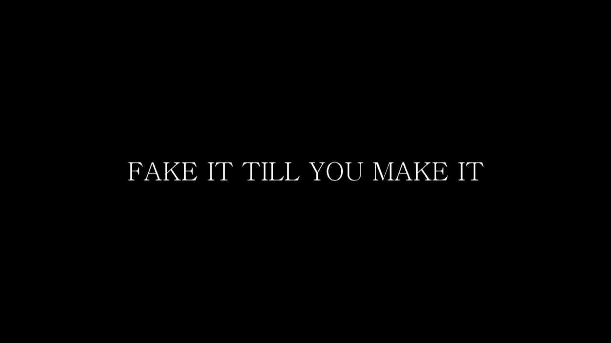

# 为什么你不应该渴望任何东西

> 原文：<https://medium.com/swlh/why-you-should-never-aspire-to-anything-2f0c5b75a192>

## 把低劣的点击诱饵标题放在一边，用这个来代替，但是不管你做什么，请不要把它，或者你曾经做过的任何事情，叫做“生活黑客”

PSA:停止说你是一个“有抱负”的人。
演员。博主。有创意。导演。企业家。
**公式:决定、承诺、行动、成功、重复。**
内化你已经是你想成为的人。
现在就开始。假装直到你成功。

new selfie, same SF Ali

# 行动呼吁

> 1.推荐这个故事。它帮助其他人看到这个故事，让我知道我的作品值得写作、阅读和推荐，让我感到被认可和模糊，因为老实说，谁的冰冷、死亡的心没有被令人眼花缭乱的通知多巴胺立即解冻和复活？喜欢，分享，转发，起泡沫，冲洗，重复。此外，医生说如果我感觉不到模糊，我就会死，因为每当我的 Klout 得分低于 70 时，就会触发一种罕见的社交货币缺乏。现在是 67。不好看。你想让我死吗？！没想到会这样。
> 
> 2.分享这个故事:脸书，推特，LinkedIn，电子邮件等。
> 
> 3.跟我连线:[中](/@sfali789)、[脸书](https://www.facebook.com/sfali789)、[推特](http://twitter.com/sfali789)、 [LinkedIn](https://www.linkedin.com/in/sfali789) 、 [Instagram](http://instagram.com/sfali789) 、 [Snapchat](https://www.snapchat.com/add/sfali789) 、[产品搜索](https://www.producthunt.com/@sfali789)、 [AngelList](https://angel.co/sfali789) 、 [Quora](https://www.quora.com/profile/SF-Ali) 和 [Quibb](http://quibb.com/farooqzafar) 。(我想就这些吧！)[也给我写邮件](mailto:fzafar1@gmail.com)！想打电话或发短信都行。(917) 982–3849.我总是乐于结交新朋友，倾听、支持并尽我所能提供帮助。这就是为什么我是灵媒的常驻啦啦队长。:)
> 
> 4.[看我写的](/@sfali789)。[加入我的邮件列表](https://upscri.be/96c9f6)。[通过考虑对我智力劳动的补偿来支持未来的工作。](http://paypal.me/sfali)

