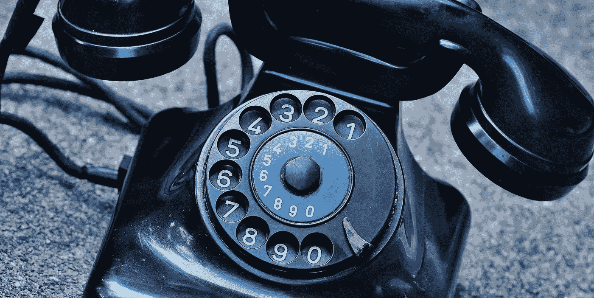
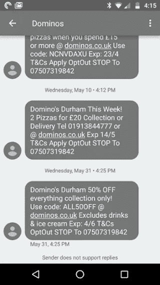
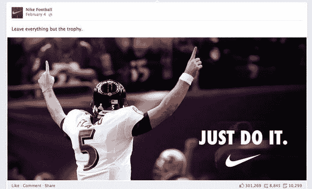
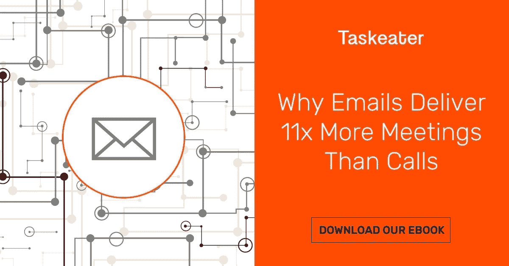
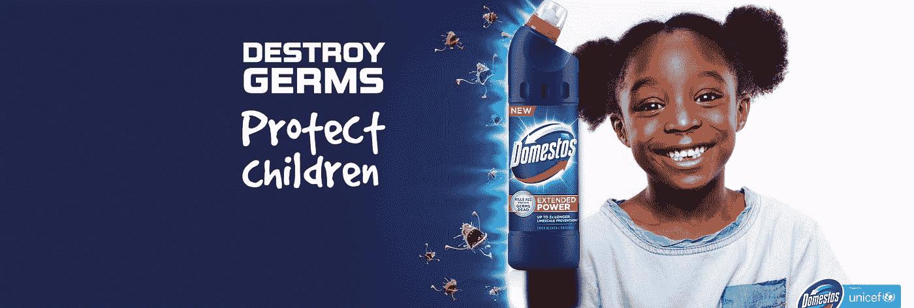

# 为什么你永远不应该打电话给千禧一代(以及应该尝试什么)

> 原文：<https://medium.com/swlh/why-you-should-never-cold-call-a-millennial-and-what-to-try-instead-8a9418888174>

免责声明——本文并不延续关于千禧一代的神话或概括！我们旨在为营销人员提供可行且公正的建议，告诉他们如何以最佳方式与最新、最大的职场新人沟通，以及如何在不断变化的企业环境中吸引受众。

每个人都讨厌陌生电话。即使是陌生来电者也讨厌陌生来电。这不是什么新鲜事。你现在需要在销售过程中考虑的是，千禧一代不仅仅讨厌陌生来电——他们讨厌电话。任何形式的电话。

去年，职场千禧一代的总人数达到了 4000 万(T2)。一年前，[谷歌调查](https://www.thinkwithgoogle.com/consumer-insights/the-changing-face-b2b-marketing/)发现千禧一代 B2B 研究人员的数量急剧增加。事实上，2014 年，18 至 34 岁的人几乎占了所有研究人员的一半。

到 2025 年，全球四分之三的工人将是千禧一代。时代在变，如果你想与下一代员工达成交易，那么你的销售方法必须跟上。

如果千禧一代已经讨厌和害怕打电话，他们对你的销售人员说的话有多容易接受呢？这篇文章总结了千禧一代电话恐惧症的原因，以及你如何调整你的销售技巧，使其包括附加值和原因营销，从而提高你与千禧一代的接近率。

如果你正试图为你的企业选择一种外向战略，下载我们的免费电子书— [“外向战略:为什么电子邮件带来的会议比电话多 11 倍”。](https://www.taskeater.com/downloads/outbound-strategy-why-emails-deliver-11x-more-meetings-than-calls/)

# 那么千禧一代到底为什么这么讨厌打电话呢？

如今，超过 75%的英国成年人拥有智能手机，但四分之一的人从未用它给任何人打电话。黛西·布坎南去年在《卫报》的一篇文章中把这种厌恶归因于千禧年礼仪的发展。

曾经，打电话被认为是日常工作生活的必需品。现在，对年轻一代来说，不打电话给某人是不礼貌的。

把你自己放在你的千禧年展望的头脑中。**你可能讨厌打电话或接电话有三个主要原因**——任何年龄的人都可能有同感:

# 原因 1:你可能会在电话中失去冷静

随着 MSN Messenger、SMS、BBM 和 MySpace 等平台的成长，以及通过 Facebook Messenger、WhatsApp、Twitter 甚至 Tinder today 进行交流，写作已经成为千禧一代的主要交流方式。

写作是异步的，这意味着它允许你花时间整理你的想法，计划你想要表达的东西。另一方面，现场对话总是会包含某种程度的即兴和自发性——而千禧一代不喜欢这样。

对于被称为[【焦虑一代】](http://nypost.com/2016/03/20/they-cant-even-why-millennials-are-the-anxious-generation/)的人来说，打电话或接电话可能是一件令人伤脑筋的事情，因为这会占用他们思考和准备的时间。

# 原因二:接电话很费时间

Twitter 允许用户使用 280 个字符，这是对之前 140 个字符限制的最新改变。不管怎样，你可以在几秒钟内阅读并消化一条微博。千禧一代已经习惯于消化过滤成原声片段的信息，所以相比之下，打电话感觉又长又杂乱。

【comScore 最近的一项研究显示，千禧一代不会参与更长的销售内容。针对千禧一代的广告需要 5 到 6 秒的长度才能有效。如果他们想吸引千禧一代的员工，销售技巧将不得不变得更简短、更犀利。

# 原因 3:打电话的人不体贴

给朋友或同事发电子邮件或短信是尊重的，因为这不会干扰他们的日程安排，也不会要求他们在一段时间内全神贯注。一名 20 多岁的员工告诉《华尔街日报》:“不发邮件就给某人打电话会让人觉得你把自己的需求看得比他们的更重要。”打电话给你正在占用他们时间的人。

# 听起来熟悉吗？

千禧一代并不是唯一感到焦虑的人。爱丁堡玛格丽特女王学院的心理学家和交流专家盖伊·菲尔丁博士一直在研究一种叫做“电话恐惧”的发展中的状况。英国有 250 万人，也就是 10%到 15%的成年人在打电话时会感到焦虑或恐惧。2.5%的人如此焦虑，以至于他们被归为真正的“电话恐惧症”。

将这些焦虑与已经不愉快的接到陌生电话的经历结合起来:也许是时候挂断电话，尝试一些新的东西了？

# 如果电话推销不起作用，你应该如何向千禧一代销售？

鉴于年轻一代更喜欢沟通方式的变化，随着越来越多的千禧一代进入职场，广告和营销将不得不与时俱进。

**要与千禧一代的观众产生共鸣，你必须接触他们的方式*……***

想想前景映射背后的基本原则——如果没人能看到，即使是最令人惊叹、制作精良、富有美感的广告也毫无价值。

你需要把你的信息带到你的目标受众那里，并在那里接触到他们。

世代动力学中心发现，千禧一代更喜欢按以下顺序交流:

1.  WhatsApp/Facebook Messenger 等短信和短信应用
2.  电子邮件，主题是最重要的方面
3.  社会化媒体
4.  电话
5.  面对面互动

由此可见，问题不在于手机本身，而在于通话。事实上，研究表明，39%的千禧一代更愿意用手机互动，而不是和真人互动…

尼尔森发现，18-24 岁的千禧一代中有 98%拥有智能手机，比其他任何一代人都多。25-34 岁的千禧一代以 97%的拥有率紧随其后，35-44 岁的 x 世代以 96%的拥有率紧随其后。在这些世代中，智能手机几乎无处不在，因此如果你从事营销或销售，你需要利用这一关键资源。

# 不打电话给千禧一代的方法:

根据通用动力中心的顶级培养基，我们为你收集了一些选择和例子。

# 给他们发短信…

发短信(包括 Messenger 或 Whatsapp 这样的免费聊天平台)很快。您可以即时发送和接收响应。68%的千禧一代承认每天“大量”发短信(T1)，这一比例也远高于其他年龄段(X 一代中只有 47%的人承认这一点)。

像达美乐或 EasyJet 这样的公司使用文本来分享需要积极响应的优惠，如奖励或限时优惠，因为文本消息的即时性。然而，这种形式对于 B2B 卖家来说更棘手，他们需要空间来描述他们正在出售的服务，并且他们的报价没有同样的紧迫感。

# 尝试使用社交媒体…

《精英日报》在 T2 进行的一项研究发现，大约一半的千禧一代使用社交媒体或其他基于互联网的工具做出购买决定。朋友或家人在社交媒体平台上的推荐对千禧一代的决策有着巨大的影响。但是，你如何让别人使用你的服务，让他们积极评价你的服务呢？建立网上业务可能对像耐克或匡威[这样的大型 B2C 品牌有用，可以保持客户忠诚度](https://www.inc.com/geoff-smith/millennials-becoming-more-loyal-in-era-of-consumer-choice.html)，但是如果你是 B2B 企业或新兴企业，一个不知名的名字很难脱颖而出。社交媒体需要与你的销售策略相结合——无论是你的 LinkedIn 个人资料、潜在客户还是引导网站内容的赞助横幅广告。

# 给他们发一封邮件…

Movable Ink 的一项研究发现，48%的电子邮件是在智能手机上打开的。尽管比其他平台更古老，千禧一代并没有放弃电子邮件。电子邮件不像聊天平台那样需要立即回复，它允许更长、更精心制作的信息——非常适合工作场所的交流。

直销协会(DMA)和 Demand Metric 在 2016 年 6 月对美国营销人员进行的一项[调查](https://www.emarketer.com/Article/Email-Continues-Deliver-Strong-ROI-Value-Marketers/1014461)发现，电子邮件的平均投资回报率为 122%，比其他营销形式高出四倍，包括社交媒体、直邮和付费搜索。

当然，这个指标对于 B2B 电子邮件营销活动来说非常不同，但是 [59%的 B2B 营销人员](https://www.hubspot.com/marketing-statistics?version=published)仍然认为电子邮件是他们最有效的创收渠道。

# 你说什么(而不是你怎么说)仍然是最重要的事情

现在，我引用了 T2 最近的一项 comScore 研究,显示内容或广告时间更短的千禧一代——但这种*并不意味着他们的注意力持续时间更短。*

千禧一代由于早期接触技术和数字平台而变得残疾，并且发现不可能长时间专注，这是一个经常被引用的误解，源于臭名昭著的[微软金鱼研究](http://time.com/3858309/attention-spans-goldfish/)——一项得出[可疑结论](/indian-thoughts/stop-saying-millennials-have-short-attention-spans-fa2822967419)的研究。

虽然千禧一代可能很容易分心，但这并不反映他们的心态发生了任何生理或心理变化。互联网和第二屏幕[的使用越来越多](http://www.adweek.com/lostremote/accenture-report-87-of-consumers-use-second-screen-device-while-watching-tv/51698)为内容营销商或直接广告商创造了一个竞争更加激烈的环境。

由于内容丰富的环境，千禧一代已经形成了更高的娱乐标准。这是最具竞争力的时候，因为每个人都在做同样的事情，无论何时何地。

千禧一代更看重高质量的体验，因此为了吸引他们的注意力，内容必须提供某种形式的体验。这可以是教育，娱乐或社会导向。推销你的服务是什么或者你的产品做什么，不是千禧一代感兴趣的；只有 1%的人说他们会受到广告的影响。相反，他们关注的是品牌价值、真实可信的内容、天衣无缝、引人入胜的品牌互动以及道德观。

正如西蒙·西内克所说，“为什么”做这件事比“做什么”更重要。一项 [CrowdTwist 研究](https://www.loyalty360.org/Loyalty360/media//ResearchAndReportDocs/GenX_Report_WEB.pdf)发现，近 50%的受访者忠于具有社会意识利益的品牌，如慈善捐赠或品牌互动奖励。这就是通常所说的**事业营销。**

# 这真的有用吗？

易贝为公益营销提供了一个完美的测试环境。每当易贝卖家列出一件待售商品，他们都有机会向自己选择的慈善机构捐赠一定比例的款项。卖家的结果列表有一个唯一的标识符，帮助该项目在网站上脱颖而出。

易贝围绕这一功能的使用进行的一项研究发现，当买家有机会捐赠时，他们更有可能实际结账(当领先的电子商务网站的购物篮废弃率高达 76.6%时，这一点很重要)，他们更有可能选择与慈善机构有关联的卖家，而不是与慈善机构没有关联的卖家。加入捐赠选项的卖家销售额增长了 29%。

较大的公司会以更大的规模投资慈善捐赠和社会活动。例如，联合利华在其所有品牌中实施与公益事业相关的广告，发展和可持续发展的价值观是其公司价值观的核心。联合利华可持续生活计划的目标是在 2020 年前帮助 2500 万人改善如厕条件，像 Domestos 这样的品牌将与联合国儿童基金会合作实现这一目标。它还有一些项目侧重于改善健康和福祉、减少环境影响和赞助发展。

An example from Unilever’s Domestos campaign where they partnered with Unicef

事业营销，以及相对于你的产品或服务描述的附加值，是一个重要的视角，不仅对于内容营销这样的入站技术，而且对于出站推销和电子邮件文案也是如此。

根据 Corporate Vision [的调查结果](https://greatb2bmarketing.com/b2b-marketing/b2b/evolving-journey-of-b2b-buyer/)，74%的 B2B 买家选择首先增加价值和洞察力的销售代表。强制销售的时代已经过去很久了，现在为了达成交易，你必须帮助你的潜在客户解决他们的问题——这是个人资料(博客链接)可以帮助解决的。

如果你还在决定你的外出策略，下载我们的免费电子书，[《外出策略:为什么电子邮件带来的会议比电话多 11 倍》。](https://www.taskeater.com/downloads/outbound-strategy-why-emails-deliver-11x-more-meetings-than-calls/)

我们还提供这方面的专家建议和服务——为什么不[今天就联系](https://www.taskeater.com/contact-us/)并与专家交谈呢？

# 丹·范伦宁的文章

Taskeater 的常务董事，Taskeater 以前的客户之一。他有 16 年的销售经验，两个男孩，热爱橄榄球。[在 LinkedIn 上连接。](https://www.linkedin.com/in/dan-vanrenen/)

## 这篇文章发表在《T8 创业》(The Startup)杂志上，这是 Medium 最大的创业刊物，有 312，921 人关注。

## 在这里订阅接收[我们的头条新闻](http://growthsupply.com/the-startup-newsletter/)。

