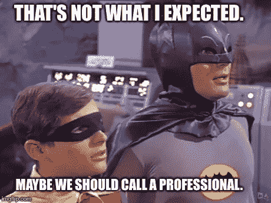
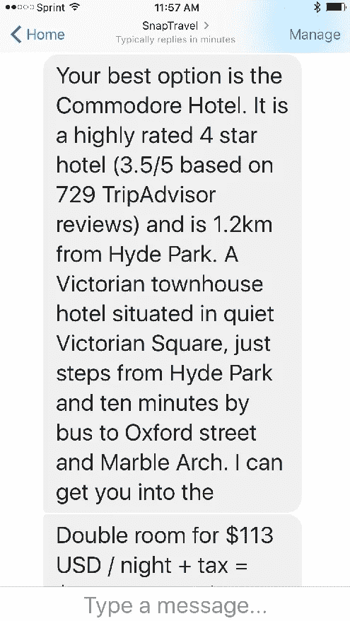
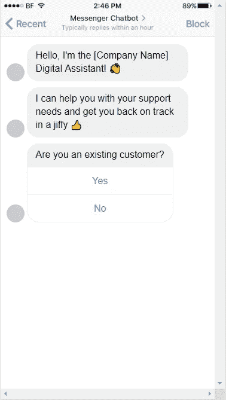
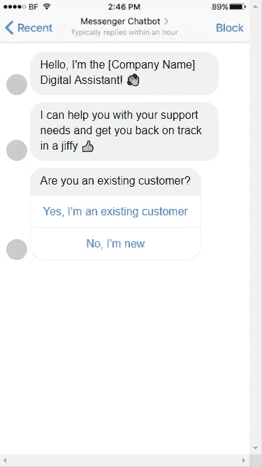
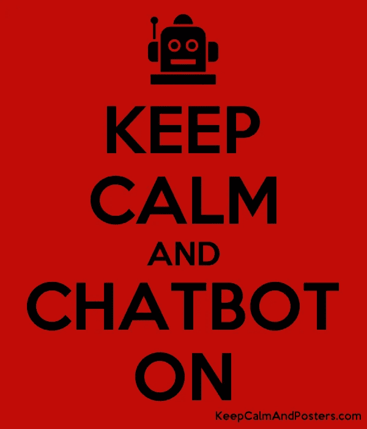

# 为什么你不应该使用“是”或“否”聊天机器人按钮

> 原文：<https://medium.com/swlh/why-you-should-never-use-yes-or-no-chatbot-buttons-d1be443372be>

## 保护您的聊天机器人免受一个最突出的用户错误

Thinking about using ‘Yes’ or ‘No’ chatbot buttons? Please STOP and read this article first…

## 用户滥用你的聊天机器人的频率远远超过你的预期🤖

如果你认为大多数用户会像预期的那样使用你的聊天机器人，这显然是你的第一次尝试。用户对话不仅会让你惊讶，而且你可能会发现自己被其中的许多内容弄得目瞪口呆。

期待聊天机器人的对话按计划进行，实际上相当于遇见一个陌生人，并期望提前知道对话将如何展开。简单明了地说，预测聊天机器人的用户行为几乎是不可能的。

If your chatbot has made you feel this way, don’t worry. You’re not alone…

这个故事的寓意是，期待意想不到的事情，尽你所能采取一切措施保护你的宝贝聊天机器人不被用户误操作。否则，当你的聊天机器人悲惨地失败时，不要感到惊讶。

## 如果你认为用户会阅读你的聊天机器人所说的一切，那你就错了🤦

这是我在制作第一个聊天机器人后学到的第一课，也是最严厉的一课。除非你的聊天机器人纯粹是为了娱乐目的而设计的——在这种情况下，这种情况仍然可能发生——否则请期待用户经常浏览你的聊天机器人的回复，而不是逐字阅读。

用户最终希望从你的聊天机器人中获得某种价值，如果这种价值不是纯粹的娱乐，那么他们会试图尽快通过聊天机器人的对话来获得他们所寻求的价值。这一残酷的现实只会增加用户在浏览聊天机器人的对话流时出错的可能性。

这里关键的一点是，你需要尽可能保持你的聊天机器人回复简明扼要。任何不必要的对话，如果不能帮助用户找到他们想要的东西，只会增加用户出错和误用的可能性。

A perfect example of a long chatbot response that is at risk of getting skimmed over

## 使用单个单词的聊天机器人按钮，如“是”或“否”，就像是在乞求用户出错🙏

现在我们已经确定了用户浏览和误读你的聊天机器人内容的可能性，让我们结合使用模糊的单个单词聊天机器人按钮，如“是”或“否”。我将提供一个简单的真实世界的例子，它实际上发生在我以前创建的聊天机器人中，来证明为什么这些小小的聊天机器人按钮如此危险。

在这个例子中，我们有一个基于支持的聊天机器人，它给用户的初始消息要求他们确认他们是否是现有客户。这是一个重要的调查，因为现有客户应该继续聊天机器人对话，并希望从聊天机器人获得他们需要的支持。作为新客户的用户需要被路由到联络中心队列，在那里销售代表将联系他们。

没有关注初始消息内容的用户可能会点击“是”聊天机器人按钮，表明他们是现有客户，而实际上他们可能只是犯了一个错误。现在，该用户获得了免费支持，而不是销售代表的回电。这是一个简单的例子，但您可以看到像这样的用户错误对您的 chatbot 的成功会造成多大的代价。

You’d be shocked at how many users will incorrectly respond to these ‘Yes’ and ‘No’ chatbot buttons

## 选择简洁，除非你的聊天机器人按钮被标为✏️

在这个例子中,“是”和“否”聊天机器人按钮应该标记为“是，我是现有客户”和“否，我是新客户”,以防止用户出错。虽然用户通常会浏览聊天机器人的响应，但他们通常更可能注意聊天机器人按钮的标签，因为他们在点击聊天机器人按钮时必须专注于该按钮。

Chatbot buttons with descriptive labels such as these help to prevent user error

因此，在构建下一个聊天机器人时，选择简洁的聊天机器人消息，以最大限度地减少用户浏览的可能性，但一定要在聊天机器人按钮上做标记，清楚地表明用户点击它将采取什么行动，即使他们没有阅读相关聊天机器人消息的一个字。

像往常一样，记得“保持冷静，打开聊天机器人”…

## 这篇文章发表在 [The Startup](https://medium.com/swlh) 上，这是 Medium 最大的创业刊物，有+388，456 人关注。

## 订阅接收[我们的头条新闻](http://growthsupply.com/the-startup-newsletter/)。

