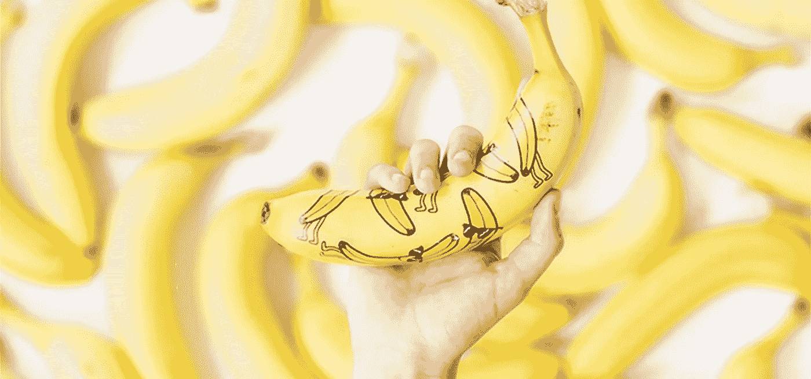
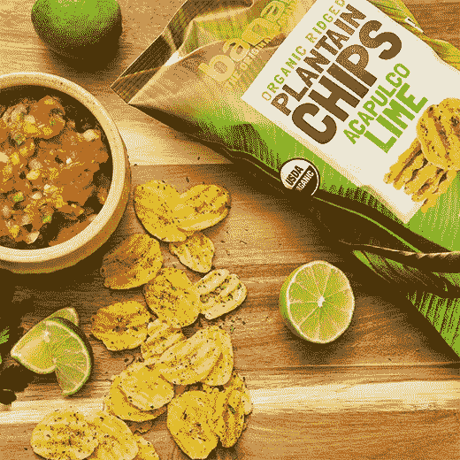
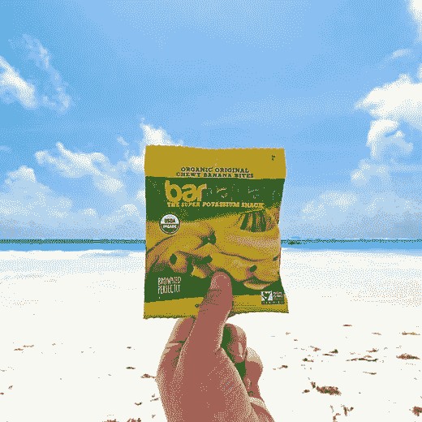

# 为什么你应该追求你的坏主意

> 原文：<https://medium.com/swlh/why-you-should-pursue-your-bad-idea-9dc4b4896d3e>

虽然马特·克利福德和巴纳纳团队已经成功地给香蕉打上了品牌——是的，这种水果你只需花 0.4 美元就能买到——但该公司一开始就吸取了一个惨痛的教训。"*2012 年，我和我的朋友有了创办香蕉公司的想法。现在，我知道你在想什么:这不是一个好主意。*

当马特(首席运营官)和其他联合创始人 Caue Suplicy(首席执行官)和尼克·英格索尔(CMO)得知每年浪费 750 亿香蕉时，“*默认是假设这个问题已经解决了。农产品领域有很多大公司肯定在解决这个问题。*“这些垃圾来自超市销售的被认为“不完美”的香蕉。

虽然一个人的垃圾会成为另一个人的数百万美元的生意，“*我们最初几乎没有研究就放弃了这个想法，只是假设一个如此大的问题已经被解决了。*“直到几个月后，经过大量的研究，朋友们才意识到他们手中有一个重要的机会。没有主要的供应商回收未使用的香蕉。快进到现在的公司，巴纳纳已经发展到 20 名员工，数百万的收入，并且是世界上最大的有机产品生产商。

"*这才是真正让我们惊讶的地方，它改变了我们看待想法和机会的方式。我们只是假设——错误地假设——一个伟大的想法已经被解决了。我认为这个想法在当今世界比以往任何时候都更有意义，在这个世界上，信息如此之多，噪音如此之大，以至于人们默认一个大问题正在得到解决。*

*照片:* [*巴纳娜*](https://barnana.com/)

*更从* [*智慧捕捉*](http://bulldogdrummond.com/blog/author/wisdom-capture#filters)

*由* [*智慧捕捉*](https://wisdomcapture.com) *。*

*关于作者:智慧无可替代。* [*我们拍摄高层领导和成功人士*](https://wisdomcapture.com/) *，并利用我们的学习平台将他们的见解传达给整个组织。结果是:大规模的导师交流带来了高水平的参与和专业发展。智慧属于每个人的心灵。*

## 这篇文章发表在《创业公司》杂志上，这是 Medium 最大的创业刊物，有 325，962 人关注。

## 订阅接收[我们的头条新闻](http://growthsupply.com/the-startup-newsletter/)。

