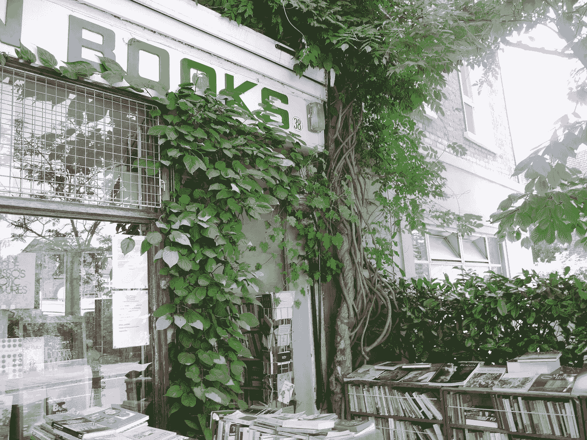

# 为什么你应该读完多少书就放弃多少书

> 原文：<https://medium.com/swlh/why-you-should-quit-as-many-books-as-you-finish-499be0d870c>

## 为扔掉任何你不喜欢的书辩护

Walden Books, probably the best book shop in the world.

我强烈怀疑大多数人不读书的一个重要原因是因为他们不选择他们喜欢的书。 然后他们强迫自己艰难地读完每一页，厌倦并绝望地去做其他任何事情。毕竟，这是我们在学校学习阅读的方式。